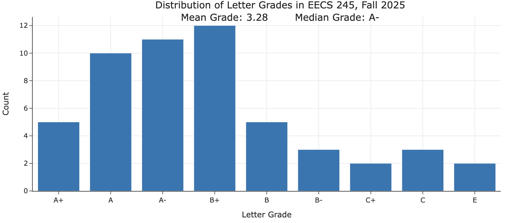
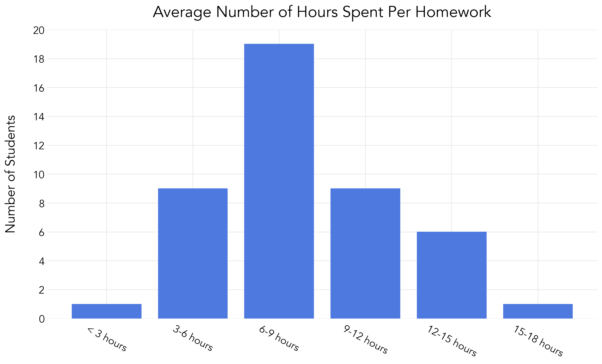

{: .red }
> **The site is currently under construction.** Information here is subject to change before the start of the semester.

# Mathematics for Machine Learning 🧠
{: .no_toc }
{: .mb-2 }
EECS 245, Fall 2026 at the University of Michigan
{: .no_toc }
{: .fs-6 .fw-300 .mb-2 }

**Instructor**: <a href="https://rampure.org">Suraj Rampure</a>, rampure@umich.edu 
**Lectures**: TuTh 10:30AM-12PM, 1010 DOW 
**Labs**: Wednesdays at <a href="https://crapuler.com/course/FA26/EECS/245">various times</a>

{: .blue }
> Are you a computer science, data science, or statistics major who needs to take a linear algebra course and is interested in machine learning? Take EECS 245 in Fall 2026!

  <iframe width="560" height="315" src="https://www.youtube.com/embed/cPKpJ9ycM-Y" title="YouTube video player" frameborder="0" allow="accelerometer; autoplay; clipboard-write; encrypted-media; gyroscope; picture-in-picture; web-share" allowfullscreen></iframe>

<!-- 1. TOC
{:toc} -->

## Content

{: .green }
> Visit our course websites from the [Spring 2026](https://eecs245.org/sp26/) and [Winter 2026](https://eecs245.org/wn26/) offerings. These contain links to our [interactive course notes](https://notes.eecs245.org), lecture recordings (in Winter 2026 only), homeworks, labs, and exams.

Click to see the official catalog description.
Mathematical foundations of machine learning and artificial intelligence, focusing primarily on linear algebra, along with select topics from calculus and probability. Topics include matrices, vectors, projections, spans, least squares, and eigenvalue and eigenvector problems. Includes mathematical theory as well as application to concrete data sets in a modern programming language.

## Schedule


{{ module }}


## Credit

test

The course counts for:
- The linear algebra requirement for:
    - **Computer Science** majors (CS-Eng and CS-LSA*).
    - **Data Science** majors (DS-Eng and DS-LSA).
    - **Statistics** majors.
    - **Artificial Intelligence** minors.
- The linear algebra prerequisite for:
    - EECS 442, EECS 445, EECS 448, EECS 474, EECS 476, and CSE 576.
    - **Any** 400-level STATS or DATASCI course with a linear algebra prerequisite.

<!-- If you take the course in Fall 2026, you'll need to submit overrides to get into the above courses, but rest assured, we have agreements in place with the relevant departments and instructors to get you into the courses you need. We will also share your information with the CS/DS/Stats advisors to get you linear algebra credit. Wolverine Access will encode the above information starting in Winter 2027, after which point students won't need to submit overrides. -->

<small>*CS-LSA students don't have a linear algebra requirement, but this course fits in the linear algebra "bucket" for the second math course; see [here](https://docs.google.com/document/d/1i0W77CzwMK6l3FFFdG7_7urp8H_oE4EaOzRPFOJdrxo/preview?tab=t.0#heading=h.m67kk7886dyq) for details.</small>

## Prerequisites

This course has a math prerequisite and a programming prerequisite.
- EECS 203 or Math 116 (or Math 215, 216, 275, 285, or 295), i.e. some math course after Calculus 1.
- Some 100-level programming class (e.g. EECS 183, ENGR 101, ROB 102, or similar).

## Workload and Final Grade Distribution

Here is distribution of letter grades earned in Fall 2025. We expect the distribution to be similar in Fall 2026.

This course has 11 weekly homeworks, weekly in-person labs, 2 non-cumulative midterm exams, and a cumulative final exam, which allows you to get back some of the points you lost on the midterms.

We surveyed Fall 2025 students to get a rough sense of the amount of time they spent on each homework.

Our target is that the course takes a similar amount of time per week as EECS 203.

## Course Evaluations

You can find the official end-of-semester course evaluations from Fall 2025 [here](resources/next/fa25-evals.pdf).

## Logistics

In Fall 2026:
- Lectures are in-person and recorded. **New**: Attendance will be a part of your grade, though there will be alternative ways of earning this credit for students who miss lectures (e.g. by attending office hours instead).
- Labs are in-person and attendance is part of your grade.
- There are 2 midterm exams and a cumulative final exam, with an opportunity to "redeem" lower scores on the midterms by doing better on the final (see the [Spring 2026 syllabus](https://eecs245.org/sp26/syllabus#exams) for more details).
- There _may_ be occasional quizzes administered in the College of Engineering Electronic Testing Facility.

The full Fall 2026 course website, including the detailed syllabus, schedule, assignments, and resources, will be posted closer to the start of the semester.

## Questions?

If you have **any** questions about the course, don't hesitate to contact [Suraj Rampure](https://rampure.org) at rampure@umich.edu. We're happy to meet with students 1-on-1 to answer any questions they may have about the course.
