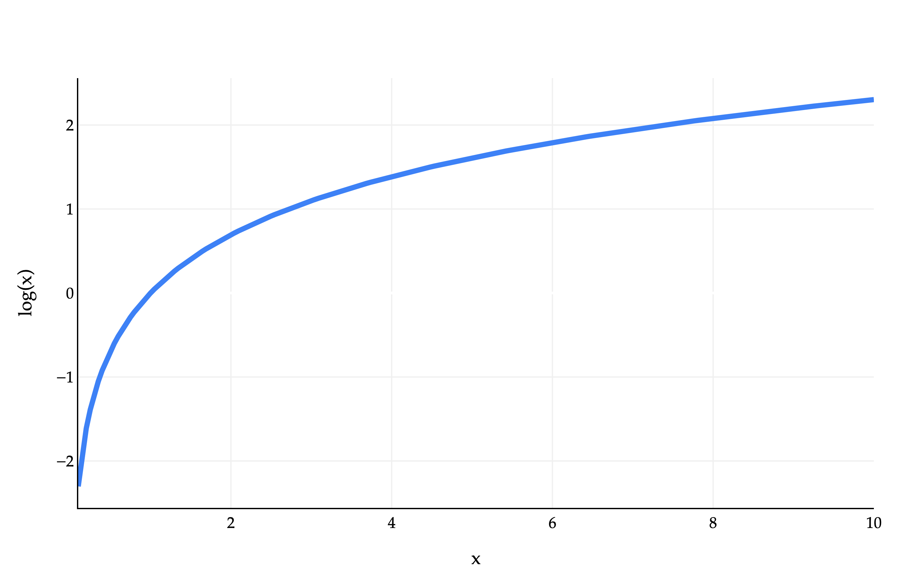

# Homework 1: Means, Sums, and Calculus

**due** Sunday, May 10th, 2026 at 11:59PM Ann Arbor Time

<a class="btn btn-info assignment-pdf-button" href="/resources/homeworks/hw01/hw01.pdf" target="_blank">View as PDF ✏️</a>

{: .yellow }

Write your solutions to the following problems either by writing them on a piece of paper or on a tablet and scanning your answers as a PDF. Note that you are not allowed to use LaTeX, Google Docs, or any other digital document creation software to type your answers. Homeworks are due to Gradescope by 11:59PM on the due date. See the [syllabus](https://eecs245.org/syllabus/#homeworks) for details on the slip day policy.

Homework will be evaluated not only on the correctness of your answers, but on your ability to present your ideas clearly and logically. You should always explain and justify your conclusions, using sound reasoning. Your goal should be to convince the reader of your assertions. If a question does not require explanation, it will be explicitly stated.

Before proceeding, make sure you're familiar with the [collaboration policy](https://eecs245.org/syllabus/#homeworks).

---

## Problems

- [Problem 1: Welcome Survey](#problem-1-welcome-survey-5-pts)
- [Problem 2: Fun with Loops](#problem-2-fun-with-loops-8-pts)
- [Problem 3: Simpson's Paradox](#problem-3-simpsons-paradox-5-pts)
- [Problem 4: The Proof is in the Pudding](#problem-4-the-proof-is-in-the-pudding-8-pts)
- [Problem 5: Mean Imputation](#problem-5-mean-imputation-6-pts)
- [Problem 6: Bias-Variance Decomposition](#problem-6-bias-variance-decomposition-8-pts)
- [Problem 7: Coin Flipping](#problem-7-coin-flipping-9-pts)

---

Total Points: 5 + 8 + 5 + 8 + 6 + 8 + 9 = 49

---

## Problem 1: Welcome Survey (5 pts)

Make sure to fill out the [Welcome Survey](https://docs.google.com/forms/d/e/1FAIpQLSee14997ZWHuI-eYwNZHh4tI6i9Xu0kRLYMm_ve9uoSxbjVgA/viewform?usp=dialog) for 5 points on the homework.

---

## Problem 2: Fun with Loops (8 pts)

This problem involves writing code and submitting it to the Gradescope autograder.

There are two ways to access the supplemental Jupyter Notebook:

-   **Option 1 (preferred)**: Set up a Jupyter Notebook environment locally, use `git` to clone our course repository, and open `homeworks/hw01/hw01.ipynb`. For instructions on how to do this, see the [Environment Setup](https://eecs245.org/env-setup) page of the course website.

-   **Option 2**: Click [here](https://datahub.eecs245.org/hub/user-redirect/git-pull?repo=https%3A%2F%2Fgithub.com%2Feecs245%2Fsp26-code&urlpath=tree%2Fsp26-code%2Fhomeworks%2Fhw01%2Fhw01.ipynb&branch=main) to open `hw01.ipynb` on DataHub. Before doing so, read the instructions on the [Environment Setup](https://eecs245.org/env-setup/#option-2-using-the-eecs-245-datahub) page on how to use the DataHub.

To receive credit for the programming portion of the homework, you'll need to submit your completed notebook to the autograder on Gradescope. Your submission time for Homework 1 is the **latter** of your PDF and code submission times.

---

## Problem 3: Simpson's Paradox (5 pts)

In this problem, we'll look at an example of how "simple" data analysis is not always so simple. Consider two students, Lisa and Bart, who have completed three semesters at Michigan. **In each semester, Lisa earns a higher GPA than Bart.**

|              |          |         |          |         |
|:------------:|:--------:|:-------:|:--------:|:-------:|
| **Semester** | **Lisa** |         | **Bart** |         |
|              |   GPA    | Credits |   GPA    | Credits |
|     FA24     |   2.3    |   20    |   2.0    |    5    |
|     WN25     |   3.0    |   18    |   2.7    |    5    |
|     FA25     |   4.0    |    5    |   3.7    |   22    |

But, **Bart has a higher overall GPA**! Remember that GPA is a **weighted average**, where each course grade is weighted by the number of credits the course is worth. Lisa's overall GPA is

$$
\text{Lisa's overall GPA} = \frac{2.3 \cdot 20 + 3.0 \cdot 18 + 4.0 \cdot 5}{20 + 18 + 5} \approx 2.79
$$

You should verify that Bart's GPA is indeed higher than Lisa's.

Why does this happen? Even though Lisa has a higher GPA in every semester, Bart takes many more credits in the semester where both of them perform well (FA25), while Lisa takes more credits in the semesters where both perform worse. This phenomenon ---- where data shows one trend overall but the opposite trend when broken down by subgroups -- is known as **Simpson's Paradox**.

In a similar vein, consider the following data on the weights of dogs in Veterinarian Kyle's care, separated by district and breed.

|              |                      |       |                     |       |
|:------------:|:--------------------:|:-----:|:-------------------:|:-----:|
|              | **Golden Retriever** |       | **German Shepherd** |       |
| **District** |     Mean Weight      | Count |     Mean Weight     | Count |
|  District 1  |          30          |   4   |         20          |   3   |
|  District 2  |          45          |   1   |         \\(a\\)         |  \\(b\\)  |

a)

(2 pts) What is the mean weight of all Golden Retrievers in Kyle's care?

b)

(3 pts) Find **integers** \\(a\\) and \\(b\\) such that the following all hold:

-   In District 1, the mean weight of Golden Retrievers is greater than the mean weight of German Shepherds.

-   In District 2, the mean weight of Golden Retrievers is greater than the mean weight of German Shepherds.

-   Overall, the mean weight of Golden Retrievers is less than the mean weight of German Shepherds.

There are infinitely many solutions. Give a solution with the **smallest possible value of \\(a\\)**. If multiple values of \\(b\\) remain, give the smallest such value. Remember to show your work, as with every other problem in this homework.

---

## Problem 4: The Proof is in the Pudding (8 pts)

To rigorously understand the math behind machine learning, we'll need to be able to **prove** various statements. But the proofs we'll write in machine learning are of a different flavor than the proofs you'd write in a discrete math class. In this problem, we'll discuss the general approach to proving statements in this class. The problem looks long, but most of it is explaining *how* to answer it!

**Here, you'll prove or disprove various statements about a dataset of numbers, \\(y_1, y_2, \ldots, y_n\\).**

To prove that a statement is always true, you must provide some sort of reason as to *why* it is always true, no matter what the values in \\(y_1, y_2, \ldots, y_n\\) are. For example, consider the statement:

> *Suppose we add \\(5\\) to each \\(y_i\\). The mean of the new dataset must be greater than the mean of the original dataset.*

This statement is always true, but it's not enough just to say *"This statement is always true; since we're adding a positive number to each value, the mean will also increase."* That's good intuition to have, but we need to provide a more rigorous justification.

It's also not enough to come up with a specific example that satisfies the statement --- specific examples are an important first step to convince yourself that the statement is true, but they're not enough to prove it.

Here's what a more rigorous justification might look like:

> *The mean of the original dataset is \\(\bar{y} = \displaystyle\frac{1}{n} \sum_{i=1}^n y_i\\). The mean of the new dataset is:* 

$$
\frac{1}{n} \sum_{i=1}^n (y_i + 5) = \frac{1}{n} \left( \sum_{i=1}^n y_i + \sum_{i=1}^n 5 \right) = \frac{1}{n} \left( \sum_{i=1}^n y_i \right) + \frac{1}{n} \left( \sum_{i=1}^n 5 \right) = \bar{y} + 5
$$

 *Therefore, the mean of the new dataset is equal to the original dataset's mean plus \\(5\\), so the mean of the new dataset is greater than the mean of the original dataset, and so the statement is always true.*

Note that in the argument above, we didn't assume anything specifically about the numbers in the original dataset --- we didn't use a specific example. Just because a statement holds true for one example, doesn't mean it always holds true!

On the other hand, to *disprove* a statement, what you need to show is that it is **not** always true. The easiest way to do this is to provide a **counterexample**, i.e. a set of values \\(y_1, y_2, \ldots, y_n\\) where the statement is false. For example, consider the statement:

> *The smallest number in the dataset must be less than the mean.*

Upon first glance, it may seem like this statement is true. If we consider the numbers \\(1\\), \\(2\\), and \\(9\\) (just three numbers we made up for an example), the smallest number (\\(1\\)) is indeed less than the mean (\\(\frac{1+2+9}{3} = 4\\)). But, this statement is not true in general. Valid justification might look like:

> *This statement is not always true. For example, consider the dataset \\(1\\), \\(1\\), and \\(1\\). The smallest number and mean are both \\(1\\), so the smallest number is not less than the mean, so the statement is not always true.*

This is a counterexample, and is a sufficient disproof. Now, it's your turn!

Consider a dataset of numbers \\(y_1, y_2, \ldots, y_n\\). For each of the following statements, either provide a proof or a counterexample to disprove the statement.

a)

(2 pts) At least half of the numbers in the dataset must be less than the mean.

b)

(2 pts) Suppose that all of the numbers in the dataset are unique. Then, removing the largest number from the dataset will increase the mean.

c)

(2 pts) Suppose that all of the numbers in the dataset are unique, that \\(n\\) is odd, and that the mean of the dataset is not equal to the median of the dataset. Then, if we remove the median value from the dataset, the median of the new dataset must be different from the median of the original dataset.

d)

(2 pts) Suppose we introduce a new number to the dataset that is greater than the mean of the existing dataset. The mean of the new dataset must be greater than the mean of the original dataset.

---

## Problem 5: Mean Imputation (6 pts)

In the real world, it's common to have missing values in a dataset --- for example, a survey may ask for a person's age, but they may not want to answer that question. One strategy for dealing with missing values is to *impute* (i.e. fill in) the missing values with the mean of the dataset. In this problem, we'll explore the implications of this strategy.

Before proceeding, you may want to review [Appendix 1](https://notes.eecs245.org/math-foundations/summation/), on summation notation and the mean.

Consider a dataset of \\(n\\) numbers \\(y_1, y_2, \ldots, y_n\\) with mean \\(\bar{y}\\) and standard deviation \\(s\\): 

$$
s = \sqrt{\frac{1}{n} \sum_{i=1}^n (y_i - \bar{y})^2}
$$

Suppose we introduce \\(k\\) new values to the dataset, \\(y_{n+1}, y_{n+2}, \ldots, y_{n+k}\\), all of which are equal to \\(\bar{y}\\).

Let the new mean and standard deviation of all \\(n + k\\) values be \\(\bar{y}'\\) and \\(s'\\), respectively.

a)

(2 pts) Find \\(\bar{y}'\\) in terms of \\(\bar{y}\\), \\(n\\), \\(k\\), and \\(s\\). You may not need to use all of these variables in your answer. Remember that simply writing a formula for \\(\bar{y}'\\) is not enough; you must show your work.

b)

(3 pts) Find \\(s'\\) in terms of \\(\bar{y}\\), \\(n\\), \\(k\\), and \\(s\\). Again, you may not need to use all of these variables in your answer.

c)

(1 pt) In part **b)**, you should have found that the value of \\(s'\\) is less than the value of \\(s\\). Give an intuitive explanation of *why* this is the case, as long as \\(k > 0\\). What is the standard deviation of a dataset supposed to measure?

---

## Problem 6: Bias-Variance Decomposition (8 pts)

The main result in [Chapter 1.2](https://notes.eecs245.org/introduction-to-supervised-learning/squared-loss-constant-model/) is that \\(w^* = \bar{y} = \operatorname{Mean}(y_1, y_2, \ldots, y_n)\\) is the constant prediction that minimizes mean squared error: 

$$
R_{\text{sq}}(w) = \frac{1}{n} \sum_{i=1}^n (y_i - w)^2
$$

To arrive at this result, we used calculus: we took the derivative of \\(R_{\text{sq}}(w)\\) with respect to \\(w\\), set it equal to \\(0\\), and solved for the resulting value of \\(w\\), which we called \\(w^*\\).

In this problem, we'll analyze \\(R_{\text{sq}}(w)\\) in a way that doesn't use calculus. The general idea is this: if \\(f(x) = a(x-c)^2 + k\\), then we know that \\(f(x)\\) is a quadratic function that opens upwards, with a vertex at \\((c, k)\\). This means that \\(f(x)\\) is minimized at \\(x = c\\).

We know from [Chapter 1.2](https://notes.eecs245.org/introduction-to-supervised-learning/squared-loss-constant-model/) that \\(R_{\text{sq}}(w)\\) is a quadratic function of \\(w\\), so if we can write it in the form \\(R_{\text{sq}}(w) = a(w-c)^2 + k\\), then we know that \\(R_{\text{sq}}(w)\\) is minimized at \\(w = c\\).

Consider a dataset of numbers \\(y_1, \ldots, y_n\\) with a mean of \\(\bar{y}\\).

a)

(2 pts) What is the value of \\(\displaystyle \frac{1}{n} \sum_{i=1}^n (y_i - \bar{y})\\)? Show your work, even if the answer is familiar from [Appendix 1](https://notes.eecs245.org/math-foundations/summation/).

b)

(2 pts) Show that:

$$
R_{\text{sq}}(w) = \frac{1}{n} \sum_{i=1}^n \left((y_i - \bar{y})^2 + 2(y_i - \bar{y})(\bar{y} - w) + (\bar{y} - w)^2\right)
$$

 Some guidance:

-   To proceed, start by rewriting \\(y_i - w\\) in the definition of \\(R_{\text{sq}}(w)\\) as \\((y_i - \bar{y}) + (\bar{y} - w)\\). Why is this a valid step?

-   Make sure not to expand unnecessarily. Your work should only take 3-4 lines.

c)

(2 pts) Using your results from the previous two parts, show that:

$$
R_{\text{sq}}(w) = \frac{1}{n} \sum_{i=1}^n (y_i - \bar{y})^2 + (\bar{y} - w)^2
$$

 This is called the **bias-variance decomposition** of \\(R_{\text{sq}}(w)\\).

d)

(1 pt) Why does the result in part **c)** prove that \\(w^* = \bar{y}\\) minimizes \\(R_{\text{sq}}(w)\\)?

e)

(1 pt) In part **c)**, you showed that:

$$
R_{\text{sq}}(w) = \frac{1}{n} \sum_{i=1}^n (y_i - \bar{y})^2 + (\bar{y} - w)^2
$$

Take a close look at the equation above, then fill in the blank below with a **single word**:

The value of \\(R_{\text{sq}}(w^*)\\), when \\(w^* = \bar{y}\\), is equal to the

of the data.

---

## Problem 7: Coin Flipping (9 pts)

In this problem, we'll plant the seeds of how probability, calculus, and machine learning are all related.

Suppose we find a coin on the ground, and we're unsure of whether the coin is fair. We decide to flip the coin repeatedly to estimate its bias, \\(p\\), which is the probability of flipping heads on any particular flip. (The probability of flipping tails on any particular flip, then, is \\(1 - p\\).)

Suppose we flip the coin 100 times and see 65 heads. Assuming that each flip is independent, this is a possible result, no matter what the value of \\(p\\) is, as long as \\(0 < p < 1\\). But, some values of \\(p\\) are more believable than others.

For example, if \\(p = 0.5\\), the probability of seeing 65 heads and 35 tails is: 

$$
\mathbb{P}(\text{65 heads} \mid p = 0.5) = \binom{100}{65} (0.5)^{65} (0.5)^{35} \approx 0.00086
$$

 If \\(p = 0.7\\), the probability of seeing 65 heads and 35 tails is: 

$$
\mathbb{P}(\text{65 heads} \mid p = 0.7) = \binom{100}{65} (0.7)^{65} (0.3)^{35} \approx 0.04678
$$

The \\(\binom{100}{65}\\) term, pronounced "100 choose 65", represents the number of ways to arrange 65 heads and 35 tails in 100 flips. Don't worry if these calculations are unfamiliar, and you only have a shaky grasp of probability --- calculating probabilities is not the main point of this exercise.

**Question**: What value of \\(p\\) maximizes the probability calculation above? This is the idea we'll explore in this problem.

a)

(4 pts) First, let's phrase the problem in slightly more general terms. Suppose we flip a coin \\(n\\) times, and see \\(k\\) heads. Then, the probability of seeing \\(k\\) heads and \\(n - k\\) tails, given a bias of \\(p\\), is:

$$
L(p) = \binom{n}{k} p^k (1 - p)^{n - k}
$$

The letter \\(L\\) stands for "likelihood". For now, just think of \\(L(p)\\) as a function of just \\(p\\); treat \\(n\\) and \\(k\\) as constants.

Find \\(\frac{\text{d}L}{\text{d}p}\\), and use it to find the value of \\(p\\) that maximizes \\(L(p)\\). (You do not need to perform a second derivative test.) Feel free to refer to the [Appendix 2](https://notes.eecs245.org/math-foundations/derivatives/) for a review of derivative rules.

b)

(3 pts) Computing \\(\frac{\text{d}L}{\text{d}p}\\) was quite messy. Let's investigate another approach.

A technique often used in machine learning is to take the **natural** logarithm (with base \\(e\\)) of the function we're trying to minimize. Let's test this out, and then reason about why this is a valid step.

First, some useful properties of logarithms:

$$
\begin{align*}
\log(ab) &= \log(a) + \log(b) \\\\
\log(a^b) &= b \log(a) \\\\
\frac{\text{d} \log(x)}{\text{d}x} &= \frac{1}{x} \\\\
\frac{\text{d} \log(f(x))}{\text{d}x} &= \frac{1}{f(x)} \cdot \frac{\text{d} f}{\text{d}x} \quad \text{(by the chain rule)}
\end{align*}
$$

Show that:

$$
\frac{\text{d} \log(L(p))}{\text{d}p} = \frac{k}{p} - \frac{n - k}{1 - p}
$$

Then, show that the value of \\(p\\) that maximizes \\(L(p)\\) is the same as the value of \\(p\\) that maximizes \\(\log(L(p))\\).

c)

(2 pts) You should have noticed that computing the derivative of \\(\log(L(p))\\) and solving for where it is equal to 0 was much, much easier than computing the derivative of \\(L(p)\\) and solving for where it is equal to 0. This is because the logarithm function allows us to turn products into sums, which are much easier to work with.

But why was this a valid step? Why does the value of \\(p\\) that maximizes \\(L(p)\\) have to be the same as the value of \\(p\\) that maximizes \\(\log(L(p))\\)? It has to do with the graph of the logarithm function.

As we see above, the function \\(f(x) = \log(x)\\) is a **strictly monotonically increasing** function. This means that if \\(a > b\\), then \\(\log(a) > \log(b)\\), i.e. the graph of \\(\log(x)\\) always increases as we move from left to right.

Provide a **two sentence explanation** of why the value of \\(p\\) that maximizes \\(L(p)\\) is the same as the value of \\(p\\) that maximizes \\(\log(L(p))\\). You don't need to "prove" or write any math here, as the answer was already provided to you implicitly in this problem --- we want to ensure you understand *why* the fact that \\(\log(x)\\) is strictly monotonically increasing implies that the value of \\(p\\) that maximizes \\(L(p)\\) is the same as the value of \\(p\\) that maximizes \\(\log(L(p))\\).

