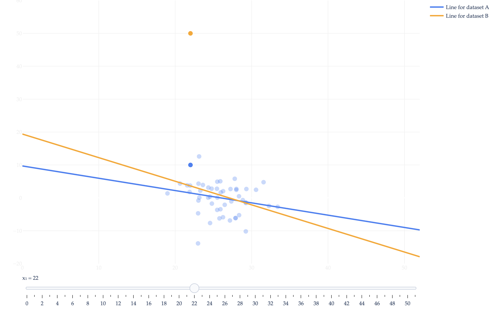



# Homework 2: Empirical Risk and Simple Linear Regression

**due** Wednesday, May 13th, 2026 at 11:59PM Ann Arbor Time

<a class="btn btn-info assignment-pdf-button" href="/resources/homeworks/hw02/hw02.pdf" target="_blank">View as PDF ✏️</a>
<a class="btn btn-info assignment-pdf-button" href="/resources/homeworks/hw02/hw02-solutions.pdf" target="_blank">Solutions PDF ✅</a>

{: .yellow }

Write your solutions to the following problems either by writing them on a piece of paper or on a tablet and scanning your answers as a PDF. Note that you are not allowed to use LaTeX, Google Docs, or any other digital document creation software to type your answers. Homeworks are due to Gradescope by 11:59PM on the due date. See the [syllabus](https://eecs245.org/syllabus/#homeworks) for details on the slip day policy.

Homework will be evaluated not only on the correctness of your answers, but on your ability to present your ideas clearly and logically. You should always explain and justify your conclusions, using sound reasoning. Your goal should be to convince the reader of your assertions. If a question does not require explanation, it will be explicitly stated.

Before proceeding, make sure you're familiar with the [collaboration policy](https://eecs245.org/syllabus/#homeworks).

---

## Problems

- [Problem 1: Homework 1 Solutions Review](#problem-1-homework-1-solutions-review-10-pts)
- [Problem 2: Stonks](#problem-2-stonks-7-pts)
- [Problem 3: Slippery Slope](#problem-3-slippery-slope-9-pts)
- [Problem 4: Fun with Correlation](#problem-4-fun-with-correlation-8-pts)
- [Problem 5: Switching Sides](#problem-5-switching-sides-9-pts)
- [Problem 6: Simple LAD](#problem-6-simple-lad-9-pts)

---

Total Points: 10 + 7 + 9 + 8 + 9 + 9 = 52

---

## Problem 1: Homework 1 Solutions Review (10 pts)

Review the solutions to Homework 1. Pick **two problem parts** (for example, Problem 3a and Problem 5) from Homework 1 in which your solutions have the most room for improvement, i.e., where they have unsound reasoning, could be significantly more efficient or clearer, etc. **Include a screenshot of your solution to each problem part**, and in a few sentences, explain what was deficient and how it could be fixed.

Alternatively, if you think one of your solutions is significantly better than the posted one, copy it here and explain why you think it is better. If you didn't do Homework 1, choose two problem parts from it that look challenging to you, and in a few sentences, explain the key ideas behind their solutions in your own words.

Solution

---

## Problem 2: Stonks (7 pts)

This problem will eventually have something to do with machine learning. But first, a life lesson.

Suppose you invest in a stock, and:

-   In year 1, your investment increases by 50%.

-   In year 2, your investment decreases by 50%.

-   In year 3, your investment increases by 50%.

-   In year 4, your investment decreases by 50%.

What is the average growth rate of your investment, **per year**? The answer is not 0%, because ultimately you've **lost money**, even though it looks like the gains and losses should cancel out.

Why? At end of year 1, you have more money than you started with, and so losing 50% of that money in year 2 hurts more than losing 50% of your starting amount. Then, going up 50% in year 3 earns you less money than originally going up 50% in year 1 did, and so on.

Before we calculate the average growth rate, let's calculate the final value of your investment. To do so, we should convert these growth rates from percentages multipliers, using the formula:

$$
\text{multiplier} = 1 + \frac{\text{percentage}}{100}
$$

So,

$$
\text{final value} = \text{initial value} \cdot \underbrace{1.5}_{\text{year } 1} \cdot \underbrace{0.5}_{\text{year } 2} \cdot \underbrace{1.5}_{\text{year } 3} \cdot \underbrace{0.5}_{\text{year } 4} = \text{initial value} \cdot 0.5625
$$

Converting \\(0.5625\\) from a percentage back to a growth rate gives us:

$$
\text{percentage} = 0.5625 - 1 = -0.4375 = -43.75\%
$$

So, in total, we lost 43.75% of our money.

This doesn't give us our average growth rate, though. The average growth rate, as a multiplier, should be a value \\(g\\) such that if our investment grows by \\(g\\) each year, we end up with \\(1.5 \cdot 0.5 \cdot 1.5 \cdot 0.5 \cdot \text{initial value}\\). In other words:

$$
\text{final value} = \text{initial value} \cdot g^4
$$

So, as a multiplier, we have that:

$$
g^4 = 1.5 \cdot 0.5 \cdot 1.5 \cdot 0.5 \implies g = \left( 1.5 \cdot 0.5 \cdot 1.5 \cdot 0.5 \right)^{1/4} \approx 0.8660
$$

Converting \\(g\\) back to a percentage gives us:

$$
\text{percentage} = 0.8660 - 1 = -0.1340 = -13.40\%
$$

So, the average growth rate of our investment, **per year**, is \\(-13.40\%\\) --- not the 0% that we might initially guess.

What does this have to do with machine learning? Let's re-visit one particular calculation above.

$$
g = \left( 1.5 \cdot 0.5 \cdot 1.5 \cdot 0.5 \right)^{1/4}
$$

Here, \\(g\\), is the **geometric mean** of the numbers 1.5, 0.5, 1.5, and 0.5. Geometric means are useful in computing the average of growth rates (when expressed as multipliers). In general, if \\(y_1, y_2, \ldots, y_n\\) are **positive** numbers, then their geometric mean is:

$$
\left(y_1 \cdot y_2 \cdot \ldots \cdot y_n\right)^{1/n} = \left(\prod_{i=1}^n y_i\right)^{1/n}
$$

Like the arithmetic mean, as we saw in [Chapter 1.2](https://notes.eecs245.org/introduction-to-supervised-learning/squared-loss-constant-model/), and the harmonic mean, as we saw in Lab 2, the geometric mean is the constant prediction that minimizes average loss for some loss function.

In this case, the loss function is the log-quotient loss, defined as:

$$
\begin{aligned}
L_{LQ}(y_i, h(x_i)) &= \left[\log\left(\frac{y_i}{h(x_i)}\right)\right]^2
\end{aligned}
$$

Note that \\(\log(\cdot)\\) is the natural logarithm, with base \\(e\\).

Prove that the geometric mean of \\(y_1, y_2, \ldots, y_n\\) is the constant prediction that minimizes average log-quotient loss for the constant model, i.e. that the geometric mean minimizes:

$$
R_{LQ}(w) = \frac{1}{n} \sum_{i=1}^n \left[\log\left(\frac{y_i}{w}\right)\right]^2
$$

<em>Hint: This is a question involving the three-step modeling process. You'll want to start by finding \\(\frac{\text{d}}{\text{d}w} R_{LQ}(w)\\) and setting that to 0. As a sub-problem, you'll need to find \\(\frac{\text{d}}{\text{d}w} \left[\log\left(\frac{y_i}{w}\right)\right]\\). Work one step at a time and make sure your logic is clearly justified. Review the logarithm rules presented in <a href="https://eecs245.org/resources/homeworks/hw01/#problem-5-mean-imputation-6-pts">Homework 1, Problem 5</a>, and also use the fact that if \\(b = \log(a)\\), then \\(a = e^b\\).</em>

Solution

First, we find the derivative of \\(R_{LQ}(w)\\) with respect to \\(w\\). In doing so, you'll notice that we use the fact that \\(\log \left(\frac{y_i}{w}\right) = \log(y_i) - \log(w)\\) to simplify.

$$
\begin{align*}
\frac{\text{d}}{\text{d}w} R_{LQ}(w) &= \frac{\text{d}}{\text{d}w} \left( \frac{1}{n} \sum_{i=1}^n \left[\log\left(\frac{y_i}{w}\right)\right]^2 \right) \\\\
&= \frac{1}{n} \sum_{i=1}^n \frac{\text{d}}{\text{d}w} \left[\log\left(\frac{y_i}{w}\right)\right]^2 \\\\
&= \frac{1}{n} \sum_{i=1}^n 2 \left[\log\left(\frac{y_i}{w}\right)\right] \underbrace{\frac{\text{d}}{\text{d}w} \left[\log\left(\frac{y_i}{w}\right)\right]}_{\text{chain rule}} \\\\
&= \frac{1}{n} \sum_{i=1}^n 2 \left[\log\left(\frac{y_i}{w}\right)\right] \frac{\text{d}}{\text{d}w} \underbrace{\left[\log(y_i) - \log(w)\right]}_{\text{simplification}} \\\\
&= \frac{1}{n} \sum_{i=1}^n 2 \left[\log\left(\frac{y_i}{w}\right)\right] \left( -\frac{1}{w} \right) \\\\
&= -\frac{2}{nw} \sum_{i=1}^n \left[\log\left(\frac{y_i}{w}\right)\right] \\\\
\end{align*}
$$

Next, we'll set this derivative to 0 and solve for the resulting value of \\(w\\), called \\(w^*\\).

Setting this equal to 0 yields:

$$
-\frac{2}{nw} \sum_{i=1}^n \left[\log\left(\frac{y_i}{w}\right)\right] = 0
$$

From here, we can multiply both sides by \\(-\frac{n}{2}\\).

$$
\frac{1}{w} \sum_{i=1}^n \left[\log\left(\frac{y_i}{w}\right)\right] = 0
$$

Next, we'll multiply both sides by \\(w\\). \\(\frac{1}{w}\\) could never be 0, so this is fine, since it won't change the set of possible values for \\(w^*\\).

$$
\sum_{i=1}^n \left[\log\left(\frac{y_i}{w}\right)\right] = 0
$$

From here, we'll use the simplification that \\(\log\left(\frac{y_i}{w}\right) = \log(y_i) - \log(w)\\).

$$
\sum_{i=1}^n \left[\log(y_i) - \log(w)\right] = 0
$$

Distributing the sum gives us:

$$
\sum_{i=1}^n \log(y_i) - \sum_{i=1}^n \log(w) = 0
$$

The second term is the sum of \\(n\\) terms of \\(\log(w)\\), which is \\(n \log(w)\\).

$$
\sum_{i=1}^n \log(y_i) - n \log(w) = 0
$$

Remember, the goal is to isolate \\(w\\). We're almost there. Adding \\(n \log(w)\\) to both sides and dividing by \\(n\\) gives us:

$$
\log(w) = \frac{1}{n} \sum_{i=1}^n \log(y_i)
$$

How do we undo the logarithm? By exponentiating both sides, as the hint suggests.

$$
e^{\log(w)} = e^{\frac{1}{n} \sum_{i=1}^n \log(y_i)}
$$

But \\(e^{\log(w)} = w\\), so we have:

$$
w = e^{\frac{1}{n} \sum_{i=1}^n \log(y_i)}
$$

We know that we eventually need to make the right-hand side look like the geometric mean. To help us get there, we can use the fact that \\(\log(a) + \log(b) + \log(c) + ... = \log(a \cdot b \cdot c \cdot ...)\\).

$$
w = e^{\frac{1}{n} \log(y_1 \cdot y_2 \cdot \ldots \cdot y_n)}
$$

Then, using the fact that \\(e^{ab} = (e^a)^b\\), we have:

$$
w = \left( e^{\log(y_1 \cdot y_2 \cdot \ldots \cdot y_n)} \right)^{1/n}
$$

And finally, using the fact that \\(\log(x)\\) is the inverse of \\(e^x\\), we have:

$$
w^* = \left( y_1 \cdot y_2 \cdot \ldots \cdot y_n \right)^{1/n} = \boxed{\left( \prod_{i=1}^n y_i \right)^{1/n}}
$$

which is the geometric mean of \\(y_1, y_2, \ldots, y_n\\)! So, we've shown that the geometric mean minimizes average log-quotient loss for the constant model.

---

## Problem 3: Slippery Slope (9 pts)

In [Chapter 1.3](https://notes.eecs245.org/introduction-to-supervised-learning/absolute-loss/), we found that \\(w^* = \mathrm{Median}(y_1, y_2, \ldots, y_n)\\) is the constant prediction that minimizes mean absolute error: 

$$
R_{\mathrm{abs}}(w) = \frac{1}{n} \sum_{i=1}^n |y_i - w|
$$

Suppose that we have a dataset of numbers \\(y_1, y_2, \ldots, y_n\\) such that \\(n\\) is **odd** and the values are arranged in increasing order. That is, \\(y_1 \leq y_2 \leq \cdots \leq y_n\\).

**Note: Parts a) and b) are independent of each other.**

a)

(5 pts) Suppose that \\(R_{\mathrm{abs}}(\alpha) = V\\), where \\(V\\) is the minimum value of \\(R_{\mathrm{abs}}(w)\\) and \\(\alpha\\) is one of the numbers in our dataset.

Let \\(\alpha + \beta\\) be the smallest value greater than \\(\alpha\\) in our dataset, where \\(\beta &gt; 0\\). Another way of thinking about this is that \\(\beta =\\) (smallest value greater than \\(\alpha\\)) \\(- \alpha\\).

Suppose we modify our dataset by replacing the value \\(\alpha\\) with the value \\(\alpha + \beta + 1\\). In our **new** dataset of \\(n\\) values:

1.  What value of \\(w\\) minimizes \\(R_{\mathrm{abs}}(w)\\)?

2.  What is the new minimum value of \\(R_{\mathrm{abs}}(w)\\)?

Both of your answers should be expressions involving \\(V\\), \\(\alpha\\), \\(\beta\\), and/or constants.

<em>Hint: Think about the problem on your own for a while. If you're stuck, watch this <a href="https://www.loom.com/share/f0980c9f4d5f4fada99b307014e05cd8?sid=2807514e-c1aa-42d8-8883-7e6d1fab5168">hint video</a>.</em>

Solution

The new minimum of \\(R_{\mathrm{abs}}(w)\\) is \\(V + \frac{1}{n}\\), and the \\(w^*\\) that minimizes \\(R_{\mathrm{abs}}(w)\\) for the new dataset is \\(\alpha + \beta\\).

Make sure to refer to the [hint video](https://www.loom.com/share/f0980c9f4d5f4fada99b307014e05cd8?sid=0066ee1b-a23b-4f5c-bebf-ee751b09a4a4) we recorded for this problem, since it walks through much of our solution.

We are told that \\(\alpha\\) minimizes the mean absolute error on the original dataset. This indicates that \\(\alpha\\) is the median of the dataset, and since we've given that \\(n\\) is odd, it is the unique minimizer of mean absolute error. Before modifying \\(\alpha\\), here's how our values look on a number line; note that since \\(n\\) is odd, there are \\(\frac{n-1}{2}\\) values to the left of the median, 1 value equal to the median, and \\(\frac{n-1}{2}\\) values to the right of the median.

$$
\underbrace{y_1 \:\:\:\: y_2 \:\:\:\: ... \:\:\:\: y_\frac{n-1}{2}}_{\text{the smallest $\frac{n-1}{2}$ values}} \:\:\:\: \underbrace{\color{blue}\alpha}_\text{the current median} \:\:\:\: \underbrace{{\color{red}\alpha + \beta} \:\:\:\: y_{\frac{n-1}{2} + 3} \:\:\:\: y_{\frac{n-1}{2} + 4} \:\:\:\: ... \:\:\:\: y_n}_{\text{the largest $\frac{n-1}{2}$ values}}
$$

When we modify the the value of \\(\alpha\\) to be \\(\alpha + \beta + 1\\), the new median becomes \\(\alpha + \beta\\), which is the value that was immediately to the right of the old median. The old median and new median swap places.

$$
\underbrace{y_1 \:\:\:\: y_2 \:\:\:\: ... \:\:\:\: y_\frac{n-1}{2}}_{\text{the smallest $\frac{n-1}{2}$ values}} \:\:\:\: \underbrace{{\color{red}\alpha + \beta}}_\text{the new median} \:\:\:\: \underbrace{{\color{blue}\alpha + \beta + 1} \:\:\:\: y_{\frac{n-1}{2} + 3} \:\:\:\: y_{\frac{n-1}{2} + 4} \:\:\:\: ... \:\:\:\: y_n}_{\text{the largest $\frac{n-1}{2}$ values}}
$$

**Throughout the solution, especially when we break the problem into four cases, make sure to keep refering to the diagram above.**

Now that we know that the new minimizer of \\(R_\text{abs}(w)\\) on the new dataset is \\(\alpha + \beta\\), we need to calculate \\(R_\text{abs}(\alpha + \beta)\\) on the new dataset --- in other words, we need the mean absolute distance of each point in the new dataset from the new median, \\(\alpha + \beta\\).

To do so, we'll find the new **sum** of absolute distances from the median and divide it by \\(n\\), as we'll see that it's easier to think in terms of the sum, or total, absolute error of the whole dataset from the median.

On the old dataset, the sum of absolute distances from the median is \\(Vn\\), since the old mean absolute distances from the median is \\(V\\). (We're using the term "absolute distance" here because it feels more intuitive than "absolute error" for this particular problem, but the terms are equivalent.) We'll approach the problem by determining what to add or subtract from \\(Vn\\) to get the new sum of absolute distances from the median.

We can break this into four cases:

-   For the smallest \\(\frac{n-1}{2}\\) values, the new median is now \\(\beta\\) units further away than the old median was --- the new median is \\(\alpha + \beta\\), which is \\(\beta\\) units further away than the old median was. This adds \\(\boxed{\beta \cdot \left( \frac{n-1}{2} \right)}\\) to the sum of absolute errors from the median.

-   In the old dataset, exactly one of the \\(n\\) values was equal to the median, and that point had an absolute distance of 0 from the median. That's still the case in the new dataset, so this fact alone doesn't change the sum of absolute errors from the median.

-   The distance between the median and the point immediately to the right of it used to be \\(({\color{red}\alpha + \beta}) - {\color{blue}\alpha} = \beta\\), but is now \\(({\color{blue}\alpha + \beta + 1}) - ({\color{red}\alpha + \beta}) = 1\\). The difference between these two is \\(1 - \beta\\); if \\(\beta &gt; 1\\), these two points are now closer than they were before, and if \\(\beta &lt; 1\\), these two points are now further than they were before. This adds \\(\boxed{1 - \beta}\\) to the sum of absolute errors from the median.

-   For the largest \\(\frac{n-1}{2} - 1\\) values --- that is, the last bracket from the diagram, excluding \\(\alpha + \beta + 1\\) --- the new median is now \\(\beta\\) units closer than the old median was. This subtracts \\(\beta \cdot \left( \frac{n-1}{2} - 1 \right)\\) from the sum of absolute errors from the median, or equivalently, adds \\(\boxed{-\beta \cdot \left( \frac{n-1}{2} - 1 \right)}\\).

So, the new sum of absolute errors from the median is:

$$
Vn + \beta \cdot \left( \frac{n-1}{2} \right) + 1 - \beta - \beta \cdot \left( \frac{n-1}{2} - 1 \right) = Vn + 1
$$

And so the mean of absolute errors from the median, \\(R_\text{abs}(\alpha + \beta)\\), in the new dataset, is:

$$
\frac{Vn+1}{n} = \boxed{V + \frac{1}{n}}
$$

b)

(4 pts) Let \\(y_a\\) and \\(y_b\\) be two values in our dataset such that \\(y_a &lt; y_b\\) and that the slope of \\(R_{\mathrm{abs}}(w)\\) between \\(w = y_a\\) and \\(w = y_b\\) is constant, and equal to \\(-\frac{2}{3}\\).

Suppose we introduce a new value to our dataset that is less than \\(y_a\\). In our **new** dataset of \\(n+1\\) values, what is the slope of \\(R_{\mathrm{abs}}(w)\\) between \\(w = y_a\\) and \\(w = y_b\\)? Your answer should be an expression involving \\(n\\) and/or constants, but should not contain \\(a\\) or \\(b\\), or any value of \\(y\\).

Solution

We know from Chapter 1.3 that the slope of \\(R_\text{abs}(w)\\) at any \\(w\\) that is not a data point is:

$$
\frac{\text{d}}{\text{d}w} R_{\mathrm{abs}}(w) = \frac{\# \text{ left of } w - \# \text{ right of } w}{n}
$$

In the region between \\(w = y_a\\) and \\(w = y_b\\), the slope is constant, meaning there are no data points between \\(y_a\\) and \\(y_b\\), since if there were, the slope would change at that point.

Suppose \\(w'\\) is some value between \\(y_a\\) and \\(y_b\\), meaning that it's on the line segment whose slope we know about. Let \\(k\\) be the number of data points less than \\(w'\\). Then, the number of data points greater than \\(w'\\) is \\(n - k\\), and:

$$
\frac{\text{d}}{\text{d}w} R_{\mathrm{abs}}(w') = \frac{k - (n - k)}{n} = \frac{2k - n}{n} = \underbrace{-\frac{2}{3}}_{\text{given to us in the question}}
$$

In the new dataset, since we add a point to the left of \\(y_a\\), the number of data points less than \\(w'\\) is now \\(k+1\\), while the number of data points greater than \\(w'\\) is still \\(n - k\\). Therefore, in the **new** dataset, the slope of \\(R_{\mathrm{abs}}(w)\\) between \\(w = y_a\\) and \\(w = y_b\\) is:

$$
\frac{\text{d}}{\text{d}w} R_{\mathrm{abs}}(w') = \frac{(k+1) - (n - k)}{n+1} = \frac{2k + 1 - n}{n+1} = s
$$

(\\(s\\) is a new variable we've introduced here to represent the slope in the new dataset.)

The problem now boils down to re-writing \\(s\\) in terms of \\(n\\) only, not involving \\(k\\). To do this, we'll use the final result from the first equation:

$$
\frac{2k - n}{n} = -\frac{2}{3} \implies 2k - n = -\frac{2}{3}n \implies 2k = \frac{n}{3} \implies k = \frac{n}{6}
$$

Plugging \\(k = \frac{n}{6}\\) into the equation for \\(s\\), we get:

$$
\begin{align*}
s &= \frac{2k + 1 - n}{n+1} \\\\
&= \frac{2 \cdot \frac{n}{6} + 1 - n}{n+1} \\\\
&= \frac{\frac{n}{3} + 1 - n}{n+1} \\\\
&= \boxed{\frac{-\frac{2}{3}n + 1}{n+1}}
\end{align*}
$$

---

## Problem 4: Fun with Correlation (8 pts)

As we will see in [Chapter 2.4](https://notes.eecs245.org/simple-linear-regression/correlation/), the correlation coefficient \\(r\\) between two variables \\(x\\) and \\(y\\) measures the strength of the linear association between them, or intuitively, how tightly the points cluster around a line. Formally, \\(r\\) is defined as: 

$$
r = \frac{1}{n} \sum_{i=1}^n \left( \frac{x_i - \bar{x}}{\sigma_x} \right) \left( \frac{y_i - \bar{y}}{\sigma_y} \right)
$$

where \\(\bar{x}\\) and \\(\bar{y}\\) are the means of \\(x\\) and \\(y\\), respectively, and \\(\sigma_x\\) and \\(\sigma_y\\) are the standard deviations of \\(x\\) and \\(y\\), respectively.

a)

(3 pts) Let \\(r\\) be the correlation coefficient between \\(x\\) and \\(y\\). Let \\(t\\) be a new variable defined as:

$$
t_i = -2x_i + 5, \qquad i = 1, \ldots, n
$$

Let \\(r'\\) be the correlation coefficient between \\(t\\) and \\(y\\). Prove that \\(r' = -r\\).

<em>Hint: You can use the facts that if \\(t_i = ax_i + b\\), then \\(\bar{t} = a\bar{x} + b\\) and \\(\sigma_t = |a|\sigma_x\\), without proof. Everything else must be derived from the definition of the correlation coefficient.</em>

Solution

$$
\begin{align*}
r'&= \frac{1}{n} \sum_{i=1}^n \left( \frac{t_i - \bar{t}}{\sigma_t} \right) \left( \frac{y_i - \bar{y}}{\sigma_y} \right) \\\\
&= \frac{1}{n} \sum_{i=1}^n \left( \frac{-2x_i+5 - (-2\bar{x}+5)}{2\sigma_x} \right) \left( \frac{y_i - \bar{y}}{\sigma_y} \right) \\\\
&= \frac{1}{n} \sum_{i=1}^n \left( \frac{-2x_i + 2\bar{x}}{2\sigma_x} \right) \left( \frac{y_i - \bar{y}}{\sigma_y} \right) \\\\
&= \frac{1}{n} \sum_{i=1}^n \left( \frac{-2(x_i -\bar{x})}{2\sigma_x} \right) \left( \frac{y_i - \bar{y}}{\sigma_y} \right) \\\\
&= \frac{1}{n} \sum_{i=1}^n \left( -\frac{x_i -\bar{x}}{\sigma_x} \right) \left( \frac{y_i - \bar{y}}{\sigma_y} \right) \\\\
&= -\frac{1}{n} \sum_{i=1}^n \left( \frac{x_i -\bar{x}}{\sigma_x} \right) \left( \frac{y_i - \bar{y}}{\sigma_y} \right) \\\\
&= -r
\end{align*}
$$

b)

(5 pts) Suppose we fit two simple linear regression models by minimizing mean squared error.

-   Model 1: \\(\text{predicted } y_i = h(x_i) = w_0^* + w_1^* x_i\\)

-   Model 2: \\(\text{predicted } y_i = h'(t_i) = w_0' + w_1' t_i\\)

(The \\('\\) does not indicate a derivative here!)

We already know that \\(r' = -r\\). How do the other quantities compare between the two lines?

1.  Express \\(w_1'\\) in terms of \\(w_1^*\\), \\(w_0^*\\), and/or constants (but no other variables).

2.  Express \\(w_0'\\) in terms of \\(w_0^*\\), \\(w_1^*\\), and/or constants (but no other variables).

3.  Above, you should have found that the new slope, \\(w_1'\\), and new intercept, \\(w_0'\\), are different than the original slope and intercept. However, it turns out that the mean squared error of both model's predictions are the same. That is:

    

$$
\frac{1}{n} \sum_{i=1}^n (y_i - (w_0' + w_1' t_i))^2 = \frac{1}{n} \sum_{i=1}^n (y_i - (w_0^* + w_1^* x_i))^2
$$

   Give a two-sentence English explanation of why this is the case.

Solution

$$
\begin{align*}
w_1'&=r'\frac{\sigma_y}{\sigma_t} \\\\
&=-r\frac{\sigma_y}{2\sigma_x} \\\\
&=-\frac{1}{2}r\frac{\sigma_y}{\sigma_x} \\\\
&=-\frac{1}{2}w_1^* \\\\
\\\\
w_0'&=\bar{y}-w_1'\bar{t} \\\\
&=\bar{y}-(-\frac{1}{2}w_1^* \cdot (-2\bar{x}+5)) \\\\
&=\bar{y}-(w_1^*\bar{x} - \frac{5}{2}w_1^*) \\\\
&=\bar{y}-w_1^*\bar{x} + \frac{5}{2}w_1^* \\\\
&=w_0^* + \frac{5}{2}w_1^*
\end{align*}
$$

When you apply a scaling or shifting transformation on \\(x\\), the model's line will adjust its slope and intercept to give the same predictions as before to MSE. The model aims to minimize the difference between the actual \\(y\\)'s and the predictions, so if the actual \\(y\\)'s and predictions stay the same, then the MSE will also be the same.

c)

(0 pts, **optional**) This part is challenging and potentially time-consuming, so we've made it optional. It's good exam practice though, so if you don't do it now, you should return to it later on when you have more time. It is independent of the previous two parts of this problem.

Prove that, for any dataset \\((x_1, y_1), \ldots, (x_n, y_n)\\) with a correlation coefficient \\(r\\),

$$
\underbrace{\frac{1}{n} \sum_{i=1}^n (y_i - (w_0^* + w_1^* x_i))^2}_{\text{mean squared error of optimal SLR model}} = \underbrace{\sigma_y^2 (1 - r^2)}_{\text{function of correlation coefficient}}
$$

Solution

$$
\begin{align*}
&\frac{1}{n} \sum_{i=1}^n (y_i - (w_0^* + w_1^* x_i))^2 \\\\
&=\frac{1}{n} \sum_{i=1}^n (y_i - (\bar{y}-w_1^*\bar{x} + w_1^* x_i))^2 && \text{sub in } w_0^* \\\\
&=\frac{1}{n} \sum_{i=1}^n (y_i - \bar{y}+w_1^*\bar{x} - w_1^* x_i)^2 \\\\
&=\frac{1}{n} \sum_{i=1}^n ((y_i - \bar{y})-w_1^*(x_i-\bar{x}))^2 \\\\
&=\frac{1}{n} \sum_{i=1}^n (y_i - \bar{y})^2-2((y_i - \bar{y})\cdot w_1^*(x_i-\bar{x}))+(w_1^*(x_i-\bar{x}))^2 && \text{expand square} \\\\
&=\frac{1}{n} \sum_{i=1}^n (y_i - \bar{y})^2-\frac{1}{n} \sum_{i=1}^n2((y_i - \bar{y})\cdot w_1^*(x_i-\bar{x}))+\frac{1}{n} \sum_{i=1}^n(w_1^*(x_i-\bar{x}))^2 && \text{expand summation}
\end{align*}
$$

Let's simplify each of the summations separately, starting with the one on the left which we can rewrite in terms of \\(\sigma_y\\):

$$
\begin{align*}
\sigma_y &= \sqrt{\frac{1}{n} \sum_{i=1}^n(y_i-\bar{y})^2} \\\\
\sigma_y^2 &= \frac{1}{n} \sum_{i=1}^n(y_i-\bar{y})^2
\end{align*}
$$

We can apply a similar method to the term on the right:

$$
\begin{align*}
&\frac{1}{n} \sum_{i=1}^n(w_1^*(x_i-\bar{x}))^2 \\\\
&=\frac{1}{n} \sum_{i=1}^n((r\frac{\sigma_y}{\sigma_x})(x_i-\bar{x}))^2 \\\\
&=\frac{1}{n} \sum_{i=1}^n(r\frac{\sigma_y}{\sigma_x})^2(x_i-\bar{x})^2 \\\\
&=(r\frac{\sigma_y}{\sigma_x})^2 \cdot \big(\frac{1}{n} \sum_{i=1}^n(x_i-\bar{x})^2 \big) \\\\
&=(r\frac{\sigma_y}{\sigma_x})^2 \cdot \sigma_x^2 \\\\
&=r^2\sigma_y^2
\end{align*}
$$

Next, simplify the middle term:

$$
\begin{align*}
&\frac{1}{n} \sum_{i=1}^n2((y_i - \bar{y})\cdot w_1^*(x_i-\bar{x})) \\\\
&=2w_1^* \cdot \big(\frac{1}{n} \sum_{i=1}^n(y_i - \bar{y})\cdot (x_i-\bar{x}) \big) \\\\
&=2w_1^* \cdot r\sigma_x \sigma_y \:\:\:\:\:\: \text{rewriting in terms of } r=\frac{1}{n}\sum_{i=1}^{n}(\frac{x_i-\bar{x}}{\sigma_x})(\frac{y_i-\bar{y}}{\sigma_y}) \\\\
&=2r\frac{\sigma_y}{\sigma_x} \cdot r\sigma_x \sigma_y \:\:\:\:\: \text{substitute } w_1^* \\\\
&=2r^2\sigma_y^2
\end{align*}
$$

Finally, let's put all of that together:

$$
\begin{align*}
&\frac{1}{n} \sum_{i=1}^n (y_i - \bar{y})^2-\frac{1}{n} \sum_{i=1}^n2((y_i - \bar{y})\cdot w_1^*(x_i-\bar{x}))+\frac{1}{n} \sum_{i=1}^n(w_1^*(x_i-\bar{x}))^2 \\\\
&=\sigma_y^2 - 2r^2\sigma_y^2+r^2\sigma_y^2 \\\\
&=\sigma_y^2(1-2r^2+r^2) \\\\
&=\sigma_y^2(1-r^2)
\end{align*}
$$

---

## Problem 5: Switching Sides (9 pts)

Consider two datasets, \\(A\\) and \\(B\\). Both datasets have \\(n = 50\\) points, of which 49 are identical, and only one is different between the two datasets:

-   **Dataset \\(A\\)**: \\((22, 10), (x_2, y_2), \ldots, (x_{49}, y_{49}), (x_{50}, y_{50})\\)

-   **Dataset \\(B\\)**: \\((22, 50), \underbrace{(x_2, y_2), \ldots, (x_{49}, y_{49}), (x_{50}, y_{50})}_{\text{identical in both datasets}}\\)

Suppose that in both datasets, the \\(x\\)-values have a mean of \\(\bar{x} = 26\\) and a standard deviation of \\(\sigma_x = \sqrt{\frac{1}{n} \sum_{i=1}^n (x_i - \bar{x})^2} = 3\\).

a)

(5 pts) Suppose we fit a simple linear regression model by minimizing mean squared error, separately for each dataset.

Let \\(w_1^A\\) and \\(w_1^B\\) be the optimal slopes for datasets \\(A\\) and \\(B\\), respectively. Determine the difference between \\(w_1^B\\) and \\(w_1^A\\). That is, find:

$$
w_1^B - w_1^A
$$

Your answer should be a number with no variables.

<em>Hint: There are many equivalent formulas for the slope of the regression line. We recommend using this one for this problem: </em>

$$
w_1^* = \displaystyle\frac{\displaystyle\sum_{i=1}^n (x_i - \overline x)y_i}{\displaystyle\sum_{i=1}^n (x_i - \overline x)^2}
$$

Solution

\\(-\frac{16}{45}\\)

Since the datasets are identical for all \\(i&gt;1\\), we can rewrite the summation 

$$
\sum_{i=1}^n (x_i-\overline{x})y_i
$$

 as 

$$
(x_1-\overline{x})y_1 + \sum_{i=2}^n(x_i-\overline{x})y_i
$$

In dataset \\(A\\), \\(x_1 = 22\\) and \\(y_1 = 10\\). In dataset \\(B\\), \\(x_1 = 22\\) and \\(y_1 = 50\\). But in both datasets, 

$$
\sum_{i=2}^n (x_i - \overline{x})y_i
$$

 is the same, and so is 

$$
\sum_{i=1}^n (x_i - \overline{x})^2
$$

So, **the difference** between their two optimal slopes is:

$$
\begin{align*}
w_1^B - w_1^A
&= \frac{(22-26)50 + \sum_{i=2}^n (x_i - \overline{x})y_i}{\sum_{i=1}^n (x_i - \overline{x})^2}
- \frac{(22-26)10 + \sum_{i=2}^n (x_i - \overline{x})y_i}{\sum_{i=1}^n (x_i - \overline{x})^2} \\\\
&= \frac{(22-26)(50-10)}{\sum_{i=1}^n (x_i - \overline{x})^2}
\end{align*}
$$

The denominator, \\(\sum_{i=1}^n (x_i - \overline{x})^2\\), is \\(n\\) times the variance of the \\(x\\)-values, which is 

$$
n\sigma_x^2 = 50 \cdot 3^2 = 450
$$

So numerically the difference is: 

$$
w_1^B - w_1^A
= \frac{(22-26)(50-10)}{450}
= \frac{-160}{450}
= -\frac{16}{45}
$$

So, since \\(x_1 &lt; \bar{x}\\), dataset \\(B\\)'s slope is less than dataset \\(A\\)'s slope.

To further our understanding of the problem, if \\(x_1 &gt; \bar{x}\\), dataset B's slope would have been greater than dataset A's slope.

We've produced an interactive visualization of what's going on.

[Find the visualization here.](https://eecs245.org/resources/homeworks/hw02/hw02-regression-point-vis.html)

The slider you'll see in the resulting visualization will allow you to change the value of \\(x_1\\) and observe how the fitted regression lines change in response. In the visualization, as you move \\(x_1\\), the mean \\(\bar{x}\\) changes ever so slightly to reflect your new choice of \\(x_1\\).

b)

(4 pts) Let \\(h_A\\) and \\(h_B\\) be the simple linear regression lines for datasets \\(A\\) and \\(B\\), respectively. That is, \\(h_A(x_i) = w_0^A + w_1^A x_i\\) and \\(h_B(x_i) = w_0^B + w_1^B x_i\\).

Which of the following values is greater: \\(|h_A(40) - h_B(40)|\\) or \\(|h_A(42) - h_B(42)|\\)? Why?

<em>Hint: Intuitively, we're asking which input's predicted value changes more by switching from \\(A\\) to \\(B\\). Don't try and expand the absolute differences or find their values exactly. Instead, draw a picture of both lines. For each line, there is one point that it is guaranteed to pass through. Using your knowledge of that point, and the slopes of the lines, you should be able to reason about which difference is greater. In your picture, assume that the lines intersect at some point to the left of \\(x = 40\\).</em>

Solution

\\(|h_A(42) - h_B(42)| \text{ is greater.}\\)

From part (a), we know that 

$$
w_1^B < w_1^A
$$

 so the two regression lines are not parallel.

From [Chapter 2.3](https://notes.eecs245.org/simple-linear-regression/finding-optimal-parameters/#regression-line-passes-through-the-mean), we know that each regression line is guaranteed to pass through the point \\((\overline{x}, \overline{y})\\) for its own dataset.

Since \\(y_1^B &gt; y_1^A\\) (that is, since \\(50 &gt; 10\\)), we know that \\(\overline{y}^B &gt; \overline{y}^A\\). More precisely, dataset \\(B\\) increases the total sum of \\(y\\)-values by \\(40\\), so 

$$
\bar{y}^B
= \frac{40 + 50 \cdot \bar{y}^A}{50}
= \bar{y}^A + \frac{4}{5}
$$

This means that dataset \\(A\\)'s regression line passes through \\((26, \bar{y}^A)\\), while dataset \\(B\\)'s regression line passes through \\((26, \bar{y}^A + \frac{4}{5})\\).

Because \\(x_1 = 22 &lt; \bar{x} = 26\\), we showed in part (a) that \\(w_1^B &lt; w_1^A\\). This implies that the two regression lines intersect at some point to the **right** of \\(x = 26\\).

The difference between the two models' predictions is larger for inputs that are farther from the point of intersection. Since the intersection occurs to the right of \\(x = 26\\) **but to the left of \\(x=40\\)** (as mentioned in the problem), the input \\(x = 42\\) is farther from the intersection than \\(x = 40\\) is.

Therefore, 

$$
|h_A(42) - h_B(42)| > |h_A(40) - h_B(40)|
$$

---

## Problem 6: Simple LAD (9 pts)

This problem involves writing code and submitting it to the Gradescope autograder.

There are two ways to access the supplemental Jupyter Notebook:

-   **Option 1 (preferred)**: Set up a Jupyter Notebook environment locally, use `git` to clone our course repository, and open `homeworks/hw02/hw02.ipynb`. For instructions on how to do this, see the [Environment Setup](https://eecs245.org/env-setup) page of the course website.

-   **Option 2**: Click [here](https://datahub.eecs245.org/hub/user-redirect/git-pull?repo=https%3A%2F%2Fgithub.com%2Feecs245%2Fsp26-code&urlpath=tree%2Fsp26-code%2Fhomeworks%2Fhw02%2Fhw02.ipynb&branch=main) to open `hw02.ipynb` on DataHub. Before doing so, read the instructions on the [Environment Setup](https://eecs245.org/env-setup/#option-2-using-the-eecs-245-datahub) page on how to use the DataHub.

To receive credit for the programming portion of the homework, you'll need to submit your completed notebook to the autograder on Gradescope. Your submission time for Homework 2 is the **latter** of your PDF and code submission times.


