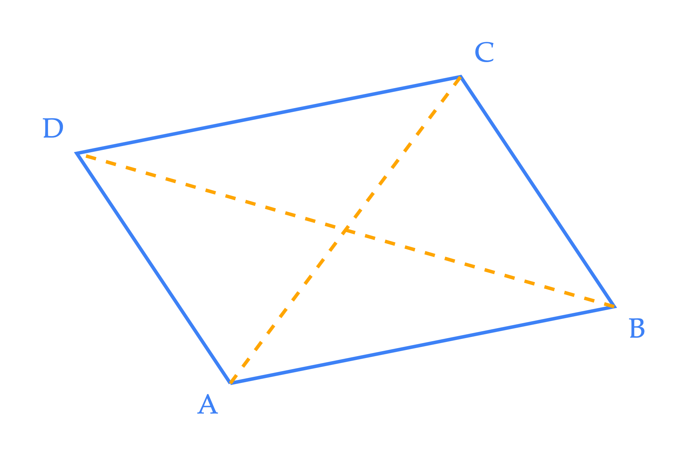
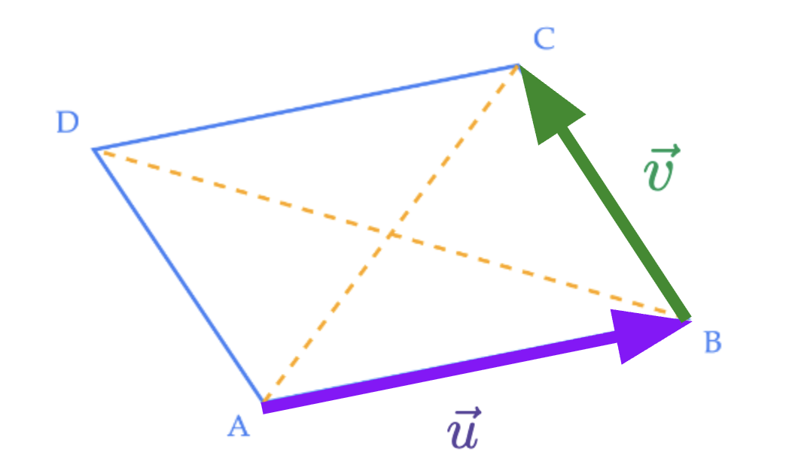
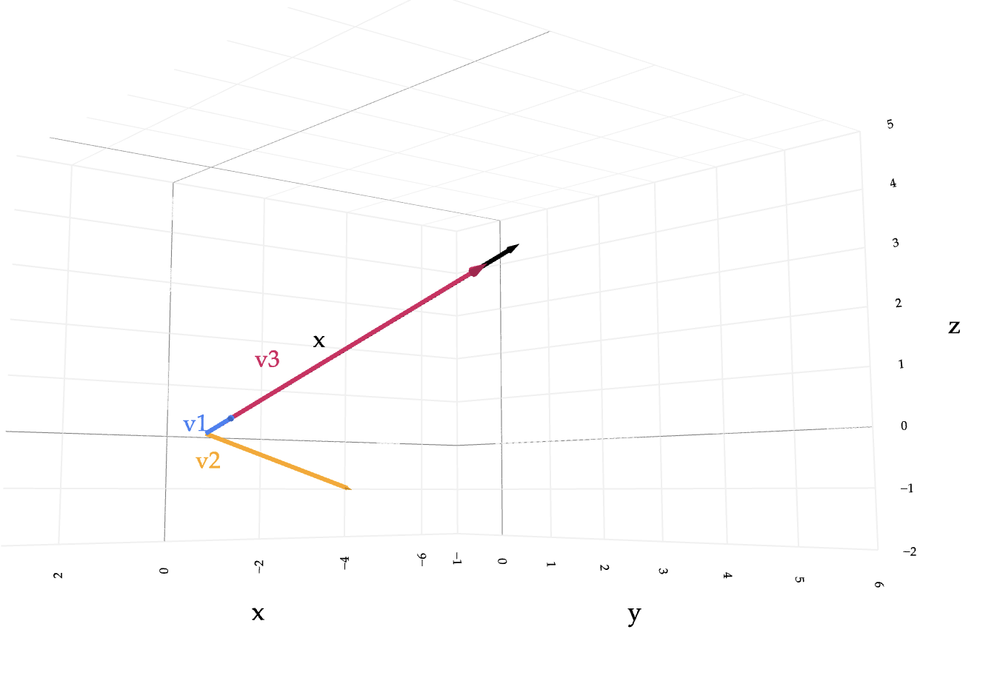
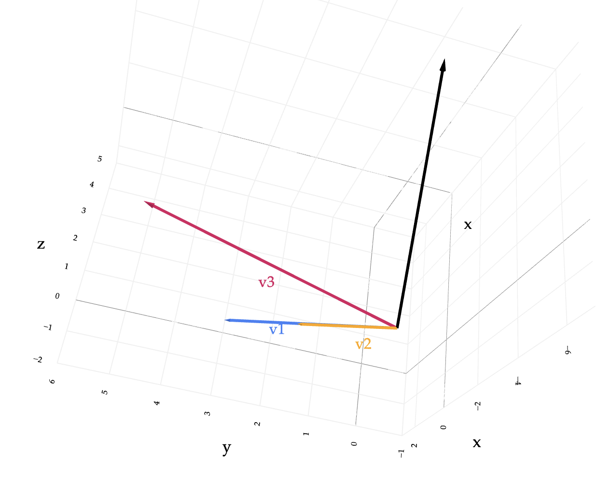



# Homework 3: Vectors and the Dot Product

**due** Sunday, May 17th, 2026 at 11:59PM Ann Arbor Time

<a class="btn btn-info assignment-pdf-button" href="/resources/homeworks/hw03/hw03.pdf" target="_blank">View as PDF ✏️</a>
<a class="btn btn-info assignment-pdf-button" href="/resources/homeworks/hw03/hw03-solutions.pdf" target="_blank">Solutions PDF ✅</a>

{: .yellow }

Write your solutions to the following problems either by writing them on a piece of paper or on a tablet and scanning your answers as a PDF. Note that you are not allowed to use LaTeX, Google Docs, or any other digital document creation software to type your answers. Homeworks are due to Gradescope by 11:59PM on the due date. See the [syllabus](https://eecs245.org/syllabus/#homeworks) for details on the slip day policy.

Homework will be evaluated not only on the correctness of your answers, but on your ability to present your ideas clearly and logically. You should always explain and justify your conclusions, using sound reasoning. Your goal should be to convince the reader of your assertions. If a question does not require explanation, it will be explicitly stated.

Before proceeding, make sure you're familiar with the [collaboration policy](https://eecs245.org/syllabus/#homeworks).

---

## Problems

- [Problem 1: Homework 2 Solutions Review](#problem-1-homework-2-solutions-review-10-pts)
- [Problem 2: Parallelogram Law](#problem-2-parallelogram-law-14-pts)
- [Problem 3: Linear Combinations](#problem-3-linear-combinations-9-pts)
- [Problem 4: Correlation](#problem-4-correlation-7-pts)
- [Problem 5: Projections](#problem-5-projections-15-pts)
- [Problem 6: Norms](#problem-6-norms-12-pts)
- [Problem 7: Neighbors](#problem-7-neighbors-10-pts)
- [Problem 8: Feedback](#problem-8-feedback-6-pts)

---

Total Points: 10 + 14 + 9 + 7 + 15 + 12 + 10 + 6 = 83

---

## Problem 1: Homework 2 Solutions Review (10 pts)

Review the solutions to Homework 2. Pick **two problem parts** (for example, Problem 2a and Problem 4b) from Homework 2 in which your solutions have the most room for improvement, i.e., where they have unsound reasoning, could be significantly more efficient or clearer, etc. **Include a screenshot of your solution to each problem part**, and in a few sentences, explain what was deficient and how it could be fixed.

Alternatively, if you think one of your solutions is significantly better than the posted one, copy it here and explain why you think it is better. If you didn't do Homework 2, choose two problem parts from it that look challenging to you, and in a few sentences, explain the key ideas behind their solutions in your own words.

Solution

---

## Problem 2: Parallelogram Law (14 pts)

a)

(4 pts) Let \\(\vec{u} = \begin{bmatrix} 3 \\\\ -6 \\\\ 0 \\\\ 2 \end{bmatrix}\\) and \\(\vec{v} = \begin{bmatrix} 2 \\\\ 1 \\\\ 4 \\\\ -2 \end{bmatrix}\\). Compute the following quantities:

1.  \\(\lVert \vec{u} \rVert\\)

2.  \\(\lVert \vec{v} \rVert\\)

3.  \\(\lVert \vec{u} + \vec{v} \rVert\\)

4.  \\(\lVert \vec{u} - \vec{v} \rVert\\)

Solution

1.  \\(\lVert \vec{u} \rVert = \sqrt{3^2 + (-6)^2 + 0^2 + 2^2} = \sqrt{9 + 36 + 0 + 4} = \sqrt{49} = 7\\)

2.  \\(\lVert \vec{v} \rVert = \sqrt{2^2 + 1^2 + 4^2 + (-2)^2} = \sqrt{4 + 1 + 16 + 4} = \sqrt{25} = 5\\)

3.  $$
\begin{align*}
    \lVert \vec{u} + \vec{v} \rVert &= \sqrt{(3+2)^2 + (-6+1)^2 + (0+4)^2 + (2-2)^2} \\\\
    &= \sqrt{25 + 25 + 16 + 0} \\\\ &= \sqrt{66}
    \end{align*}
$$

4.  $$
\begin{align*}
    \lVert \vec{u} - \vec{v} \rVert &= \sqrt{(3-2)^2 + (-6-1)^2 + (0-4)^2 + (2 - (-2))^2} \\\\
    &= \sqrt{1 + 49 + 16 + 16} \\\\ &= \sqrt{82}
    \end{align*}
$$

b)

(3 pts) Using the same vectors as in part **a)**, compute the angle between \\(\vec{u}\\) and \\(\vec{v}\\). Leave your answer in terms of \\(\cos^{-1}\\).

Solution

Since \\(\vec{u} \cdot \vec{v} = \lVert \vec{u} \rVert \lVert \vec{v} \rVert \cos \theta\\), we have:

$$
\begin{align*}
\vec u \cdot \vec v &= 3\cdot 2 + (-6)\cdot 1 + 0\cdot 4 + 2\cdot (-2) = 6 - 6 + 0 - 4 = -4,\\\\
\|\vec u\| &= \sqrt{3^2 + (-6)^2 + 0^2 + 2^2} = \sqrt{49} = 7,\\\\
\|\vec v\| &= \sqrt{2^2 + 1^2 + 4^2 + (-2)^2} = \sqrt{25} = 5,\\\\
\cos\theta &= \frac{\vec u \cdot \vec v}{\|\vec u\|\;\|\vec v\|} = \frac{-4}{7\cdot 5} = -\frac{4}{35}.\\\\
\theta &= \cos^{-1}\!\left(-\dfrac{4}{35}\right)
\end{align*}
$$

c)

(4 pts) Now, suppose \\(\vec{u} = \begin{bmatrix} u&#95;1 \\\\ u&#95;2 \\\\ \vdots \\\\ u&#95;n \end{bmatrix}\\) and \\(\vec{v} = \begin{bmatrix} v&#95;1 \\\\ v&#95;2 \\\\ \vdots \\\\ v&#95;n \end{bmatrix}\\) are any two vectors in \\(\mathbb{R}^n\\). Prove that:

$$
\lVert \vec{u} + \vec{v} \rVert^2 + \lVert \vec{u} - \vec{v} \rVert^2 = 2\lVert \vec{u} \rVert^2 + 2\lVert \vec{v} \rVert^2
$$

The statement above is called the **parallelogram law** of vectors.

<em>Hint: The point of part <strong>a)</strong> was to give you a feel for which quantities are involved in this statement. Your proof should not use these values in particular. Instead, <strong>start with the left-hand side</strong> of the equation and use the properties of the dot product introduced in <a href="https://notes.eecs245.org/vectors/dot-product/#properties-of-the-dot-product">Chapter 3.3</a>.</em>

Solution

Since \\(\|\vec u\|^2 = \vec u \cdot \vec u\\), we can expand both \\(\|\vec u+\vec v\|^2\\) and \\(\|\vec u-\vec v\|^2\\) using the distributive property of the dot product, as mentioned in the hint. Below, we color \\(\textcolor{orange}{\vec u\cdot\vec u}\\) in orange, \\(\textcolor{blue}{\vec v\cdot\vec v}\\) in blue, and \\(\textcolor{magenta}{\vec u\cdot\vec v}\\) in magenta.

$$
\begin{align*}
\|\vec u+\vec v\|^2
&= (\vec u+\vec v)\cdot(\vec u+\vec v) \\\\
&= \textcolor{orange}{\vec u\cdot\vec u}
+ \textcolor{magenta}{\vec u\cdot\vec v}
+ \textcolor{magenta}{\vec v\cdot\vec u}
+ \textcolor{blue}{\vec v\cdot\vec v} \\\\
&= \textcolor{orange}{\vec u\cdot\vec u}
+ \textcolor{blue}{\vec v\cdot\vec v}
+ \textcolor{magenta}{2\,\vec u\cdot\vec v}.
\end{align*}
$$

$$
\begin{align*}
\|\vec u-\vec v\|^2
&= (\vec u-\vec v)\cdot(\vec u-\vec v) \\\\
&= \textcolor{orange}{\vec u\cdot\vec u}
- \textcolor{magenta}{\vec u\cdot\vec v}
- \textcolor{magenta}{\vec v\cdot\vec u}
+ \textcolor{blue}{\vec v\cdot\vec v} \\\\
&= \textcolor{orange}{\vec u\cdot\vec u}
+ \textcolor{blue}{\vec v\cdot\vec v}
- \textcolor{magenta}{2\,\vec u\cdot\vec v}.
\end{align*}
$$

Note that the \\(\textcolor{magenta}{+2\vec u\cdot\vec v}\\) from the first expansion and the \\(\textcolor{magenta}{-2\vec u\cdot\vec v}\\) from the second cancel when we add them. Thus,

$$
\begin{align*}
\|\vec u+\vec v\|^2 + \|\vec u-\vec v\|^2
&= \left(\textcolor{orange}{\vec u\cdot\vec u} + \textcolor{blue}{\vec v\cdot\vec v} + \textcolor{magenta}{2\,\vec u\cdot\vec v}\right) \\\\
&\quad + \left(\textcolor{orange}{\vec u\cdot\vec u} + \textcolor{blue}{\vec v\cdot\vec v} - \textcolor{magenta}{2\,\vec u\cdot\vec v}\right) \\\\
&= 2\,\textcolor{orange}{\vec u\cdot\vec u} + 2\,\textcolor{blue}{\vec v\cdot\vec v} \\\\
&= 2\|\vec u\|^2 + 2\|\vec v\|^2.
\end{align*}
$$

d)

(3 pts) Why is the equality from part **c)** called the parallelogram law? Let's explore.

Suppose points \\(A\\), \\(B\\), \\(C\\), and \\(D\\) in \\(\mathbb{R}^n\\) form a parallelogram: a polygon with four sides where opposite sides are parallel and equal in length.

Using the results of the previous part of this problem, prove that the sum of the squares of the side lengths of the parallelogram is equal to the sum of the squares of the diagonals. In other words, prove that:

$$
(AB)^2 + (BC)^2 + (CD)^2 + (DA)^2 = (AC)^2 + (BD)^2
$$

where \\(AB\\) represents the length of the segment from point \\(A\\) to point \\(B\\), etc.

<em>Hint: Define two vectors, \\(\vec u\\) and \\(\vec v\\), and explain why the result from the previous part of this problem implies the desired equality. This is mostly an English problem.</em>

Solution

Let \\(\vec u\\) be the vector along \\(\overrightarrow{AB}\\) (purple arrow in the figure) and \\(\vec v\\) be the vector along \\(\overrightarrow{BC}\\) (green arrow).

Opposite sides of a parallelogram are equal and parallel, so the remaining sides point as

$$
\overrightarrow{CD}=-\,{\color{Violet}\vec u},\qquad
\overrightarrow{DA}=-\,{\color{ForestGreen}\vec v}.
$$

Next, read each diagonal as a head--to--tail sum of side vectors.

$$
\overrightarrow{AC}=\overrightarrow{AB}+\overrightarrow{BC}
= {\color{Violet}\vec u}+{\color{ForestGreen}\vec v},\qquad
\overrightarrow{BD}=\overrightarrow{BC}+\overrightarrow{CD}
= {\color{ForestGreen}\vec v}-{\color{Violet}\vec u}.
$$

Now translate side lengths into norms of the corresponding vectors.

$$
\begin{align*}
(AB) &= \|{\color{Violet}\vec u}\|, &
(BC) &= \|{\color{ForestGreen}\vec v}\|, &
(CD) &= \|{-\,{\color{Violet}\vec u}}\|=\|{\color{Violet}\vec u}\|, &
(DA) &= \|{-\,{\color{ForestGreen}\vec v}}\|=\|{\color{ForestGreen}\vec v}\|.
\end{align*}
$$

Squaring and summing the four sides gives

$$
\begin{align*}
\big(\textcolor{blue}{AB}\big)^2+\big(\textcolor{blue}{BC}\big)^2
+\big(\textcolor{blue}{CD}\big)^2+\big(\textcolor{blue}{DA}\big)^2
&= \|{\color{Violet}\vec u}\|^2+\|{\color{ForestGreen}\vec v}\|^2
+\|{\color{Violet}\vec u}\|^2+\|{\color{ForestGreen}\vec v}\|^2 \\\\
&= 2\|{\color{Violet}\vec u}\|^2 + 2\|{\color{ForestGreen}\vec v}\|^2.
\end{align*}
$$

Do the same for the diagonals, using the vector expressions above.

$$
\begin{align*}
(AC) &= \|\,{\color{Violet}\vec u}+{\color{ForestGreen}\vec v}\,\|, &
(BD) &= \|\,{\color{ForestGreen}\vec v}-{\color{Violet}\vec u}\,\|.
\end{align*}
$$

Squaring and adding the diagonals yields

$$
\begin{align*}
\big(\textcolor{orange}{AC}\big)^2+\big(\textcolor{orange}{BD}\big)^2
&= \|\,{\color{Violet}\vec u}+{\color{ForestGreen}\vec v}\,\|^2
+ \|\,{\color{Violet}\vec u}-{\color{ForestGreen}\vec v}\,\|^2.
\end{align*}
$$

By the parallelogram law proven in part **(c)**,

$$
\|\,{\color{Violet}\vec u}+{\color{ForestGreen}\vec v}\,\|^2
+\|\,{\color{Violet}\vec u}-{\color{ForestGreen}\vec v}\,\|^2
= 2\|{\color{Violet}\vec u}\|^2 + 2\|{\color{ForestGreen}\vec v}\|^2.
$$

Combining with the side-length sum computed above,

$$
\boxed{\;
\big(\textcolor{blue}{AB}\big)^2+\big(\textcolor{blue}{BC}\big)^2
+\big(\textcolor{blue}{CD}\big)^2+\big(\textcolor{blue}{DA}\big)^2
\;=\;
\big(\textcolor{orange}{AC}\big)^2+\big(\textcolor{orange}{BD}\big)^2
\;}
$$

---

## Problem 3: Linear Combinations (9 pts)

As we saw in [Chapter 3.1](https://notes.eecs245.org/vectors/vectors-and-linear-combinations/#linear-combinations), a **linear combination** of vectors \\(\vec v&#95;1, \vec v&#95;2, \ldots, \vec v&#95;d \in \mathbb{R}^n\\) is a vector of the form

$$
a_1 \vec v_1 + a_2 \vec v_2 + \cdots + a_d \vec v_d
$$

where \\(a&#95;1, a&#95;2, \ldots, a&#95;d\\) are scalars.

Much of our study of linear algebra involves understanding **the set of possible linear combinations** of a given set of vectors. As the notes detail, our multiple linear regression problem boils down to finding the best possible linear combination of the features, so it's important that we understand how linear combinations work.

Let \\(\vec v&#95;1 = \begin{bmatrix} 2 \\\\ 3 \\\\ 0 \end{bmatrix}\\), \\(\vec v&#95;2 = \begin{bmatrix} -1 \\\\ 2 \\\\ -1 \end{bmatrix}\\), \\(\vec v&#95;3 = \begin{bmatrix} 0 \\\\ 5 \\\\ 2 \end{bmatrix}\\), and \\(\vec x = \begin{bmatrix} -6 \\\\ 1 \\\\ 4 \end{bmatrix}\\).

You can find an interactive, three-dimensional visualization of these four vectors at this link:

<https://eecs245.org/resources/homeworks/hw03/hw03-problem-2.html>

We recommend you have this visual open while you work through this problem.

a)

(4 pts) Find constants \\(a\\), \\(b\\), and \\(c\\) such that

$$
a \vec v_1 + b \vec v_2 + c \vec v_3 = \vec x
$$

In other words, write \\(\vec x\\) as a linear combination of \\(\vec v&#95;1\\), \\(\vec v&#95;2\\), and \\(\vec v&#95;3\\).

<em>Hint: Start by writing out the equation as a system of equations. Then, use your favorite method for solving systems of equations to find \\(a\\), \\(b\\), and \\(c\\). We reviewed how to solve systems of equations in Lab 3.</em>

Solution

\\(a=-3, b=0, c=2\\)

We can express the equation above as a system of three equations in the three unknowns \\(a,b,c\\).

$$
\begin{align*}
a\vec v_1 + b\vec v_2 + c\vec v_3 &= \vec x \\\\
a\begin{bmatrix}2\\\\3\\\\0\end{bmatrix}
+ b\begin{bmatrix}-1\\\\2\\\\-1\end{bmatrix}
+ c\begin{bmatrix}0\\\\5\\\\2\end{bmatrix}
&= \begin{bmatrix}-6\\\\1\\\\4\end{bmatrix}
\end{align*}
$$

Equating components gives the system

$$
\begin{align*}
2a - b &= -6 \tag{1}\\\\
3a + 2b + 5c &= 1 \tag{2}\\\\
-b + 2c &= 4 \tag{3}
\end{align*}
$$

In \\((1)\\), isolate \\(b\\):

$$
\begin{align*}
b &= 6 + 2a \tag{4}
\end{align*}
$$

Substitute this expression for \\(b\\) into \\((3)\\):

$$
\begin{align*}
-(6+2a) + 2c &= 4 \\\\
2c &= 10 + 2a \\\\
c &= 5 + a \tag{5}
\end{align*}
$$

Now substitute \\((4)\\) and \\((5)\\) into \\((2)\\):

$$
\begin{align*}
3a + 2(6+2a) + 5(5+a) &= 1 \\\\
3a + 12 + 4a + 25 + 5a &= 1 \\\\
12a + 37 &= 1 \\\\
12a &= -36 \\\\
a &= -3 \tag{6}
\end{align*}
$$

Back-substitute to get \\(b\\) and \\(c\\):

$$
\begin{align*}
b &= 6 + 2(-3) = 0 \\\\
c &= 5 + (-3) = 2
\end{align*}
$$

**So:** to verify that these values are correct, compute the linear combination:

$$
\begin{align*}
a\vec v_1 + b\vec v_2 + c\vec v_3
&= (-3)\begin{bmatrix}2\\\\3\\\\0\end{bmatrix}
+ 0\begin{bmatrix}-1\\\\2\\\\-1\end{bmatrix}
+ 2\begin{bmatrix}0\\\\5\\\\2\end{bmatrix} \\\\
&= \begin{bmatrix}-6\\\\-9\\\\0\end{bmatrix}
+ \begin{bmatrix}0\\\\0\\\\0\end{bmatrix}
+ \begin{bmatrix}0\\\\10\\\\4\end{bmatrix} \\\\
&= \begin{bmatrix}-6\\\\1\\\\4\end{bmatrix}
= \vec x
\end{align*}
$$

$$
\boxed{\,a=-3,\; b=0,\; c=2\,}
$$

b)

(2 pts) Try and find constants \\(d\\) and \\(e\\) such that

$$
d \vec v_1 + e \vec v_3 = \vec x
$$

If you are able to find constants \\(d\\) and \\(e\\), **explain why**, even though there are two unknowns but three equations for them. If you are unable to find constants \\(d\\) and \\(e\\), **explain why** no solution exists.

Solution

\\(d=-3, e=2\\)

This is a system of three equations and two unknowns, since there are only two vectors in the linear combination. We'll start by solving it the same way we did in part **(a)**.

$$
\begin{align*}
d\vec v_1 + e\vec v_3
&= \vec x \\\\
d\begin{bmatrix}2\\\\3\\\\0\end{bmatrix}
+ e\begin{bmatrix}0\\\\5\\\\2\end{bmatrix}
&= \begin{bmatrix}-6\\\\1\\\\4\end{bmatrix}
\end{align*}
$$

Equating components gives

$$
\begin{align*}
2d &= -6 \tag{1}\\\\
3d + 5e &= 1 \tag{2}\\\\
2e &= 4 \tag{3}
\end{align*}
$$

We can solve directly from \\((1)\\) and \\((3)\\):

$$
\begin{align*}
d &= -3 \tag{4}\\\\
e &= 2 \tag{5}
\end{align*}
$$

Now check equation \\((2)\\) with these values:

$$
\begin{align*}
3(-3) + 5(2) &= -9 + 10 = 1
\end{align*}
$$

so \\((2)\\) holds as well. Notice we did not need \\((2)\\) to *find* \\(d\\) and \\(e\\); it served as a consistency check, which it passes, so a solution exists.

You could also have seen this without re-solving: in part **(a)**, the coefficient on \\(\vec v&#95;2\\) was \\(b=0\\). Since \\(\vec v&#95;2\\) does not appear in the combination here, the same coefficients on \\(\vec v&#95;1\\) and \\(\vec v&#95;3\\) work, namely \\(d=a=-3\\) and \\(e=c=2\\).

$$
\boxed{\,d=-3,\; e=2\,}
$$

Geometrically, \\(\vec x\\) lies in the plane spanned by \\(\vec v&#95;1\\) and \\(\vec v&#95;3\\) (the set \\(\mathrm{span}\lbrace\vec v&#95;1,\vec v&#95;3\rbrace\\)), so we did not need \\(\vec v&#95;2\\) to reach \\(\vec x\\). (See next page)

**Visual note**: In the view above, the arrows for \\(\vec v&#95;1\\), \\(\vec v&#95;3\\), and \\(\vec x\\) look almost colinear only because of the camera angle. What matters is that they are *coplanar*: \\(\vec x \in \mathrm{span}\lbrace\vec v&#95;1,\vec v&#95;3\rbrace\\). The arrow for \\(\vec v&#95;2\\) is not in that plane, which is why we did not need it in the combination. To see this clearly, open the interactive viewer and rotate the scene:

<https://eecs245.org/resources/homeworks/hw03/hw03-problem-2.html>

c)

(3 pts) Try and find constants \\(p\\) and \\(q\\) such that

$$
p \vec v_1 + q \vec v_2 = \vec x
$$

If you are able to find constants \\(p\\) and \\(q\\), **explain why**, even though there are two unknowns but three equations for them. If you are unable to find constants \\(p\\) and \\(q\\), **explain why** no solution exists.

Solution

No solution.

This is a system of three equations in two unknowns, because the linear combination uses only two vectors. We'll attempt to solve it the same way as in part **(a)**.

$$
\begin{align*}
p\vec v_1 + q\vec v_2
&= \vec x \\\\
p\begin{bmatrix}2\\\\3\\\\0\end{bmatrix}
+ q\begin{bmatrix}-1\\\\2\\\\-1\end{bmatrix}
&= \begin{bmatrix}-6\\\\1\\\\4\end{bmatrix}
\end{align*}
$$

Equating components gives the system

$$
\begin{align*}
2p - q &= -6 \tag{1}\\\\
3p + 2q &= 1 \tag{2}\\\\
-q &= 4 \tag{3}
\end{align*}
$$

From \\((3)\\) we get \\(q=-4\\). Use \\((1)\\) with \\(q=-4\\):

$$
\begin{align*}
2p - (-4) &= -6 \\\\
2p + 4 &= -6 \\\\
2p &= -10 \\\\
p &= -5
\end{align*}
$$

Now check \\((2)\\) with \\(p=-5,\ q=-4\\):

$$
\begin{align*}
3(-5) + 2(-4) &= -15 - 8 = -23 \neq 1
\end{align*}
$$

Since \\((2)\\) is violated, the system is inconsistent and there are no constants \\(p,q\\) satisfying all three equations.

**Why this also makes sense visually.** From the 3D visualization, \\(\vec x\\) lies in the plane generated by linear combinations of \\(\vec v&#95;1\\) and \\(\vec v&#95;3\\) \\(\big(\mathrm{span}\lbrace\vec v&#95;1,\vec v&#95;3\rbrace\big)\\). Trying to use only \\(\vec v&#95;1\\) and \\(\vec v&#95;2\\) keeps you in the different plane \\(\mathrm{span}\lbrace\vec v&#95;1,\vec v&#95;2\rbrace\\), which does not contain \\(\vec x\\). Hence no solution with \\(p\vec v&#95;1+q\vec v&#95;2=\vec x\\).

$$
\boxed{\text{No solution}}
$$

---

## Problem 4: Correlation (7 pts)

In [Chapter 2.4](https://notes.eecs245.org/simple-linear-regression/correlation/), you were told that the correlation coefficient, \\(r\\), ranges between \\(-1\\) and \\(1\\), where \\(-1\\) implies a perfect negative linear association and \\(1\\) implies a perfect positive linear association. However, you were never given a proof of the fact that \\(-1 \leq r \leq 1\\).

Here, you will prove this fact, given your newfound understanding of vectors, the dot product, and angles.

a)

(2 pts) Let \\(\vec x\\) and \\(\vec y\\) be two vectors in \\(\mathbb{R}^n\\). We define the "mean-centered" version of \\(\vec x\\) to be:

$$
\vec{x}_{\text{c}} = \begin{bmatrix} x_1 - \bar{x} \\\\ x_2 - \bar{x} \\\\ \vdots \\\\ x_n - \bar{x} \end{bmatrix}
$$

 where \\(\displaystyle \bar{x} = \frac{1}{n} \sum&#95;{i=1}^n x&#95;i\\) is the mean of the components of \\(\vec{x}\\). The mean-centered version of \\(\vec y\\), named \\(\vec{y}&#95;{\text{c}}\\), is defined similarly.

Express \\(\vec{x}&#95;{\text{c}} \cdot \vec{y}&#95;{\text{c}}\\) using summation notation.

Solution

$$
\begin{align*}
\vec{x}_{\text{c}} \cdot \vec{y}_{\text{c}}
&=
\begin{bmatrix}
x_1-\bar{x} \\\\[2pt]
x_2-\bar{x} \\\\[2pt]
\vdots \\\\[2pt]
x_n-\bar{x}
\end{bmatrix}
\cdot
\begin{bmatrix}
y_1-\bar{y} \\\\[2pt]
y_2-\bar{y} \\\\[2pt]
\vdots \\\\[2pt]
y_n-\bar{y}
\end{bmatrix} \\\\[6pt]
&=
(x_1-\bar{x})(y_1-\bar{y})
+ (x_2-\bar{x})(y_2-\bar{y})
+ \cdots
+ (x_n-\bar{x})(y_n-\bar{y}) \\\\[6pt]
&= \sum_{i=1}^n (x_i-\bar{x})(y_i-\bar{y})
\end{align*}
$$

b)

(3 pts) Prove that:

$$
r = \frac{\vec{x}_{\text{c}} \cdot \vec{y}_{\text{c}}}{\lVert \vec{x}_{\text{c}} \rVert \lVert \vec{y}_{\text{c}} \rVert}
$$

Do so by starting with the right-hand side of the equation, expanding it, and simplifying it until you reach the definition of \\(r\\).

Solution

From part **(a)**, the dot product of the mean--centered vectors is

$$
\vec{x}_{\mathrm c}\cdot \vec{y}_{\mathrm c} \;=\; \sum_{i=1}^n (x_i-\bar x)(y_i-\bar y)
$$

 and the norms are

$$
\|\vec{x}_{\mathrm c}\| \;=\; \sqrt{\sum_{i=1}^n (x_i-\bar x)^2},
\qquad
\|\vec{y}_{\mathrm c}\| \;=\; \sqrt{\sum_{i=1}^n (y_i-\bar y)^2}
$$

Start from the right-hand side and substitute these definitions:

$$
\begin{align*}
\frac{\vec{x}_{\mathrm c}\cdot \vec{y}_{\mathrm c}}{\|\vec{x}_{\mathrm c}\|\,\|\vec{y}_{\mathrm c}\|}
&= \frac{\sum_{i=1}^n (x_i-\bar x)(y_i-\bar y)}
{\sqrt{\sum_{i=1}^n (x_i-\bar x)^2}\;\sqrt{\sum_{i=1}^n (y_i-\bar y)^2}}
\end{align*}
$$

Now rewrite each square root as \\(\sqrt{n}\\) times the square root of the average (this is just \\(\sqrt{\sum}=\sqrt{n}\sqrt{\text{average}}\\)):

$$
\begin{align*}
&= \frac{\sum_{i=1}^n (x_i-\bar x)(y_i-\bar y)}
{\,\big(\sqrt{n}\,\sqrt{\tfrac{1}{n}\sum_{i=1}^n (x_i-\bar x)^2}\big)\;
\big(\sqrt{n}\,\sqrt{\tfrac{1}{n}\sum_{i=1}^n (y_i-\bar y)^2}\big)}
\end{align*}
$$

Let

$$
\sigma_x \;=\; \sqrt{\frac{1}{n}\sum_{i=1}^n (x_i-\bar x)^2},
\qquad
\sigma_y \;=\; \sqrt{\frac{1}{n}\sum_{i=1}^n (y_i-\bar y)^2}
$$

 so each denominator factor is \\(\sqrt{n}\sigma&#95;x\\) and \\(\sqrt{n}\sigma&#95;y\\). This gives

$$
\begin{align*}
&= \frac{\sum_{i=1}^n (x_i-\bar x)(y_i-\bar y)}{\,n\,\sigma_x\,\sigma_y}
\end{align*}
$$

Finally, pull out the \\(1/n\\) and group terms to match the correlation definition (average of standardized products):

$$
\begin{align*}
\frac{\vec{x}_{\mathrm c}\cdot \vec{y}_{\mathrm c}}{\|\vec{x}_{\mathrm c}\|\,\|\vec{y}_{\mathrm c}\|}&= \frac{1}{n}\sum_{i=1}^n
\left(\frac{x_i-\bar x}{\sigma_x}\right)
\left(\frac{y_i-\bar y}{\sigma_y}\right)
\;=\; r
\end{align*}
$$

c)

(2 pts) In 1-2 English sentences, explain why the result from part **b)** implies that \\(-1 \leq r \leq 1\\).

Solution

The result from part **b)** implies that \\(-1 \leq r \leq 1\\) because the right-hand side of the equation is the cosine of the angle between the mean-centered vectors, and the cosine of an angle is bounded between \\(-1\\) and \\(1\\).

---

## Problem 5: Projections (15 pts)

In [Chapter 3.4](https://notes.eecs245.org/vectors/projecting-onto-a-single-vector/), we study the concept of **projecting** one vector onto one or more other vectors. In this problem, you'll see how this concept can be thought of in terms of our friend from the first two weeks of the course: calculus.

Let \\(\vec x\\) and \\(\vec y\\) be two vectors in \\(\mathbb{R}^n\\). Consider the function \\(f: \mathbb{R} \to \mathbb{R}\\), defined as:

$$
f(k) = \lVert \vec y - k \vec x \rVert^2
$$

 By \\(\mathbb{R} \to \mathbb{R}\\), we mean that \\(f\\) takes in a single real number (i.e. a scalar, **not** a vector) and outputs a single real number. This means that we can find \\(\frac{\text{d} f}{\text{d} k}\\), the derivative of \\(f\\) with respect to \\(k\\).

Note that \\(k \vec x\\) is a vector that points in the same direction (or the opposite direction) as \\(\vec x\\).

a)

(4 pts) Rewrite \\(f(k)\\) using the properties of the dot product from [Chapter 3.3](https://notes.eecs245.org/vectors/dot-product/#dot-product-and-the-vector-norm). Then, show that:

$$
\frac{\text{d} f}{\text{d} k} = -2 \vec x \cdot \vec y + 2k \vec x \cdot \vec x
$$

Solution

Start by rewriting the squared norm as a dot product and expanding. We color the dot--product pieces to track them: \\(\textcolor{orange}{\vec y\cdot\vec y}\\) (orange), \\(\textcolor{blue}{\vec x\cdot\vec x}\\) (blue), and \\(\textcolor{magenta}{\vec x\cdot\vec y}\\) (magenta).

$$
\begin{align*}
f(k)
&= \|\vec y - k\vec x\|^2 \\\\
&= (\vec y - k\vec x)\!\cdot\!(\vec y - k\vec x) \\\\
&= \textcolor{orange}{\vec y\!\cdot\!\vec y}
\;-\; k\,\textcolor{magenta}{(\vec y\!\cdot\!\vec x)}
\;-\; k\,\textcolor{magenta}{(\vec x\!\cdot\!\vec y)}
\;+\; k^2\,\textcolor{blue}{(\vec x\!\cdot\!\vec x)} \\\\
&= \textcolor{orange}{\|\vec y\|^2}
\;-\; 2k\,\textcolor{magenta}{(\vec x\!\cdot\!\vec y)}
\;+\; k^2\,\textcolor{blue}{(\vec x\!\cdot\!\vec x)}
\qquad\text{(since }\vec x\!\cdot\!\vec y=\vec y\!\cdot\!\vec x\text{).}
\end{align*}
$$

Now differentiate term--by--term with respect to \\(k\\) (the dot products are constants with respect to \\(k\\)):

$$
\frac{\text{d}f}{\text{d}k}
= 0 \;-\; 2\,\textcolor{magenta}{(\vec x\!\cdot\!\vec y)}
\;+\; 2k\,\textcolor{blue}{(\vec x\!\cdot\!\vec x)}.
$$

$$
\boxed{\;\displaystyle \frac{\text{d}f}{\text{d}k} \;=\; -2\,\vec x\!\cdot\!\vec y \;+\; 2k\,(\vec x\!\cdot\!\vec x)\;}
$$

b)

(2 pts) Find \\(k^*\\), the value of \\(k\\) that minimizes \\(f(k)\\). A second derivative test is not necessary.

Solution

From part **a)**, we know that \\(\dfrac{\text{d}f}{\text{d}k} = -2\vec x\cdot\vec y + 2k(\vec x\cdot\vec x)\\). Let's set this derivative to \\(0\\) and solve for \\(k\\).

$$
\begin{align*}
-2\,\vec x\!\cdot\!\vec y + 2k\,(\vec x\!\cdot\!\vec x) &= 0 \\\\
2k\,(\vec x\!\cdot\!\vec x) &= 2\,\vec x\!\cdot\!\vec y \\\\
k^* &= \frac{\vec x\!\cdot\!\vec y}{\vec x\!\cdot\!\vec x}
\end{align*}
$$

This gives the minimizer when \\(\vec x\cdot\vec x&gt;0\\). If \\(\vec x\cdot\vec x=0\\), the only possibility is \\(\vec x=\vec 0=\begin{bmatrix}0\\\\0\\\\ \vdots\\\\ 0\end{bmatrix}\\). In that case,

$$
f(k)=\|\vec y - k\vec 0\|^2=\|\vec y\|^2
$$

 which does not depend on \\(k\\). Thus every value of \\(k\\) yields the same objective value, and any \\(k\\) minimizes \\(f\\).

$$
\boxed{\,k^*=\dfrac{\vec x\!\cdot\!\vec y}{\vec x\!\cdot\!\vec x}\ \text{ when }\ \vec x\neq \vec 0\,}
$$

c)

(3 pts) Show that the vectors \\(k^* \vec x\\) and \\(\vec y - k^* \vec x\\) are orthogonal.

Solution

From part **b)**, \\(k^*=\dfrac{\vec x\cdot\vec y}{\vec x\cdot\vec x}\\) when \\(\vec x\neq \vec 0\\). To check whether two vectors are orthogonal, we compute their dot product; they are orthogonal if and only if the dot product equals \\(0\\).

$$
\begin{align*}
(k^* \vec x)\cdot(\vec y - k^* \vec x)
&= (k^*\vec x)\cdot \vec y \;-\; (k^*\vec x)\cdot(k^*\vec x) \\\\
&= k^*\,(\vec x\cdot \vec y) \;-\; (k^*)^2\,(\vec x\cdot \vec x) \\\\
&= \frac{\vec x\cdot \vec y}{\vec x\cdot \vec x}\,(\vec x\cdot \vec y)
\;-\; \left(\frac{\vec x\cdot \vec y}{\vec x\cdot \vec x}\right)^2 (\vec x\cdot \vec x) \\\\
&= \frac{(\vec x\cdot \vec y)^2}{\vec x\cdot \vec x}
\;-\; \frac{(\vec x\cdot \vec y)^2}{\vec x\cdot \vec x} \\\\
&= 0
\end{align*}
$$

Since the dot product is \\(0\\), the vectors \\(k^*\vec x\\) and \\(\vec y - k^*\vec x\\) are orthogonal.

d)

(4 pts) Now, let's study a seemingly unrelated problem. Suppose we're given a dataset

\\((x&#95;1, y&#95;1), (x&#95;2, y&#95;2), \ldots, (x&#95;n, y&#95;n)\\) and we'd like to find the optimal model parameter, \\(w\\), for a simple linear model **with no intercept term**,

$$
h(x_i) = w x_i
$$

 Find the value of \\(w\\) that minimizes the average loss (i.e. empirical risk) when using squared loss. A second derivative test is not necessary. (To be clear, the solution to this problem does not involve linear algebra.)

Solution

First, let's start by writing down an expression for mean squared error, \\(R&#95;\text{sq}(w)\\).

$$
\begin{align*}
R_\text{sq}(w) &= \frac{1}{n}\sum_{i=1}^n \big(y_i - w x_i\big)^2
\end{align*}
$$

Now, let's find \\(\dfrac{\text{d}R&#95;\text{sq}}{\text{d}w}\\). Differentiate term by term; for each \\(i\\),

$$
\dfrac{\text{d}}{\text{d}w}\big(y_i - w x_i\big)^2 = 2\big(y_i - w x_i\big)(-x_i)
$$

Then,

$$
\begin{align*}
\frac{\text{d}R}{\text{d}w}
&= \frac{1}{n}\sum_{i=1}^n 2\big(y_i - w x_i\big)(-x_i) \\\\
&= -\frac{2}{n}\sum_{i=1}^n x_i y_i \;+\; \frac{2}{n} w \sum_{i=1}^n x_i^2
\end{align*}
$$

Next, we'll set \\(\dfrac{\text{d}R&#95;\text{sq}}{\text{d}w}=0\\) and solve for the corresponding value of \\(w\\), called \\(w^*\\).

$$
\begin{align*}
-\sum_{i=1}^n x_i y_i \;+\; w^* \sum_{i=1}^n x_i^2 &= 0 \\\\
w^* \sum_{i=1}^n x_i^2 &= \sum_{i=1}^n x_i y_i \\\\
w^* &= \dfrac{\sum_{i=1}^n x_i y_i}{\sum_{i=1}^n x_i^2}
\end{align*}
$$

$$
\boxed{\,w^* = \dfrac{\sum_{i=1}^n x_i y_i}{\sum_{i=1}^n x_i^2}\,}
$$

e)

(2 pts) Suppose \\(\vec x = \begin{bmatrix} x&#95;1 \\\\ x&#95;2 \\\\ \vdots \\\\ x&#95;n \end{bmatrix}\\) is a vector of all the \\(x&#95;i\\) values in the dataset and \\(\vec y = \begin{bmatrix} y&#95;1 \\\\ y&#95;2 \\\\ \vdots \\\\ y&#95;n \end{bmatrix}\\) is a vector of all the \\(y&#95;i\\) values in the dataset.

Then, notice that \\(w^*\\) (the optimal slope) from part **d)** is the same formula as \\(k^*\\) (the optimal stretching factor) from part **b)**! This is not a coincidence: the problem in part **d)** is equivalent to the problem stated at the start of this question, it's just stated differently! This may be a bit confusing, since:

-   The problem at the start involves two vectors, \\(\vec x\\) and \\(\vec y\\), which live in \\(\mathbb{R}^n\\), and \\(n\\) may be very large (could be 100-dimensional space!).

-   The problem in part **d)** involves a dataset of \\(n\\) points, \\((x&#95;1, y&#95;1), (x&#95;2, y&#95;2), \ldots, (x&#95;n, y&#95;n)\\), but the points themselves along with the line \\(h(x&#95;i) = w x&#95;i\\) are drawn in \\(\mathbb{R}^2\\).

In the vector view, we're finding the best scalar multiple of a vector in \\(\mathbb{R}^n\\) to make it as close as possible to another vector in \\(\mathbb{R}^n\\). In the regression view, we're fitting a line (through the origin) to points in \\(\mathbb{R}^2\\).

Let's make the connection between the two viewpoints more explicit. In part **d)**, once we pick a value of \\(w\\), the predictions for each \\(x&#95;i\\) are of the form \\(w x&#95;i\\). A vector of predictions, \\(\vec p\\), might look like:

$$
\vec p = \begin{bmatrix} h(x_1) \\\\ h(x_2) \\\\ \vdots \\\\ h(x_n) \end{bmatrix} = \begin{bmatrix} w x_1 \\\\ w x_2 \\\\ \vdots \\\\ w x_n \end{bmatrix} = w \begin{bmatrix} x_1 \\\\ x_2 \\\\ \vdots \\\\ x_n \end{bmatrix} = w \vec x
$$

Given this, in 1-2 English sentences, explain why finding the \\(w\\) that minimizes

\\(\displaystyle R&#95;\text{sq}(w) = \frac{1}{n}\sum&#95;{i=1}^n \big(y&#95;i - w x&#95;i\big)^2\\) is equivalent to finding the scalar \\(k\\) that minimizes

\\(\displaystyle f(k) = \lVert \vec y - k \vec x \rVert^2\\).

Solution

Minimizing

$$
R_\text{sq}(w) = \frac{1}{n}\sum_{i=1}^n (y_i - w x_i)^2
$$

 is equivalent to minimizing

$$
\lVert \vec y - w \vec x \rVert^2
$$

 because the vector of residuals has components \\(y&#95;i - w x&#95;i\\), and squaring and summing those components is exactly the squared Euclidean norm of \\(\vec y - w \vec x\\). Thus, choosing the best slope \\(w\\) in the regression problem is the same as choosing the best scalar \\(k\\) that makes \\(k\vec x\\) as close as possible to \\(\vec y\\).

---

## Problem 6: Norms (12 pts)

In [the last section of Chapter 3.2](https://notes.eecs245.org/vectors/norms/#other-norms), we introduced the concept of vector norms *other than* the "default" Euclidean norm. Each of those norms describes a different way of measuring the length of a vector --- just like how different loss functions described different ways of measuring the error of a prediction.

a)

(2 pts) **In this part only**, let \\(\vec v = \begin{bmatrix} 3 \\\\ -6 \\\\ 0 \\\\ 2 \end{bmatrix}\\). Compute \\(\lVert \vec v \rVert&#95;2\\), \\(\lVert \vec v \rVert&#95;1\\), and \\(\lVert \vec v \rVert&#95;\infty\\).

Solution

$$
\begin{align*}
\|\vec v\|_2 &= \sqrt{3^2 + (-6)^2 + 0^2 + 2^2}
= \sqrt{9 + 36 + 0 + 4}
= \sqrt{49}
= 7,\\\\
\|\vec v\|_1 &= |3| + |-6| + |0| + |2|
= 3 + 6 + 0 + 2
= 11,\\\\
\|\vec v\|_\infty &= \max\{\,|3|,\,|-6|,\,|0|,\,|2|\,\}
= \max\{3,6,0,2\}
= 6.
\end{align*}
$$

b)

(3 pts) In Problem 1, we introduced the parallelogram law, which states that

$$
\lVert \vec{u} + \vec{v} \rVert^2 + \lVert \vec{u} - \vec{v} \rVert^2 = 2\lVert \vec{u} \rVert^2 + 2\lVert \vec{v} \rVert^2
$$

In general, the parallelogram law only holds for the \\(L&#95;2\\) norm, not necessarily other norms.

Find a counterexample involving two vectors \\(\vec{u}\\) and \\(\vec{v}\\) such that the parallelogram law **does not hold** for the \\(L&#95;1\\) norm.

Solution

We want to check whether the parallelogram law holds for the \\(L&#95;1\\) norm

$$
\|\vec u+\vec v\|_1^2 + \|\vec u-\vec v\|_1^2 \stackrel{?}{=} 2\|\vec u\|_1^2 + 2\|\vec v\|_1^2
$$

Choose

$$
\vec u=\begin{bmatrix}1\\\\0\end{bmatrix}
\qquad
\vec v=\begin{bmatrix}0\\\\1\end{bmatrix}
$$

Left-hand side

$$
\vec u+\vec v=\begin{bmatrix}1\\\\1\end{bmatrix},\quad
\|\vec u+\vec v\|_1=|1|+|1|=2,\quad
\|\vec u+\vec v\|_1^2=2^2=4
$$

$$
\vec u-\vec v=\begin{bmatrix}1\\\\-1\end{bmatrix},\quad
\|\vec u-\vec v\|_1=|1|+|-1|=2,\quad
\|\vec u-\vec v\|_1^2=2^2=4
$$

$$
\|\vec u+\vec v\|_1^2+\|\vec u-\vec v\|_1^2=4+4=8
$$

Right-hand side

$$
\|\vec u\|_1=|1|+|0|=1,\quad \|\vec v\|_1=|0|+|1|=1
$$

$$
2\|\vec u\|_1^2+2\|\vec v\|_1^2 = 2\cdot 1^2 + 2\cdot 1^2 = 2+2=4
$$

Since \\(8\neq 4\\), the parallelogram law does not hold for the \\(L&#95;1\\) norm with this choice of \\(\vec u,\vec v\\)

c)

(3 pts) Prove that

$$
\lVert \vec v \rVert_2 \leq \sqrt{n}\lVert \vec v \rVert_\infty
$$

<em>Hint: Start by writing out the definition of the \\(L&#95;2\\) norm, and then square it to remove the square root. You will have a sum of \\(n\\) terms. Explain why each of those \\(n\\) terms is less than or equal to \\(\lVert \vec v \rVert&#95;\infty^2\\). This is most of the way to the proof, but there's still some work you'll need to do after you get to that point.</em>

Solution

Start from the definition of the \\(L&#95;2\\) norm

$$
\begin{align*}
\|\vec v\|_2^2 &= \sum_{i=1}^n v_i^2
\end{align*}
$$

For each index \\(i\\), by the definition of the \\(L&#95;\infty\\) norm we have \\(|v&#95;i|\le \|\vec v\|&#95;\infty\\)

$$
\begin{align*}
v_i^2 \le \|\vec v\|_\infty^2 \quad \text{for each } i
\end{align*}
$$

Sum these inequalities over \\(i=1,\dots,n\\)

$$
\begin{align*}
\sum_{i=1}^n v_i^2 \le \sum_{i=1}^n \|\vec v\|_\infty^2 = n\,\|\vec v\|_\infty^2
\end{align*}
$$

Thus

$$
\begin{align*}
\|\vec v\|_2^2 \le n\,\|\vec v\|_\infty^2
\end{align*}
$$

Both sides are nonnegative, so taking square roots preserves the inequality

$$
\|\vec v\|_2 \le \sqrt{n}\,\|\vec v\|_\infty
$$

d)

(4 pts) Prove that

$$
\lVert \vec v \rVert_2 \leq \lVert \vec v \rVert_1
$$

<em>Hint: Start with the fact that </em>

$$
\lVert \vec v \rVert_1^2 = \left( |v_1| + |v_2| + \cdots + |v_n| \right)^2
$$

Solution

As the hint implies, let's start by expanding the definition of \\(\|\vec v\|&#95;1^2\\). We write the \\(L&#95;1\\) norm as one square to avoid carrying a square root

$$
\|\vec v\|_1^2 = \big(|v_1| + |v_2| + \cdots + |v_n|\big)^2
$$

For intuition, recall the perspective from part **(c)**: by definition, the \\(L&#95;\infty\\) norm is the largest absolute value among the components, so \\(\|\vec v\|&#95;\infty \ge |v&#95;i|\\) for every \\(i\\), and this remains true after squaring because both sides are nonnegative. Here, we will instead use the hint and expand the \\(L&#95;1\\) square into "square" terms and "cross" terms

$$
\|\vec v\|_1^2 = \underbrace{|v_1|^2 + |v_2|^2 + \cdots + |v_n|^2}_{\text{squares}}
\;+\; \underbrace{2\big(|v_1||v_2| + |v_1||v_3| + \cdots + |v_{n-1}||v_n|\big)}_{\text{cross terms}}
$$

Each cross term \\(|v&#95;i||v&#95;j|\\) is nonnegative, so the cross--term sum shown above is \\(\ge 0\\)

$$
\|\vec v\|_1^2 \;\ge\; |v_1|^2 + |v_2|^2 + \cdots + |v_n|^2
$$

The right--hand side is exactly the square of the \\(L&#95;2\\) norm

$$
|v_1|^2 + \cdots + |v_n|^2 \;=\; \|\vec v\|_2^2
$$

Therefore

$$
\|\vec v\|_1^2 \;\ge\; \|\vec v\|_2^2
$$

Both sides are nonnegative, so taking square roots preserves the inequality

$$
\|\vec v\|_2 \;\le\; \|\vec v\|_1
$$

---

## Problem 7: Neighbors (10 pts)

This problem involves writing code and submitting it to the Gradescope autograder.

There are two ways to access the supplemental Jupyter Notebook:

-   **Option 1 (preferred)**: Set up a Jupyter Notebook environment locally, use `git` to clone our course repository, and open `homeworks/hw03/hw03.ipynb`. For instructions on how to do this, see the [Environment Setup](https://eecs245.org/env-setup) page of the course website.

-   **Option 2**: Click [here](https://datahub.eecs245.org/hub/user-redirect/git-pull?repo=https://github.com/eecs245/sp26-code&urlpath=tree/sp26-code/homeworks/hw03/hw03.ipynb&branch=main) to open `hw03.ipynb` on DataHub. Before doing so, read the instructions on the [Environment Setup](https://eecs245.org/env-setup/#option-2-using-the-eecs-245-datahub) page on how to use the DataHub.

To receive credit for the programming portion of the homework, you'll need to submit your completed notebook to the autograder on Gradescope. Your submission time for Homework 3 is the **latter** of your PDF and code submission times.

---

## Problem 8: Feedback (6 pts)

We'd like to get your feedback on how the course has been going so far, now that we're a few weeks in.

You can find the survey [at this link](https://docs.google.com/forms/d/e/1FAIpQLScjtXiAZMekz3ezBMt6Eshjxfze-QMcZM7hCQu_h-oLXv1xfg/viewform?usp=publish-editor). It is **not anonymous**, but it links to an anonymous feedback form if you'd like to provide some feedback anonymously.

Thank you for your feedback --- it's helping shape our brand-new course.


