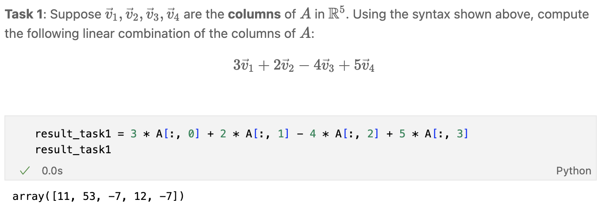
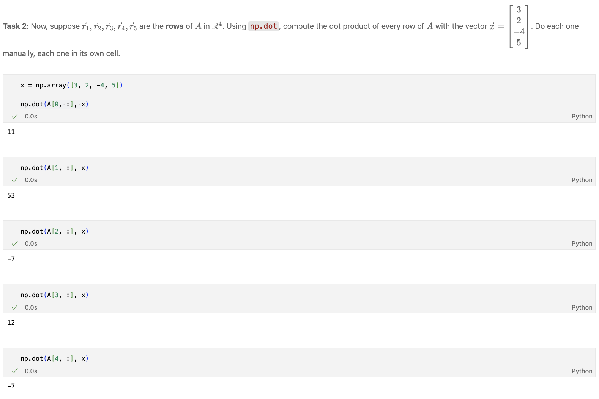
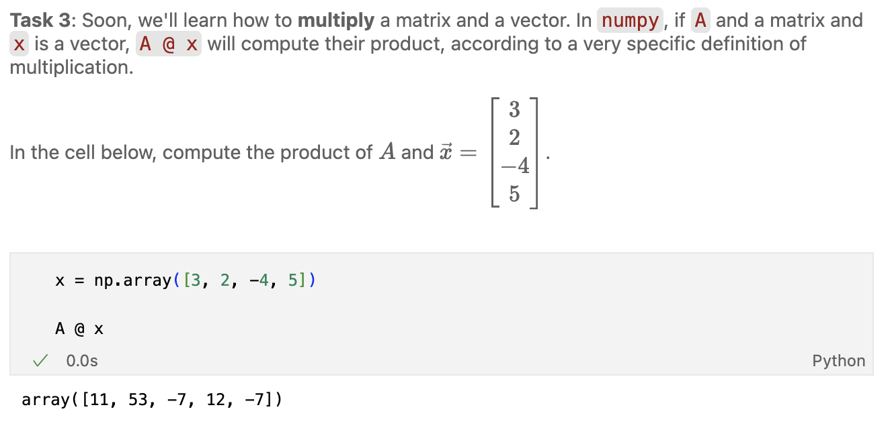



# Homework 4: Projections, Span, and Linear Independence

**due** Wednesday, May 20th, 2026 at 11:59PM Ann Arbor Time (no slip days allowed!)

<a class="btn btn-info assignment-pdf-button" href="/resources/homeworks/hw04/hw04.pdf" target="_blank">View as PDF ✏️</a>
<a class="btn btn-info assignment-pdf-button" href="/resources/homeworks/hw04/hw04-solutions.pdf" target="_blank">Solutions PDF ✅</a>

{: .yellow }

Write your solutions to the following problems either by writing them on a piece of paper or on a tablet and scanning your answers as a PDF. Note that you are not allowed to use LaTeX, Google Docs, or any other digital document creation software to type your answers. Homeworks are due to Gradescope by 11:59PM on the due date. See the [syllabus](https://eecs245.org/syllabus/#homeworks) for details on the slip day policy.

Homework will be evaluated not only on the correctness of your answers, but on your ability to present your ideas clearly and logically. You should always explain and justify your conclusions, using sound reasoning. Your goal should be to convince the reader of your assertions. If a question does not require explanation, it will be explicitly stated.

Before proceeding, make sure you're familiar with the [collaboration policy](https://eecs245.org/syllabus/#homeworks).

---

## Problems

- [Problem 1: Homework 3 Solutions Review](#problem-1-homework-3-solutions-review-10-pts)
- [Problem 2: Warmup](#problem-2-warmup-6-pts)
- [Problem 3: Projections](#problem-3-projections-7-pts)
- [Problem 4: Lines and Planes](#problem-4-lines-and-planes-11-pts)
- [Problem 5: Rows and Columns](#problem-5-rows-and-columns-12-pts)
- [Problem 6: Linear Independence of New Vectors](#problem-6-linear-independence-of-new-vectors-8-pts)
- [Problem 7: Intersections of Subspaces](#problem-7-intersections-of-subspaces-6-pts)

---

Total Points: 10 + 6 + 7 + 11 + 12 + 8 + 6 = 60

---

## Problem 1: Homework 3 Solutions Review (10 pts)

Review the solutions to Homework 3. Pick **two problem parts** (for example, Problem 2a and Problem 5b) from Homework 3 in which your solutions have the most room for improvement, i.e., where they have unsound reasoning, could be significantly more efficient or clearer, etc. **Include a screenshot of your solution to each problem part**, and in a few sentences, explain what was deficient and how it could be fixed.

Alternatively, if you think one of your solutions is significantly better than the posted one, copy it here and explain why you think it is better. If you didn't do Homework 3, choose two problem parts from it that look challenging to you, and in a few sentences, explain the key ideas behind their solutions in your own words.

Solution

---

## Problem 2: Warmup (6 pts)

Let \\(\vec u = \begin{bmatrix} k \\\\ 3 \end{bmatrix}\\) and \\(\vec v = \begin{bmatrix} 2 \\\\ -1 \end{bmatrix}\\), where \\(k \in \mathbb{R}\\) is some constant.

a)

(1 pt) Find all values of \\(k\\) such that \\(\vec u\\) and \\(\vec v\\) are orthogonal.

Solution

In order for \\(\vec u\\) and \\(\vec v\\) to be orthogonal, their dot product must be 0.

$$
\begin{align*}
\vec{u} \cdot \vec{v} &= 0 \\\\
k \cdot 2 + 3 \cdot (-1) &= 0 \\\\
2k-3&=0 \\\\
k &= \boxed{\frac{3}{2}}
\end{align*}
$$

b)

(2 pts) Find all values of \\(k\\) such that \\(\text{span}(\lbrace\vec u, \vec v\rbrace) = \mathbb{R}^2\\).

Solution

As long as \\(\vec u\\) and \\(\vec v\\) aren't collinear --- that is, as long as \\(\vec u \neq c \vec v\\) for some \\(c \in \mathbb{R}\\) --- then \\(\text{span}(\lbrace\vec u, \vec v\rbrace) = \mathbb{R}^2\\). Since we have 2 vectors, we can solve for the \\(c\\) that makes \\(\vec{u}\\) a scalar multiple of \\(\vec{v}\\).

$$
\begin{align*}
\vec{u}&= c\vec{v} \\\\
\begin{bmatrix} k \\\\ 3 \end{bmatrix} &= c \begin{bmatrix} 2 \\\\ -1 \end{bmatrix} \\\\
k &= 2c \\\\
3 &= -c \\\\
\end{align*}
$$

The above equations imply that \\(c = -3\\) and \\(k = 2c = -6\\).

So, in order for \\(\vec{u} \neq c\vec{v}\\) to be true, \\(\boxed{k \neq -6}\\).

c)

(3 pts) Find all values of \\(k\\) such that \\(\text{span}(\lbrace\vec u, \vec v\rbrace)\\) is a line in \\(\mathbb{R}^2\\). Then, write the equation of that line, in both slope-intercept form (\\(y = mx + b\\)) and parametric form. (The parametric form of a line is introduced in [Chapter 4.4](https://notes.eecs245.org/linear-independence/lines-planes-hyperplanes/#lines-in-parametric-form). There are infinitely many possible answers; give just one.)

Solution

For \\(\text{span}(\lbrace\vec u, \vec v\rbrace)\\) to be a line, they must be collinear. So \\(\vec{u}=c\vec{v}\\) for some \\(c \in \mathbb{R}\\) must be true. We know from our solution in part **b)** that \\(\vec u\\) and \\(\vec v\\) are collinear when \\(\boxed{k = -6}\\).

In parametric form, the line spanned by \\(\vec u\\) and \\(\vec v\\) is the same as the line spanned by \\(\vec v\\) (since they point in the same direction), which is

$$
\boxed{L = \begin{bmatrix} 0 \\\\ 0 \end{bmatrix} + t \begin{bmatrix} 2 \\\\ -1 \end{bmatrix}, \quad t \in \mathbb{R}}
$$

There are infinitely many ways to write a particular line in parametric form, so as long as the point lies on the line and the slope is some \\(c\vec{u}\\) or \\(c\vec{v}\\) where \\(c \in \mathbb{R}\\), we've correctly described the line in question. So, we could have used \\(L = \begin{bmatrix} 0 \\\\ 0 \end{bmatrix} + t\begin{bmatrix} -40 \\\\ 20\end{bmatrix}, \quad t \in \mathbb{R}\\) if we wanted.

Next, we'll need to find the line in slope-intercept form. Scaling \\(\vec{v}\\) by \\(\frac{1}{2}\\) gives us \\(\begin{bmatrix} 1 \\\\ -\frac{1}{2} \end{bmatrix}\\), a vector which tells us how much \\(y\\) changes for each change in \\(x\\), so our slope is \\(-\frac{1}{2}\\). Lastly, the line must go through the origin because it's a span of vectors, telling us the intercept is 0. So, in slope-intercept form, our line is \\(\boxed{y = -\frac{1}{2}x}\\).

---

## Problem 3: Projections (7 pts)

Suppose \\(\vec u, \vec v \in \mathbb{R}^n\\). Let \\(\vec p\\) be the projection of \\(\vec u\\) onto \\(\vec v\\), and let \\(\vec e = \vec u - \vec p\\).

a)

(2 pts) Which of the following vectors is \\(\vec e\\) orthogonal to, and why? Select all that apply.

$$
\vec u, \quad \vec v, \quad \vec p
$$

 (You don't need to rederive any results from [Chapter 3.4](https://notes.eecs245.org/vectors/projecting-onto-a-single-vector/#orthogonal-projections), but we do want to hear your reasoning.)

Solution

\\(\vec e\\) is orthogonal to \\(\vec v\\) and \\(\vec p\\). The error vector \\(\vec{e}\\) is the vector with the shortest distance from \\(\vec{v}\\) to \\(\vec{u}\\), so it must be orthogonal to \\(\vec{v}\\). \\(\vec{p} = \frac{\vec{u} \cdot \vec{v}}{\vec v \cdot \vec v}\vec{v}\\) is a scalar multiple of \\(\vec{v}\\), so \\(\vec{e}\\) is orthogonal to it as well.

Refer to a picture of the situation [here](https://notes.eecs245.org/vectors/projecting-onto-a-single-vector/#orthogonal-projections) (scroll down to the second picture in the "Orthogonal Projections" section).

b)

(3 pts)
\\(\text{span}(\lbrace\vec u, \vec v\rbrace)\\) is the set of all possible linear combinations of \\(\vec u\\) and \\(\vec v\\). Similarly, \\(\text{span}(\lbrace\vec e, \vec v\rbrace)\\) is the set of all possible linear combinations of \\(\vec e\\) and \\(\vec v\\).

Let's prove that \\(\text{span}(\lbrace\vec e, \vec v\rbrace) = \text{span}(\lbrace\vec u, \vec v\rbrace)\\), meaning that every vector you can create with \\(\vec u\\) and \\(\vec v\\) can also be created with \\(\vec e\\) and \\(\vec v\\), and vice versa.

Remember that the span of a set of vectors is a **set** too. To show that two sets \\(A\\) and \\(B\\) are equal, we need to show that every element of \\(A\\) is in \\(B\\), and every element of \\(B\\) is in \\(A\\).

Here, we'll show that

1.  if \\(\vec x \in \text{span}(\lbrace\vec u, \vec v\rbrace)\\), then \\(\vec x \in \text{span}(\lbrace\vec e, \vec v\rbrace)\\),

2.  if \\(\vec x \in \text{span}(\lbrace\vec e, \vec v\rbrace)\\), then \\(\vec x \in \text{span}(\lbrace\vec u, \vec v\rbrace)\\).

We'll do **(i)** for you. If \\(\vec x \in \text{span}(\lbrace\vec u, \vec v\rbrace)\\), then

$$
\vec x = a \vec u + b \vec v
$$

 for some scalars \\(a\\) and \\(b\\). But, we know that \\(\vec e = \vec u - \vec p\\), meaning that \\(\vec u = \vec e + \vec p\\). This gives

$$
\vec x = a (\vec e + \vec p) + b \vec v = a \vec e + a \vec p + b \vec v
$$

But, \\(\vec p\\) --- the projection of \\(\vec u\\) onto \\(\vec v\\) --- is a vector in the direction of \\(\vec v\\), meaning that \\(\vec p = c \vec v\\) for some scalar \\(c\\). ([Chapter 3.4](https://notes.eecs245.org/vectors/projecting-onto-a-single-vector/#orthogonal-decomposition) has the optimal value of \\(c\\) but it's not important in this proof.) Substituting \\(\vec p = c \vec v\\) gives us

$$
\vec x = a \vec e + a \vec p + b \vec v = a \vec e + a (c \vec v) + b \vec v = a \vec e + (ac + b) \vec v
$$

This last expression, \\(a \vec e + (ac + b) \vec v\\), is a linear combination of \\(\vec e\\) and \\(\vec v\\), meaning that \\(\vec x \in \text{span}(\lbrace\vec e, \vec v\rbrace)\\), as required.

Your turn: complete **(ii)** by showing that if \\(\vec x \in \text{span}(\lbrace\vec e, \vec v\rbrace)\\), then \\(\vec x \in \text{span}(\lbrace\vec u, \vec v\rbrace)\\).

Solution

If \\(\vec{x} \in \text{span}(\lbrace\vec{e}, \vec{v}\rbrace)\\), then

$$
\begin{align*}
\vec{x} &= a\vec{e} + b\vec{v} \\\\
&=a(\vec{u}-\vec{p}) + b\vec{v} \\\\
&=a(\vec{u}-c\vec{v}) + b\vec{v} \\\\
&= a\vec{u} - ac\vec{v} + b\vec{v} \\\\
&= a\vec{u} + (b - ac)\vec{v}
\end{align*}
$$

\\(a\\) and \\(b-ac\\) are both scalars, so \\(\vec{x}\in \text{span}(\lbrace\vec e, \vec v\rbrace)\\).

c)

(2 pts) To recap, the point of the previous part was to show that any vector that can be created with \\(\vec u\\) and \\(\vec v\\) can also be created with \\(\vec e\\) and \\(\vec v\\).

Using what you learned in [Chapter 3.4](https://notes.eecs245.org/vectors/projecting-onto-a-single-vector/#orthogonal-decomposition) (and Lab 4), explain why we'd rather write some new vector \\(\vec b\\) as a linear combination of \\(\vec e\\) and \\(\vec v\\), rather than \\(\vec u\\) and \\(\vec v\\).

Solution

We prefer using \\(\vec{e}\\) and \\(\vec{v}\\) because they are orthogonal, so writing \\(\vec{b}\\) as a linear combination of them doesn't involve solving a system of equations --- instead, we can find the scalars on \\(\vec e\\) and \\(\vec v\\) through orthogonal projections, which is simpler.

For example, to find scalars \\(a&#95;1\\) and \\(a&#95;2\\) such that

$$
a_1 \vec e + a_2 \vec v = \vec b
$$

we know that \\(a&#95;1 = \frac{\vec b \cdot \vec e}{\vec e \cdot \vec e}\\) and \\(a&#95;2 = \frac{\vec b \cdot \vec v}{\vec v \cdot \vec v}\\).

To review why this is the case, see the end of [Chapter 3.4](https://notes.eecs245.org/vectors/projecting-onto-a-single-vector/#orthogonal-decomposition). But in short, we could start with

$$
a_1 \vec e + a_2 \vec v = \vec b
$$

and take the dot product of both sides with \\(\vec e\\), which gives us

$$
a_1 \vec e \cdot \vec e + a_2 \vec v \cdot \vec e = \vec b \cdot \vec e
$$

Since \\(\vec e \cdot \vec = 0\\), this says

$$
a_1 \vec e \cdot \vec e = \vec b \cdot \vec e \implies a_1 = \frac{\vec b \cdot \vec e}{\vec e \cdot \vec e}
$$

which is precisely the coefficient we'd find when projecting \\(\vec b\\) onto \\(\vec e\\).

---

## Problem 4: Lines and Planes (11 pts)

As we saw in [Chapter 4.1](https://notes.eecs245.org/linear-independence/span/#span-of-two-vectors), the span of two linearly independent vectors in \\(\mathbb{R}^n\\) is a 2-dimensional subspace of \\(\mathbb{R}^n\\), which we call a plane when working with vectors from \\(\mathbb{R}^3\\). In this problem, we will build your understanding of lines and planes in \\(\mathbb{R}^3\\).

To help you visualize lines and planes, consult:

-   (Primary) **The supplemental Jupyter Notebook** we've created for Homework 4, which can either be found [here](https://datahub.eecs245.org/hub/user-redirect/git-pull?repo=https%3A%2F%2Fgithub.com%2Feecs245%2Fsp26-code&urlpath=tree%2Fsp26-code%2Fhomeworks%2Fhw04%2Fhw04.ipynb&branch=main) on DataHub, or [here](https://github.com/eecs245/sp26-code/blob/main/homeworks/hw04/hw04.ipynb) in the course GitHub repository.

-   [Chapter 4.4](https://notes.eecs245.org/linear-independence/span/#overview) of the course notes, which focuses on this idea (and is a detour in the main storyline of the notes).

-   **The Lab 4 solutions**, once they are released.

a)

(3 pts) Consider the plane \\(7x - 3y + 4z = 0\\). This is a plane written in standard form,

$$
ax + by + cz + d = 0
$$

Find two vectors that lie in this plane, and use those vectors to write the plane in parametric form. (There are infinitely many possible answers, since the parametric form of a line, or plane, or subspace in general is not unique.)

Solution

Let's use \\(\vec{u}=\begin{bmatrix} 1 \\\\ 1 \\\\ -1 \end{bmatrix}\\) and \\(\vec{v}=\begin{bmatrix} 6 \\\\ 10 \\\\ -3 \end{bmatrix}\\) as our vectors that lie in the plane. There is nothing special about the numbers we've put in \\(\vec u\\) and \\(\vec v\\); they just happen to satisfy \\(7x - 3y + 4z = 0\\), as we'll verify below.

$$
\begin{align*}
\text{using } &\vec{u}, \:\: 7(1) -3(1) +4(-1) \\\\
&=7-3-4=0\\\\
\\\\
\text{using } &\vec{v}, \:\: 7(6) -3(10) +4(-3) \\\\
&=42-30-12=0
\end{align*}
$$

The standard form of the plane tells us that \\(d=0\\), meaning the plane contains the origin. So, we can write our plane's parametric form as:

$$
\begin{align*}
&\begin{bmatrix} 0 \\\\ 0 \\\\ 0 \end{bmatrix} + s\vec{u} + t\vec{v} \\\\
&=\begin{bmatrix} 0 \\\\ 0 \\\\ 0 \end{bmatrix} + s\begin{bmatrix} 1 \\\\ 1 \\\\ -1 \end{bmatrix} + t\begin{bmatrix} 6 \\\\ 10 \\\\ -3 \end{bmatrix}
\end{align*}
$$

b)

(8 pts) Consider the linearly independent vectors

$$
\vec v_1 = \begin{bmatrix} 7 \\\\ -1 \\\\ 2 \end{bmatrix}, \quad \vec v_2 = \begin{bmatrix} 2 \\\\ 1 \\\\ 1 \end{bmatrix}, \quad \vec v_3 = \begin{bmatrix} 3 \\\\ 1 \\\\ 1 \end{bmatrix}
$$

1.  In standard form, find the equation of the plane spanned by \\(\vec v&#95;1\\) and \\(\vec v&#95;2\\).

    <em>Hint: Use the cross product from <a href="https://notes.eecs245.org/linear-independence/lines-planes-hyperplanes/">Chapter 4.4</a> to find the values of \\(a\\), \\(b\\), and \\(c\\) in \\(ax + by + cz + d = 0\\), and you know what \\(d\\) must be by the definition of the span of a set of vectors.</em>

2.  In standard form, find the equation of the plane spanned by \\(\vec v&#95;1\\) and \\(\vec v&#95;3\\).

    Your answer should be a different plane than the one you found in subpart **(i)**. (This is an important point: since \\(\vec v&#95;1, \vec v&#95;2, \vec v&#95;3\\) are linearly independent, any pair of them span a plane, but all three pairs of them span different planes.)

3.  The planes you find in subparts **(i)** and **(ii)** intersect at a **line**. Solve for the equation of this line of intersection in parametric form. What do you notice about the equation of the line?

   To help you visualize this line of intersection, use the supplemental Jupyter Notebook.

4.  In standard form, find the equation of the plane spanned by \\(\vec v&#95;2\\) and \\(\vec v&#95;3\\). Now, find the intersection of this plane with the object from subpart **(iii)**. What type of geometric object is this new intersection?

   Once again, use the supplemental Jupyter Notebook to visualize this intersection.

Solution

To find the standard form of a plane for parts \\(\textbf{(i)}\\) and \\(\textbf{(ii)}\\), we take the cross product of the two vectors used to span the plane. The resulting vector's components are the coefficients of the equation. For these planes, \\(d=0\\) by definition of a span of a set of vectors

\\(\textbf{(i)}\\)

$$
\begin{align*}
\vec{v}_1 \times \vec{v}_2 &= \begin{bmatrix} (-1) \cdot 1 - 2 \cdot 1 \\\\ 2 \cdot 2 - 7 \cdot 1 \\\\ 7 \cdot 1 - (-1) \cdot 2 \end{bmatrix} \\\\
&= \begin{bmatrix} -1 -2 \\\\ 4-7 \\\\ 7+2 \end{bmatrix} \\\\
&= \begin{bmatrix} -3 \\\\ -3 \\\\ 9 \end{bmatrix}
\end{align*}
$$

So, the plane spanned by \\(\vec{v}&#95;1\\) and \\(\vec{v}&#95;2\\) is:

$$
\begin{align*}
-3x - 3y + 9z = 0
\end{align*}
$$

You can verify that \\(\vec v&#95;1\\) and \\(\vec v&#95;2\\) both satisfy this equation by plugging them in.

\\(\textbf{(ii)}\\)

$$
\begin{align*}
\vec{v}_1 \times \vec{v}_3 &= \begin{bmatrix} (-1) \cdot 1 - 2 \cdot 1 \\\\ 2 \cdot 3 - 7 \cdot 1 \\\\ 7 \cdot 1 - (-1) \cdot 3 \end{bmatrix} \\\\
&= \begin{bmatrix} -1-2 \\\\ 6-7 \\\\ 7+3 \end{bmatrix} \\\\
&= \begin{bmatrix} -3 \\\\ -1 \\\\ 10 \end{bmatrix} \\\\
\end{align*}
$$

So, the plane spanned by \\(\vec{v}&#95;1\\) and \\(\vec{v}&#95;3\\) is:

$$
\begin{align*}
-3x - y + 10z = 0
\end{align*}
$$

\\(\textbf{(iii)}\\)

The intersection of the two planes is a line that passes through \\((0, 0, 0)\\), since both planes pass through the origin. We know that lines that pass through the origin can be written as the span of a single vector. We also know that the vector \\(\vec v&#95;1\\), by definition, is on that line, since it's on both the plane from part \\(\textbf{(i)}\\) and the plane from part \\(\textbf{(ii)}\\). So, the line of intersection is the span of \\(\vec v&#95;1\\). In parametric form, this is:

$$
L = t\begin{bmatrix} 7 \\\\ -1 \\\\ 2 \end{bmatrix}, \quad t \in \mathbb{R}
$$

You might not have noticed this immediately, which is fine: there's an algebraic solution too. Let's look at the two equations for the planes from parts \\(\textbf{(i)}\\) and \\(\textbf{(ii)}\\):

$$
\begin{align*}
-3x - 3y + 9z &= 0 \\\\
-3x - y + 10z &= 0
\end{align*}
$$

This is a system of 2 equations with 3 unknowns, which means that we won't be able to find a single unique solution. But, we can find a parametric solution by solving for one variable in terms of the other two. Let's pick \\(y\\) as the parameter; call it \\(t\\). Now, let's solve for \\(x\\) and \\(z\\) in terms of \\(t\\).

$$
\begin{align*}
-3x - 3t + 9z &= 0 \\\\
-3x - t + 10z &= 0
\end{align*}
$$

Subtracting the second equation from the first, we get:

$$
\begin{align*}
-2t - z &= 0 \\\\
z &= -2t
\end{align*}
$$

Substituting \\(z = -2t\\) back into the first equation gives

$$
-3x - 3t + 9(-2t) = 0 \implies -3x - 3t - 18t = 0 \implies -3x - 21t = 0 \implies x = -7t
$$

So, the parametric solution is:

$$
x = -7t, \quad y = t, \quad z = -2t, \quad t \in \mathbb{R}
$$

or, equivalently,

$$
t\begin{bmatrix} -7 \\\\ 1 \\\\ -2 \end{bmatrix}, \quad t \in \mathbb{R}
$$

Which is the same as the form we found earlier!

**(iv)**

$$
\begin{align*}
\vec{v}_2 \times \vec{v}_3 &= \begin{bmatrix} 1 \cdot 1 - 1 \cdot 1 \\\\ 1 \cdot 3 - 2 \cdot 1 \\\\ 2 \cdot 1 - 1 \cdot 3 \end{bmatrix} \\\\
&= \begin{bmatrix} 1 - 1 \\\\ 3 - 2 \\\\ 2 - 3 \end{bmatrix} \\\\
&= \begin{bmatrix} 0 \\\\ 1 \\\\ -1 \end{bmatrix}
\end{align*}
$$

So, the plane spanned by \\(\vec{v}&#95;2\\) and \\(\vec{v}&#95;3\\) is:

$$
\begin{align*}
y-z = 0
\end{align*}
$$

The intersection between this new plane and the line from part \\(\textbf{(iii)}\\) is the point \\((0, 0, 0)\\). All three planes we've found in this problem pass through the origin, and all three planes have different slopes, so their intersection is the single point \\((0, 0, 0)\\).

---

## Problem 5: Rows and Columns (12 pts)

Soon, we will start to learn about matrices. In this problem, we'll start to connect what we've learned about vectors and spans to matrices. In this question, we'll consider the matrix \\(A\\):

$$
A = \begin{bmatrix}
5 & 3 & 5 & 2 \\\\
3 & 0 & -6 & 4 \\\\
-2 & 0 & 4 & 3 \\\\
8 & 2 & -6 & -8 \\\\
1 & 1 & 3 & 0
\end{bmatrix}
$$

\\(A\\) has 5 rows and 4 columns. There are two ways of looking at \\(A\\):

1.  As a collection of **4 "column" vectors**, each in \\(\mathbb{R}^5\\), stacked side-by-side.

2.  As a collection of **5 "row" vectors**, each in \\(\mathbb{R}^4\\), stacked on top of each other.

a)

(3 pts) Using the algorithm in [Chapter 4.2](https://notes.eecs245.org/linear-independence/linear-independence/#finding-linearly-independent-subsets-with-the-same-span), find a linearly independent set of vectors in \\(\mathbb{R}^5\\) with the same span as the column vectors of \\(A\\). How many vectors are in this set?

Solution

Our goal is to find the set of linearly independent column vectors for the matrix \\(A\\), as is outlined in the notes.

Let

$$
\begin{align*}
\vec{v_1}=\begin{bmatrix} 5 \\\\ 3 \\\\ -2 \\\\ 8 \\\\ 1 \end{bmatrix} \qquad \vec{v_2}= \begin{bmatrix} 3 \\\\ 0 \\\\ 0 \\\\ 2 \\\\ 1 \end{bmatrix} \qquad \vec{v_3} = \begin{bmatrix} 5 \\\\ -6 \\\\ 4 \\\\ -6 \\\\ 3 \end{bmatrix} \qquad \vec{v_4} = \begin{bmatrix} 2 \\\\ 4 \\\\ 3 \\\\ -8 \\\\ 0 \end{bmatrix}
\end{align*}
$$

\\(i=2,S=\lbrace\vec{v&#95;1}\rbrace: \vec{v&#95;2} \notin \text{span}(S)\\). There's no way to make \\(\vec{v&#95;2}\\) as a linear combination of \\(v&#95;1\\) because of the 0's in \\(\vec{v&#95;2}\\). So, we add \\(\vec{v&#95;2}\\) to the set.

\\(i=3,S=\lbrace\vec{v&#95;1}, \vec{v&#95;2}\rbrace:\\) Let's try to write \\(\vec{v&#95;3}\\) as a linear combination of \\(\vec{v&#95;1}\\) and \\(\vec{v&#95;2}\\), i.e. solve the system of equations we get from \\(a\vec{v&#95;1} + b\vec{v&#95;2} = \vec{v&#95;3}\\):

$$
\begin{align}
5a + 3b &= 5 \\\\
3a &= -6 \\\\
-2a &= 4 \\\\
8a + 2b &= -6 \\\\
a + b &= 3
\end{align}
$$

Equations (2) and (3) tell us \\(a = -2\\). Plugging this into equations (1), (4), and (5) each tell us that \\(b = 5\\). So, \\(a = -2, b = 5\\) satisfy all 5 equations, meaning that \\(\vec{v&#95;3}\\) is a linear combination of \\(\vec{v&#95;1}\\) and \\(\vec{v&#95;2}\\). (If we found that some equations implied \\(b = -5\\) and some implied \\(b\\) was something else, the equations would be inconsistent, meaning that \\(\vec{v&#95;3}\\) is not a linear combination of \\(\vec{v&#95;1}\\) and \\(\vec{v&#95;2}\\).)

Since \\(\vec{v&#95;3} \in \text{span}(S)\\), we don't add it to \\(S\\).

\\(i=4,S=\lbrace\vec{v&#95;1}, \vec{v&#95;2}\rbrace:\\) Let's try to write \\(\vec{v&#95;4}\\) as a linear combination of the vectors in \\(S\\), i.e. solve the system of equations we get from \\(a\vec{v&#95;1}+b\vec{v&#95;2}=\vec{v&#95;4}\\):

$$
\begin{align}
5a + 3b &= 2 \tag{1} \\\\
3a &= 4 \tag{2} \\\\
-2a &= 3 \tag{3} \\\\
8a + 2b &= -9 \tag{4} \\\\
a + b &= 0 \tag{5}
\end{align}
$$

In equations (2) and (3), simplifying for \\(a\\) gives us \\(a=\frac{4}{3}\\) and \\(a=-\frac{3}{2}\\). This is a contradiction, so \\(\vec{v&#95;4} \notin \text{span}(S)\\), so we should add it to the set.

Therefore, our set of linearly independent vectors in \\(\mathbb{R}^5\\) is \\(\boxed{S=\lbrace\vec{v&#95;1}, \vec{v&#95;2}, \vec{v&#95;4}\rbrace}\\), a set of 3 vectors.

b)

(4 pts) Find a linearly independent set of vectors in \\(\mathbb{R}^4\\) with the same span as the row vectors of \\(A\\). How many vectors are in this set?

Solution

We can use a similar process as we did in the previous part, but on the rows of \\(A\\) rather than the columns.

Let

$$
\begin{align*}
\vec{v_1}=\begin{bmatrix} 5 \\\\ 3 \\\\ 5 \\\\ 2 \end{bmatrix} \qquad \vec{v_2}= \begin{bmatrix} 3 \\\\ 0 \\\\ -6 \\\\ 4\end{bmatrix} \qquad \vec{v_3} = \begin{bmatrix} -2 \\\\ 0 \\\\ 4 \\\\ 3 \end{bmatrix} \qquad \vec{v_4} = \begin{bmatrix} 8 \\\\ 2 \\\\ -6 \\\\ -8 \end{bmatrix} \qquad \vec{v_5}=\begin{bmatrix}1 \\\\ 1\\\\ 3 \\\\0\end{bmatrix}
\end{align*}
$$

\\(i=2,S=\lbrace\vec{v&#95;1}\rbrace: \vec{v&#95;2} \notin \text{span}(S)\\). There's no way to make \\(\vec{v&#95;2}\\) as a linear combination of \\(v&#95;1\\) because of the 0 in \\(\vec{v&#95;2}\\). So, we add \\(\vec{v&#95;2}\\) to the set.

\\(i=3,S=\lbrace\vec{v&#95;1}, \vec{v&#95;2}\rbrace:\\) Let's try to write \\(\vec v&#95;3\\) as a linear combination of \\(\vec{v&#95;1}\\) and \\(\vec{v&#95;2}\\), i.e. solve the system of equations we get from \\(a\vec{v&#95;1} + b\vec{v&#95;2} = \vec{v&#95;3}\\):

$$
\begin{align}
5a+3b&=-2 \tag{1} \\\\
3a &= 0 \tag{2} \\\\
5a-6b &= 4 \tag{3} \\\\
2a - 4b &= 3 \tag{4}
\end{align}
$$

In equation (2), we see that \\(a=0\\). Plugging this into equations (1), (3), and (4) gives us:

$$
\begin{align*}
3b &= -2 \\\\
5b &= 4 \\\\
-4b &= 3
\end{align*}
$$

These give us contradictions, so \\(\vec{v&#95;3} \notin \text{span}(S)\\), so we should add it to the set.

\\(i=4,S=\lbrace\vec{v&#95;1}, \vec{v&#95;2}, \vec{v&#95;3}\rbrace:\\) Let's try to write \\(\vec{v&#95;4}\\) as a linear combination of the vectors in \\(S\\), i.e. solve the system of equations we get from \\(a\vec{v&#95;1}+b\vec{v&#95;2}+c\vec{v&#95;3}=\vec{v&#95;4}\\):

$$
\begin{align}
5a+3b -2c&=8 \tag{1} \\\\
3a &= 2 \tag{2} \\\\
5a-6b +4c&= -6 \tag{3} \\\\
2a - 4b +3c&= -8 \tag{4}
\end{align}
$$

In equation (2), we see that \\(a=\frac{2}{3}\\). Plugging this into equations (1), (3), and (4) gives us:

$$
\begin{align*}
\frac{10}{3} + 3b -2c &= 8 \implies 3b -2c = \frac{14}{3} \\\\
\frac{10}{3} -6b +4c &= -6 \implies -6b +4c = -\frac{28}{3} \\\\
\frac{4}{3} -4b +3c &= -8 \implies -4b +3c = -\frac{28}{3}
\end{align*}
$$

Notice that the new first and second equations are the same; the second is just the first multiplied by -2. Since the second and third equations don't look like parallel lines, they will intersect somewhere, and so there does exist a solution for \\(a, b, c\\). We don't even need to bother looking for it, though you can verify yourself that \\(a = \frac{2}{3}, b = -\frac{14}{3}, c = -\frac{28}{3}\\) satisfy all four original equations.

So, \\(\vec{v&#95;4} \in \text{span}(S)\\), so we don't add it to the set.

\\(i = 5, S = \lbrace\vec{v&#95;1}, \vec{v&#95;2}, \vec{v&#95;3}\rbrace:\\) Let's try to write \\(\vec{v&#95;5}\\) as a linear combination of the vectors in \\(S\\), i.e. solve the system of equations we get from \\(a\vec{v&#95;1}+b\vec{v&#95;2}+c\vec{v&#95;3}=\vec{v&#95;5}\\):

$$
\begin{align}
5a+3b -2c&=1 \tag{1} \\\\
3a &= 1 \tag{2} \\\\
5a-6b +4c&= 3 \tag{3} \\\\
2a - 4b +3c&= 0 \tag{4}
\end{align}
$$

You can verify yourself that \\(a = \frac{1}{3}, b = -\frac{10}{3}, c = -\frac{14}{3}\\) satisfy all four equations. So, \\(\vec{v&#95;5} \in \text{span}(S)\\), so we don't add it to the set.

Therefore, our set of linearly independent vectors in \\(\mathbb{R}^4\\) is \\(\boxed{S=\lbrace\vec{v&#95;1}, \vec{v&#95;2}, \vec{v&#95;3}\rbrace}\\), a set of 3 vectors.

You should have found that the number of vectors you found in both parts is the same. This is not a coincidence, it is true for any matrix --- the number of linearly independent columns is the same as the number of linearly independent rows. This number is called the **rank** of the matrix.

If you were to run the following Python code, the number you'd see back is the number of linearly independent vectors you found in both parts.

    import numpy as np

    A = np.array([[5, 3, 5, 2],
                  [3, 0, -6, 4],
                  [-2, 0, 4, 3],
                  [8, 2, -6, -8],
                  [1, 1, 3, 0]])

    np.linalg.matrix_rank(A)

c)

(3 pts) Open the **the supplemental Jupyter Notebook** we've created for Homework 4, which can either be found [here](https://datahub.eecs245.org/hub/user-redirect/git-pull?repo=https%3A%2F%2Fgithub.com%2Feecs245%2Fsp26-code&urlpath=tree%2Fsp26-code%2Fhomeworks%2Fhw04%2Fhw04.ipynb&branch=main) on DataHub, or [here](https://github.com/eecs245/sp26-code/blob/main/homeworks/hw04/hw04.ipynb) in the course GitHub repository.

Complete the three tasks within orange lines, related to the introduction we've provided above. Include screenshots of your code and its output as part of your PDF.

Solution

  

d)

(2 pts) Using what you observed in the notebook, **by hand** (that is, without using Python), compute the result of the following matrix-vector multiplication:

$$
\begin{bmatrix} 2 & 4 & 5 \\\\ 3 & 9 & 8 \\\\ 4 & 0 & 1 \end{bmatrix} \begin{bmatrix} 4 \\\\ 1 \\\\ 3 \end{bmatrix}
$$

Solution

As we saw, the product will contain the dot product of the rows of the matrix with the vector. So, we can compute each dot product manually:

$$
\begin{align*}
\text{first row of output:} \quad 2 \cdot 4 + 4 \cdot 1 + 5 \cdot 3 &= 8 + 4 + 15 = 27 \\\\
\text{second row of output:} \quad 3 \cdot 4 + 9 \cdot 1 + 8 \cdot 3 &= 12 + 9 + 24 = 45 \\\\
\text{third row of output:} \quad 4 \cdot 4 + 0 \cdot 1 + 1 \cdot 3 &= 16 + 0 + 3 = 19
\end{align*}
$$

Therefore, the product is \\(\boxed{\begin{bmatrix} 27 \\\\ 45 \\\\ 19 \end{bmatrix}}\\).

---

## Problem 6: Linear Independence of New Vectors (8 pts)

Suppose \\(\vec v&#95;1, \vec v&#95;2, \vec v&#95;3 \in \mathbb{R}^n\\) **are linearly independent**. In both parts below, determine if the new set of vectors is linearly independent. If they are, prove that they are by showing that the only solution to the equation

$$
a \vec u_1 + b \vec u_2 + c \vec u_3 = \vec 0
$$

is \\(a = b = c = 0\\). If they are not, show that there exist scalars \\(a, b, c\\) such that \\(a \vec u&#95;1 + b \vec u&#95;2 + c \vec u&#95;3 = \vec 0\\) where at least one of \\(a, b, c\\) is non-zero.

a)

(4 pts)
\\(\vec u&#95;1 = \vec v&#95;2 - \vec v&#95;3\\), \\(\vec u&#95;2 = \vec v&#95;1 - \vec v&#95;3\\), and \\(\vec u&#95;3 = \vec v&#95;1 - \vec v&#95;2\\)

Solution

These vectors are **linearly dependent**.

Let's start by writing

$$
a\vec{u_1} + b\vec{u_2} + c\vec{u_3} = \vec{0}
$$

We need to try and find all solutions for \\(a\\), \\(b\\), and \\(c\\) in the equation above.

Plugging in \\(\vec{u&#95;1}, \vec{u&#95;2}, \vec{u&#95;3}\\) gives us

$$
\begin{align*}
a(\vec{v_2} - \vec{v_3}) + b(\vec{v_1} - \vec{v_3}) + c(\vec{v_1} - \vec{v_2}) &= \vec{0} \\\\
a\vec{v_2} - a\vec{v_3} + b\vec{v_1} - b\vec{v_3} + c\vec{v_1} - c\vec{v_2} &= \vec{0}
\end{align*}
$$

From here, let's collect like terms:

$$
\begin{align*}
(b + c)\vec v_1 + (a - c) \vec v_2 + (-a - b)\vec v_3 = \vec{0}
\end{align*}
$$

But, since \\(\vec v&#95;1, \vec v&#95;2, \vec v&#95;3\\) are linearly independent, the only solution to this equation is that all three of \\(b + c\\), \\(a - c\\), and \\(-a - b\\) are 0.

$$
\begin{align*}
b + c &= 0 \\\\
a - c &= 0 \\\\
-a - b &= 0
\end{align*}
$$

The above tells us that \\(a = c\\) and \\(b = -c\\), meaning that any solution of the form \\((c, -c, c)\\) is a non-zero solution to the equation \\(a\vec{u&#95;1} + b\vec{u&#95;2} + c\vec{u&#95;3} = \vec{0}\\). For example, if we set \\(c = 5\\), then

$$
5\vec{u_1} - 5\vec{u_2} + 5\vec{u_3} = \vec 0
$$

So, there exists a non-zero solution to the equation \\(a\vec{u&#95;1} + b\vec{u&#95;2} + c\vec{u&#95;3} = \vec{0}\\), meaning that the vectors \\(\vec{u&#95;1}, \vec{u&#95;2}, \vec{u&#95;3}\\) are linearly dependent.

b)

(4 pts)
\\(\vec u&#95;1 = \vec v&#95;2 + \vec v&#95;3\\), \\(\vec u&#95;2 = \vec v&#95;1 + \vec v&#95;3\\), and \\(\vec u&#95;3 = \vec v&#95;1 + \vec v&#95;2\\)

Solution

These vectors are **linearly independent**.

Let's start by writing

$$
a\vec{u_1} + b\vec{u_2} + c\vec{u_3} = \vec{0}
$$

We need to try and find all solutions for \\(a\\), \\(b\\), and \\(c\\) in the equation above. Plugging in \\(\vec{u&#95;1}, \vec{u&#95;2}, \vec{u&#95;3}\\) gives us

$$
\begin{align*}
a(\vec{v_2} + \vec{v_3}) + b(\vec{v_1} + \vec{v_3}) + c(\vec{v_1} + \vec{v_2}) &= \vec{0} \\\\
a\vec{v_2} + a\vec{v_3} + b\vec{v_1} + b\vec{v_3} + c\vec{v_1} + c\vec{v_2} &= \vec{0} \\\\ (b + c) \vec v_1 + (a + c) \vec v_2 + (a + b) \vec v_3 &= 0
\end{align*}
$$

Again, since \\(\vec v&#95;1, \vec v&#95;2, \vec v&#95;3\\) are linearly independent, the only solution to this equation is that \\(b + c\\), \\(a + c\\), and \\(a + b\\) are all 0.

$$
\begin{align*}
b + c &= 0 \\\\
a + c &= 0 \\\\
a + b &= 0
\end{align*}
$$

The only solution to the system above is \\(a = b = c = 0\\), meaning that the only solution to the equation \\(a\vec{u&#95;1} + b\vec{u&#95;2} + c\vec{u&#95;3} = \vec{0}\\) is the trivial solution. Therefore, the vectors \\(\vec{u&#95;1}, \vec{u&#95;2}, \vec{u&#95;3}\\) are linearly independent.

---

## Problem 7: Intersections of Subspaces (6 pts)

Let:

-   \\(M\\) be the subspace of \\(\mathbb{R}^4\\) spanned by \\(\begin{bmatrix}1 \\\\ 1 \\\\ 1 \\\\ 0\end{bmatrix}\\) and \\(\begin{bmatrix}0 \\\\ -4 \\\\ 1 \\\\ 5\end{bmatrix}\\).

-   \\(N\\) be the subspace of \\(\mathbb{R}^4\\) spanned by \\(\begin{bmatrix}0 \\\\ -2 \\\\ 1 \\\\ 2\end{bmatrix}\\) and \\(\begin{bmatrix}1 \\\\ -1 \\\\ 1 \\\\ 3\end{bmatrix}\\).

a)

(2 pts) Find a vector that belongs to both \\(M\\) and \\(N\\). In other words, find a vector \\(\vec v\\) such that \\(\vec v \in M\\) and \\(\vec v \in N\\). There are infinitely many answers; state the answer with a first component of 1.

Solution

\\(\begin{bmatrix} 1 \\\\ -3 \\\\ 2 \\\\ 5 \end{bmatrix}\\) is a vector in both \\(M\\) and \\(N\\); it's the sum of \\(\begin{bmatrix} 1 \\\\ 1 \\\\ 1 \\\\ 0 \end{bmatrix}\\) and \\(\begin{bmatrix} 0 \\\\ -4 \\\\ 1 \\\\ 5 \end{bmatrix}\\), and it's also the sum of \\(\begin{bmatrix} 0 \\\\ -2 \\\\ 1 \\\\ 2 \end{bmatrix}\\) and \\(\begin{bmatrix} 1 \\\\ -1 \\\\ 1 \\\\ 3 \end{bmatrix}\\).

b)

(4 pts) Find the dimension of the set of all vectors that belong to both \\(M\\) and \\(N\\). Explain your reasoning.

Solution

Any vector in \\(M\\) is of the form

$$
a \begin{bmatrix} 1 \\\\ 1 \\\\ 1 \\\\ 0 \end{bmatrix} + b \begin{bmatrix} 0 \\\\ -4 \\\\ 1 \\\\ 5 \end{bmatrix} = \begin{bmatrix} a \\\\ a - 4b \\\\ a + b \\\\ 5b \end{bmatrix}.
$$

Any vector in \\(N\\) is of the form

$$
c \begin{bmatrix} 0 \\\\ -2 \\\\ 1 \\\\ 2 \end{bmatrix} + d \begin{bmatrix} 1 \\\\ -1 \\\\ 1 \\\\ 3 \end{bmatrix} = \begin{bmatrix} d \\\\ -2c - d \\\\ c + d \\\\ 2c + 3d \end{bmatrix}.
$$

For a vector to belong to both \\(M\\) and \\(N\\), we need

$$
\begin{align*}
a &= d \\\\
a - 4b &= -2c - d \\\\
a + b &= c + d \\\\
5b &= 2c + 3d.
\end{align*}
$$

From the first equation, \\(a = d\\). From the third equation, this means \\(b = c\\). Plugging these into the second equation gives \\(a - 4b = -2b - a\\), so \\(a = b\\). Therefore \\(a = b = c = d\\), and the fourth equation is automatically satisfied.

So, the set of all vectors in both \\(M\\) and \\(N\\) is

$$
\left\{t\begin{bmatrix} 1 \\\\ -3 \\\\ 2 \\\\ 5 \end{bmatrix} \mid t \in \mathbb{R}\right\}.
$$

This is a line through the origin, so its dimension is \\(\boxed{1}\\).


