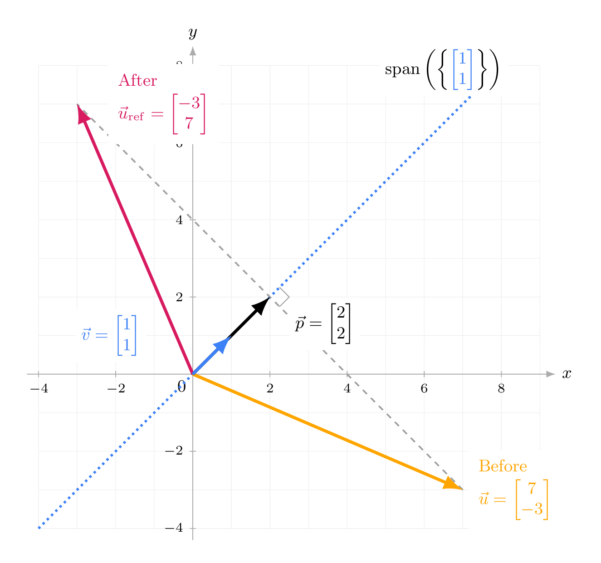



<script>
window.MathJax = {
  tex: {inlineMath: [['$', '$'], ['\\(', '\\)']]}
};
</script>
<script src="https://cdn.jsdelivr.net/npm/mathjax@3/es5/tex-mml-chtml.js" async></script>

<style>
.main-content p {
  margin-bottom: 1.15em;
}
.main-content .assignment-list > li {
  display: list-item;
}
.main-content .assignment-list > li::before {
  content: none;
}
.main-content ul.assignment-list {
  list-style-type: disc;
}
.assignment-pdf-button {
  font-size: 0.95rem;
  padding: 0.35rem 0.65rem;
}
.assignment-actions {
  align-items: center;
  display: flex;
  flex-wrap: wrap;
  gap: 0.55rem;
  margin: 0 0 1rem;
}
.math-display,
mjx-container[jax="CHTML"][display="true"] {
  max-width: 100%;
  overflow-x: auto;
  overflow-y: hidden;
}
.math-display {
  padding-bottom: 0.2rem;
}
.math-display mjx-container[jax="CHTML"][display="true"] {
  padding-bottom: 0.2rem;
}
.answer-blank {
  border-bottom: 1px solid currentColor;
  display: inline-block;
  min-width: 8rem;
  height: 1em;
  vertical-align: baseline;
}
.assignment-parts {
  margin: 1rem 0;
}
.assignment-part {
  column-gap: 0.55rem;
  display: grid;
  grid-template-columns: 1.4rem minmax(0, 1fr);
  margin-bottom: 1.05rem;
}
.assignment-part-label {
  font-weight: 600;
  text-align: right;
}
.assignment-part-content > :first-child {
  margin-top: 0;
}
.mc-options {
  display: flex;
  flex-wrap: wrap;
  gap: 0.9rem 1.6rem;
  margin: 0.9rem 0 1.1rem;
}
.mc-option {
  display: inline-flex;
  align-items: center;
  gap: 0.35rem;
  white-space: nowrap;
}
.mc-bubble,
.mc-square {
  display: inline-block;
  flex: 0 0 auto;
  height: 0.95em;
  width: 0.95em;
  vertical-align: -0.12em;
}
.mc-bubble {
  border: 1.5px solid currentColor;
  border-radius: 50%;
}
.mc-square {
  border: 1.5px solid currentColor;
}
.mc-correct {
  background: currentColor;
}
.main-content table {
  font-size: 0.9rem;
  width: auto;
  max-width: 100%;
}
.main-content table th,
.main-content table td {
  padding: 0.35rem 0.5rem;
  white-space: nowrap;
}
/* Answer-choice matrices should size to their labels, not theme column minima. */
.main-content table.answer-choice-table th,
.main-content table.answer-choice-table td {
  min-width: 0;
  padding: 0.35rem 0.4rem;
}
.crossnumber-grid {
  display: grid;
  grid-template-columns: repeat(3, 2.4rem);
  grid-template-rows: repeat(3, 2.4rem);
  margin: 1rem auto;
  width: max-content;
}
.crossnumber-cell {
  align-items: center;
  border: 1.5px solid currentColor;
  display: flex;
  font-size: 1.1rem;
  justify-content: center;
  position: relative;
}
.crossnumber-label {
  font-size: 0.55rem;
  left: 0.15rem;
  line-height: 1;
  position: absolute;
  top: 0.15rem;
}
.crossnumber-missing {
  border: 0;
}
</style>

# Homework 4: Projections, Span, and Linear Independence

**due** Sunday, October 4th, 2026 at 11:59PM Ann Arbor Time <span style="color: red;">(no slip days allowed!)</span>

<div class="assignment-actions">
<a class="btn btn-info assignment-pdf-button" href="/resources/homeworks/hw04/hw04.pdf" target="_blank">View as PDF ✏️</a>
</div>

{: .yellow }
<div markdown="1">
Write your solutions to the following problems either by writing them on a piece of paper or on a tablet and scanning your answers as a PDF. Note that you are not allowed to use LaTeX, Google Docs, or any other digital document creation software to type your answers. Homeworks are due to Pensive by 11:59PM on the due date.

**For Homework 4, you cannot use slip days; this is so that we can release solutions on Monday morning, giving you enough time to review them before Midterm 1 on Tuesday 10/6.**

Homework will be evaluated not only on the correctness of your answers, but on your ability to present your ideas clearly and logically. You should always explain and justify your conclusions, using sound reasoning. Your goal should be to convince the reader of your assertions. If a question does not require explanation, it will be explicitly stated.

Before proceeding, make sure you're familiar with the [collaboration policy](https://eecs245.org/syllabus/#homeworks).
</div>

---

## Problems

- [Problem 1: Homework 3 Solutions Review](#problem-1-homework-3-solutions-review-6-pts)
- [Problem 2: Warmup](#problem-2-warmup-8-pts)
- [Problem 3: Projections](#problem-3-projections-5-pts)
- [Problem 4: A Change of Reflection](#problem-4-a-change-of-reflection-10-pts)
- [Problem 5: Lines and Planes](#problem-5-lines-and-planes-11-pts)
- [Problem 6: Rows and Columns](#problem-6-rows-and-columns-16-pts)
- [Problem 7: Linear Independence of New Vectors](#problem-7-linear-independence-of-new-vectors-8-pts)
- [Problem 8: Intersections of Subspaces](#problem-8-intersections-of-subspaces-6-pts)

---

Total Points: 6 + 8 + 5 + 10 + 11 + 16 + 8 + 6 = 70

---

## Problem 1: Homework 3 Solutions Review (6 pts)

Review the solutions to Homework 3. Pick **two problem parts** (for example, Problem 4a and Problem 5b) from Homework 3 in which your solutions have the most room for improvement, i.e., where they have unsound reasoning, could be significantly more efficient or clearer, etc. **Include a screenshot of your solution to each problem part**, and in a few sentences, explain what was deficient and how it could be fixed.

Alternatively, if you think one of your solutions is significantly better than the posted one, copy it here and explain why you think it is better. If you didn't do Homework 3, choose two problem parts from it that look challenging to you, and in a few sentences, explain the key ideas behind their solutions in your own words.

---

## Problem 2: Warmup (8 pts)

Let <span class="math-inline">\\(\vec u = \begin{bmatrix} k \\\\ 3 \end{bmatrix}\\)</span> and <span class="math-inline">\\(\vec v = \begin{bmatrix} 2 \\\\ -1 \end{bmatrix}\\)</span>, where <span class="math-inline">\\(k \in \mathbb{R}\\)</span> is some constant.

<div class="assignment-parts" markdown="1">
<div class="assignment-part" markdown="1">
<div class="assignment-part-label">a)</div>
<div class="assignment-part-content" markdown="1">
(1 pt) Find all values of <span class="math-inline">\\(k\\)</span> such that <span class="math-inline">\\(\vec u\\)</span> and <span class="math-inline">\\(\vec v\\)</span> are orthogonal.

</div>
</div>

<div class="assignment-part" markdown="1">
<div class="assignment-part-label">b)</div>
<div class="assignment-part-content" markdown="1">
(2 pts) Find all values of <span class="math-inline">\\(k\\)</span> such that the projection of <span class="math-inline">\\(\vec u\\)</span> onto <span class="math-inline">\\(\vec v\\)</span> is <span class="math-inline">\\(\begin{bmatrix} 14 \\\\ -7 \end{bmatrix}\\)</span>.

</div>
</div>

<div class="assignment-part" markdown="1">
<div class="assignment-part-label">c)</div>
<div class="assignment-part-content" markdown="1">
(2 pts) Find all values of <span class="math-inline">\\(k\\)</span> such that <span class="math-inline">\\(\text{span}(\lbrace\vec u, \vec v\rbrace) = \mathbb{R}^2\\)</span>.

</div>
</div>

<div class="assignment-part" markdown="1">
<div class="assignment-part-label">d)</div>
<div class="assignment-part-content" markdown="1">
(3 pts) Find all values of <span class="math-inline">\\(k\\)</span> such that <span class="math-inline">\\(\text{span}(\lbrace\vec u, \vec v\rbrace)\\)</span> is a line in <span class="math-inline">\\(\mathbb{R}^2\\)</span>. Then, write the equation of that line, in both slope-intercept form (<span class="math-inline">\\(y = mx + b\\)</span>) and parametric form. (The parametric form of a line is introduced in [Chapter 4.4](https://notes.eecs245.org/linear-independence/lines-planes-hyperplanes/#lines-in-parametric-form). There are infinitely many possible answers; give just one.)

</div>
</div>

</div>

---

## Problem 3: Projections (5 pts)

Suppose <span class="math-inline">\\(\vec u, \vec v \in \mathbb{R}^n\\)</span>. Let <span class="math-inline">\\(\vec p\\)</span> be the projection of <span class="math-inline">\\(\vec u\\)</span> onto <span class="math-inline">\\(\vec v\\)</span>, and let <span class="math-inline">\\(\vec e = \vec u - \vec p\\)</span>.

<div class="assignment-parts" markdown="1">
<div class="assignment-part" markdown="1">
<div class="assignment-part-label">a)</div>
<div class="assignment-part-content" markdown="1">
(1 pt) Which of the following vectors is <span class="math-inline">\\(\vec e\\)</span> orthogonal to, and why? Select all that apply.

<div class="math-display">
$$
\vec u, \quad \vec v, \quad \vec p
$$
</div>

 (You don't need to rederive any results from [Chapter 3.4](https://notes.eecs245.org/vectors/projecting-onto-a-single-vector/#orthogonal-projections), but we do want to hear your reasoning.)

</div>
</div>

<div class="assignment-part" markdown="1">
<div class="assignment-part-label">b)</div>
<div class="assignment-part-content" markdown="1">
(2 pts)
<span class="math-inline">\\(\text{span}(\lbrace\vec u, \vec v\rbrace)\\)</span> is the set of all possible linear combinations of <span class="math-inline">\\(\vec u\\)</span> and <span class="math-inline">\\(\vec v\\)</span>. Similarly, <span class="math-inline">\\(\text{span}(\lbrace\vec e, \vec v\rbrace)\\)</span> is the set of all possible linear combinations of <span class="math-inline">\\(\vec e\\)</span> and <span class="math-inline">\\(\vec v\\)</span>.

Let's prove that <span class="math-inline">\\(\text{span}(\lbrace\vec e, \vec v\rbrace) = \text{span}(\lbrace\vec u, \vec v\rbrace)\\)</span>, meaning that every vector you can create with <span class="math-inline">\\(\vec u\\)</span> and <span class="math-inline">\\(\vec v\\)</span> can also be created with <span class="math-inline">\\(\vec e\\)</span> and <span class="math-inline">\\(\vec v\\)</span>, and vice versa.

Remember that the span of a set of vectors is a **set** too. To show that two sets <span class="math-inline">\\(A\\)</span> and <span class="math-inline">\\(B\\)</span> are equal, we need to show that every element of <span class="math-inline">\\(A\\)</span> is in <span class="math-inline">\\(B\\)</span>, and every element of <span class="math-inline">\\(B\\)</span> is in <span class="math-inline">\\(A\\)</span>.

Here, we'll show that

<ol class="assignment-list" markdown="1" data-item-count="2" start="1" style="list-style-type: decimal;">
<li markdown="1" value="1">

if <span class="math-inline">\\(\vec x \in \text{span}(\lbrace\vec u, \vec v\rbrace)\\)</span>, then <span class="math-inline">\\(\vec x \in \text{span}(\lbrace\vec e, \vec v\rbrace)\\)</span>,

</li>
<li markdown="1" value="2">

if <span class="math-inline">\\(\vec x \in \text{span}(\lbrace\vec e, \vec v\rbrace)\\)</span>, then <span class="math-inline">\\(\vec x \in \text{span}(\lbrace\vec u, \vec v\rbrace)\\)</span>.

</li>
</ol>

We'll do **(i)** for you. If <span class="math-inline">\\(\vec x \in \text{span}(\lbrace\vec u, \vec v\rbrace)\\)</span>, then

<div class="math-display">
$$
\vec x = a \vec u + b \vec v
$$
</div>

 for some scalars <span class="math-inline">\\(a\\)</span> and <span class="math-inline">\\(b\\)</span>. But, we know that <span class="math-inline">\\(\vec e = \vec u - \vec p\\)</span>, meaning that <span class="math-inline">\\(\vec u = \vec e + \vec p\\)</span>. This gives

<div class="math-display">
$$
\vec x = a (\vec e + \vec p) + b \vec v = a \vec e + a \vec p + b \vec v
$$
</div>

But, <span class="math-inline">\\(\vec p\\)</span> --- the projection of <span class="math-inline">\\(\vec u\\)</span> onto <span class="math-inline">\\(\vec v\\)</span> --- is a vector in the direction of <span class="math-inline">\\(\vec v\\)</span>, meaning that <span class="math-inline">\\(\vec p = c \vec v\\)</span> for some scalar <span class="math-inline">\\(c\\)</span>. ([Chapter 3.4](https://notes.eecs245.org/vectors/projecting-onto-a-single-vector/#orthogonal-decomposition) has the optimal value of <span class="math-inline">\\(c\\)</span> but it's not important in this proof.) Substituting <span class="math-inline">\\(\vec p = c \vec v\\)</span> gives us

<div class="math-display">
$$
\vec x = a \vec e + a \vec p + b \vec v = a \vec e + a (c \vec v) + b \vec v = a \vec e + (ac + b) \vec v
$$
</div>

This last expression, <span class="math-inline">\\(a \vec e + (ac + b) \vec v\\)</span>, is a linear combination of <span class="math-inline">\\(\vec e\\)</span> and <span class="math-inline">\\(\vec v\\)</span>, meaning that <span class="math-inline">\\(\vec x \in \text{span}(\lbrace\vec e, \vec v\rbrace)\\)</span>, as required.

Your turn: complete **(ii)** by showing that if <span class="math-inline">\\(\vec x \in \text{span}(\lbrace\vec e, \vec v\rbrace)\\)</span>, then <span class="math-inline">\\(\vec x \in \text{span}(\lbrace\vec u, \vec v\rbrace)\\)</span>.

</div>
</div>

<div class="assignment-part" markdown="1">
<div class="assignment-part-label">c)</div>
<div class="assignment-part-content" markdown="1">
(2 pts) To recap, the point of the previous part was to show that any vector that can be created with <span class="math-inline">\\(\vec u\\)</span> and <span class="math-inline">\\(\vec v\\)</span> can also be created with <span class="math-inline">\\(\vec e\\)</span> and <span class="math-inline">\\(\vec v\\)</span>.

Using what you learned in [Chapter 3.4](https://notes.eecs245.org/vectors/projecting-onto-a-single-vector/#orthogonal-decomposition) (and Lab 4), explain why we'd rather write some new vector <span class="math-inline">\\(\vec b\\)</span> as a linear combination of <span class="math-inline">\\(\vec e\\)</span> and <span class="math-inline">\\(\vec v\\)</span>, rather than <span class="math-inline">\\(\vec u\\)</span> and <span class="math-inline">\\(\vec v\\)</span>.

</div>
</div>

</div>

---

## Problem 4: A Change of Reflection (10 pts)

In this problem, we will explore the idea of **reflecting** a vector across a line. This problem has applications to computer graphics, where reflecting vectors across a line can produce a mirror image of a two-dimensional shape.

The picture below shows reflection of the vector <span class="math-inline">\\(\vec u = \begin{bmatrix} 7 \\\\ -3 \end{bmatrix}\\)</span> across the line spanned by <span class="math-inline">\\(\vec v=\begin{bmatrix}1\\\\1\end{bmatrix}\\)</span>.

<div style="text-align: center;">

</div>

In the picture above, reflecting <span class="math-inline">\\(\vec{u}=\begin{bmatrix}7\\\\-3\end{bmatrix}\\)</span> across the line spanned by <span class="math-inline">\\(\vec v\\)</span> gives us <span class="math-inline">\\(\vec{u}&#95;{\mathrm{ref}}=\begin{bmatrix}-3\\\\7\end{bmatrix}\\)</span>. Notice that <span class="math-inline">\\(\vec{p}=\begin{bmatrix}2\\\\2\end{bmatrix}\\)</span>, the projection of <span class="math-inline">\\(\vec{u}\\)</span> onto <span class="math-inline">\\(\vec v\\)</span>, has its tip halfway between the tips of <span class="math-inline">\\(\vec u\\)</span> and <span class="math-inline">\\(\vec u&#95;\text{ref}\\)</span>. To get from <span class="math-inline">\\(\vec{u}\\)</span> to <span class="math-inline">\\(\vec{u}&#95;{\mathrm{ref}}\\)</span>, we move to <span class="math-inline">\\(\vec{p}\\)</span>, then keep going the same distance in the same direction.

<div class="assignment-parts" markdown="1">
<div class="assignment-part" markdown="1">
<div class="assignment-part-label">a)</div>
<div class="assignment-part-content" markdown="1">
(4 pts) Let <span class="math-inline">\\(\vec u=\begin{bmatrix}4\\\\3\end{bmatrix}\\)</span> and <span class="math-inline">\\(\vec v=\begin{bmatrix}1\\\\2\end{bmatrix}\\)</span>.

<ol class="assignment-list" markdown="1" data-item-count="3" start="1" style="list-style-type: decimal;">
<li markdown="1" value="1">

Find the projection <span class="math-inline">\\(\vec p\\)</span> of <span class="math-inline">\\(\vec u\\)</span> onto <span class="math-inline">\\(\vec v\\)</span>.

</li>
<li markdown="1" value="2">

Now, find <span class="math-inline">\\(\vec u&#95;\text{ref}\\)</span>, the reflection of <span class="math-inline">\\(\vec u\\)</span> across the line spanned by <span class="math-inline">\\(\vec v\\)</span>.

</li>
<li markdown="1" value="3">

Draw a picture showing <span class="math-inline">\\(\vec v\\)</span>, the line spanned by <span class="math-inline">\\(\vec v\\)</span> (dotted, as in our example), <span class="math-inline">\\(\vec p\\)</span>, <span class="math-inline">\\(\vec u\\)</span>, and <span class="math-inline">\\(\vec u&#95;\text{ref}\\)</span>.

</li>
</ol>

</div>
</div>

<div class="assignment-part" markdown="1">
<div class="assignment-part-label">b)</div>
<div class="assignment-part-content" markdown="1">
(2 pts) Find the reflection <span class="math-inline">\\(\vec u&#95;\text{ref}\\)</span> of <span class="math-inline">\\(\vec{u}=\begin{bmatrix}3\\\\-1\\\\2\end{bmatrix}\\)</span> across the line spanned by <span class="math-inline">\\(\vec v=\begin{bmatrix}1\\\\1\\\\2\end{bmatrix}\\)</span>. You don't need to draw a picture.

</div>
</div>

<div class="assignment-part" markdown="1">
<div class="assignment-part-label">c)</div>
<div class="assignment-part-content" markdown="1">
(4 pts) Let <span class="math-inline">\\(\vec{u},\vec{v}\in\mathbb{R}^n\\)</span> be nonzero vectors. Find a formula for the reflection <span class="math-inline">\\(\vec{u}&#95;{\mathrm{ref}}\\)</span> of <span class="math-inline">\\(\vec{u}\\)</span> across the line spanned by <span class="math-inline">\\(\vec v\\)</span>. Your answer should be an expression that involves <span class="math-inline">\\(\vec u\\)</span>, <span class="math-inline">\\(\vec v\\)</span>, and/or constants.

</div>
</div>

</div>

---

## Problem 5: Lines and Planes (11 pts)

As we saw in [Chapter 4.1](https://notes.eecs245.org/linear-independence/span/#span-of-two-vectors), the span of two linearly independent vectors in <span class="math-inline">\\(\mathbb{R}^n\\)</span> is a 2-dimensional subspace of <span class="math-inline">\\(\mathbb{R}^n\\)</span>, which we call a plane when working with vectors from <span class="math-inline">\\(\mathbb{R}^3\\)</span>. In this problem, we will build your understanding of lines and planes in <span class="math-inline">\\(\mathbb{R}^3\\)</span>.

To help you visualize lines and planes, consult:

<ul class="assignment-list" markdown="1" data-item-count="4">
<li markdown="1">

(Primary) **The supplemental Jupyter Notebook** we've created for Homework 4, which can either be found [here](https://datahub.eecs245.org/hub/user-redirect/git-pull?repo=https%3A%2F%2Fgithub.com%2Feecs245%2Ffa26-code&urlpath=tree%2Ffa26-code%2Fhomeworks%2Fhw04%2Fhw04.ipynb&branch=main) on DataHub, or [here](https://github.com/eecs245/fa26-code/blob/main/homeworks/hw04/hw04.ipynb) in the course GitHub repository.

</li>
<li markdown="1">

[Chapter 4.4](https://notes.eecs245.org/linear-independence/lines-planes-hyperplanes/) of the course notes, which focuses on this idea.

</li>
<li markdown="1">

The [**solutions**](https://eecs245.org/resources/labs/lab04/#activity-6-a-plane-from-spanning-vectors) to Lab 4, Activity 6.

</li>
<li markdown="1">

Desmos' 3D mode: [desmos.com/3d](https://desmos.com/3d).

</li>
</ul>

<div class="assignment-parts" markdown="1">
<div class="assignment-part" markdown="1">
<div class="assignment-part-label">a)</div>
<div class="assignment-part-content" markdown="1">
(3 pts) Consider the plane <span class="math-inline">\\(7x - 3y + 4z = 0\\)</span>. This is a plane written in standard form,

<div class="math-display">
$$
ax + by + cz + d = 0
$$
</div>

Find two vectors that lie in this plane, and use those vectors to write the plane in parametric form. (There are infinitely many possible answers, since the parametric form of a line, or plane, or subspace in general is not unique.)

</div>
</div>

<div class="assignment-part" markdown="1">
<div class="assignment-part-label">b)</div>
<div class="assignment-part-content" markdown="1">
(8 pts) Consider the linearly independent vectors

<div class="math-display">
$$
\vec v_1 = \begin{bmatrix} 7 \\\\ -1 \\\\ 2 \end{bmatrix}, \quad \vec v_2 = \begin{bmatrix} 2 \\\\ 1 \\\\ 1 \end{bmatrix}, \quad \vec v_3 = \begin{bmatrix} 3 \\\\ 1 \\\\ 1 \end{bmatrix}
$$
</div>

<ol class="assignment-list" markdown="1" data-item-count="4" start="1" style="list-style-type: decimal;">
<li markdown="1" value="1">

In standard form, find the equation of the plane spanned by <span class="math-inline">\\(\vec v&#95;1\\)</span> and <span class="math-inline">\\(\vec v&#95;2\\)</span>.

<em>Hint: Use the cross product from <a href="https://notes.eecs245.org/linear-independence/lines-planes-hyperplanes/">Chapter 4.4</a> to find the values of <span class="math-inline">\\(a\\)</span>, <span class="math-inline">\\(b\\)</span>, and <span class="math-inline">\\(c\\)</span> in <span class="math-inline">\\(ax + by + cz + d = 0\\)</span>, and you know what <span class="math-inline">\\(d\\)</span> must be by the definition of the span of a set of vectors.</em>

</li>
<li markdown="1" value="2">

In standard form, find the equation of the plane spanned by <span class="math-inline">\\(\vec v&#95;1\\)</span> and <span class="math-inline">\\(\vec v&#95;3\\)</span>.

Your answer should be a different plane than the one you found in subpart **(i)**. (This is an important point: since <span class="math-inline">\\(\vec v&#95;1, \vec v&#95;2, \vec v&#95;3\\)</span> are linearly independent, any pair of them span a plane, but all three pairs of them span different planes.)

</li>
<li markdown="1" value="3">

The planes you find in subparts **(i)** and **(ii)** intersect at a **line**. Solve for the equation of this line of intersection in parametric form. What do you notice about the equation of the line?

To help you visualize this line of intersection, use the supplemental Jupyter Notebook.

</li>
<li markdown="1" value="4">

In standard form, find the equation of the plane spanned by <span class="math-inline">\\(\vec v&#95;2\\)</span> and <span class="math-inline">\\(\vec v&#95;3\\)</span>. Now, find the intersection of this plane with the object from subpart **(iii)**. What type of geometric object is this new intersection?

Once again, use the supplemental Jupyter Notebook to visualize this intersection.

</li>
</ol>

</div>
</div>

</div>

---

## Problem 6: Rows and Columns (16 pts)

Soon, we will start to learn about matrices. In this problem, we'll start to connect what we've learned about vectors and spans to matrices. In this question, we'll consider the matrix <span class="math-inline">\\(A\\)</span>:

<div class="math-display">
$$
A = \begin{bmatrix}
5 & 3 & 5 & 2 \\\\
3 & 0 & -6 & 4 \\\\
-2 & 0 & 4 & 3 \\\\
8 & 2 & -6 & -8 \\\\
1 & 1 & 3 & 0
\end{bmatrix}
$$
</div>

<span class="math-inline">\\(A\\)</span> has 5 rows and 4 columns. There are two ways of looking at <span class="math-inline">\\(A\\)</span>:

<ol class="assignment-list" markdown="1" data-item-count="2" start="1" style="list-style-type: decimal;">
<li markdown="1" value="1">

As a collection of **4 "column" vectors**, each in <span class="math-inline">\\(\mathbb{R}^5\\)</span>, stacked side-by-side.

</li>
<li markdown="1" value="2">

As a collection of **5 "row" vectors**, each in <span class="math-inline">\\(\mathbb{R}^4\\)</span>, stacked on top of each other.

</li>
</ol>

<div class="assignment-parts" markdown="1">
<div class="assignment-part" markdown="1">
<div class="assignment-part-label">a)</div>
<div class="assignment-part-content" markdown="1">
(4 pts) Using the algorithm in [Chapter 4.2](https://notes.eecs245.org/linear-independence/linear-independence/#finding-linearly-independent-subsets-with-the-same-span), find a linearly independent set of vectors in <span class="math-inline">\\(\mathbb{R}^5\\)</span> with the same span as the column vectors of <span class="math-inline">\\(A\\)</span>. How many vectors are in this set?

</div>
</div>

<div class="assignment-part" markdown="1">
<div class="assignment-part-label">b)</div>
<div class="assignment-part-content" markdown="1">
(5 pts) Find a linearly independent set of vectors in <span class="math-inline">\\(\mathbb{R}^4\\)</span> with the same span as the row vectors of <span class="math-inline">\\(A\\)</span>. How many vectors are in this set?

You should have found that the number of vectors you found in both parts is the same. This is not a coincidence, it is true for any matrix --- the number of linearly independent columns is the same as the number of linearly independent rows. This number is called the **rank** of the matrix.

If you were to run the following Python code, the number you'd see back is the number of linearly independent vectors you found in both parts.

```python
import numpy as np

A = np.array([[5, 3, 5, 2],
              [3, 0, -6, 4],
              [-2, 0, 4, 3],
              [8, 2, -6, -8],
              [1, 1, 3, 0]])

np.linalg.matrix_rank(A)
```
</div>
</div>

<div class="assignment-part" markdown="1">
<div class="assignment-part-label">c)</div>
<div class="assignment-part-content" markdown="1">
(5 pts) Open the **the supplemental Jupyter Notebook** we've created for Homework 4, which can either be found [here](https://datahub.eecs245.org/hub/user-redirect/git-pull?repo=https%3A%2F%2Fgithub.com%2Feecs245%2Ffa26-code&urlpath=tree%2Ffa26-code%2Fhomeworks%2Fhw04%2Fhw04.ipynb&branch=main) on DataHub, or [here](https://github.com/eecs245/fa26-code/blob/main/homeworks/hw04/hw04.ipynb) in the course GitHub repository.

Complete the three tasks within orange lines, related to the introduction we've provided above. Include screenshots of your code and its output as part of your PDF.

</div>
</div>

<div class="assignment-part" markdown="1">
<div class="assignment-part-label">d)</div>
<div class="assignment-part-content" markdown="1">
(2 pts) Using what you observed in the notebook, **by hand** (that is, without using Python), compute the result of the following matrix-vector multiplication:

<div class="math-display">
$$
\begin{bmatrix} 2 & 4 & 5 \\\\ 3 & 9 & 8 \\\\ 4 & 0 & 1 \end{bmatrix} \begin{bmatrix} 4 \\\\ 1 \\\\ 3 \end{bmatrix}
$$
</div>

</div>
</div>

</div>

---

## Problem 7: Linear Independence of New Vectors (8 pts)

Suppose <span class="math-inline">\\(\vec v&#95;1, \vec v&#95;2, \vec v&#95;3 \in \mathbb{R}^n\\)</span> **are linearly independent**. In both parts below, determine if the new set of vectors is linearly independent. If they are, prove that they are by showing that the only solution to the equation

<div class="math-display">
$$
a \vec u_1 + b \vec u_2 + c \vec u_3 = \vec 0
$$
</div>

is <span class="math-inline">\\(a = b = c = 0\\)</span>. If they are not, show that there exist scalars <span class="math-inline">\\(a, b, c\\)</span> such that <span class="math-inline">\\(a \vec u&#95;1 + b \vec u&#95;2 + c \vec u&#95;3 = \vec 0\\)</span> where at least one of <span class="math-inline">\\(a, b, c\\)</span> is non-zero.

<div class="assignment-parts" markdown="1">
<div class="assignment-part" markdown="1">
<div class="assignment-part-label">a)</div>
<div class="assignment-part-content" markdown="1">
(4 pts)
<span class="math-inline">\\(\vec u&#95;1 = \vec v&#95;2 - \vec v&#95;3\\)</span>, <span class="math-inline">\\(\vec u&#95;2 = \vec v&#95;1 - \vec v&#95;3\\)</span>, and <span class="math-inline">\\(\vec u&#95;3 = \vec v&#95;1 - \vec v&#95;2\\)</span>

</div>
</div>

<div class="assignment-part" markdown="1">
<div class="assignment-part-label">b)</div>
<div class="assignment-part-content" markdown="1">
(4 pts)
<span class="math-inline">\\(\vec u&#95;1 = \vec v&#95;2 + \vec v&#95;3\\)</span>, <span class="math-inline">\\(\vec u&#95;2 = \vec v&#95;1 + \vec v&#95;3\\)</span>, and <span class="math-inline">\\(\vec u&#95;3 = \vec v&#95;1 + \vec v&#95;2\\)</span>

</div>
</div>

</div>

---

## Problem 8: Intersections of Subspaces (6 pts)

Let:

<ul class="assignment-list" markdown="1" data-item-count="2">
<li markdown="1">

<span class="math-inline">\\(M\\)</span> be the subspace of <span class="math-inline">\\(\mathbb{R}^4\\)</span> spanned by <span class="math-inline">\\(\begin{bmatrix}1 \\\\ 1 \\\\ 1 \\\\ 0\end{bmatrix}\\)</span> and <span class="math-inline">\\(\begin{bmatrix}0 \\\\ -4 \\\\ 1 \\\\ 5\end{bmatrix}\\)</span>.

</li>
<li markdown="1">

<span class="math-inline">\\(N\\)</span> be the subspace of <span class="math-inline">\\(\mathbb{R}^4\\)</span> spanned by <span class="math-inline">\\(\begin{bmatrix}0 \\\\ -2 \\\\ 1 \\\\ 2\end{bmatrix}\\)</span> and <span class="math-inline">\\(\begin{bmatrix}1 \\\\ -1 \\\\ 1 \\\\ 3\end{bmatrix}\\)</span>.

</li>
</ul>

<div class="assignment-parts" markdown="1">
<div class="assignment-part" markdown="1">
<div class="assignment-part-label">a)</div>
<div class="assignment-part-content" markdown="1">
(2 pts) Find a vector that belongs to both <span class="math-inline">\\(M\\)</span> and <span class="math-inline">\\(N\\)</span>. In other words, find a vector <span class="math-inline">\\(\vec v\\)</span> such that <span class="math-inline">\\(\vec v \in M\\)</span> and <span class="math-inline">\\(\vec v \in N\\)</span>. There are infinitely many answers; state the answer with a first component of 1.

</div>
</div>

<div class="assignment-part" markdown="1">
<div class="assignment-part-label">b)</div>
<div class="assignment-part-content" markdown="1">
(4 pts) Find the dimension of the set of all vectors that belong to both <span class="math-inline">\\(M\\)</span> and <span class="math-inline">\\(N\\)</span>. Explain your reasoning.
</div>
</div>

</div>


