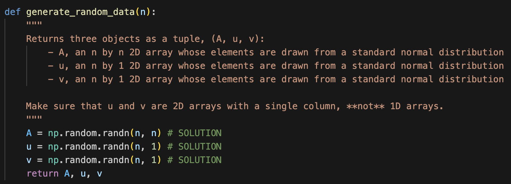
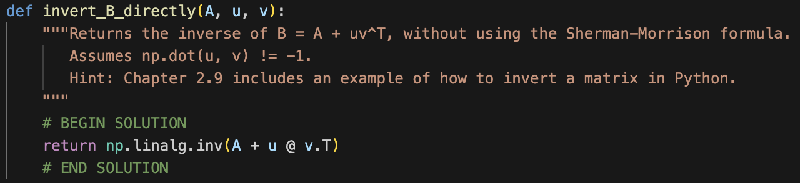
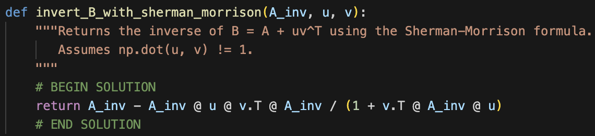
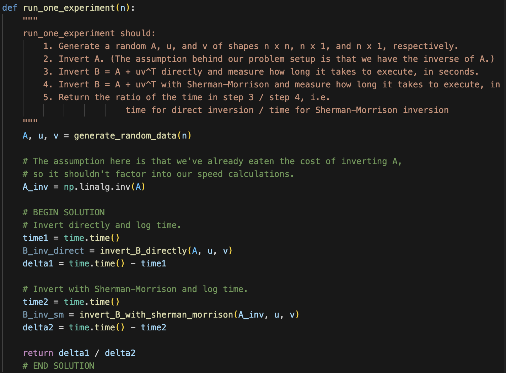
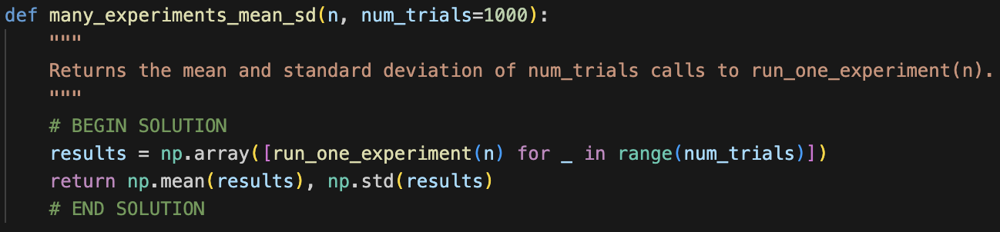
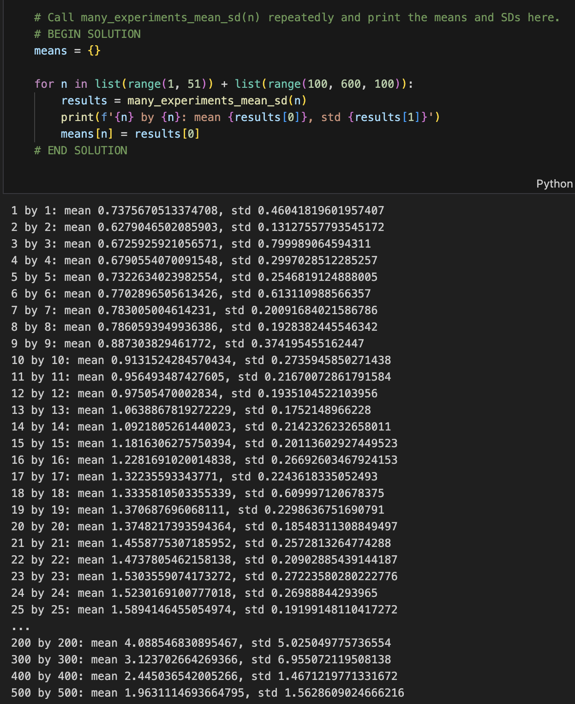



# Homework 6: Rank and Inverses

**due** Sunday, May 31st, 2026 at 11:59PM Ann Arbor Time

<a class="btn btn-info assignment-pdf-button" href="/resources/homeworks/hw06/hw06.pdf" target="_blank">View as PDF ✏️</a>
<a class="btn btn-info assignment-pdf-button" href="/resources/homeworks/hw06/hw06-solutions.pdf" target="_blank">Solutions PDF ✅</a>

{: .yellow }

Write your solutions to the following problems either by writing them on a piece of paper or on a tablet and scanning your answers as a PDF. Note that you are not allowed to use LaTeX, Google Docs, or any other digital document creation software to type your answers. Homeworks are due to Gradescope by 11:59PM on the due date. See the [syllabus](https://eecs245.org/syllabus/#homeworks) for details on the slip day policy.

Homework will be evaluated not only on the correctness of your answers, but on your ability to present your ideas clearly and logically. You should always explain and justify your conclusions, using sound reasoning. Your goal should be to convince the reader of your assertions. If a question does not require explanation, it will be explicitly stated.

Before proceeding, make sure you're familiar with the [collaboration policy](https://eecs245.org/syllabus/#homeworks).

---

## Problems

- [Problem 1: Homework 5 Solutions Review](#problem-1-homework-5-solutions-review-10-pts)
- [Problem 2: Rank-Nullity Practice](#problem-2-rank-nullity-practice-9-pts)
- [Problem 3: Spaces](#problem-3-spaces-16-pts)
- [Problem 4: Numbers of Solutions](#problem-4-numbers-of-solutions-12-pts)
- [Problem 5: Projecting onto a Single Vector](#problem-5-projecting-onto-a-single-vector-12-pts)
- [Problem 6: Invertibility of $XX^T$](#problem-6-invertibility-of-xxt-5-pts)
- [Problem 7: Trickster](#problem-7-trickster-5-pts)
- [Problem 8: Sherman-Morrison Inverse](#problem-8-sherman-morrison-inverse-22-pts)

---

Total Points: 10 + 9 + 16 + 12 + 12 + 5 + 5 + 22 = 91

---

## Problem 1: Homework 5 Solutions Review (10 pts)

Review [the solutions to Homework 5](https://eecs245.org/resources/homeworks/hw05/). Pick **two problem parts** (for example, Problem 2a and Problem 4b) from Homework 5 in which your solutions have the most room for improvement, i.e., where they have unsound reasoning, could be significantly more efficient or clearer, etc. **Include a screenshot of your solution to each problem part**, and in a few sentences, explain what was deficient and how it could be fixed.

Alternatively, if you think one of your solutions is significantly better than the posted one, copy it here and explain why you think it is better. If you didn't do Homework 5, choose two problem parts from it that look challenging to you, and in a few sentences, explain the key ideas behind their solutions in your own words.

Solution

---

## Problem 2: Rank-Nullity Practice (9 pts)

Recall from [Chapter 5.4](https://notes.eecs245.org/matrices/null-space-rank-nullity/#rank-nullity-theorem) that the rank-nullity theorem states that for any \\(n \times d\\) matrix \\(A\\),

$$
\text{rank}(A) + \text{dim}(\text{nullsp}(A)) = \underbrace{\text{number of columns in } A}_{d}
$$

In each part, identify whether the statement is true or false, and explain why.

a)

(3 pts) There exists a \\(4 \times 5\\) matrix \\(A\\) with \\(\text{rank}(A) = 4\\) and \\(\text{dim}(\text{colsp}(A)) = 3\\).

Solution

\\(\boxed{\text{False}}\\). \\(\text{rank}(A) = \text{dim}(\text{colsp}(A))\\) for any matrix \\(A\\) by definition.

b)

(3 pts) There exists a \\(4 \times 5\\) matrix \\(B\\) with \\(\text{rank}(B) = 3\\) and \\(\text{dim}(\text{nullsp}(B)) = 2\\).

Solution

\\(\boxed{\text{True}}\\). In fact, every \\(4 \times 5\\) matrix with \\(\text{rank}(B) = 3\\) must have \\(\text{dim}(\text{nullsp}(B)) = 2\\).

This is because the rank-nullity theorem tells us that

$$
\text{rank}(B) + \text{dim}(\text{nullsp}(B)) = \text{\# columns in } B = 5
$$

 so if \\(\text{rank}(B) = 3\\), then \\(\text{dim}(\text{nullsp}(B)) = 2\\).

c)

(3 pts) There exists a \\(4 \times 5\\) matrix \\(C\\) with \\(\text{dim}(\text{nullsp}(C)) = 4\\) and \\(\text{dim}(\text{nullsp}(C^T)) = 1\\).

Solution

\\(\boxed{\text{False}}\\).

Suppose \\(C\\) is a \\(4 \times 5\\) matrix with \\(\text{dim}(\text{nullsp}(C)) = 4\\). Then, by the rank-nullity theorem,

$$
\text{rank}(C) + \text{dim}(\text{nullsp}(C)) = 5 \implies \text{rank}(C) = 5 - 4 = 1
$$

But then, applying the rank-nullity theorem to \\(C^T\\) and using the fact that \\(\text{rank}(C^T) = \text{rank}(C) = 1\\), we have

$$
\text{rank}(C^T) + \text{dim}(\text{nullsp}(C^T)) = 4 \implies \text{dim}(\text{nullsp}(C^T)) = 4 - 1 = 3
$$

But, the question states that \\(\text{dim}(\text{nullsp}(C^T)) = 1\\), so we have a contradiction. Therefore, no such matrix \\(C\\) exists.

---

## Problem 3: Spaces (16 pts)

a)

(4 pts) Find a matrix \\(A\\) such that

$$
\text{nullsp}(A) = \text{span}\left(\left\{\begin{bmatrix} 2 \\\\ 1 \\\\ 0 \\\\ 1 \end{bmatrix}\right\}\right)
$$

What is \\(\text{rank}(A)\\)?

Solution

Recall, \\(\text{nullsp}(A)\\) is the set of all vectors \\(\vec x\\) such that \\(A\vec x = \vec 0\\). We have that:

**(i)** \\(\text{nullsp}(A)\\) is a 1-dimensional subspace of \\(\mathbb{R}^4\\).

**(ii)** \\(A\\) has 4 columns, because the null space is made up of vectors in \\(\mathbb{R}^4\\); \\(A\\) must have 4 columns in order for \\(A \begin{bmatrix} 2 \\\\ 1 \\\\ 0 \\\\ 1 \end{bmatrix}\\) to be a valid product.

**(iii)** The above two facts imply, from the rank-nullity theorem, that \\(\text{rank}(A) + 1 = 4 \implies \text{rank}(A) = 3\\).

We know that \\(A\\) has 3 linearly independent columns, and 4 total columns. We don't know how many rows it has, but it must have at least 3 rows since \\(\text{rank}(A) = 3\\).

The easiest solution is to make \\(A\\) a \\(3 \times 4\\) matrix. Let \\(\vec a^{(1)}, \vec a^{(2)}, \vec a^{(3)}, \vec a^{(4)}\\) be the columns of \\(A\\). Then,

$$
A\begin{bmatrix} 2 \\\\ 1 \\\\ 0 \\\\ 1 \end{bmatrix} = \begin{bmatrix} | & | & | & | \\\\ \vec a^{(1)} & \vec a^{(2)} & \vec a^{(3)} & \vec a^{(4)} \\\\ | & | & | & |\end{bmatrix} \begin{bmatrix} 2 \\\\ 1 \\\\ 0 \\\\ 1 \end{bmatrix} = \vec 0
$$

 implies that \\(A\\)'s columns must satisfy

$$
2 \vec a^{(1)} + \vec a^{(2)} + \vec a^{(4)} = \vec 0
$$

So, we just need to pick 4 vectors in \\(\mathbb{R}^3\\) such that one of them is a linear combination of the others, and the above relationship is satisfied. The above relationship gives us a dependency relationship between \\(\vec a^{(1)}\\), \\(\vec a^{(2)}\\), and \\(\vec a^{(4)}\\), so we can accomplish both goals at the same time.

Let's pick \\(\vec a^{(1)} = \begin{bmatrix} 1 \\\\ 0 \\\\ 0 \end{bmatrix}\\), \\(\vec a^{(2)} = \begin{bmatrix} 0 \\\\ 1 \\\\ 0 \end{bmatrix}\\), and \\(\vec a^{(3)} = \begin{bmatrix} 0 \\\\ 0 \\\\ 1 \end{bmatrix}\\). There's nothing special about these choices other than that the numbers are small and simple; you could have picked any three linearly independent vectors. Note that \\(\vec a^{(3)}\\) doesn't appear in the relationship above; \\(\vec a^{(1)}\\), \\(\vec a^{(2)}\\), and \\(\vec a^{(4)}\\) all do, so now we can find the required \\(\vec a^{(4)}\\) by solving the equation \\(2 \vec a^{(1)} + \vec a^{(2)} + \vec a^{(4)} = \vec 0\\).

$$
\vec a^{(4)} = -2 \vec a^{(1)} - \vec a^{(2)} = \begin{bmatrix} -2 \\\\ -1 \\\\ 0 \end{bmatrix}
$$

So, one possible \\(A\\) is \\(\boxed{A = \begin{bmatrix} 1 &amp; 0 &amp; 0 &amp; -2 \\\\ 0 &amp; 1 &amp; 0 &amp; -1 \\\\ 0 &amp; 0 &amp; 1 &amp; 0 \end{bmatrix}}\\), which has \\(\boxed{\text{rank}(A) = 3}\\).

b)

(4 pts) Find a matrix \\(A\\) such that

$$
\text{nullsp}(A) = \text{span}\left(\left\{\begin{bmatrix} 2 \\\\ 2 \\\\ 1 \\\\ 0 \end{bmatrix}, \begin{bmatrix} 3 \\\\ 1 \\\\ 0 \\\\ 1 \end{bmatrix}\right\}\right)
$$

What is \\(\text{rank}(A)\\)?

Solution

Following the logic from the last subpart, \\(\text{dim}(\text{nullsp}(A)) = 2\\) and \\(A\\) must have 4 columns, so

$$
\text{rank}(A) = 4 - 2 = 2
$$

So, the easiest example will involve a \\(2 \times 4\\) matrix \\(A\\). If \\(A = \begin{bmatrix} | &amp; | &amp; | &amp; | \\\\ \vec a^{(1)} &amp; \vec a^{(2)} &amp; \vec a^{(3)} &amp; \vec a^{(4)} \\\\ | &amp; | &amp; | &amp; |\end{bmatrix}\\), then it must be the case that

\\(A \begin{bmatrix} 2 \\\\ 2 \\\\ 1 \\\\ 0 \end{bmatrix} = \vec 0\\) and \\(A \begin{bmatrix} 3 \\\\ 1 \\\\ 0 \\\\ 1 \end{bmatrix} = \vec 0\\). This gives us two conditions on \\(\vec a^{(1)}, \vec a^{(2)}, \vec a^{(3)}, \vec a^{(4)}\\):

$$
2 \vec a^{(1)} + 2 \vec a^{(2)} + \vec a^{(3)} = \vec 0
$$

$$
3 \vec a^{(1)} + \vec a^{(2)} + \vec a^{(4)} = \vec 0
$$

\\(\vec a^{(1)}\\) and \\(\vec a^{(2)}\\) appear in both equations, so it might be easiest to make those the two linearly independent columns (remember that \\(\text{rank}(A) = 2\\)). So, let's make them \\(\vec a^{(1)} = \begin{bmatrix} 1 \\\\ 0 \end{bmatrix}\\) and \\(\vec a^{(2)} = \begin{bmatrix} 0 \\\\ 1 \end{bmatrix}\\). Now, we can solve for \\(\vec a^{(3)}\\) and \\(\vec a^{(4)}\\) by solving the two equations:

$$
\vec a^{(3)} = -2 \vec a^{(1)} - 2 \vec a^{(2)} = \begin{bmatrix} -2 \\\\ -2 \end{bmatrix}
$$

$$
\vec a^{(4)} = -3 \vec a^{(1)} - \vec a^{(2)} = \begin{bmatrix} -3 \\\\ -1 \end{bmatrix}
$$

So, one possible \\(A\\) is \\(\boxed{A = \begin{bmatrix} 1 &amp; 0 &amp; -2 &amp; -3 \\\\ 0 &amp; 1 &amp; -2 &amp; -1 \end{bmatrix}}\\), which has \\(\boxed{\text{rank}(A) = 2}\\).

Just to verify that we did this correctly, let's take a linear combination of \\(\begin{bmatrix} 2 \\\\ 2 \\\\ 1 \\\\ 0 \end{bmatrix}\\) and \\(\begin{bmatrix} 3 \\\\ 1 \\\\ 0 \\\\ 1 \end{bmatrix}\\) and check that multiplying \\(A\\) by that linear combination gets us to \\(\vec 0\\). How about

$$
\vec v = 5 \begin{bmatrix} 2 \\\\ 2 \\\\ 1 \\\\ 0 \end{bmatrix} + 2 \begin{bmatrix} 3 \\\\ 1 \\\\ 0 \\\\ 1 \end{bmatrix} = \begin{bmatrix} 16 \\\\ 12 \\\\ 5 \\\\ 2 \end{bmatrix}
$$

Indeed,

$$
A \vec v = \begin{bmatrix} 1 & 0 & -2 & -3 \\\\ 0 & 1 & -2 & -1 \end{bmatrix} \begin{bmatrix} 16 \\\\ 12 \\\\ 5 \\\\ 2 \end{bmatrix} = \begin{bmatrix} 16 - 2 \cdot 5 - 3 \cdot 2 \\\\ 12 - 2 \cdot 5 - 1 \cdot 2 \end{bmatrix} = \begin{bmatrix} 0 \\\\ 0 \end{bmatrix} = \vec 0
$$

so it seems like we found a valid \\(A\\).

c)

(4 pts) Find a matrix \\(A\\) such that

$$
\begin{bmatrix} 1 \\\\ 1 \\\\ 5 \end{bmatrix} \in \text{colsp}(A), \quad \begin{bmatrix} 0 \\\\ 3 \\\\ 1 \end{bmatrix} \in \text{colsp}(A), \quad \begin{bmatrix} 1 \\\\ 1 \\\\ 2 \end{bmatrix} \in \text{nullsp}(A)
$$

What is \\(\text{rank}(A)\\)?

Solution

We know that \\(A\\) has 3 rows, because \\(\begin{bmatrix} 1 \\\\ 1 \\\\ 5 \end{bmatrix}\\) is a linear combination of \\(A\\)'s columns, which must be in \\(\mathbb{R}^3\\). It also has 3 columns, because the null space is made up of vectors in \\(\mathbb{R}^3\\); \\(A\\) must have 3 columns in order for \\(A \begin{bmatrix} 1 \\\\ 1 \\\\ 2 \end{bmatrix}\\) to be a valid product.

So, \\(A\\) is a \\(3 \times 3\\) matrix.

There are two linearly independent columns in the column space of \\(A\\), so \\(A\\) must have at least 2 linearly independent columns, meaning \\(\text{rank}(A) \geq 2\\). However, the null space contains a non-zero vector, so \\(A\\) must have exactly 2 linearly independent columns and a null space of dimension 1, meaning \\(\text{rank}(A) = 2\\).

The easiest path forward is to make \\(A\\) a \\(3 \times 3\\) matrix whose first column is \\(\begin{bmatrix} 1 \\\\ 1 \\\\ 5 \end{bmatrix}\\) and whose second column is \\(\begin{bmatrix} 0 \\\\ 3 \\\\ 1 \end{bmatrix}\\). Then, we can solve for the third column by solving the equation \\(A \begin{bmatrix} 1 \\\\ 1 \\\\ 2 \end{bmatrix} = \vec 0\\) (or \\(A \begin{bmatrix} 2 \\\\ 2 \\\\ 4 \end{bmatrix} = \vec 0\\), or \\(A (\text{any scalar multiple of } \begin{bmatrix} 1 \\\\ 1 \\\\ 2 \end{bmatrix}) = \vec 0\\)).

If we let \\(A = \begin{bmatrix}1 &amp; 0 &amp; c&#95;1 \\\\ 1 &amp; 3 &amp; c&#95;2 \\\\ 5 &amp; 1 &amp; c&#95;3 \end{bmatrix}\\), then we have the following system of equations:

$$
\begin{align*}
A\begin{bmatrix} 1 \\\\ 1 \\\\ 2 \end{bmatrix} &= \vec{0} \\\\
\implies \begin{bmatrix} 1 & 0 & c_1 \\\\ 1 & 3 & c_2 \\\\ 5 & 1 & c_3 \end{bmatrix}
\begin{bmatrix} 1 \\\\ 1 \\\\ 2 \end{bmatrix} &=
\begin{bmatrix}
1 \cdot 1 + 0 \cdot 1 + c_1 \cdot 2 \\\\
1 \cdot 1 + 3 \cdot 1 + c_2 \cdot 2 \\\\
5 \cdot 1 + 1 \cdot 1 + c_3 \cdot 2 \\\\
\end{bmatrix}
=
\begin{bmatrix}
1 + 2c_1 \\\\
4 + 2c_2 \\\\
6 + 2c_3
\end{bmatrix}
= \vec{0}
\end{align*}
$$

This is satisfied by \\(c&#95;1 = -\frac{1}{2}\\), \\(c&#95;2 = -2\\), and \\(c&#95;3 = -3\\), so one possible \\(A\\) is \\(\boxed{A = \begin{bmatrix} 1 &amp; 0 &amp; -\frac{1}{2} \\\\ 1 &amp; 3 &amp; -2 \\\\ 5 &amp; 1 &amp; -3 \end{bmatrix}}\\), with \\(\boxed{\text{rank}(A) = 2}\\).

d)

(4 pts) Let \\(\vec u = \begin{bmatrix} 1 \\\\ 3 \\\\ 4 \end{bmatrix}\\) and \\(\vec v = \begin{bmatrix} 8 \\\\ -2 \\\\ 3 \end{bmatrix}\\). Explain why there **does not** exist a matrix \\(A\\) such that

$$
\vec u \in \text{colsp}(A), \quad \vec v \in \text{nullsp}(A^T)
$$

and propose one change we could make to \\(\vec v\\) that would allow such an \\(A\\) to exist.

<em>Hint: In the <a href="https://notes.eecs245.org/matrices/null-space-rank-nullity/#example-orthogonal-complements">Orthogonal Complements example in Chapter 5.4</a>, and in <a href="https://youtu.be/dcqA-6-vYA4">this video</a>, we discuss a fact related to this question. If you want to make a claim about the required relationship between \\(\vec u\\) and \\(\vec v\\), you need to re-prove it here. This shouldn't take too many lines of work.</em>

Solution

The reason is that **every element of \\(\text{colsp}(A)\\) is orthogonal to every element of \\(\text{nullsp}(A^T)\\)**. Sometimes, this is phrased as the column space and null space being \\(\textbf{orthogonal complements}\\).

Why is this the case? Suppose \\(A\\) is an \\(n \times d\\) matrix where \\(\vec u \in \text{colsp}(A)\\) and \\(\vec v \in \text{nullsp}(A^T)\\). The definition of \\(\vec u \in \text{colsp}(A)\\) is that there exists some other vector \\(\vec y\\) such that

$$
\vec u = A \vec y
$$

Here, \\(\vec u \in \mathbb{R}^n\\) and \\(\vec y \in \mathbb{R}^d\\).

The definition of \\(\vec v\\) is that

$$
A^T \vec v = \vec 0
$$

Likewise, \\(\vec v \in \mathbb{R}^n\\).

Then,

$$
\vec u \cdot \vec v = (A \vec y) \cdot \vec v = (A \vec y)^T \vec v = \vec y^T A^T \vec v = \vec y^T \vec 0 = 0
$$

So, if \\(\vec u \in \text{colsp}(A)\\) and \\(\vec v \in \text{nullsp}(A^T)\\), then \\(\vec u\\) and \\(\vec v\\) must be orthogonal.

This explains why there doesn't exist a matrix \\(A\\) where \\(\begin{bmatrix} 1 \\\\ 3 \\\\ 4 \end{bmatrix} \in \text{colsp}(A)\\) and \\(\begin{bmatrix} 8 \\\\ -2 \\\\ 3 \end{bmatrix} \in \text{nullsp}(A^T)\\), since these vectors aren't orthogonal, as their dot product is \\(8 - 6 + 12 = 14 \neq 0\\).

A change to \\(\vec v\\) that would allow such an \\(A\\) to exist is to change its first component to \\(-6\\); then,

$$
\vec u \cdot \vec v = \begin{bmatrix} 1 \\\\ 3 \\\\ 4 \end{bmatrix} \cdot \begin{bmatrix} -6 \\\\ -2 \\\\ 3 \end{bmatrix} = -6 + -6 + 12 = 0
$$

---

## Problem 4: Numbers of Solutions (12 pts)

Recall that if \\(A\\) is an \\(n \times d\\) matrix, \\(\vec x \in \mathbb{R}^d\\), and \\(\vec b \in \mathbb{R}^n\\), then

$$
A \vec x = \vec b
$$

 is a system of \\(n\\) equations in \\(d\\) unknowns, where the unknowns are the components of \\(\vec x\\), i.e. \\(x&#95;1\\), \\(x&#95;2\\), \\(\ldots\\), \\(x&#95;d\\). Solving this system is equivalent to writing \\(\vec b\\) as a **linear combination of the columns of \\(A\\)**.

In each part, do two things:

1.  Construct a matrix \\(A\\) for which the number of solutions (that is, number of valid \\(\vec x\\)'s) to the system \\(A \vec x = \vec b\\) is the number provided.

2.  Determine whether the function \\(f(\vec x) = A \vec x\\) is one-to-one, onto, both, or neither. (See [Chapter 6.2](https://notes.eecs245.org/linear-transformations-and-projections/inverses/#inverting-a-transformation) for a refresher on the definitions.)

The first part has been done for you as an example.

a)

\\(0\\) or \\(1\\), depending on \\(\vec b\\)

Solution

**(i)** If there are either 0 or 1 solutions, we know that \\(A\\)'s columns must be linearly independent. This is because if a given set of vectors is linearly independent, then any linear combination of them can only be written in one way (a fact that we proved in Chapter 2.6). \\(A\\)'s columns must also **not** span all of \\(\mathbb{R}^n\\), since there are some \\(\vec b \in \mathbb{R}^n\\) with no solutions for \\(\vec x\\), so \\(A\\) must have fewer columns than rows.

One possible \\(A\\) is \\(A = \begin{bmatrix} 1 &amp; 0 \\\\ 0 &amp; 2 \\\\ 0 &amp; 0 \end{bmatrix}\\). For example, \\(\vec b = \begin{bmatrix} -3 \\\\ 4 \\\\ 0 \end{bmatrix}\\) only has a single solution for \\(\vec x\\), which is \\(\vec x = \begin{bmatrix} -3 \\\\ 2 \end{bmatrix}\\), while \\(\vec c = \begin{bmatrix} 1 \\\\ 2 \\\\ 3 \end{bmatrix}\\) has no solution for \\(\vec x\\).

**(ii)** The function \\(f(\vec x) = A \vec x\\) is one-to-one, but not onto. It is one-to-one because of the fact that any linear combination of \\(A\\)'s columns can only be written in one way, so if \\(\vec x \neq \vec y\\), then \\(A \vec x\\) and \\(A \vec y\\) must also be different. It is not onto, since there are vectors in \\(\mathbb{R}^3\\) (like \\(\vec c\\) above) that aren't the output of \\(f(\vec x)\\).

b)

(4 pts)
\\(\infty\\), no matter what \\(\vec b\\) is

Solution

For \\(A\vec x = \vec b\\) to have an infinite number of solutions, for every possible \\(\vec b \in \mathbb{R}^n\\), we need \\(A\\)'s **columns to be linearly dependent and span all of \\(\mathbb{R}^n\\)**. We need its columns to span \\(\mathbb{R}^n\\) so there's at least one solution for every \\(\vec b \in \mathbb{R}^n\\), and we need its columns to be linearly dependent so that there are infinitely many ways to write any given \\(\vec b \in \text{colsp}(A)\\) through a linear combination of \\(A\\)'s columns.

One possible \\(A\\) is \\(\boxed{A=\begin{bmatrix}1 &amp; 0 &amp; 0 &amp; 1 \\\\ 0 &amp; 1 &amp; 0 &amp; 1 \\\\ 0 &amp; 0 &amp; 1 &amp; 1\end{bmatrix}}\\). Pick any \\(\vec b \in \mathbb{R}^3\\) and there will be infinitely many vectors \\(\vec x\\) where \\(A \vec x = \vec b\\).

The function \\(f(\vec x) = A \vec x\\)\...

-   **is onto**, because the columns of \\(A\\) span all of \\(\mathbb{R}^n\\), meaning that all vectors in \\(\mathbb{R}^n\\) are possible outputs of \\(f(\vec x)\\).

-   **is not one-to-one**, because it's possible for two different vectors \\(\vec x, \vec y \in \mathbb{R}^4\\) to result in \\(A \vec x = A \vec y\\). For example, \\(A \begin{bmatrix} 1 \\\\ 1 \\\\ 1 \\\\ 1 \end{bmatrix} = A \begin{bmatrix} 0 \\\\ 0 \\\\ 0 \\\\ 2 \end{bmatrix} = \begin{bmatrix} 2 \\\\ 2 \\\\ 2 \end{bmatrix}\\).

c)

(4 pts)
\\(0\\) or \\(\infty\\), depending on what \\(\vec b\\) is

Solution

For \\(A\vec x = \vec b\\) to have either \\(0\\) or \\(\infty\\) solutions depending on \\(\vec b\\), \\(A\\)'s columns **must be linearly dependent but must *not* span all of \\(\mathbb{R}^n\\)**. This ensures that for some \\(\vec b\\) there are no solutions (when \\(\vec b\\) is not in the column space of \\(A\\)), and for any \\(\vec b\\) in the column space, there are infinitely many solutions (since the columns are linearly dependent).

One possible \\(A\\) is \\(\boxed{A = \begin{bmatrix} 1 &amp; 0 &amp; 1 \\\\ 0 &amp; 1 &amp; 1 \\\\ 0 &amp; 0 &amp; 0 \end{bmatrix}}\\). For example, for \\(\vec b = \begin{bmatrix} 2 \\\\ 2 \\\\ 0 \end{bmatrix}\\), there are infinitely many solutions for \\(\vec x\\); \\(\vec x = \begin{bmatrix} 0 \\\\ 0 \\\\ 2 \end{bmatrix}\\) and \\(\vec x = \begin{bmatrix} -6 \\\\ -6 \\\\ 8 \end{bmatrix}\\) both do the job. But for \\(\vec b = \begin{bmatrix} 1 \\\\ 2 \\\\ 3 \end{bmatrix}\\), there are no solutions for \\(\vec x\\) in \\(A \vec x = \vec b\\), since no linear combination of \\(A\\)'s columns can have a non-zero third component.

The function \\(f(\vec x) = A\vec x\\)\...

-   **is not onto**, because the columns of \\(A\\) do not span all of \\(\mathbb{R}^n\\) (e.g., we can't reach \\(\begin{bmatrix} 1 \\\\ 2 \\\\ 3 \end{bmatrix}\\)).

-   **is not one-to-one**, because it's possible for two different vectors \\(\vec x, \vec y \in \mathbb{R}^3\\) to result in \\(A \vec x = A \vec y\\) as we saw above with \\(\begin{bmatrix} 0 \\\\ 0 \\\\ 2 \end{bmatrix}\\) and \\(\begin{bmatrix} -6 \\\\ -6 \\\\ 8 \end{bmatrix}\\).

d)

(4 pts)
\\(1\\), no matter what \\(\vec b\\) is

Solution

For \\(A\vec x = \vec b\\) to have exactly one solution for every \\(\vec b \in \mathbb{R}^n\\), \\(A\\)'s columns **must be linearly independent and must span all of \\(\mathbb{R}^n\\)**. This guarantees that for any \\(\vec b\\), there is a *unique* solution \\(\vec x\\).

One possible \\(A\\) is \\(\boxed{A = \begin{bmatrix} 1 &amp; 0 &amp; 0 \\\\ 0 &amp; 1 &amp; 0 \\\\ 0 &amp; 0 &amp; 1 \end{bmatrix}}\\). Given any \\(\vec b \in \mathbb{R}^3\\), \\(A\vec x = \vec b\\) always has the unique solution \\(\vec x = \vec b\\).

The function \\(f(\vec x) = A \vec x\\)\...

-   **is onto**, because the columns of \\(A\\) span all of \\(\mathbb{R}^n\\), so every vector in \\(\mathbb{R}^n\\) can be written as \\(A\vec x\\) for some \\(\vec x\\).

-   **is one-to-one**, because the columns are linearly independent; if \\(A\vec x&#95;1 = A\vec x&#95;2\\) then \\(\vec x&#95;1 = \vec x&#95;2\\).

Therefore, \\(A\\) is invertible.

---

## Problem 5: Projecting onto a Single Vector (12 pts)

In Homework 6, Problem 3, you found that the \\(2 \times 2\\) matrix \\(P\\) that projects \\(\vec u \in \mathbb{R}^2\\) onto the unit vector \\(\vec v \in \mathbb{R}^2\\) was

$$
P = \begin{bmatrix} v_1^2 & v_1v_2 \\\\ v_1v_2 & v_2^2 \end{bmatrix}
$$

a)

(6 pts) Find:

1.  \\(\text{rank}(P)\\)

2.  A basis for \\(\text{colsp}(P)\\)

3.  A basis for \\(\text{nullsp}(P)\\)

4.  A basis for \\(\text{colsp}(P^T)\\)

Solution

**(i)** \\(\boxed{\text{rank}(P)=1}\\). Both columns are scalar multiples of \\(\begin{bmatrix} v&#95;1 \\\\ v&#95;2 \end{bmatrix}\\). Another way of looking at it is that \\(\text{column 2} = \frac{v&#95;2}{v&#95;1} (\text{column 1})\\).

**(ii)** A basis for \\(\text{colsp}(P)\\) is \\(\boxed{\left\lbrace \begin{bmatrix} v&#95;1 \\\\ v&#95;2 \end{bmatrix} \right\rbrace}\\); any linear combination of \\(P\\)'s columns is a scalar multiple of \\(\begin{bmatrix} v&#95;1 \\\\ v&#95;2 \end{bmatrix}\\).

**(iii)** Since \\(P\\) has \\(2\\) columns and \\(\text{rank}(P) = 1\\), the null space of \\(P\\) has dimension \\(2 - 1 = 1\\), so a basis for \\(\text{nullsp}(P)\\) will contain just a single vector, and \\(\text{nullsp}(P)\\) will be the set of scalar multiples of that vector.

Let \\(\vec{x} = \begin{bmatrix} x&#95;1 \\\\ x&#95;2 \end{bmatrix}\\) be a vector in \\(\text{nullsp}(P)\\). Then,

$$
P \vec{x} = \begin{bmatrix} v_1^2 & v_1 v_2 \\\\ v_1 v_2 & v_2^2 \end{bmatrix} \begin{bmatrix} x_1 \\\\ x_2 \end{bmatrix}
      = \begin{bmatrix} v_1^2 x_1 + v_1 v_2 x_2 \\\\ v_1 v_2 x_1 + v_2^2 x_2 \end{bmatrix} = \vec{0}
$$

By inspection, one possible solution is \\(\vec x = \begin{bmatrix} - v&#95;2 \\\\ v&#95;1 \end{bmatrix}\\). Plugging this into both components of \\(P \vec x = \vec 0\\) gives us:

$$
v_1^2 (-v_2) + v_1 v_2 (v_1) = 0 \\\\ v_1v_2(-v_2) + v_2^2 (v_1) = 0
$$

which is satisfied, so \\(\boxed{\left\lbrace \begin{bmatrix} - v&#95;2 \\\\ v&#95;1 \end{bmatrix} \right\rbrace}\\) is a basis for \\(\text{nullsp}(P)\\). Any scalar multiple of \\(\begin{bmatrix} - v&#95;2 \\\\ v&#95;1 \end{bmatrix}\\) will also work.

**(iv)** Note that \\(P = P^T\\), i.e. \\(P\\) is symmetric, so a basis for \\(\text{colsp}(P)\\) is also a basis for \\(\text{colsp}(P^T)\\). So, \\(\boxed{\left\lbrace \begin{bmatrix} v&#95;1 \\\\ v&#95;2 \end{bmatrix} \right\rbrace}\\) is a basis for \\(\text{colsp}(P^T)\\).

A worthwhile observation is that \\(P\\) is the outer product of \\(\vec v = \begin{bmatrix} v&#95;1 \\\\ v&#95;2 \end{bmatrix}\\) with itself, i.e. \\(P = \vec v \vec v^T\\).

b)

(3 pts) Explain why \\(P\\) is not invertible, and then explain why the transformation \\(f(\vec u) = P \vec u\\) can't be reversed.

Solution

\\(P\\) is not invertible because \\(\text{rank}(P)\neq 2\\), and an \\(n \times n\\) matrix must have rank \\(n\\) to be invertible.

When you project \\(\vec u\\) onto \\(\vec v\\), you're "losing information" because you no longer know the direction of the original \\(\vec u\\). Different vectors \\(\vec u\\) and \\(\vec w\\) might end up with the same projection onto \\(\vec v\\), despite being different vectors, meaning the transformation isn't one-to-one, and hence can't be undone.

c)

(3 pts) As mentioned in Homework 6, Problem 3, \\(P\\) is an idempotent matrix, meaning that

$$
P^2 = P
$$

In general, if \\(P^2 = P\\) and \\(P\\) is invertible, what must \\(P\\) be?

<em>Hint: Multiply both sides of \\(P^2 = P\\) by \\(P^{-1}\\).</em>

Solution

\\(P\\) must be the **identity matrix**, \\(I\\).

$$
\begin{align*}
P^2 &= P \\\\
PP &= P \\\\
PPP^{-1} &= PP^{-1} \\\\
P\underbrace{(PP^{-1})}_{I} &= \underbrace{PP^{-1}}_{I} \\\\
P &= I
\end{align*}
$$

---

## Problem 6: Invertibility of \\(XX^T\\) (5 pts)

In [Chapter 5.4](https://notes.eecs245.org/matrices/null-space-rank-nullity/#example-rank-of-x-tx), and in [this video](https://youtu.be/hOyaHqGmO1I), we proved that \\(\text{rank}(X) = \text{rank}(X^TX)\\).

Here, we'll ask you to prove something similar involving \\(XX^T\\). Note that \\(X^TX\\) is a matrix containing the dot products of all pairs of \\(X\\)'s **columns**, while \\(XX^T\\) is a matrix containing the dot products of all pairs of \\(X\\)'s **rows**. (This has fact had something to do with Homework 6, Problem 4!)

Suppose \\(X\\) is an \\(n \times d\\) matrix, and \\(XX^T\\) is invertible. Find and explain **all** inequalities that **must** be true between \\(n\\), \\(d\\), and \\(r = \text{rank}(X)\\).

Solution

\\(XX^T\\) is an \\(n \times n\\) matrix. For it to be invertible, it must have a rank of \\(n\\). But, since \\(\text{rank}(X) = \text{rank}(XX^T)\\), \\(X\\) must also have a rank of \\(n\\). So, one equality is \\(\boxed{r = n}\\).

**Why is \\(\text{rank}(X) = \text{rank}(XX^T)\\)? For full credit, this needed to be proved.** There's an easy way and a hard way; we'll start with the hard way. Similar to what we did in the homework, we'll prove that the ranks are equal by looking at null spaces and using the rank-nullity theorem. But, \\(X\\)'s null space is made up of vectors in \\(\mathbb{R}^d\\), while \\(XX^T\\)'s null space is made up of vectors in \\(\mathbb{R}^n\\). So, we need to find a way to compare the two, since they involve different types of vectors.

The linking fact is that \\(\text{rank}(X) = \text{rank}(X^T)\\), so we can instead argue that \\(\text{rank}(X^T) = \text{rank}(XX^T)\\). And, to do this, we'll show that the null spaces of \\(X^T\\) and \\(XX^T\\) are the same, which will tell us (again, through the rank-nullity theorem) that the ranks are equal.

Our goal is to show that \\(\text{nullsp}(X^T) = \text{nullsp}(XX^T)\\). Both sides of this equation are sets, so to show they're equal, we need to show that any element in one set is also in the other, and vice versa.

**(i)** **Prove \\(\vec v \in \text{nullsp}(X^T) \implies \vec v \in \text{nullsp}(XX^T)\\)**:

Let \\(\vec v \in \text{nullsp}(X^T)\\). This means \\(\vec v \in \mathbb{R}^n\\) and \\(X^T \vec v = \vec 0\\). Multiplying both sides by \\(X\\) on the left gives us \\(XX^T \vec v = X \vec 0 = \vec 0\\). So, \\(\vec v \in \text{nullsp}(XX^T)\\).

**(ii)** **Prove \\(\vec v \in \text{nullsp}(XX^T) \implies \vec v \in \text{nullsp}(X^T)\\)**:

Let \\(\vec v \in \text{nullsp}(XX^T)\\). Again, this means that \\(\vec v \in \mathbb{R}^n\\) and \\(XX^T \vec v = \vec 0\\). Let's multiply both sides by \\(\vec v^T\\) on the left:

$$
\begin{align*}
XX^T \vec v &= \vec 0 \\\\
\vec v^T XX^T \vec v &= \vec v^T \vec 0 \\\\
(X^T \vec v)^T (X^T \vec v) &= 0 \\\\
(X^T \vec v) \cdot (X^T \vec v) &= 0 \\\\
\| X^T \vec v \|^2 &= 0 \\\\
X^T \vec v &= \vec 0
\end{align*}
$$

Since we've shown that any element in \\(\text{nullsp}(X^T)\\) is also in \\(\text{nullsp}(XX^T)\\), and vice versa, we have \\(\text{nullsp}(X^T) = \text{nullsp}(XX^T)\\).

The easier way to prove this would be to start with the fact that

$$
\text{rank}(X) = \text{rank}(X^TX)
$$

and replace every \\(X\\) with \\(X^T\\):

$$
\text{rank}(X^T) = \text{rank}((X^T)^T X^T) = \text{rank}(XX^T)
$$

But since \\(\text{rank}(X) = \text{rank}(X^T)\\), we have \\(\text{rank}(X) = \text{rank}(XX^T)\\).

Back to the main plot. Remember that \\(X\\) is an \\(n \times d\\) matrix, and we now know that \\(\text{rank}(X) = r = n\\). But, in general, \\(\text{rank}(X) \leq n\\) and \\(\text{rank}(X) \leq d\\). So, \\(\boxed{n \leq d}\\), meaning that \\(X\\) must have at least as many columns as rows (meaning it must be wide or square, not tall).

Just to make sense of this, imagine \\(X\\) had more rows than columns. Then, it might look something like

$$
X = \begin{bmatrix} \cdot & \cdot & \cdot & \cdot \\\\ \cdot & \cdot & \cdot & \cdot \\\\ \cdot & \cdot & \cdot & \cdot \\\\ \cdot & \cdot & \cdot & \cdot \\\\ \cdot & \cdot & \cdot & \cdot \\\\ \cdot & \cdot & \cdot & \cdot \end{bmatrix}
$$

This matrix has up to 4 linearly independent columns, and so it has up to 4 linearly independent rows, meaning not all of its rows can be linearly independent. But, since \\(\text{rank}(X) = n\\), we need all of its rows to be linearly independent. So, \\(X\\) can't be tall, and its number of columns must be greater than or equal to its number of rows.

So, to summarize:

-   \\(r = n\\)

-   \\(n \leq d\\)

-   (implied by the above two) \\(r \leq d\\)

---

## Problem 7: Trickster (5 pts)

Find a matrix \\(A\\) that is **not equal to the identity matrix**, but where \\(A^6 = I\\).

Once you think of your answer, you should explain how you found it, and should use Python to verify that \\(A^6 = I\\) holds. Include a screenshot of your Python code.

<em>Hint: This problem has a trick to it, and to think of it, I'd suggest reading the <a href="https://notes.eecs245.org/linear-transformations-and-projections/linear-transformations/#rotations-and-orthogonal-matrices">Rotations and Orthogonal Matrices section of Chapter 6.2</a>.</em>

Solution

\\(A\\) could be the rotation matrix that corresponds to rotating by \\(60^\circ\\), or \\(\frac{\pi}{3}\\) radians, since applying this transformation 6 times will bring us back to the vectors we started with.

As we saw in [Chapter 6.2](https://notes.eecs245.org/linear-transformations-and-projections/linear-transformations/#rotations-and-orthogonal-matrices),

$$
R(\theta) = \begin{bmatrix} \cos \theta & -\sin \theta \\\\ \sin \theta & \cos \theta \end{bmatrix}
$$

so

$$
\boxed{A = \begin{bmatrix} \cos \frac{\pi}{3} & -\sin \frac{\pi}{3} \\\\ \sin \frac{\pi}{3} & \cos \frac{\pi}{3} \end{bmatrix} = \begin{bmatrix} \frac{1}{2} & -\frac{\sqrt{3}}{2} \\\\ \frac{\sqrt{3}}{2} & \frac{1}{2} \end{bmatrix}}
$$

A simpler answer might be \\(\boxed{A = \begin{bmatrix} 0 &amp; 1 \\\\ 1 &amp; 0 \end{bmatrix}}\\), since \\(A^2 = I\\) and so \\(A^6 = (A^2)^3 = I^3 = I\\).

---

## Problem 8: Sherman-Morrison Inverse (22 pts)

In EECS 280 or EECS 281, you may have learned about **memoization**, which involves storing results of an earlier calculation to help speed up future calculations. This problem involves something similar.

Suppose we have an \\(n \times n\\) matrix \\(A\\) whose inverse, \\(A^{-1}\\), we already know. Remember that finding inverses in general is a difficult task, so once we've found one, we'd like to avoid having to invert again.

And, suppose that we need to know the inverse of

$$
B = A + \vec u \vec v^T
$$

which is the sum of \\(A\\) and a rank 1 matrix created by taking the "outer product" of \\(\vec u, \vec v \in \mathbb{R}^n\\) (as discussed in [Chapter 5.3](https://notes.eecs245.org/matrices/rank-and-column-space/#example-vector-outer-product)). Think of \\(B\\) as a small update to \\(A\\).

The Sherman-Morrison formula states that

$$
B^{-1} = (A + \vec u \vec v^T)^{-1} = A^{-1} - \frac{A^{-1} \vec u \vec v^T A^{-1}}{1 + \vec v^T A^{-1} \vec u}
$$

The formula allows us to find the inverse of \\(A + \vec u \vec v^T\\) just by knowing \\(\vec u\\), \\(\vec v\\), and \\(A^{-1}\\), meaning we don't need to recompute the inverse!

a)

(3 pts) To start, we'll consider a simpler case of the Sherman-Morrison formula, where \\(A = I\\), the identity matrix. Then, since \\(I = I^{-1}\\), the matrix we're inverting is

$$
B = A + \vec u \vec v^T
$$

and its inverse is

$$
B^{-1} = (I + \vec u \vec v^T)^{-1} = I - \frac{\vec u \vec v^T}{1 + \vec v^T \vec u}
$$

\\(B\\) is invertible, **except when** the denominator of the fraction above is 0, i.e. \\(1 + \vec v^T \vec u = 0\\).

When \\(1 + \vec v^T \vec u = 0\\), what is true about \\(B\\)?

<em>Hint: Evaluate \\(B \vec u\\). What does the result tell you about \\(\text{nullsp}(B)\\)?</em>

Solution

As the hint suggests, let's multiply out \\(B \vec u\\) in the case where \\(A = I\\).

$$
\begin{align*}
B\vec u &= (I+\vec u\vec v^T)\vec u
\\\\&= I\vec u+\vec u\vec v^T\vec u
\\\\&= 1\vec u+(\vec v^T\vec u) \vec u
\\\\&= \vec u(1+\vec v^T\vec u) \:\:\:\:\:\:\:\:\:\:\:\:\:\:\:\:\:\:\:\:\:\: (\vec v ^T \vec u \text{ is a scalar!)}
\end{align*}
$$

When \\(1+\vec v^T\vec u=0\\), then \\(B\vec u=\vec 0\\). This means that \\(\vec u \in \text{nullsp}(B)\\). But, this means that \\(B\\)'s null space contains more than just the zero vector, so \\(\text{dim}(\text{nullsp}(B)) &gt; 0\\), so \\(\text{rank}(B) &lt; n\\), meaning \\(B\\) is not invertible.

b)

(4 pts) Prove that as long as \\(1 + \vec v^T \vec u \neq 0\\), that

$$
(I + \vec u \vec v^T) \left( I - \frac{\vec u \vec v^T}{1 + \vec v^T \vec u} \right) = I
$$

(Yes, this involves a fair bit of algebra.)

Solution

$$
\begin{align*}
(I + {\vec u \vec v^T}) \left( I - \frac{{\vec u \vec v^T}}{1 + {\vec v^T \vec u}} \right) &= I - \frac{{\vec u \vec v^T}}{1 + {\vec v^T \vec u}} + {\vec u \vec v^T} - \frac{{\vec u \vec v^T} {\vec u \vec v^T}}{1 + {\vec v^T \vec u}} \\\\
&= I - \frac{{\vec u \vec v^T}}{1 + {\vec v^T \vec u}} + {\vec u \vec v^T} - \frac{({\vec v^T \vec u}){\vec u \vec v^T}}{1 + {\vec v^T \vec u}} \hspace{3em} \text{(remember, } {\vec v^T \vec u} \text{ is a scalar)} \\\\
&= I + {\vec u \vec v^T}\left(-\frac{1}{1 + {\vec v^T \vec u}} + 1 - \frac{({\vec v^T \vec u})}{1 + {\vec v^T \vec u}}\right) \\\\
&= I + {\vec u \vec v^T}\left(-\frac{1}{1 + {\vec v^T \vec u}} + \frac{1 + {\vec v^T \vec u}}{1 + {\vec v^T \vec u}} - \frac{\vec v^T\vec u}{1 + {\vec v^T \vec u}}\right) \\\\
&= I + {\vec u \vec v^T}\left(\frac{1 + {\vec v^T \vec u}}{1 + {\vec v^T \vec u}} - \frac{1 + \vec v^T \vec u}{1 + {\vec v^T \vec u}}\right) \\\\
&= I + {\vec u \vec v^T}(0) \\\\
&= I
\end{align*}
$$

c)

(8 pts) Now, let's return to the full-fledged Sherman-Morrison formula, where

$$
B = A + \vec u \vec v^T, \qquad B^{-1} = (A + \vec u \vec v^T)^{-1} = A^{-1} - \frac{A^{-1} \vec u \vec v^T A^{-1}}{1 + \vec v^T A^{-1} \vec u}
$$

Open the **supplemental Jupyter Notebook** we've created for Homework 6, which can either be found [here](https://datahub.eecs245.org/hub/user-redirect/git-pull?repo=https%3A%2F%2Fgithub.com%2Feecs245%2Fsp26-code&urlpath=tree%2Fsp26-code%2Fhomeworks%2Fhw06%2Fhw06.ipynb&branch=main) on DataHub, or [here](https://github.com/eecs245/sp26-code/blob/main/homeworks/hw06/hw06.ipynb) in the course GitHub repository; also watch [this video](https://youtu.be/HZtoekU9NcE) first with tips on using `numpy` for linear algebra.

There, you're asked to implement the Sherman-Morrison formula, and run some experiments to quantify how much quicker using the formula is than computing the inverse of \\(B\\) from scratch.

This problem is **not autograded**. Rather, in your submission to this part, include screenshots of your implementations of functions `generate_random_data`, `invert_B_directly`,

`invert_B_with_sherman_morrison`, `run_one_experiment`, and `many_experiments_mean_sd`, along with their outputs on the provided examples.

Solution

    

d)

(4 pts) Include screenshots of the code you used to call `many_experiments_mean_sd` for the values provided in the question, the outputs of the print statements you were asked to add, and the `plotly` line chart you were asked to create.

Solution

e)

(3 pts) Answer the question posed at the end of the supplemental Jupyter Notebook. (This shouldn't be a screenshot; just write your answer in this PDF the same way you answered Problems 1-7.)

Solution

Once \\(n\\) increases past a point, the pre-computed inverse \\(A^{-1}\\) no longer fits in the computer's cache, and has to be stored in memory (RAM), which is slower to access than the cache. At that point, the cost of retrieving \\(A^{-1}\\) from memory to apply the Sherman-Morrison formula becomes larger than just computing the inverse directly.

This may seem unintuitive, but note that `numpy` has highly optimized linear algebra routines, written in C which solve systems and invert matrices very quickly. So, even though the Sherman-Morrison formula is more efficient than inverting \\(B\\) directly, the difference in execution time becomes negligible as \\(n\\) increases.

If you're curious, look into [Low-Rank Adaptions (LoRA)](https://www.ibm.com/think/topics/lora), a relatively recent development in large language model research! The general idea is the same as we've worked with here.


