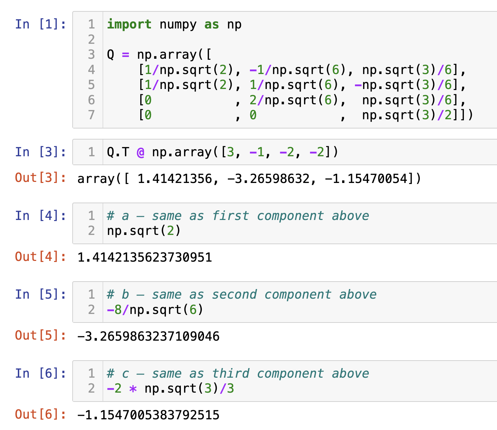
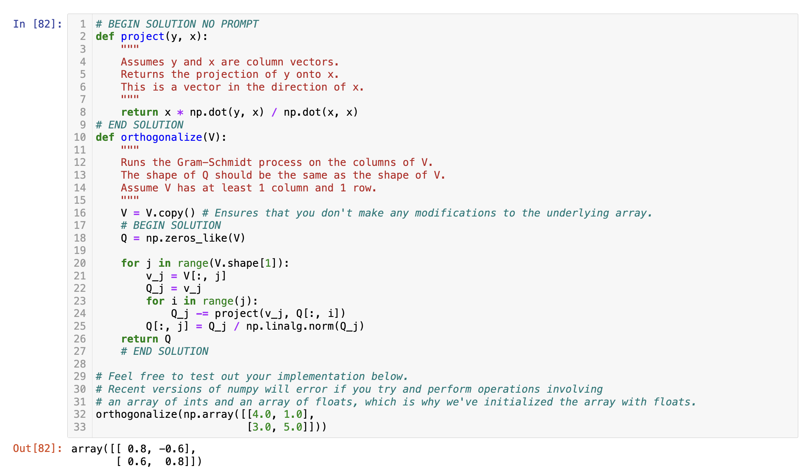
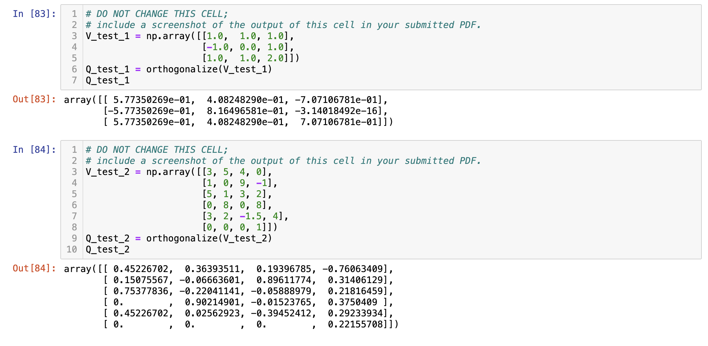



# Homework 7: Projections; Regression using Linear Algebra

**due** Thursday, June 4th, 2026 at 11:59PM Ann Arbor Time

<a class="btn btn-info assignment-pdf-button" href="/resources/homeworks/hw07/hw07.pdf" target="_blank">View as PDF ✏️</a>
<a class="btn btn-info assignment-pdf-button" href="/resources/homeworks/hw07/hw07-solutions.pdf" target="_blank">Solutions PDF ✅</a>

{: .yellow }

Write your solutions to the following problems either by writing them on a piece of paper or on a tablet and scanning your answers as a PDF. Note that you are not allowed to use LaTeX, Google Docs, or any other digital document creation software to type your answers. Homeworks are due to Gradescope by 11:59PM on the due date. See the [syllabus](https://eecs245.org/syllabus/#homeworks) for details on the slip day policy.

Homework will be evaluated not only on the correctness of your answers, but on your ability to present your ideas clearly and logically. You should always explain and justify your conclusions, using sound reasoning. Your goal should be to convince the reader of your assertions. If a question does not require explanation, it will be explicitly stated.

Before proceeding, make sure you're familiar with the [collaboration policy](https://eecs245.org/syllabus/#homeworks).

---

## Problems

- [Problem 1: Homework 6 Solutions Review](#problem-1-homework-6-solutions-review-10-pts)
- [Problem 2: Anonymous Feedback](#problem-2-anonymous-feedback-6-pts)
- [Problem 3: The Complete Solution](#problem-3-the-complete-solution-18-pts)
- [Problem 4: Orthogonalization](#problem-4-orthogonalization-27-pts)
- [Problem 5: Same, but Different](#problem-5-same-but-different-13-pts)
- [Problem 6: Putting it into Practice](#problem-6-putting-it-into-practice-8-pts)
- [Problem 7: Billy the Waiter](#problem-7-billy-the-waiter-14-pts)

---

Total Points: 10 + 6 + 18 + 27 + 13 + 8 + 14 = 96

---

## Problem 1: Homework 6 Solutions Review (10 pts)

Review the solutions to Homework 6. Pick **two problem parts** (for example, Problem 2a and Problem 5b) from Homework 6 in which your solutions have the most room for improvement, i.e., where they have unsound reasoning, could be significantly more efficient or clearer, etc. **Include a screenshot of your solution to each problem part**, and in a few sentences, explain what was deficient and how it could be fixed.

Alternatively, if you think one of your solutions is significantly better than the posted one, copy it here and explain why you think it is better. If you didn't do Homework 6, choose two problem parts from it that look challenging to you, and in a few sentences, explain the key ideas behind their solutions in your own words.

Solution

---

## Problem 2: Anonymous Feedback (6 pts)

We'd like to get your feedback on how the course has been going so far, now that we're past the halfway point and Midterm 2 is fast approaching.

You can find the survey [at this link](https://docs.google.com/forms/d/e/1FAIpQLSctsQYk1gGq87DsRU1gwB8eFG4V6vSnb3qBjYaFypRg4qWlZQ/viewform?usp=publish-editor), which you should complete **after you've finished the rest of Homework 7**. Unlike the Homework 3 survey, **it is anonymous**, so feel free to provide candid feedback.

In order to earn the 6 points for Homework 7, Problem 2, include a screenshot of the confirmation message you see after submitting the form. (We consider it an honor code violation to include a screenshot if you didn't actually submit the form!)

Thank you for your feedback once again!

---

## Problem 3: The Complete Solution (18 pts)

Before beginning this problem, make sure you've read both [Chapter 6.3](https://notes.eecs245.org/linear-transformations-and-projections/projecting-onto-column-space/) and [Chapter 6.4](https://notes.eecs245.org/linear-transformations-and-projections/complete-solution/).

a)

(4 pts) Consider the matrix \\(A\\) and vector \\(\vec b\\) defined below.

$$
A = \begin{bmatrix}
1 & 1 \\\\
0 & 1 \\\\
2 & -1 \\\\
1 & -1 \\\\
\end{bmatrix}, \quad \vec b = \begin{bmatrix} 1 \\\\ 2 \\\\ 3 \\\\ 2 \end{bmatrix}
$$

Find the vector \\(\vec x^{\ast}\\) that minimizes \\(\lVert \vec b - A \vec x \rVert^2\\). Show your work, but feel free to use `numpy` to compute some of the matrix operations; [here](https://youtu.be/HZtoekU9NcE?si=X6O8fJ19OdPIgpwq) is a video that walks through how to do this. (We're intentionally using different variables here than in the notes to have you think about the problem in general terms.)

Solution

Given

$$
A =
\begin{bmatrix}
1 & 1 \\\\
0 & 1 \\\\
2 & -1 \\\\
1 & -1
\end{bmatrix}
\qquad
\vec{b} =
\begin{bmatrix} 1 \\\\ 2 \\\\ 3 \\\\ 2 \end{bmatrix}
$$

 and \\(\vec{x} \in \mathbb{R}^2\\), we want the vector \\(\vec{x}^{\ast}\\) that makes the squared error \\(\lVert \vec{b} - A\vec{x} \rVert^2\\) as small as possible.

Because \\(A\\) has two linearly independent columns, its columns form a 2D subspace of \\(\mathbb{R}^4\\), and there is a *unique* least-squares solution. The standard way to get it is to use the normal equations

$$
A^T A \vec{x}^* = A^T \vec{b}
$$

First let's find \\(A^T A\\):

$$
A^T =
\begin{bmatrix}
1 & 0 & 2 & 1 \\\\
1 & 1 & -1 & -1
\end{bmatrix}
\qquad
A^T A =
\begin{bmatrix}
1 & 0 & 2 & 1 \\\\
1 & 1 & -1 & -1
\end{bmatrix}
\begin{bmatrix}
1 & 1 \\\\
0 & 1 \\\\
2 & -1 \\\\
1 & -1
\end{bmatrix}
=
\begin{bmatrix}
6 & -2 \\\\
-2 & 4
\end{bmatrix}
$$

 Now we'll find the right-hand side \\(A^T \vec{b}\\):

$$
A^T \vec{b}
=
\begin{bmatrix}
1 & 0 & 2 & 1 \\\\
1 & 1 & -1 & -1
\end{bmatrix}
\begin{bmatrix}
1 \\\\ 2 \\\\ 3 \\\\ 2
\end{bmatrix}
=
\begin{bmatrix}
9 \\\\ -2
\end{bmatrix}
$$

So the normal equation becomes

$$
\begin{bmatrix}
6 & -2 \\\\
-2 & 4
\end{bmatrix}
\begin{bmatrix}
x_1^* \\\\[2pt] x_2^*
\end{bmatrix}
=
\begin{bmatrix}
9 \\\\[2pt] -2
\end{bmatrix}
$$

To solve, we invert \\(A^T A\\). The determinant is \\(6 \cdot 4 - (-2)(-2) = 20\\), so

$$
(A^T A)^{-1} = \frac{1}{20}
\begin{bmatrix}
4 & 2 \\\\
2 & 6
\end{bmatrix}
$$

Then:

$$
\vec{x}^* = (A^T A)^{-1} A^T \vec{b}
= \frac{1}{20}
\begin{bmatrix}
4 & 2 \\\\
2 & 6
\end{bmatrix}
\begin{bmatrix}
9 \\\\ -2
\end{bmatrix}
= \frac{1}{20}
\begin{bmatrix}
36 - 4 \\\\
18 - 12
\end{bmatrix}
= \frac{1}{20}
\begin{bmatrix}
32 \\\\ 6
\end{bmatrix}
=
\begin{bmatrix}
\frac{8}{5} \\\\[4pt]
\frac{3}{10}
\end{bmatrix}
$$

So the least-squares minimizer is

$$
\boxed{
\vec{x}^* =
\begin{bmatrix}
\frac{8}{5} \\\\[4pt]
\frac{3}{10}
\end{bmatrix}
}
$$

Geometrically, \\(A\vec{x}^{\ast}\\) is the projection of \\(\vec{b}\\) onto the column space of \\(A\\), and \\(\vec{x}^{\ast}\\) are the coordinates of that projection in the basis given by the two columns of \\(A\\).

For the remainder of the problem, we will use the same vector \\(\vec b\\), but instead use the following matrix \\(A\\).

$$
A = \begin{bmatrix}
1 & 0 & 1 & -4 & 4 \\\\
0 & 2 & 1 & -5 & 3 \\\\
2 & -6 & -1 & 7 & -1 \\\\
1 & -4 & -1 & 6 & -2
\end{bmatrix}
$$

Note that this new matrix \\(A\\) has **a rank of 2**.

b)

(2 pts) Now, find **one** vector \\(\vec x^{\ast}\\) that minimizes \\(\lVert \vec b - A \vec x \rVert^2\\) for this new matrix \\(A\\). Again, show your work. If you've read [Chapter 6.4](https://notes.eecs245.org/linear-transformations-and-projections/complete-solution/) closely, this should not require much calculation.

Solution

Since \\(A\\) has rank 2 but 5 columns, the normal equation

$$
A^T A \vec{x} = A^T \vec{b}
$$

 do not have a unique solution, and there are infinitely many vectors \\(\vec{x}^{\ast}\\) that minimize \\(\lVert \vec{b} - A\vec{x}\rVert^2\\).

To find one such vector, we can keep only two linearly independent columns of \\(A\\) --- here, we use columns 3 and 1, in that order --- since removing dependent columns does not change \\(\text{colsp}(A)\\).

$$
A' =
\begin{bmatrix}
1 & 1 \\\\[3pt]
1 & 0 \\\\[3pt]
-1 & 2 \\\\[3pt]
-1 & 1
\end{bmatrix}
\qquad
\vec{b} =
\begin{bmatrix} 1 \\\\ 2 \\\\ 3 \\\\ 2 \end{bmatrix}
$$

This matrix has the same two columns as in part **a)**, but in the opposite order, so the least-squares coefficients are also swapped relative to part **a)**. Therefore,

$$
\vec{x}' =
\begin{bmatrix}
\frac{3}{10} \\\\[3pt]
\frac{8}{5}
\end{bmatrix}
$$

To extend back to the full 5-dimensional \\(\vec{x}\\), we place these coefficients in entries 3 and 1, respectively, and set the others to \\(0\\):

$$
\boxed{
\vec{x}^* =
\begin{bmatrix}
\frac{3}{10} \\\\[3pt]
0 \\\\[3pt]
\frac{8}{5} \\\\[3pt]
0 \\\\[3pt]
0
\end{bmatrix}
}
$$

This \\(\vec{x}^{\ast}\\) satisfies the normal equation \\(A^T A \vec{x} = A^T \vec{b}\\) and therefore minimizes \\(\lVert \vec{b} - A\vec{x}\rVert^2\\).

c)

(4 pts) Find a basis for \\(\text{nullsp}(A)\\). <em>Hint: Try and do so efficiently, since this is the type of problem we'll see on Midterm 2.</em>

Solution

To find a basis for \\(\text{nullsp}(A)\\), we look for all vectors \\(\vec{x}\\) that satisfy

$$
A\vec{x} = \vec{0}
\quad \text{where }
A =
\begin{bmatrix}
1 & 0 & 1 & -4 & 4 \\\\
0 & 2 & 1 & -5 & 3 \\\\
2 & -6 & -1 & 7 & -1 \\\\
1 & -4 & -1 & 6 & -2
\end{bmatrix}
$$

Since \\(\text{rank}(A) = 2\\) and \\(A\\) has 5 columns, the rank-nullity theorem says

$$
\dim(\text{nullsp}(A)) = 5 - 2 = 3
$$

So, a basis for \\(\text{nullsp}(A)\\) will have 3 vectors. The easy way to find those three vectors is to determine how to write \\(A\\)'s linearly dependent columns as linear combinations of its linearly independent columns. Columns 1 and 3 are linearly independent (they are the same two columns as in part **a)**). By inspection --- that is, by guessing and checking --- we can find that:

-   \\(\text{column 2} = -2 (\text{column 1}) + 2 (\text{column 3})\\), so

$$
A \begin{bmatrix} -2 \\\\ -1 \\\\ 2 \\\\ 0 \\\\ 0 \end{bmatrix} = \vec 0
$$

-   \\(\text{column 4} = 1 (\text{column 1}) - 5 (\text{column 3})\\), so

$$
A \begin{bmatrix} 1 \\\\ 0 \\\\ -5 \\\\ -1 \\\\ 0 \end{bmatrix} = \vec 0
$$

-   \\(\text{column 5} = 1 (\text{column 1}) + 3 (\text{column 3})\\), so

$$
A \begin{bmatrix} 1 \\\\ 0 \\\\ 3 \\\\ 0 \\\\ -1 \end{bmatrix} = \vec 0
$$

So, a basis for \\(\text{nullsp}(A)\\) is given by

$$
\boxed{\left\{\begin{bmatrix} -2 \\\\ -1 \\\\ 2 \\\\ 0 \\\\ 0 \end{bmatrix},
\begin{bmatrix} 1 \\\\ 0 \\\\ -5 \\\\ -1 \\\\ 0 \end{bmatrix},
\begin{bmatrix} 1 \\\\ 0 \\\\ 3 \\\\ 0 \\\\ -1 \end{bmatrix}
\right\}}
$$

Any linear combination of these vectors, when multiplied by \\(A\\), will result in the zero vector.

This also means that

$$
\text{nullsp}(A) = \text{span}\left( \left\{
\begin{bmatrix} -2 \\\\ -1 \\\\ 2 \\\\ 0 \\\\ 0 \end{bmatrix},
\begin{bmatrix} 1 \\\\ 0 \\\\ -5 \\\\ -1 \\\\ 0 \end{bmatrix},
\begin{bmatrix} 1 \\\\ 0 \\\\ 3 \\\\ 0 \\\\ -1 \end{bmatrix}
\right\} \right)
$$

d)

(2 pts) Show that if \\(\vec x'\\) satisfies the normal equation, \\(A^TA \vec x' = A^T \vec b\\), and \\(\vec x&#95;0 \in \text{nullsp}(A)\\), then \\(\vec x' + \vec x&#95;0\\) also satisfies the normal equation. <em>Hint: This is two-line solution; we're mostly asking it so that you interalize <strong>what</strong> this means and why it's true.</em>

Solution

If \\(\vec x'\\) satisfies the normal equation, then

$$
A^T A \vec x' = A^T \vec b
$$

 By the definition of the null space, if \\(\vec x&#95;0 \in \text{nullsp}(A)\\), then \\(A\vec x&#95;0 = \vec 0\\). Then:

$$
A^T A (\vec x' + \vec x_0)
= A^T (A\vec x' + A\vec x_0)
= A^T A\vec x' + A^T \vec 0
= A^T A\vec x' + \vec 0
= A^T \vec b.
$$

 Thus, \\(\vec x' + \vec x&#95;0\\) also satisfies the normal equation. This means adding any vector in \\(\text{nullsp}(A)\\) to a solution \\(\vec x'\\) of the normal equation gives another valid solution.

e)

(3 pts) Describe, using set notation, the complete set of vectors \\(\vec x^{\ast}\\) that minimize \\(\lVert \vec b - A \vec x \rVert^2\\). Is this set a subspace?

Solution

The complete set of vectors that minimize \\(\lVert \vec{b} - A\vec{x} \rVert^2\\) is all vectors that result from starting with a particular solution \\(\vec x'\\) and adding any vector in the null space of \\(A\\).

$$
\boxed{
\{\;\vec{x}^* + \vec{x}_0 \mid \vec{x}_0 \in \text{nullsp}(A)\;\}
}
$$

This set is *not* a subspace, because it does not necessarily pass through the origin (for instance, \\(\vec{x}^{\ast}\\) itself may not be \\(\vec{0}\\)).

f)

(3 pts) There are infinitely many vectors \\(\vec x^{\ast}\\) that minimize \\(\lVert \vec b - A \vec x \rVert^2\\). If we try and use code to find a solution, it can't return all of them --- it'll pick a particular one.

In Python, use `np.linalg.lstsq` to find a vector \\(\vec x^{\ast}\\) that minimizes \\(\lVert \vec b - A \vec x \rVert^2\\). Include a screenshot of your code and the vector \\(\vec x^{\ast}\\) it returns, and in your PDF, write out the coefficients of \\(\vec x^{\ast}\\) as a vector (in addition to the screenshot). Then, provide an educated guess of **why** you think it picked the \\(\vec x^{\ast}\\) that it did.

Solution

When fitting a linear model, the goal of `np.linalg.lstsq` is to find a weight vector \\(\vec{w}^{\ast}\\) that minimizes

$$
\lVert \vec{b} - A\vec{w} \rVert^2
$$

 If \\(A^TA\\) is invertible (that is, if the columns of \\(A\\) are linearly independent), there is exactly one solution:

$$
\vec{w}^* = (A^TA)^{-1}A^T\vec{b}
$$

However, if \\(A\\) does not have full rank, then \\(A^TA\\) cannot be inverted, and there are infinitely many \\(\vec{w}\\) that give the same minimum error.

In this case, `np.linalg.lstsq` uses the **singular value decomposition (SVD)** of \\(A\\) to find a stable and well-defined \\(\vec{w}^{\ast}\\). Without getting into the details, know that among all possible minimizers, this particular \\(\vec{w}^{\ast}\\) also has the smallest possible length \\(\lVert \vec{w} \rVert\\). In other words, it fits the data as well as possible while keeping the parameter vector as small as possible. It is called the "min-norm" solution.

---

## Problem 4: Orthogonalization (27 pts)

**Before starting, refer to [Chapter 6.5](https://notes.eecs245.org/linear-transformations-and-projections/gram-schmidt-process/), written just for this problem.** It won't be possible to do this problem without referencing it.

In parts **a)** through **d)**, we'll refer to the vectors \\(\vec v&#95;1 = \begin{bmatrix} 1 \\\\ 1 \\\\ 0 \\\\ 0 \end{bmatrix}\\), \\(\vec v&#95;2 = \begin{bmatrix} 0 \\\\ 1 \\\\ 1 \\\\ 0 \end{bmatrix}\\), and \\(\vec v&#95;3 = \begin{bmatrix} 0 \\\\ 0 \\\\ 1 \\\\ 1 \end{bmatrix}\\).

a)

(6 pts) By hand, apply the Gram-Schmidt process to the vectors \\(\vec v&#95;1, \vec v&#95;2, \vec v&#95;3\\) to find an orthonormal set of vectors \\(\vec q&#95;1, \vec q&#95;2, \vec q&#95;3\\). Show your work; you cannot use `numpy` for this.

Then, create the matrix \\(Q = \begin{bmatrix} | &amp; | &amp; | \\\\ \vec q&#95;1 &amp; \vec q&#95;2 &amp; \vec q&#95;3 \\\\ | &amp; | &amp; | \end{bmatrix}\\) and confirm that \\(Q^TQ = I\\), but that \\(QQ^T \neq I\\).

Solution

-   **Iteration 1**: Set \\(\vec Q&#95;1 = \vec v&#95;1 = \begin{bmatrix} 1 \\\\ 1 \\\\ 0 \\\\ 0 \end{bmatrix}\\).

-   **Iteration 2**: Set \\(\vec Q&#95;2 = \vec v&#95;2 - \text{proj}&#95;{\vec Q&#95;1}(\vec v&#95;2) = \vec v&#95;2 - \frac{\vec v&#95;2 \cdot \vec Q&#95;1}{\vec Q&#95;1 \cdot \vec Q&#95;1} \vec Q&#95;1 = \begin{bmatrix} 0 \\\\ 1 \\\\ 1 \\\\ 0 \end{bmatrix} - \frac{1}{2} \begin{bmatrix} 1 \\\\ 1 \\\\ 0 \\\\ 0 \end{bmatrix} = \begin{bmatrix} -1/2 \\\\ 1/2 \\\\ 1 \\\\ 0 \end{bmatrix}\\).

-   **Iteration 3**: Set \\(\vec Q&#95;3 = \vec v&#95;3 - \text{proj}&#95;{\vec Q&#95;1}(\vec v&#95;3) - \text{proj}&#95;{\vec Q&#95;2}(\vec v&#95;3)\\):

$$
\begin{align*}
    \vec Q_3 &= \vec v_3 - \text{proj}_{\vec Q_1}(\vec v_3)- \text{proj}_{\vec Q_2}(\vec v_3) \\\\
    &= \begin{bmatrix} 0 \\\\ 0 \\\\ 1 \\\\ 1 \end{bmatrix} - \underbrace{\frac{\vec v_3 \cdot \vec Q_1}{\vec Q_1 \cdot \vec Q_1} \vec Q_1}_{\vec v_3 \cdot \vec Q_1 = 0} - \frac{\vec v_3 \cdot \vec Q_2}{\vec Q_2 \cdot \vec Q_2} \vec Q_2 \\\\
    &= \begin{bmatrix} 0 \\\\ 0 \\\\ 1 \\\\ 1 \end{bmatrix} - \frac{\vec v_3 \cdot \vec Q_2}{\vec Q_2 \cdot \vec Q_2} \vec Q_2 \\\\
    &= \begin{bmatrix} 0 \\\\ 0 \\\\ 1 \\\\ 1 \end{bmatrix} - \frac{\begin{bmatrix} 0 \\\\ 0 \\\\ 1 \\\\ 1 \end{bmatrix} \cdot \begin{bmatrix} -1/2 \\\\ 1/2 \\\\ 1 \\\\ 0 \end{bmatrix}}{\begin{bmatrix} -1/2 \\\\ 1/2 \\\\ 1 \\\\ 0 \end{bmatrix} \cdot \begin{bmatrix} -1/2 \\\\ 1/2 \\\\ 1 \\\\ 0 \end{bmatrix}} \begin{bmatrix} -1/2 \\\\ 1/2 \\\\ 1 \\\\ 0 \end{bmatrix} \\\\
    &= \begin{bmatrix} 0 \\\\ 0 \\\\ 1 \\\\ 1 \end{bmatrix} - \frac{2}{3} \begin{bmatrix} -1/2 \\\\ 1/2 \\\\ 1 \\\\ 0 \end{bmatrix} = \begin{bmatrix} 1/3 \\\\ -1/3 \\\\ 1/3 \\\\ 1 \end{bmatrix}
    \end{align*}
$$

So,

$$
\vec Q_1 = \begin{bmatrix} 1 \\\\ 1 \\\\ 0 \\\\ 0 \end{bmatrix}, \quad \vec Q_2 = \begin{bmatrix} -1/2 \\\\ 1/2 \\\\ 1 \\\\ 0 \end{bmatrix}, \quad \vec Q_3 = \begin{bmatrix} 1/3 \\\\ -1/3 \\\\ 1/3 \\\\ 1 \end{bmatrix}
$$

Finally, we need to normalize the vectors to have length 1. Doing so gives

$$
\boxed{\vec q_1 = \frac{\vec Q_1}{\lVert \vec Q_1 \rVert} = \begin{bmatrix} 1 /\sqrt{2} \\\\ 1 /\sqrt{2} \\\\ 0 \\\\ 0 \end{bmatrix}, \quad \vec q_2 = \frac{\vec Q_2}{\lVert \vec Q_2 \rVert} = \begin{bmatrix} -1 /\sqrt{6} \\\\ 1 /\sqrt{6} \\\\ 2 /\sqrt{6} \\\\ 0 \end{bmatrix}, \quad \vec q_3 = \frac{\vec Q_3}{\lVert \vec Q_3 \rVert} = \begin{bmatrix} \sqrt{3}/6 \\\\ -\sqrt{3}/6 \\\\ \sqrt{3}/6 \\\\ \sqrt{3}/2 \end{bmatrix}}
$$

(Tip: Instead of converting \\(\vec Q&#95;3 = \begin{bmatrix} 1/3 \\\\ -1/3 \\\\ 1/3 \\\\ 1 \end{bmatrix}\\) to a unit vector, it's easier to instead convert \\(\begin{bmatrix} 1 \\\\ -1 \\\\ 1 \\\\ 3 \end{bmatrix}\\), which points in the same direction as \\(\vec Q&#95;3\\), to a unit vector. The result will be the same in both cases, but by multiplying through by 3 you get to avoid messier fractions.)

Finally, we need to construct \\(Q = \begin{bmatrix} 1/\sqrt{2} &amp; -1/\sqrt{6} &amp; \sqrt{3}/6 \\\\ 1/\sqrt{2} &amp; 1/\sqrt{6} &amp; -\sqrt{3}/6 \\\\ 0 &amp; 2/\sqrt{6} &amp; \sqrt{3}/6 \\\\ 0 &amp; 0 &amp; \sqrt{3}/2 \end{bmatrix}\\). Indeed, \\(Q^TQ = I\\) because all pairs of columns are orthogonal and have length 1. However, \\(QQ^T \neq I\\) because, for instance, row 3 and row 4 are not orthogonal, so \\((QQ^T)&#95;{3, 4} = 3/12 = 1/4 \neq 0\\).

b)

(3 pts) Suppose \\(\vec v&#95;4 = \begin{bmatrix} 2 \\\\ 2 \\\\ 3 \\\\ 3 \end{bmatrix}\\). If you were to apply the Gram-Schmidt process to the vectors \\(\vec v&#95;1, \vec v&#95;2, \vec v&#95;3, \vec v&#95;4\\), what would the vector \\(\vec Q&#95;4\\) be? Why?

Solution

Note that \\(\vec v&#95;4 = \begin{bmatrix} 2 \\\\ 2 \\\\ 3 \\\\ 3 \end{bmatrix} = 2 \begin{bmatrix} 1 \\\\ 1 \\\\ 0 \\\\ 0 \end{bmatrix} + 3 \begin{bmatrix} 0 \\\\ 0 \\\\ 1 \\\\ 1 \end{bmatrix} = 2 \vec v&#95;1 + 3 \vec v&#95;3\\), meaning \\(\lbrace \vec v&#95;1, \vec v&#95;2, \vec v&#95;3, \vec v&#95;4 \rbrace\\) are linearly dependent.

In the previous part, we already applied Gram-Schmidt to the vectors \\(\vec v&#95;1, \vec v&#95;2, \vec v&#95;3\\), giving us the orthonormal vectors \\(\vec q&#95;1, \vec q&#95;2, \vec q&#95;3\\). If we were to continue the Gram-Schmidt process for a fourth iteration, we'd have

$$
\vec Q_4 = \vec v_4 - \text{proj}_{\vec Q_1}(\vec v_4) - \text{proj}_{\vec Q_2}(\vec v_4) - \text{proj}_{\vec Q_3}(\vec v_4)
$$

Gram-Schmidt already gave us \\(Q = \begin{bmatrix} 1/\sqrt{2} &amp; -1/\sqrt{6} &amp; \sqrt{3}/6 \\\\ 1/\sqrt{2} &amp; 1/\sqrt{6} &amp; -\sqrt{3}/6 \\\\ 0 &amp; 2/\sqrt{6} &amp; \sqrt{3}/6 \\\\ 0 &amp; 0 &amp; \sqrt{3}/2 \end{bmatrix}\\), which has a column space that is equal to the span of \\(\vec v&#95;1, \vec v&#95;2, \vec v&#95;3\\).

c)

(4 pts) Consider \\(\vec y = \begin{bmatrix} 3 \\\\ 1 \\\\ 2 \\\\ 4 \end{bmatrix}\\). \\(\vec y\\) **is** in \\(\text{span}(\lbrace \vec v&#95;1, \vec v&#95;2, \vec v&#95;3 \rbrace) = \text{span}(\lbrace \vec q&#95;1, \vec q&#95;2, \vec q&#95;3 \rbrace)\\).

Find scalars \\(a\\), \\(b\\), and \\(c\\) such that \\(a\vec q&#95;1 + b\vec q&#95;2 + c\vec q&#95;3 = \vec y\\), **without** solving a system of 3 equations and 3 unknowns. Instead, use the fact that \\(\vec q&#95;1, \vec q&#95;2, \vec q&#95;3\\) are orthonormal. <em>Hint: There's a relevant problem from Lab 5.</em>

Solution

The main idea here is that to write \\(\vec y\\) as a linear combination of \\(\vec q&#95;1\\), \\(\vec q&#95;2\\), and \\(\vec q&#95;3\\), we can project \\(\vec y\\) onto each of these vectors **individually** and then use the corresponding coefficients to write \\(\vec y\\) as a linear combination of all three.

Remember, \\(\text{proj}&#95;{\vec q&#95;i}(\vec y) = \frac{\vec y \cdot \vec q&#95;i}{\vec q&#95;i \cdot \vec q&#95;i} \vec q&#95;i\\), but since each \\(\vec q&#95;i\\) is a unit vector, we have \\(\text{proj}&#95;{\vec q&#95;i}(\vec y) = (\vec y \cdot \vec q&#95;i) \vec q&#95;i\\). So,

$$
\vec y = \text{proj}_{\vec q_1}(\vec y) + \text{proj}_{\vec q_2}(\vec y) + \text{proj}_{\vec q_3}(\vec y)
$$

$$
= \underbrace{(\vec y \cdot \vec q_1)}_a \vec q_1 + \underbrace{(\vec y \cdot \vec q_2)}_b \vec q_2 + \underbrace{(\vec y \cdot \vec q_3)}_c \vec q_3 = a \vec q_1 + b \vec q_2 + c \vec q_3
$$

If this idea seems like it's coming out of nowhere, review the relevant projection activity from Lab 4.

So,

$$
\begin{align*}
a &= \vec y \cdot \vec q_1 = \begin{bmatrix} 3 \\\\ 1 \\\\ 2 \\\\ 4 \end{bmatrix} \cdot \begin{bmatrix} 1/\sqrt{2} \\\\ 1/\sqrt{2} \\\\ 0 \\\\ 0 \end{bmatrix} = 4/\sqrt{2} = \boxed{2\sqrt{2}} \\\\
b &= \vec y \cdot \vec q_2 = \begin{bmatrix} 3 \\\\ 1 \\\\ 2 \\\\ 4 \end{bmatrix} \cdot \begin{bmatrix} -1/\sqrt{6} \\\\ 1/\sqrt{6} \\\\ 2/\sqrt{6} \\\\ 0 \end{bmatrix} = \boxed{2/\sqrt{6}} \\\\
c &= \vec y \cdot \vec q_3 = \begin{bmatrix} 3 \\\\ 1 \\\\ 2 \\\\ 4 \end{bmatrix} \cdot \begin{bmatrix} \sqrt{3}/6 \\\\ -\sqrt{3}/6 \\\\ \sqrt{3}/6 \\\\ \sqrt{3}/2 \end{bmatrix} = \boxed{8\sqrt{3}/3}
\end{align*}
$$

**Notice that \\(Q^T \vec y\\) is a vector containing \\(a\\), \\(b\\), and \\(c\\), since \\(Q^T \vec y\\) contains the dot product of each of \\(Q^T\\)'s rows (which are \\(Q\\)'s columns) with \\(\vec y\\).**

Let's test out our logic in Python.

d)

(4 pts) Consider \\(\vec y = \begin{bmatrix} 1 \\\\ 2 \\\\ 3 \\\\ 4 \end{bmatrix}\\). Unlike in **c)**, \\(\vec y\\) **is not** in \\(\text{span}(\lbrace \vec v&#95;1, \vec v&#95;2, \vec v&#95;3 \rbrace)\\).

Find the vector in \\(\text{span}(\lbrace \vec v&#95;1, \vec v&#95;2, \vec v&#95;3 \rbrace)\\) that is closest to \\(\vec y\\). **Do not** stack the \\(\vec v&#95;i\\)'s into a matrix \\(X\\) and then use \\(X(X^TX)^{-1}X^T\vec y\\). Instead, use the fact that \\(\vec q&#95;1, \vec q&#95;2, \vec q&#95;3\\) are orthonormal and have the same span as \\(\vec v&#95;1, \vec v&#95;2, \vec v&#95;3\\). How does this simplify the problem?

Solution

Recall, the projection of \\(\vec y\\) onto \\(\text{span}(\lbrace \vec q&#95;1, \vec q&#95;2, \vec q&#95;3 \rbrace)\\) is given by

$$
\vec p = \underbrace{Q(Q^TQ)^{-1}Q^T}_P\vec y
$$

 Since \\(Q^TQ = I\\), we have that

$$
\vec p = QQ^T \vec y
$$

If \\(Q\\)'s rows were orthonormal, then \\(QQ^T = I\\), but that's not the case here. Instead, \\(\vec p = QQ^T \vec y\\).

$$
QQ^T = \begin{bmatrix} 3/4 & 1/4 & -1/4 & 1/4 \\\\ 1/4 & 3/4 & 1/4 & -1/4 \\\\ -1/4 & 1/4 & 3/4 & 1/4 \\\\ 1/4 & -1/4 & 1/4 & 3/4 \end{bmatrix}
$$

$$
\implies \vec p = QQ^T \vec y =  \begin{bmatrix} 3/4 & 1/4 & -1/4 & 1/4 \\\\ 1/4 & 3/4 & 1/4 & -1/4 \\\\ -1/4 & 1/4 & 3/4 & 1/4 \\\\ 1/4 & -1/4 & 1/4 & 3/4 \end{bmatrix} \begin{bmatrix} 1 \\\\ 2 \\\\ 3 \\\\ 4 \end{bmatrix} = \begin{bmatrix} 3/2 \\\\ 3/2 \\\\ 7/2 \\\\ 7/2 \end{bmatrix}
$$

So, the vector in \\(\text{span}(\lbrace \vec v&#95;1, \vec v&#95;2, \vec v&#95;3 \rbrace)\\) that is closest to \\(\vec y\\) is \\(\boxed{\begin{bmatrix} 3/2 \\\\ 3/2 \\\\ 7/2 \\\\ 7/2 \end{bmatrix}}\\).

e)

(5 pts) Open the **the supplemental Jupyter Notebook** we've created for Homework 7, which can either be found [here](https://github.com/eecs245/sp26-code/blob/main/homeworks/hw07/hw07.ipynb) in the course GitHub repository, or [here](https://datahub.eecs245.org/hub/user-redirect/git-pull?repo=https%3A%2F%2Fgithub.com%2Feecs245%2Fsp26-code&urlpath=tree%2Fsp26-code%2Fhomeworks%2Fhw07%2Fhw07.ipynb&branch=main) on DataHub.

There, you're asked to implement the function `orthogonalize`, which takes in an \\(n \times d\\) matrix \\(V\\) whose columns are linearly independent, and returns a matrix \\(Q\\) whose columns are orthonormal and have the same span as \\(V\\). This problem is **not autograded**. Rather, in your submission to this part, include a screenshot of your implementation and sample output in your PDF for Homework 7.

Solution

f)

(5 pts) A QR decomposition of a matrix \\(A\\) is a factorization of the form

$$
A = QR
$$

where \\(Q\\) is an \\(n \times d\\) matrix with orthonormal columns and \\(R\\) is an \\(d \times d\\) **upper triangular** matrix (a matrix that has 0s below the diagonal).

For example, if \\(A = \begin{bmatrix} 1 &amp; 1 &amp; 1 \\\\ -1 &amp; 0 &amp; 1 \\\\ 1 &amp; 1 &amp; 2 \end{bmatrix}\\), a \\(QR\\) decomposition of \\(A\\) is

$$
A = \begin{bmatrix} 1 & 1 & 1 \\\\ -1 & 0 & 1 \\\\ 1 & 1 & 2 \end{bmatrix} =
  \underbrace{\begin{bmatrix}
    1 / \sqrt{3} & 1 / \sqrt{6} & -1 / \sqrt{2} \\\\
    -1 / \sqrt{3} & 2 / \sqrt{6} & 0 \\\\
    1 / \sqrt{3} & 1 / \sqrt{6} & 1 / \sqrt{2}
  \end{bmatrix}}_{Q}
  \underbrace{\begin{bmatrix}
    \sqrt{3} & 2 \sqrt{3} / 3 & 2 \sqrt{3} / 3 \\\\
    0 & \sqrt{6} / 3 & 5 \sqrt{6} / 6 \\\\
    0 & 0 & 1 / \sqrt{2}
  \end{bmatrix}}_{R}
$$

Finding the \\(Q\\) in a \\(QR\\) decomposition is straightforward: apply Gram-Schmidt to the columns of \\(A\\), assuming \\(A\\)'s columns are linearly independent. The question is how to find \\(R\\).

1.  In the supplemental Jupyter Notebook, we've defined an arbitrary matrix \\(A\\) and call your `orthogonalize` function on it, and give you hints as to how to find \\(R\\). Using the experimentation there, and what you know about \\(Q\\), **explain how to find \\(R\\).**

2.  Find a \\(QR\\) decomposition of \\(A = \begin{bmatrix} 1 &amp; 0 &amp; 0 \\\\ 1 &amp; 1 &amp; 0 \\\\ 0 &amp; 1 &amp; 1 \\\\ 0 &amp; 0 &amp; 1 \end{bmatrix}\\). Note that the columns of \\(A\\) are made up of the same three vectors you worked with in parts **a)** through **d)** of this problem.

3.  Given **a** \\(QR\\) decomposition of \\(A\\), explain how to find **another** \\(QR\\) decomposition of \\(A\\) with a (slightly) different \\(Q\\) and/or \\(R\\).

Solution

1.  The big idea is that if \\(Q\\) is a matrix with orthonormal columns, then \\(Q^TQ = I\\). So, if we're trying to find an \\(R\\) such that \\(A = QR\\), then multiplying both sides by \\(Q^T\\) on the left gives us

$$
A = QR \implies Q^TA = Q^TQR \implies Q^TA = R
$$

   meaning that \\(R = Q^TA\\).

   All that's left to explain is **why \\(R\\) is upper triangular**. The product \\(Q^TA\\) contains the dot products of the rows of \\(Q^T\\) with the columns of \\(A\\). But, the rows of \\(Q^T\\) are the columns of \\(Q\\), so \\(R = Q^TA\\) contains the dot products of columns of \\(Q\\) with columns of \\(A\\). Specifically,

$$
R_{i, j} = \vec q_i \cdot \vec v_j
$$

   where \\(\vec q&#95;i\\) is the \\(i\\)-th column of \\(Q\\) and \\(\vec v&#95;j\\) is the \\(j\\)-th column of \\(A\\).

   Remember, we constructed each \\(\vec q&#95;i\\) to be orthogonal to all previously constructed \\(\vec q&#95;j\\)'s for \\(j &lt; i\\). Put in English, \\(\vec q&#95;2\\) is orthogonal to \\(\vec q&#95;1\\), \\(\vec q&#95;3\\) is orthogonal to \\(\vec q&#95;1\\) and \\(\vec q&#95;2\\), and so on.

   Each \\(\vec q&#95;i\\) was found by taking \\(\vec v&#95;i\\) and subtracting off **a linear combination of** \\(\vec q&#95;{i - 1}, \vec q&#95;{i - 2}, \ldots, \vec q&#95;1\\). (More precisely, we built the \\(\vec Q&#95;i\\)'s this way and then normalized them to get the \\(\vec q&#95;i\\)'s, but the directions of the \\(\vec Q&#95;i\\)'s are the same as the directions of the \\(\vec q&#95;i\\)'s, so this reasoning still holds.) As an example, consider how we would construct \\(\vec q&#95;4\\) if we were to apply Gram-Schmidt to the vectors \\(\vec v&#95;1, \vec v&#95;2, \vec v&#95;3, \vec v&#95;4\\):

$$
\begin{align*}
    \vec q_4 &= \vec v_4 - \text{proj}_{\vec q_1}(\vec v_4) - \text{proj}_{\vec q_2}(\vec v_4) - \text{proj}_{\vec q_3}(\vec v_4) \\\\
    \vec q_4 &= \vec v_4
- \frac{\vec v_4 \cdot \vec q_1}{\vec q_1 \cdot \vec q_1} \vec q_1
- \frac{\vec v_4 \cdot \vec q_2}{\vec q_2 \cdot \vec q_2} \vec q_2
- \frac{\vec v_4 \cdot \vec q_3}{\vec q_3 \cdot \vec q_3} \vec q_3 \\\\
    \vec q_4 &= \vec v_4 - a \vec q_1 - b \vec q_2 - c \vec q_3 \\\\
    \implies a \vec q_1 + b \vec q_2 + c \vec q_3 + \vec q_4 &= \vec v_4
    \end{align*}
$$

   But, since all the \\(\vec q&#95;i\\)'s are orthogonal to each other, if we were to take the dot product of both sides of the equation with \\(\vec q&#95;5\\), or \\(\vec q&#95;6\\), or any other \\(\vec q&#95;i\\) for \\(i &gt; 4\\), we would get 0.

   This illustrates that \\(\vec q&#95;i \cdot \vec v&#95;j = 0\\) when \\(i &gt; j\\). But, a matrix with 0's where \\(i &gt; j\\) is a matrix with 0's everywhere below the diagonal of \\(i = j\\), which is precisely an upper triangular matrix.

$$
\underbrace{\begin{bmatrix} \cdot & \cdot & \cdot & \cdot \\\\ 0 & \cdot & \cdot & \cdot \\\\ 0 & 0 & \cdot & \cdot \\\\ 0 & 0 & 0 & \cdot \end{bmatrix}}_{\text{in all the 0's, the row index (i) is greater than the column index (j)}}
$$

   So, since \\(\vec q&#95;i \cdot \vec v&#95;j = 0\\) when \\(i &gt; j\\), \\(R = Q^TA\\) --- which is made up of these dot products --- is upper triangular.

2.  We have already found the \\(Q\\) in a \\(QR\\) decomposition of \\(A = \begin{bmatrix} 1 &amp; 0 &amp; 0 \\\\ 1 &amp; 1 &amp; 0 \\\\ 0 &amp; 1 &amp; 1 \\\\ 0 &amp; 0 &amp; 1 \end{bmatrix}\\): these are the vectors we found in part **a)** of the problem.

$$
Q = \begin{bmatrix} 1/\sqrt{2} & -1/\sqrt{6} & \sqrt{3}/6 \\\\ 1/\sqrt{2} & 1/\sqrt{6} & -\sqrt{3}/6 \\\\ 0 & 2/\sqrt{6} & \sqrt{3}/6 \\\\ 0 & 0 & \sqrt{3}/2 \end{bmatrix}
$$

   Then, \\(R = Q^TA\\) is

$$
R = Q^TA = \underbrace{\begin{bmatrix} 1/\sqrt{2} & 1/\sqrt{2} & 0 & 0 \\\\ -1/\sqrt{6} & 1/\sqrt{6} & 2/\sqrt{6} & 0 \\\\ \sqrt{3}/6 & -\sqrt{3}/6 & \sqrt{3}/6 & 3\sqrt{3}/6 \end{bmatrix}}_{Q^T} \begin{bmatrix} 1 & 0 & 0 \\\\ 1 & 1 & 0 \\\\ 0 & 1 & 1 \\\\ 0 & 0 & 1 \end{bmatrix} = \begin{bmatrix} \sqrt{2} & 1/\sqrt{2} & 0 \\\\ 0 & 3/\sqrt{6} & 2/\sqrt{6} \\\\ 0 & 0 & 2\sqrt{3}/3 \end{bmatrix}
$$

3.  An easy solution is to negate one or more of the columns of \\(Q\\); the resulting columns of \\(Q\\) will still be orthonormal with the same column space. This will lead to a slightly different \\(R\\). (There are other ways of finding a \\(QR\\) decomposition as well.)

---

## Problem 5: Same, but Different (13 pts)

In [Chapter 2.4](https://notes.eecs245.org/simple-linear-regression/correlation/#correlation-and-the-regression-line/), we were introduced to one of many formulas for the optimal slope, \\(w&#95;1^{\ast}\\), and optimal intercept, \\(w&#95;0^{\ast}\\), for the simple linear regression model \\(h(x&#95;i) = w&#95;0 + w&#95;1 x&#95;i\\) when using squared loss:

$$
w_1^* = r \frac{\sigma_{y}}{\sigma_{x}} \qquad w_0^* = \bar y - w_1^* \bar x
$$

The end goal of Chapters 3 through 6 has been to give us the tools to revisit the simple linear regression model in terms of linear algebra, so that we can extend our model to allow for multiple input variables. As we see in [Chapter 7.1](https://notes.eecs245.org/regression-using-linear-algebra/regression-using-linear-algebra/), the solution is to define the \\(n \times 2\\) "**design matrix**" \\(X\\) and observation vector \\(\vec y \in \mathbb{R}^n\\) as follows:

$$
X = \begin{bmatrix} 1 & x_1 \\\\ 1 & x_2 \\\\ \vdots & \vdots \\\\ 1 & x_n \end{bmatrix}, \quad \vec y = \begin{bmatrix} y_1 \\\\ y_2 \\\\ \vdots \\\\ y_n \end{bmatrix}
$$

Then, the vector containing the optimal model parameters is

$$
\vec w^* = (X^TX)^{-1}X^T \vec y = \begin{bmatrix} w_0^* \\\\ w_1^* \end{bmatrix}
$$

 **It's not immediately obvious why the components of \\(\vec w^{\ast}\\) should have anything to do with the correlation, means of \\(x\\) and \\(y\\), and standard deviations of \\(x\\) and \\(y\\).** In this problem, we will prove that both of these formulations are equivalent, for any dataset \\((x&#95;1, y&#95;1)\\), \\((x&#95;2, y&#95;2)\\), \..., \\((x&#95;n, y&#95;n)\\).

a)

(5 pts) Express the matrix \\((X^TX)^{-1}\\) using constants and/or summations involving \\(x&#95;i\\) and/or \\(y&#95;i\\).

Solution

$$
\begin{align*}
X^TX &= \begin{bmatrix} 1 & 1 & \ldots & 1 \\\\ x_1 & x_2 & \ldots & x_n \end{bmatrix} \begin{bmatrix} 1 & x_1 \\\\ 1 & x_2 \\\\ \vdots & \vdots \\\\ 1 & x_n \end{bmatrix} = \begin{bmatrix}n & \sum_{i=1}^nx_i \\\\ \sum_{i=1}^nx_i & \sum_{i=1}^nx_i^2\end{bmatrix} \\\\
(X^TX)^{-1} &= \frac{1}{n\sum_{i=1}^nx_i^2 - (\sum_{i=1}^nx_i)^2}\begin{bmatrix}\sum_{i=1}^nx_i^2 & -\sum_{i=1}^nx_i \\\\ -\sum_{i=1}^nx_i & n\end{bmatrix}
\end{align*}
$$

b)

(3 pts) Prove that

$$
(X^TX)^{-1} = \frac{1}{n\sigma_x^2} \begin{bmatrix} \sigma_x^2 + \bar{x}^2 & -\bar{x} \\\\ -\bar{x} & 1 \end{bmatrix}
$$

<em>Hint: Start by proving \\(\sum&#95;{i = 1}^n x&#95;i^2 = n \sigma&#95;x^2 + n \bar{x}^2\\).</em>

Solution

From the previous part, we have that

$$
(X^TX)^{-1} = \frac{1}{n\sum_{i=1}^nx_i^2 - (\sum_{i=1}^nx_i)^2}\begin{bmatrix}\sum_{i=1}^nx_i^2 & -\sum_{i=1}^nx_i \\\\ -\sum_{i=1}^nx_i & n\end{bmatrix}
$$

To simplify, we'll start by proving the statement in the hint, that \\(\sum&#95;{i = 1}^n x&#95;i^2 = n \sigma&#95;x^2 + n \bar{x}^2\\). The key "trick" is writing \\(x&#95;i^2\\) as \\((x&#95;i - \bar{x} + \bar{x})^2\\), and then expand by grouping \\(((x&#95;i - \bar{x}) + \bar{x})^2\\).

We'll use the fact that \\(\sum&#95;{i = 1}^n (x&#95;i - \bar{x}) = 0\\); see [Chapter 0.1](https://notes.eecs245.org/prelim/summation/#mean-and-standard-deviation).

$$
\begin{align*}
\sum_{i = 1}^n x_i^2 &= \sum_{i = 1}^n (x_i - \bar{x} + \bar{x})^2 \\\\
&= \sum_{i = 1}^n ((x_i - \bar{x}) + \bar{x})^2 \\\\
&= \sum_{i = 1}^n \left( (x_i - \bar{x})^2 + 2(x_i - \bar{x})\bar{x} + \bar{x}^2 \right) \\\\
&= \sum_{i = 1}^n (x_i - \bar{x})^2 + 2\bar{x}\underbrace{\sum_{i = 1}^n (x_i - \bar{x})}_{0} + n\bar{x}^2 \\\\
&= \sum_{i = 1}^n (x_i - \bar{x})^2 + n\bar{x}^2 \\\\
&= n\sigma_x^2 + n\bar{x}^2
\end{align*}
$$

How does this help us? Looking back at

$$
(X^TX)^{-1} = \frac{1}{n\sum_{i=1}^nx_i^2 - (\sum_{i=1}^nx_i)^2}\begin{bmatrix}\sum_{i=1}^nx_i^2 & -\sum_{i=1}^nx_i \\\\ -\sum_{i=1}^nx_i & n\end{bmatrix}
$$

We can make the following substitutions:

-   \\(n \sum&#95;{i=1}^nx&#95;i^2 = n(n\sigma&#95;x^2 + n\bar{x}^2) = n^2 \sigma&#95;x^2 + n^2 \bar{x}^2\\)

-   \\((\sum&#95;{i=1}^nx&#95;i)^2 = (n\bar{x})^2 = n^2 \bar{x}^2\\)

-   \\(\sum&#95;{i=1}^nx&#95;i^2 = n\sigma&#95;x^2 + n\bar{x}^2\\)

-   \\(-\sum&#95;{i=1}^nx&#95;i = -n\bar{x}\\)

So,

$$
\begin{align*}
(X^TX)^{-1} &= \frac{1}{n\sum_{i=1}^n x_i^2 - \left( \sum_{i=1}^n x_i \right)^2}
\begin{bmatrix}
\sum_{i=1}^n x_i^2 & -\sum_{i=1}^n x_i \\\\
-\sum_{i=1}^n x_i & n
\end{bmatrix} \\\\
&= \frac{1}{n^2 \sigma_x^2 + n^2 \bar{x}^2 - n^2 \bar{x}^2}
\begin{bmatrix}
n\sigma_x^2 + n\bar{x}^2 & -n\bar{x} \\\\
-n\bar{x} & n
\end{bmatrix} \\\\
&= \underbrace{\frac{1}{n^2 \sigma_x^2} \begin{bmatrix}
n\sigma_x^2 + n\bar{x}^2 & -n\bar{x} \\\\
-n\bar{x} & n
\end{bmatrix}}_{\text{divide matrix by } n} \\\\
&= \frac{1}{n\sigma_x^2} \begin{bmatrix}
\sigma_x^2 + \bar{x}^2 & -\bar{x} \\\\
-\bar{x} & 1
\end{bmatrix}
\end{align*}
$$

c)

(5 pts) Finally, prove that

$$
(X^TX)^{-1}X^T \vec{y} = \begin{bmatrix} \bar{y} - r \frac{\sigma_y}{\sigma_x} \bar{x} \\\\ r \frac{\sigma_y}{\sigma_x}  \end{bmatrix}
$$

<em>Hint: Start by proving that \\(\sum&#95;{i=1}^n x&#95;i y&#95;i = nr \sigma&#95;x \sigma&#95;y + n \bar{x}\bar{y}\\).</em>

Solution

We already have a simplified form for \\((X^TX)^{-1}\\) from the previous part. Let's look at \\(X^T \vec y\\).

$$
\begin{align*}
X^T \vec y &= \begin{bmatrix} 1 & 1 & \ldots & 1 \\\\ x_1 & x_2 & \ldots & x_n \end{bmatrix} \begin{bmatrix} y_1 \\\\ y_2 \\\\ \vdots \\\\ y_n \end{bmatrix} = \begin{bmatrix} \sum_{i=1}^ny_i \\\\ \sum_{i=1}^nx_iy_i \end{bmatrix}
\end{align*}
$$

This is where the hint comes in. Let's show that \\(\sum&#95;{i=1}^n x&#95;i y&#95;i = nr \sigma&#95;x \sigma&#95;y + n \bar{x}\bar{y}\\). It's not immediately clear how to approach this, since starting with just \\(\sum&#95;{i=1}^n x&#95;i y&#95;i\\) doesn't seem to help us. Instead, let's start by expanding the definition of \\(r\\).

$$
\begin{align*}
r &= \frac{1}{n} \sum_{i=1}^n \left( \frac{x_i - \bar{x}}{\sigma_x} \right) \left( \frac{y_i - \bar{y}}{\sigma_y} \right) \\\\
nr\sigma_x \sigma_y &= \sum_{i=1}^n (x_i - \bar{x})(y_i - \bar{y}) \\\\
nr \sigma_x \sigma_y &= \sum_{i=1}^n \left( x_iy_i - x_i \bar{y} - y_i \bar{x} + \bar{x}\bar{y} \right) \\\\
nr \sigma_x \sigma_y &= \sum_{i=1}^n x_iy_i - \bar{y} \sum_{i=1}^n x_i  - \bar{x}\sum_{i=1}^n y_i  + \sum_{i=1}^n \bar{x}\bar{y} \\\\
nr \sigma_x \sigma_y &= \sum_{i=1}^n x_iy_i - n\bar{y}\bar{x} - n\bar{x}\bar{y} + n\bar{x}\bar{y} \\\\
nr \sigma_x \sigma_y &= \sum_{i=1}^n x_iy_i - n\bar{x}\bar{y} \\\\
\sum_{i=1}^n x_iy_i &= nr \sigma_x \sigma_y + n \bar{x}\bar{y}
\end{align*}
$$

So, that gives us

$$
X^T \vec y = \begin{bmatrix} \sum_{i=1}^ny_i \\\\ \sum_{i=1}^nx_iy_i \end{bmatrix} = \begin{bmatrix} n\bar{y} \\\\ n(r\sigma_x\sigma_y + \bar{x}\bar{y}) \end{bmatrix}
$$

Finally, we're ready to evaluate \\(\vec w^{\ast} = (X^TX)^{-1}X^T \vec y\\).

$$
\begin{align*}
(X^TX)^{-1}X^T \vec y
&= \frac{1}{n\sigma_x^2}
\begin{bmatrix}
\bar{x}^2+\sigma_x^2 & -\bar{x} \\\\
-\bar{x} & 1
\end{bmatrix}
\begin{bmatrix}
n\bar{y} \\\\
n(r\sigma_x\sigma_y + \bar{x}\bar{y})
\end{bmatrix}
\\\\
&= \frac{1}{\sigma_x^2}
\begin{bmatrix}
\bar{x}^2+\sigma_x^2 & -\bar{x} \\\\
-\bar{x} & 1
\end{bmatrix}
\begin{bmatrix}
\bar{y} \\\\
r\sigma_x\sigma_y + \bar{x}\bar{y}
\end{bmatrix}
\\\\
&= \frac{1}{\sigma_x^2}
\begin{bmatrix}
(\bar{x}^2+\sigma_x^2)\bar{y} - \bar{x}(r\sigma_x\sigma_y + \bar{x}\bar{y}) \\\\
-\bar{x}\bar{y} + r\sigma_x\sigma_y + \bar{x}\bar{y}
\end{bmatrix}
\\\\
&= \frac{1}{\sigma_x^2}
\begin{bmatrix}
\bar{x}^2\bar{y} + \sigma_x^2\bar{y} - \bar{x}r\sigma_x\sigma_y - \bar{x}^2\bar{y} \\\\
r\sigma_x\sigma_y
\end{bmatrix}
\\\\
&= \frac{1}{\sigma_x^2}
\begin{bmatrix}
\sigma_x^2\bar{y} - \bar{x}r\sigma_x\sigma_y \\\\
r\sigma_x\sigma_y
\end{bmatrix}
\\\\
&= \begin{bmatrix}
\bar{y} - r \frac{\sigma_y}{\sigma_x}\bar{x} \\\\
r \frac{\sigma_y}{\sigma_x}
\end{bmatrix}
\end{align*}
$$

Finally!

Note that the second component of the vector above is \\(w&#95;1^{\ast} =  r \frac{\sigma&#95;y}{\sigma&#95;x}\\) and the first component of the vector above is \\(w&#95;0^{\ast} = \bar{y} -  r \frac{\sigma&#95;y}{\sigma&#95;x} \bar{x} = \bar{y} - w&#95;1^{\ast} \bar{x}\\), as we first saw in Chapter 2.4! I think this is beautiful.

---

## Problem 6: Putting it into Practice (8 pts)

This problem asks you to apply the concepts in [Chapter 7.2](https://notes.eecs245.org/regression-using-linear-algebra/multiple-linear-regression/), and follows the last problem.

Suppose we'd like to fit a hypothesis function of the form \\(h(x&#95;i) = w&#95;0 + w&#95;1 x&#95;i^2\\). Notice the squared term; this is **not** a simple linear regression line.

To do so, we'll find the optimal parameter vector \\(\vec w^{\ast}\\) that satisfies the normal equations. The first 5 rows of our dataset are as follows, though note that our dataset has \\(n\\) rows in total.

$$
\begin{array}{c|c}
x_i & y_i \\\\
\hline
2   & 4 \\\\
-1  & 2 \\\\
3   & 5 \\\\
-7  & 3 \\\\
3   & -7 \\\\
\vdots & \vdots
\end{array}
$$

Suppose \\(x&#95;1, x&#95;2, ..., x&#95;n\\) have a mean of \\(\bar{x} = 5\\) and a variance of \\(\sigma&#95;x^2 = 8\\).

a)

(2 pts) Write the first five rows of the design matrix, \\(X\\).

Solution

Since our hypothesis function is \\(h(x&#95;i) = w&#95;0 + w&#95;1 x&#95;i^2\\), the design matrix must include a column of ones (for the intercept term) and a column containing \\(x&#95;i^2\\) for each \\(x&#95;i\\) value.

$$
X =
\begin{bmatrix}
1 & x_1^2 \\\\
1 & x_2^2 \\\\
1 & x_3^2 \\\\
1 & x_4^2 \\\\
1 & x_5^2
\end{bmatrix}
=
\begin{bmatrix}
1 & 4 \\\\
1 & 1 \\\\
1 & 9 \\\\
1 & 49 \\\\
1 & 9
\end{bmatrix}
$$

Here, each entry in the second column corresponds to \\(x&#95;i^2\\) for the given \\(x&#95;i\\) values in the dataset.

b)

(3 pts) Suppose that after solving the normal equations, we find \\(\vec w^{\ast} = \begin{bmatrix} 5 \\\\ -2 \end{bmatrix}\\). Find the augmented feature vector \\(\text{Aug}(\vec x&#95;3)\\) and squared loss for row 3 of the dataset.

Solution

The augmented feature vector adds a constant \\(1\\) for the intercept and the squared value of \\(x&#95;3\\):

$$
\text{Aug}(\vec x_3) =
\begin{bmatrix}
1 \\\\ x_3^2
\end{bmatrix}
=
\begin{bmatrix}
1 \\\\ 9
\end{bmatrix}
$$

The hypothesis function is

$$
h(x_i) = w_0 + w_1 x_i^2
$$

 Plugging in \\(x&#95;3 = 3\\) and \\(\vec w^{\ast} = [5, -2]^T\\):

$$
h(x_3) = 5 + (-2)(9) = -13
$$

From the dataset, \\(y&#95;3 = 5\\). The error for this data point is:

$$
e_3 = y_3 - h(x_3) = 5 - (-13) = 18
$$

The squared loss is

$$
L_{\text{sq}}(y_3, h(x_3)) = (y_3 - h(x_3))^2 = (18)^2 = 324
$$

$$
\boxed{
\text{Aug}(\vec x_3) =
\begin{bmatrix} 1 \\\\ 9 \end{bmatrix} \quad
L_{\text{sq}}(y_3, h(x_3)) = 324
}
$$

c)

(3 pts) Let \\(X&#95;\text{tri} = 3X\\), where \\(X\\) is the full design matrix for our dataset with \\(n\\) rows. Determine the bottom-left value in the matrix \\(X&#95;\text{tri}^TX&#95;\text{tri}\\), i.e. the value in the second row and first column. Your answer should be an expression involving \\(n\\). <em>Hint: You can use any of the hints or results from Problem 2 without needing to re-prove them.</em>

Solution

Starting with the design matrix

$$
X =
\begin{bmatrix}
1 & x_1^2 \\\\
1 & x_2^2 \\\\
\vdots & \vdots \\\\
1 & x_n^2
\end{bmatrix}
\qquad
X_\text{tri} = 3X =
\begin{bmatrix}
3 & 3x_1^2 \\\\
3 & 3x_2^2 \\\\
\vdots & \vdots \\\\
3 & 3x_n^2
\end{bmatrix}
$$

The matrix product is

$$
X_\text{tri}^T X_\text{tri} =
\begin{bmatrix}
3 & 3 & \cdots & 3 \\\\
3x_1^2 & 3x_2^2 & \cdots & 3x_n^2
\end{bmatrix}
\begin{bmatrix}
3 & 3x_1^2 \\\\
3 & 3x_2^2 \\\\
\vdots & \vdots \\\\
3 & 3x_n^2
\end{bmatrix}
$$

The bottom-left entry (row 2, column 1) is

$$
\sum_{i=1}^n (3x_i^2)(3) = \sum_{i=1}^n 9x_i^2 = 9 \sum_{i=1}^n x_i^2.
$$

Using the identity \\(\sum&#95;{i=1}^n x&#95;i^2 = n\sigma&#95;x^2 + n\bar{x}^2\\),

$$
\sum_{i=1}^n x_i^2 = n\sigma_x^2 + n\bar{x}^2
$$

 we substitute to obtain

$$
\text{Bottom-left entry} = 9n(\sigma_x^2 + \bar{x}^2)
$$

and finally, substituting \\(\sigma&#95;x^2 = 8\\) and \\(\bar{x} = 5\\):

$$
9n(8 + 5^2) = 9n(8 + 25) = 9n(33) = \boxed{297n}
$$

---

## Problem 7: Billy the Waiter (14 pts)

This problem involves writing code and submitting it to the Gradescope autograder. The goal of this problem is to give you a taste of how linear algebra can be used to implement linear regression in code, and show you how to build models that involve multiple features (including categorical variables).

Open the **the supplemental Jupyter Notebook** we've created for Homework 7, which can either be found [here](https://github.com/eecs245/sp26-code/blob/main/homeworks/hw07/hw07.ipynb) in the course GitHub repository, or [here](https://datahub.eecs245.org/hub/user-redirect/git-pull?repo=https%3A%2F%2Fgithub.com%2Feecs245%2Fsp26-code&urlpath=tree%2Fsp26-code%2Fhomeworks%2Fhw07%2Fhw07.ipynb&branch=main) on DataHub.

**This problem is entirely autograded; to receive credit for Problem 7 of this homework, you'll need to submit your completed notebook to the autograder on Gradescope.** Your submission time for Homework 7 is the **latter** of your PDF and code submission times.


