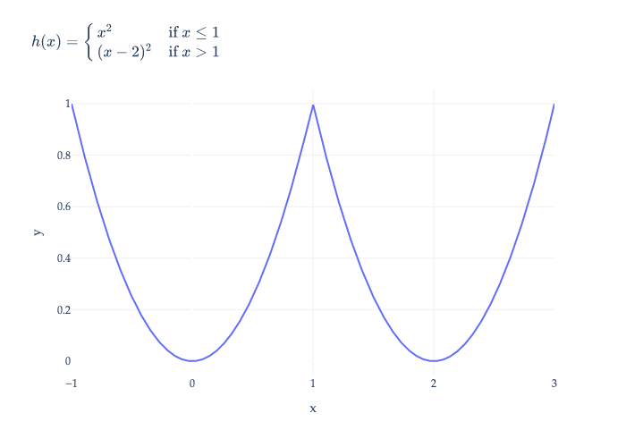



# Homework 8: Multiple Linear Regression, Gradients

**due** Sunday, June 7th, 2026 at 11:59PM Ann Arbor Time (no slip days allowed!)

<a class="btn btn-info assignment-pdf-button" href="/resources/homeworks/hw08/hw08.pdf" target="_blank">View as PDF ✏️</a>
<a class="btn btn-info assignment-pdf-button" href="/resources/homeworks/hw08/hw08-solutions.pdf" target="_blank">Solutions PDF ✅</a>

{: .yellow }

Write your solutions to the following problems either by writing them on a piece of paper or on a tablet and scanning your answers as a PDF. Note that you are not allowed to use LaTeX, Google Docs, or any other digital document creation software to type your answers. Homeworks are due to Gradescope by 11:59PM on the due date. See the [syllabus](https://eecs245.org/syllabus/#homeworks) for details on the slip day policy.

Homework will be evaluated not only on the correctness of your answers, but on your ability to present your ideas clearly and logically. You should always explain and justify your conclusions, using sound reasoning. Your goal should be to convince the reader of your assertions. If a question does not require explanation, it will be explicitly stated.

Before proceeding, make sure you're familiar with the [collaboration policy](https://eecs245.org/syllabus/#homeworks).

---

## Problems

- [Problem 1: Homework 7 Solutions Review](#problem-1-homework-7-solutions-review-10-pts)
- [Problem 2: The Sum of Errors](#problem-2-the-sum-of-errors-8-pts)
- [Problem 3: Moving Things Around](#problem-3-moving-things-around-10-pts)
- [Problem 4: Gradient Descent Fundamentals](#problem-4-gradient-descent-fundamentals-8-pts)
- [Problem 5: Product and Chain Rules](#problem-5-product-and-chain-rules-13-pts)
- [Problem 6: Convexity](#problem-6-convexity-12-pts)

---

Total Points: 10 + 8 + 10 + 8 + 13 + 12 = 61

---

## Problem 1: Homework 7 Solutions Review (10 pts)

Review the solutions to Homework 7 and pick **two problem parts** (for example, Problem 3c and Problem 5b) from Homework 7 in which your solutions have the most room for improvement, i.e., where they have unsound reasoning, could be significantly more efficient or clearer, etc. **Include a screenshot of your solution to each problem part**, and in a few sentences, explain what was deficient and how it could be fixed.

Alternatively, if you think one of your solutions is significantly better than the posted one, copy it here and explain why you think it is better. If you didn't do Homework 7, choose two problem parts from it that look challenging to you, and in a few sentences, explain the key ideas behind their solutions in your own words.

Solution

---

## Problem 2: The Sum of Errors (8 pts)

Consider a set of \\(n\\) points, \\((\vec x&#95;1, y&#95;1), (\vec x&#95;2, y&#95;2), ..., (\vec x&#95;n, y&#95;n)\\), where each \\(\vec x&#95;i\\) is a feature vector in \\(\mathbb{R}^d\\) and each \\(y&#95;i\\) is a scalar.

a)

(4 pts) To fit the model

$$
h(\vec x_i) = w_0 + w_1 x_i^{(1)} + w_2 x_i^{(2)} + ... + w_d x_i^{(d)} = \vec w \cdot \text{Aug}(\vec x_i)
$$

we minimize mean squared error,

$$
R(\vec w) = \frac{1}{n} \sum_{i=1}^n (y_i - \vec w \cdot \text{Aug}(\vec x_i))^2 = \frac{1}{n} \lVert \vec y - X \vec w \rVert^2
$$

meaning that \\(\vec w^{\ast}\\) is chosen to satisfy the normal equations. Explain why the components of the error vector,

$$
\vec e = \vec y - X \vec w^*
$$

are **guaranteed** to sum to 0.

Solution

At the optimal parameters \\(\vec w^{\ast}\\), the normal equations hold:

$$
X^T(\vec y - X\vec w^*) = 0
$$

 This means the residual vector \\(\vec e = \vec y - X\vec w^{\ast}\\) is orthogonal to every column of \\(X\\), **and any of their linear combinations**.

Because the first column of \\(X\\) consists of all 1s (from the intercept term), orthogonality with that column implies

$$
\vec 1^T \vec e = 0 \quad \Longrightarrow \quad \sum_{i=1}^n e_i = 0
$$

Therefore, the residuals (errors) always sum to zero when an intercept is included in the model.

$$
\boxed{\sum_{i=1}^n e_i = 0}
$$

b)

(4 pts) If we decide instead to fit the model

$$
h(\vec x_i) = w_1 x_i^{(1)} + w_2 x_i^{(2)} + ... + w_d x_i^{(d)} = \vec w \cdot \vec x_i
$$

which has no intercept term, are the components of the error vector \\(\vec e = \vec y - X \vec w^{\ast}\\) still guaranteed to sum to 0? If they are, explain why. If they are not, explain why not, but give at least one example dataset where they still do sum to 0.

Solution

Without an intercept term, the first column of \\(X\\) is no longer all 1s. The normal equations \\(X^T\vec e = 0\\) still ensure \\(\vec e\\) is orthogonal to each column of \\(X\\), but *not* necessarily to the all-ones vector. Therefore, there is **no guarantee** that the components of \\(\vec e\\) sum to 0.

However, they still **can** sum to 0. For instance, if \\(\vec 1\\) lies in the column space of \\(X\\), the errors will still sum to 0 --- in other words, if you can make a vector of all ones using linear combinations of the other columns of \\(X\\), \\(\vec e\\) will be orthogonal to that vector, and therefore sum to 0.

Even if \\(\vec 1\\) isn't in the column space of \\(X\\), if \\(\vec y\\) is in the column space of \\(X\\), the errors will sum to 0 because they'll all be 0 exactly. For example, if

$$
X = \begin{bmatrix} 1 & 0 \\\\ 0 & 1 \\\\ 0 & 0 \end{bmatrix}, \quad \vec y = \begin{bmatrix} 5 \\\\ 6 \\\\ 0 \end{bmatrix}
$$

then since \\(\vec y = X \begin{bmatrix} 5 \\\\ 6 \end{bmatrix}\\) exactly, the error vector \\(\vec e\\) is just \\(\begin{bmatrix} 0 \\\\ 0 \\\\ 0 \end{bmatrix}\\), and therefore sums to 0.

---

## Problem 3: Moving Things Around (10 pts)

Let \\(X\\) be an \\(n \times 4\\) design matrix whose first column is all 1s, let \\(\vec y\\) be an observation vector, and let \\(\vec w^{\ast} = (X^TX)^{-1}X^T \vec y\\).

$$
\vec w^* = \begin{bmatrix} w_0^* \\\\ w_1^* \\\\ w_2^* \\\\ w_3^* \end{bmatrix}
$$

In this problem, you'll reason about modifications to the design matrix and see how they affect the components of \\(\vec w^{\ast}\\).

a)

(3 pts) Let \\(X&#95;a\\) be the design matrix that results from **swapping the first two columns of \\(X\\)**. Let

\\(\vec v^{\ast} = (X&#95;a^TX&#95;a)^{-1}X&#95;a^T \vec y\\). Express the components of \\(\vec v^{\ast}\\) in terms of \\(w&#95;0^{\ast}, w&#95;1^{\ast}, w&#95;2^{\ast}, w&#95;3^{\ast}\\).

Solution

$$
\vec v^* = \begin{bmatrix} v_0^* \\\\ v_1^* \\\\ v_2^* \\\\ v_3^* \end{bmatrix} = \begin{bmatrix} w_1^* \\\\ w_0^* \\\\ w_2^* \\\\ w_3^* \end{bmatrix}
$$

Suppose our original model was of the form:

$$
h(x_i^{(1)}, x_i^{(2)}, x_i^{(3)}) =
w_0 + w_1 x_i^{(1)} + w_2 x_i^{(2)} + w_3 x_i^{(3)}
$$

Because the column space of the resulting design matrix has not changed, the optimal predictions themselves will not change, because the optimal predictions come from projecting \\(\vec y\\) onto the same \\(\text{colsp}(X)\\). So, the problem boils down to figuring out how to choose the coefficients in \\(\vec{v}^{\ast}\\) so that the predictions of the resulting model are the same as those in the original model. **This logic holds for the other parts of the problem, too.**

Swapping the first two columns of \\(X\\) interchanges the constant (intercept) column and the \\(x&#95;i^{(1)}\\) column. The modified model is then

$$
h(x_i^{(1)}, x_i^{(2)}, x_i^{(3)}) =
v_1 + v_0 x_i^{(1)} + v_2 x_i^{(2)} + v_3 x_i^{(3)}
$$

To produce the same predictions as before, the coefficients must switch positions accordingly:

$$
v_0^* = w_1^* \quad v_1^* = w_0^* \quad v_2^* = w_2^* \quad v_3^* = w_3^*
$$

Intuitively, when we interchange two columns of our design matrix, all that does is interchange the terms in the model, which interchanges those weights in the parameter vector.

b)

(3 pts) Let \\(X&#95;b\\) be the design matrix that results from **adding 3 to each entry in the *first* column of \\(X\\)**. Let \\(\vec v^{\ast} = (X&#95;b^TX&#95;b)^{-1}X&#95;b^T \vec y\\). Express the components of \\(\vec v^{\ast}\\) in terms of \\(w&#95;0^{\ast}, w&#95;1^{\ast}, w&#95;2^{\ast}, w&#95;3^{\ast}\\).

Solution

$$
\vec v^* = \begin{bmatrix} v_0^* \\\\ v_1^* \\\\ v_2^* \\\\ v_3^* \end{bmatrix} = \begin{bmatrix} w_0^* / 4 \\\\ w_1^* \\\\ w_2^* \\\\ w_3^* \end{bmatrix}
$$

Suppose our original model was of the form:

$$
h(x_i^{(1)}, x_i^{(2)}, x_i^{(3)}) =
w_0(1) + w_1 x_i^{(1)} + w_2 x_i^{(2)} + w_3 x_i^{(3)}
$$

Adding \\(3\\) to each entry of the first column of \\(X\\) means the intercept column (previously all ones) becomes a column of all fours. The new model is therefore

$$
h(x_i^{(1)}, x_i^{(2)}, x_i^{(3)}) =
v_0\cdot 4 + v_1 x_i^{(1)} + v_2 x_i^{(2)} + v_3 x_i^{(3)}
$$

In order to compensate for these changes to our coefficients, we need to "offset" any alterations made to our coefficients. To keep the model predictions identical to those produced by \\(\vec w^{\ast}\\), the term multiplying the constant column must remain the same:

$$
4v_0^* = w_0^*.
$$

 All other coefficients remain unchanged.

Thus,

$$
v_0^* = \frac{w_0^*}{4} \quad v_1^* = w_1^* \quad v_2^* = w_2^* \quad v_3^* = w_3^*
$$

For example, imagine fitting a line to data in \\(\mathbb{R}^2\\) and finding that the best-fitting line is \\(y = 12 + 3x\\). If we had to write this in the form \\(y = v&#95;0 \cdot 4 + v&#95;1 x\\), then the best choice for \\(v&#95;0\\) would be \\(3\\), since \\(4v&#95;0 = 12\\), and the best choice for \\(v&#95;1\\) would be \\(3\\).

c)

(4 pts) Let \\(X&#95;c\\) be the design matrix that results from **adding 3 to each entry in the *second* column of \\(X\\)**. Let \\(\vec v^{\ast} = (X&#95;c^TX&#95;c)^{-1}X&#95;c^T \vec y\\). Express the components of \\(\vec v^{\ast}\\) in terms of \\(w&#95;0^{\ast}, w&#95;1^{\ast}, w&#95;2^{\ast}, w&#95;3^{\ast}\\).

Solution

$$
\vec v^* =
\begin{bmatrix}
w_0^* - 3w_1^* \\\\[4pt]
w_1^* \\\\[4pt]
w_2^* \\\\[4pt]
w_3^*
\end{bmatrix}
$$

Suppose our original model was of the form

$$
h(x_i^{(1)}, x_i^{(2)}, x_i^{(3)}) =
w_0 + w_1 x_i^{(1)} + w_2 x_i^{(2)} + w_3 x_i^{(3)}
$$

Adding \\(3\\) to every entry in the second column means that the feature \\(x&#95;i^{(1)}\\) is replaced by \\(x&#95;i^{(1)} + 3\\). The new model becomes

$$
h(x_i^{(1)}, x_i^{(2)}, x_i^{(3)}) =
v_0 + v_1(x_i^{(1)} + 3) + v_2 x_i^{(2)} + v_3 x_i^{(3)}
$$

Expanding this gives:

$$
h(x_i^{(1)}, x_i^{(2)}, x_i^{(3)}) =
(v_0 + 3v_1) + v_1 x_i^{(1)} + v_2 x_i^{(2)} + v_3 x_i^{(3)}
$$

In order to compensate for these changes to our coefficients, we need to "offset" any alterations made to our coefficients. For the model to produce identical predictions as before, each coefficient multiplying a feature must match its original:

$$
v_1^* = w_1^* \quad v_2^* = w_2^* \quad v_3^* = w_3^*
$$

 To offset the constant \\(+3v&#95;1\\), the intercept must decrease by \\(3w&#95;1^{\ast}\\):

$$
v_0^* + 3v_1^* = w_0^*
\quad \Rightarrow \quad
v_0^* = w_0^* - 3w_1^*
$$

One way to think about this is that if we shift the feature \\(x&#95;i^{(1)}\\) by a constant value, all predictions increase by that feature's coefficient times the constant (here \\(3w&#95;1^{\ast}\\)). To preserve the same overall outputs, the intercept term must decrease by that same amount.

---

## Problem 4: Gradient Descent Fundamentals (8 pts)

Let \\(f(\vec x) = (x&#95;1 - 5)^2 + (x&#95;1^2 - x&#95;2)^2 + 1\\).

a)

(4 pts) Find \\(\nabla f(\vec x)\\), the gradient of \\(f(\vec x)\\).

Solution

Let's start by computing the partial derivatives of \\(f\\) with respect to \\(x&#95;1\\) and \\(x&#95;2\\).

$$
f(\vec x) = f\left( \begin{bmatrix} x_1 \\\\ x_2 \end{bmatrix} \right) = (x_1 - 5)^2 + (x_1^2 - x_2)^2 + 1
$$

First, let's compute \\(\frac{\partial f}{\partial x&#95;1}\\). Using the chain rule:

$$
\frac{\partial f}{\partial x_1} = 2(x_1 - 5) + 2(x_1^2 - x_2) \cdot (2x_1) = 2(x_1 - 5) + 4x_1(x_1^2 - x_2)
$$

Next, let's compute \\(\frac{\partial f}{\partial x&#95;2}\\). Only the term \\((x&#95;1^2 - x&#95;2)^2\\) depends on \\(x&#95;2\\).

$$
\frac{\partial f}{\partial x_2} = 2(x_1^2 - x_2)(-1) = -2(x_1^2 - x_2)
$$

So, the gradient is:

$$
\boxed{\nabla f(\vec x) =
\begin{bmatrix}
2(x_1 - 5) + 4x_1(x_1^2 - x_2) \\\\
-2(x_1^2 - x_2)
\end{bmatrix}}
$$

This coould be further simplified, but there's no need.

b)

(4 pts) To minimize \\(f(\vec x)\\), we'll use gradient descent. Perform one iteration of gradient descent by hand, using the initial guess \\(\vec x^{(0)} = \begin{bmatrix} 0 \\\\ 1 \end{bmatrix}\\) and learning rate \\(\alpha = \frac{1}{2}\\). What is \\(\vec x^{(1)}\\)?

Solution

The gradient descent update rule is:

$$
\vec x^{(t+1)} = \vec x^{(t)} - \alpha \nabla f(\vec x^{(t)})
$$

We've already computed \\(\nabla f(\vec x^{(0)}) = \nabla f(\begin{bmatrix} 0 \\\\ 1 \end{bmatrix}) = \begin{bmatrix} -10 \\\\ 2 \end{bmatrix}\\) from the previous part, so we can plug in everything we know:

$$
\begin{align*}
\vec x^{(1)} &= \vec x^{(0)} - \alpha \nabla f(\vec x^{(0)}) \\\\
&= \begin{bmatrix} 0 \\\\ 1 \end{bmatrix} - \frac{1}{2} \begin{bmatrix} -10 \\\\ 2 \end{bmatrix} \\\\
&= \begin{bmatrix} 0 + 5 \\\\ 1 - 1 \end{bmatrix} \\\\
&= \begin{bmatrix} 5 \\\\ 0 \end{bmatrix}
\end{align*}
$$

So,

$$
\boxed{\vec x^{(1)} =
\begin{bmatrix}
5 \\\\
0
\end{bmatrix}}
$$

This means that after one gradient descent step with \\(\alpha = \frac{1}{2}\\), the algorithm moves the guess for \\(\vec x^{\ast}\\) from \\(\begin{bmatrix} 0 \\\\ 1 \end{bmatrix}\\) to \\(\begin{bmatrix} 5 \\\\ 0 \end{bmatrix}\\).

---

## Problem 5: Product and Chain Rules (13 pts)

Our goal in this problem is to study the behavior of the function

$$
f(\vec x) = \frac{\vec x^T A \vec x}{\vec x^T \vec x}
$$

where \\(x \in \mathbb{R}^n\\) and \\(A\\) is a symmetric \\(n \times n\\) matrix (meaning \\(A = A^T\\)). This function, called the **Rayleigh quotient**, will play an important role in Chapter 5 of the course, when we eventually study the **dimensionality reduction** problem first introduced in [Chapter 1.1](https://notes.eecs245.org/introduction-to-supervised-learning/what-is-machine-learning/#dimensionality-reduction).

But first, we have to get a handle on a few gradient rules.

a)

(4 pts) As described in the [Norm and Chain Rule in Chapter 8.2](https://notes.eecs245.org/gradients/gradients-matrix-vector-operations/#example-norm-and-chain-rule), the chain rule for gradients says that if

-   \\(g: \mathbb{R}^d \to \mathbb{R}\\) is a **vector**-to-scalar function, and

-   \\(h: \mathbb{R} \to \mathbb{R}\\) is a **scalar**-to-scalar function,

then the gradient of the **vector**-to-scalar function \\(f(\vec x) = h(g(\vec x))\\) is given by

$$
\nabla f(\vec x) = \left( \frac{\text{d}h}{\text{d}x} (g(\vec x)) \right) \nabla g(\vec x)
$$

 or, perhaps more intuitively,

$$
\nabla f(\vec x) = h'(g(\vec x)) \nabla g(\vec x)
$$

Note that we need to pay close attention to the types of functions we're working with. \\(h(g(\vec x))\\) is well-defined, but \\(g(h(\vec x))\\) is not, since \\(h\\) doesn't take in vectors (it takes in scalars).

Find the gradients of each of the following functions.

1.  \\(f&#95;1(\vec x) = \log(\vec x^T A \vec x)\\), where \\(\vec x \in \mathbb{R}^n\\) and \\(A\\) is a symmetric \\(n \times n\\) matrix

2.  \\(f&#95;2(\vec x) = e^{-\sin(\vec a^T\vec x)}\\), where \\(\vec x, \vec a \in \mathbb{R}^n\\)

Here, \\(\log(x)\\) denotes the base-\\(e\\) logarithm, i.e. \\(\ln(x)\\).

<em>Hint: You can use any of the <a href="https://notes.eecs245.org/gradients/gradients-matrix-vector-operations/#the-big-three-rules">three important gradient rules from Chapter 8.2</a> without proof.</em>

Solution

**(i)** For \\(f&#95;1(\vec x) = \log(\vec x^T A \vec x)\\):

Let \\(g(\vec x) = \vec x^T A \vec x\\). Then, using the known rule for quadratic forms,

$$
\nabla g(\vec x) = 2A\vec x
$$

 since \\(A\\) is symmetric.

Since \\(\frac{\text{d}}{\text{d}x} \log(x) = \frac{1}{x}\\), the chain rule says:

$$
\nabla f_1(\vec x) = \frac{1}{\vec x^T A \vec x} \nabla g(\vec x) = \frac{1}{\vec x^T A \vec x} 2A \vec x = \boxed{ \frac{2A\vec x}{\vec x^T A \vec x}}
$$

**(ii)** For \\(f&#95;2(\vec x) = e^{-\sin(\vec a^T \vec x)}\\):

Let \\(g(\vec x) = -\sin(\vec a^T \vec x)\\) and \\(h(x) = e^x\\). Then \\(f&#95;2(\vec x) = h(g(\vec x))\\).

By the chain rule,

$$
\nabla f_2(\vec x) = \underbrace{\left(\frac{\text{d}h}{\text{d}x}(g(\vec x)) \right)}_{h'(g(\vec x))} \nabla g(\vec x)
$$

We know \\(\frac{\text{d}h}{\text{d}x} = e^x\\), so \\(\frac{\text{d}h}{\text{d}x}(g(\vec x)) = e^{g(\vec x)} = e^{-\sin(\vec a^T \vec x)}\\).

The gradient of \\(g(\vec x)\\) is

$$
\nabla g(\vec x) = -\cos(\vec a^T \vec x)\vec a
$$

So, the full application of the chain rule gives us

$$
\boxed{\nabla f_2(\vec x) = -e^{-\sin(\vec a^T \vec x)} \cos(\vec a^T \vec x)\vec a}
$$

b)

(4 pts) The product rule for gradients is a natural extension of the product rule for derivatives. If \\(f(\vec x) = g(\vec x) h(\vec x)\\), then

$$
\nabla f(\vec x) = \nabla (g(\vec x) h(\vec x)) = g(\vec x) \nabla h(\vec x) + h(\vec x) \nabla g(\vec x)
$$

Find the gradients of each of the following functions.

1.  \\(f&#95;3(\vec x) = (\vec a \cdot \vec x)(\vec b \cdot \vec x)\\), where \\(\vec x, \vec a, \vec b \in \mathbb{R}^n\\)

2.  \\(f&#95;4(\vec x) = \vec a^T \vec x \vec x^T A \vec x\\), where \\(\vec x, \vec a \in \mathbb{R}^n\\) and \\(A\\) is a symmetric \\(n \times n\\) matrix

Solution

**(i)** For \\(f&#95;3(\vec x) = (\vec a \cdot \vec x)(\vec b \cdot \vec x)\\):

Let \\(g(\vec x) = \vec a \cdot \vec x\\) and \\(h(\vec x) = \vec b \cdot \vec x\\), then \\(\nabla g(\vec x) = \vec a\\) and \\(\nabla h(\vec x) = \vec b\\).

Then, the product rule tells us

$$
\begin{align*}
\nabla f_3(\vec x) &= g(\vec x)\nabla h(\vec x) + h(\vec x)\nabla g(\vec x) \\\\
&= \boxed{(\vec a \cdot \vec x)\vec b + (\vec b \cdot \vec x)\vec a}
\end{align*}
$$

**(ii)** For \\(f&#95;4(\vec x) = \vec a^T \vec x  \vec x^T A \vec x\\):

Let \\(g(\vec x) = \vec a^T \vec x\\) and \\(h(\vec x) = \vec x^T A \vec x\\), then \\(\nabla g(\vec x) = \vec a\\) and \\(\nabla h(\vec x) = 2A\vec x\\) (since \\(A\\) is symmetric).

Then,

$$
\begin{align*}
\nabla f_4(\vec x)
&= g(\vec x)\nabla h(\vec x) + h(\vec x)\nabla g(\vec x) \\\\
&= (\vec a^T \vec x)(2A\vec x) + (\vec x^T A \vec x)\vec a \\\\
&= \boxed{2(\vec a^T \vec x)A\vec x + (\vec x^T A \vec x)\vec a}
\end{align*}
$$

c)

(5 pts) Putting together the chain rule and product rule, show that if

$$
f(\vec x) = \frac{\vec x^T A \vec x}{\vec x^T \vec x}
$$

where \\(\vec x \in \mathbb{R}^n\\) and \\(A\\) is a symmetric \\(n \times n\\) matrix, then

$$
\nabla f(\vec x) = \frac{2}{\vec x^T \vec x} \left( A \vec x - f(\vec x) \vec x \right)
$$

Solution

Let

$$
g(\vec x) = \vec x^T A \vec x \quad h(\vec x) = \frac{1}{\vec x^T \vec x}
$$

Then,

$$
f(\vec x) = g(\vec x) h(\vec x)
$$

Notice that we **intentionally** didn't introduce a quotient rule! Instead, we gave you the tools to find \\(\nabla h(\vec x)\\), which allows you to then use the product rule.

So first, since \\(\frac{\text{d}}{\text{d}x} \left(\frac{1}{x}\right) = -\frac{1}{x^2}\\), we have

$$
\nabla h(\vec x) = \nabla \left(\frac{1}{\vec x^T \vec x}\right) = -\frac{1}{(\vec x^T \vec x)^2} \nabla (\vec x^T \vec x) = -\frac{1}{(\vec x^T \vec x)^2} (2\vec x) = -\frac{2\vec x}{(\vec x^T \vec x)^2}
$$

Now, we're ready to use the product rule, with \\(g(\vec x) = \vec x^T A \vec x\\), \\(\nabla g(\vec x) = 2A\vec x\\), \\(h(\vec x) = \frac{1}{\vec x^T \vec x}\\), and \\(\nabla h(\vec x) = -\frac{2\vec x}{(\vec x^T \vec x)^2}\\).

$$
\begin{align*}
\nabla f(\vec x) &= g(\vec x)\nabla h(\vec x) + h(\vec x)\nabla g(\vec x) \\\\
&= (\vec x^T A \vec x)\left(-\frac{2\vec x}{(\vec x^T \vec x)^2}\right) + \frac{1}{\vec x^T \vec x}(2A\vec x) \\\\
&= \frac{\vec x^TA\vec x}{\vec x^T \vec x}\left(\frac{-2 \vec x}{\vec x^T \vec x} \right) + \frac{2A\vec x}{\vec x^T \vec x} \\\\
&= f(\vec x)\left(\frac{-2 \vec x}{\vec x^T \vec x} \right) + \frac{2A\vec x}{\vec x^T \vec x} \\\\
&= \boxed{\frac{2}{\vec x^T \vec x} \left( A \vec x - f(\vec x) \vec x \right)}
\end{align*}
$$

There were several ways to simplify the expression, and any correct answer will receive full credit. But, by using the fact that \\(f(\vec x) = \frac{\vec x^T A \vec x}{\vec x^T \vec x}\\), the expression simplifies rather nicely, **and we will see this specific gradient again in Chapter 10**, when studying PCA.

---

## Problem 6: Convexity (12 pts)

In [this video](https://www.loom.com/share/0b459d47827d4a2093d58a0632c9a97e), we introduce the formal definition of **convexity** for vector-to-scalar functions. Intuitively, a function \\(f: \mathbb{R}^d \to \mathbb{R}\\) is convex if its graph is a bowl-shaped surface. Formally, \\(f\\) is convex if for all \\(\vec x, \vec y \in \mathbb{R}^d\\) and all \\(t \in [0,1]\\),

$$
f((1-t)\vec x + t \vec y) \le (1-t) f(\vec x) + t f(\vec y)
$$

This is a formal way of saying that when you connect any two points on the graph of \\(f\\) with a line segment, the line segment lies on or above the graph of \\(f\\), never below.

The second derivative test for convexity is more convenient, but it doesn't apply to non-differentiable functions, e.g. \\(f(x) = |x|\\) is convex, but it isn't differentiable.

For each statement below, prove that the statement is true using the formal definition above, or give a counterexample.

a)

(4 pts) The sum of two convex functions must also be convex.

Solution

Let \\(f\\) and \\(g\\) be convex functions. We want to show that their sum \\(h(x) = f(x) + g(x)\\) is also convex.

Let's start with the definition of convexity. For any \\(x, y\\) in \\(f\\)'s domain and \\(t \in [0,1]\\), since \\(f\\) and \\(g\\) are convex, we have:

$$
f((1-t)x + ty) \leq (1-t) f(x) + t f(y)
$$

$$
g((1-t)x + ty) \leq (1-t) g(x) + t g(y)
$$

Note that the above two inequalities are individually true for any valid \\(t\\), but to combine them we can pick the same \\(t\\). Adding the two inequalities gives

$$
f((1-t)x + ty) + g((1-t)x + ty) \leq (1-t)[f(x) + g(x)] + t[f(y) + g(y)]
$$

We can recognize that the left-hand side is \\(h((1-t)x + ty)\\), and the right-hand side is \\((1-t) h(x) + t h(y)\\).

$$
h((1-t)x + ty) \leq (1-t) h(x) + t h(y)
$$

And we can conclude that \\(h(x) = f(x) + g(x)\\) satisfies the convexity definition.

$$
\boxed{\text{Therefore, the sum of convex functions is convex.}}
$$

b)

(4 pts) The difference of two convex functions must also be convex.

Solution

This statement is **not true** in general. As a counterexample, let's consider \\(f(x) = x^2\\) and \\(g(x) = 2x^2\\). Then both \\(f\\) and \\(g\\) are convex, but

$$
h(x) = f(x) - g(x) = x^2 - 2x^2 = -x^2
$$

 which is concave, not convex (since its second derivative is negative).

$$
\boxed{\text{The difference of two convex functions is not necessarily convex.}}
$$

c)

(4 pts) Suppose \\(f(x)\\) and \\(g(x)\\) are both scalar-to-scalar convex functions and that, for some scalar \\(a\\), \\(f(a) = g(a)\\). Then, \\(h(x)\\) is also convex, where

$$
h(x) = \begin{cases} f(x) & x \leq a \\\\ g(x) & x > a \end{cases}
$$

<em>Hint: The statement is false, so focus your energy on finding a counterexample.</em>

Solution

We will show that this statement is **false** by constructing convex \\(f\\) and \\(g\\) for which \\(h(x)\\) is not convex:

Let

$$
f(x) = x^2, \quad g(x) = (x - 2)^2, \quad \text{and } a = 1
$$

 Then:

$$
f(1) = 1^2 = 1 \quad g(1) = (1 - 2)^2 = 1
$$

 so \\(f(a) = g(a)\\) as required.

$$
h(x) =
\begin{cases}
x^2 & x \leq 1 \\\\
(x - 2)^2 & x > 1
\end{cases}
$$

\\(h(x)\\) is not convex: there are plenty of secant lines (line segments connecting two points on the curve) that partially lie below the curve.

$$
\boxed{\text{The function } h(x) \text{ is not necessarily convex, even if } f \text{ and } g \text{ are.}}
$$


