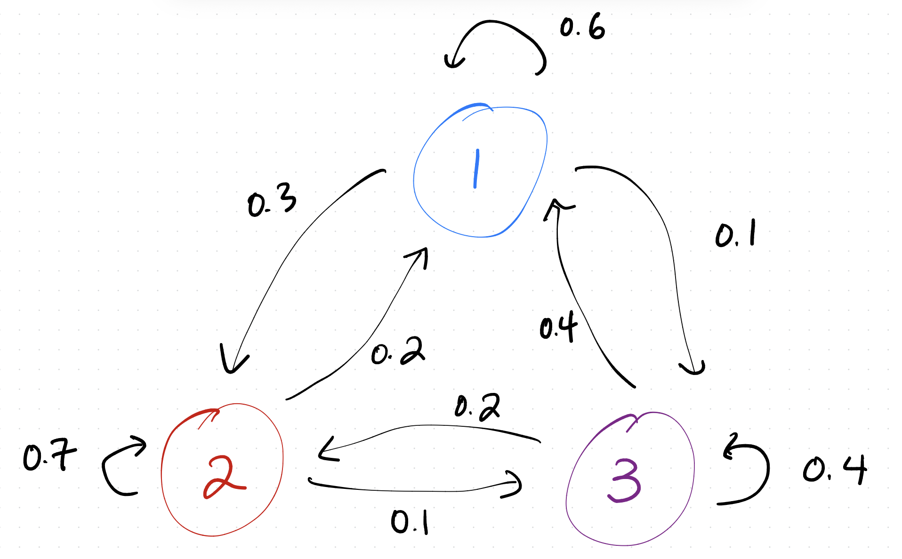
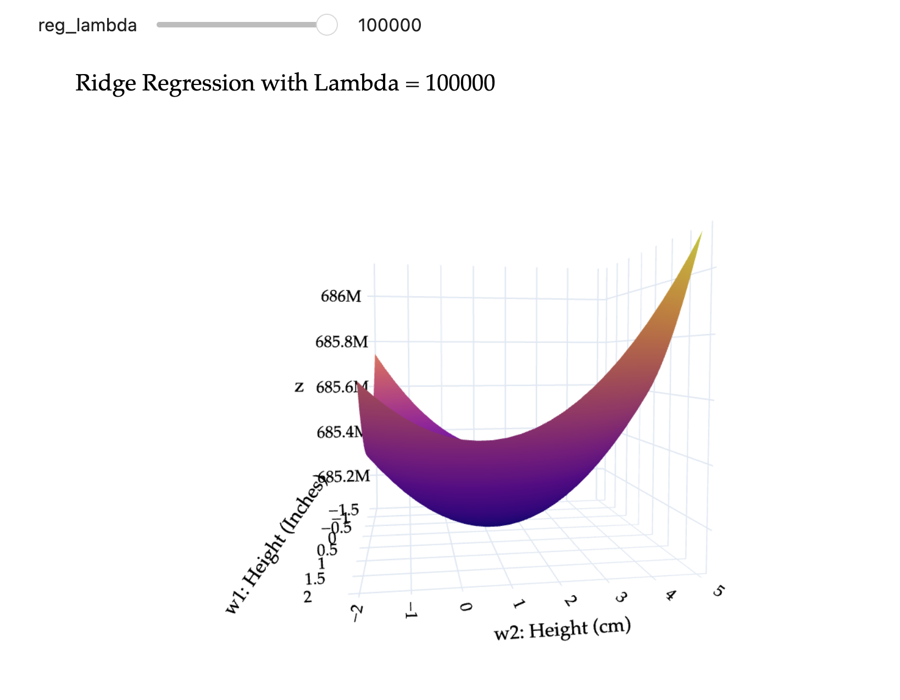
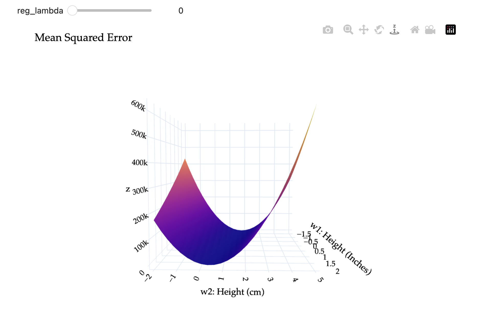



<script>
window.MathJax = {
  tex: {inlineMath: [['$', '$'], ['\\(', '\\)']]}
};
</script>
<script src="https://cdn.jsdelivr.net/npm/mathjax@3/es5/tex-mml-chtml.js" async></script>

<style>
.main-content p {
  margin-bottom: 1.15em;
}
.assignment-pdf-button {
  font-size: 0.95rem;
  padding: 0.35rem 0.65rem;
}
.assignment-actions {
  align-items: center;
  display: flex;
  flex-wrap: wrap;
  gap: 0.55rem;
  margin: 0 0 1rem;
}
.math-display,
mjx-container[jax="CHTML"][display="true"] {
  max-width: 100%;
  overflow-x: auto;
  overflow-y: hidden;
}
.math-display {
  padding-bottom: 0.2rem;
}
.math-display mjx-container[jax="CHTML"][display="true"] {
  padding-bottom: 0.2rem;
}
.answer-blank {
  border-bottom: 1px solid currentColor;
  display: inline-block;
  min-width: 8rem;
  height: 1em;
  vertical-align: baseline;
}
.assignment-parts {
  margin: 1rem 0;
}
.assignment-part {
  column-gap: 0.55rem;
  display: grid;
  grid-template-columns: 1.4rem minmax(0, 1fr);
  margin-bottom: 1.05rem;
}
.assignment-part-label {
  font-weight: 600;
  text-align: right;
}
.assignment-part-content > :first-child {
  margin-top: 0;
}
.mc-options {
  display: flex;
  flex-wrap: wrap;
  gap: 0.9rem 1.6rem;
  margin: 0.9rem 0 1.1rem;
}
.mc-option {
  display: inline-flex;
  align-items: center;
  gap: 0.35rem;
  white-space: nowrap;
}
.mc-bubble,
.mc-square {
  display: inline-block;
  flex: 0 0 auto;
  height: 0.95em;
  width: 0.95em;
  vertical-align: -0.12em;
}
.mc-bubble {
  border: 1.5px solid currentColor;
  border-radius: 50%;
}
.mc-square {
  border: 1.5px solid currentColor;
}
.mc-correct {
  background: currentColor;
}
.main-content table {
  font-size: 0.9rem;
  width: auto;
  max-width: 100%;
}
.main-content table th,
.main-content table td {
  padding: 0.35rem 0.5rem;
  white-space: nowrap;
}
</style>

# Homework 10: Eigenvalues and Eigenvectors

**due** Thursday, June 18th, 2026 at 11:59PM Ann Arbor Time

<div class="assignment-actions">
<a class="btn btn-info assignment-pdf-button" href="/resources/homeworks/hw10/hw10.pdf" target="_blank">View as PDF ✏️</a>
<a class="btn btn-info assignment-pdf-button" href="/resources/homeworks/hw10/hw10-solutions.pdf" target="_blank">Solutions PDF ✅</a>
</div>

{: .yellow }
<div markdown="1">
Write your solutions to the following problems either by writing them on a piece of paper or on a tablet and scanning your answers as a PDF. Note that you are not allowed to use LaTeX, Google Docs, or any other digital document creation software to type your answers. Homeworks are due to Gradescope by 11:59PM on the due date. See the [syllabus](https://eecs245.org/syllabus/#homeworks) for details on the slip day policy.

Homework will be evaluated not only on the correctness of your answers, but on your ability to present your ideas clearly and logically. You should always explain and justify your conclusions, using sound reasoning. Your goal should be to convince the reader of your assertions. If a question does not require explanation, it will be explicitly stated.

Before proceeding, make sure you're familiar with the [collaboration policy](https://eecs245.org/syllabus/#homeworks).
</div>

---

## Problems

- [Problem 1: Homework 9 Solutions Review](#problem-1-homework-9-solutions-review-10-pts)
- [Problem 2: Rank One Projection Matrices](#problem-2-rank-one-projection-matrices-10-pts)
- [Problem 3: Algebraic and Geometric Multiplicities](#problem-3-algebraic-and-geometric-multiplicities-20-pts)
- [Problem 4: Diagonalization](#problem-4-diagonalization-14-pts)
- [Problem 5: Adjacency Matrices](#problem-5-adjacency-matrices-16-pts)
- [Problem 6: Regularization](#problem-6-regularization-24-pts)
- [Problem 7: PageRank](#problem-7-pagerank-12-pts)

---

Total Points: 10 + 10 + 20 + 14 + 16 + 24 + 12 = 106

---

**Note**: Repeatedly, you'll be asked to find eigenvalues and eigenvectors. As usual, you're expected to show all of your work. But, you're encouraged to verify your answers by using `np.linalg.eig` in Python, as is demonstrated in [Chapter 9.1](https://notes.eecs245.org/eigenvalues-and-eigenvectors/eigenvalues-eigenvectors/#finding-eigenvalues-using-numpy). (Resist the urge to use ChatGPT\...)

---

## Problem 1: Homework 9 Solutions Review (10 pts)

Review [the solutions to Homework 9](https://eecs245.org/resources/homeworks/hw09/). Pick **two problem parts** (for example, Problem 2a and Problem 5c) from Homework 9 in which your solutions have the most room for improvement, i.e. where they have unsound reasoning, could be significantly more efficient or clearer, etc. Include a screenshot of your solution to each problem part, and in a few sentences, explain what was deficient and how it could be fixed.

Alternatively, if you think one of your solutions is significantly better than the posted one, copy it here and explain why you think it is better. If you didn't do Homework 9, choose two problem parts from it that look challenging to you, and in a few sentences, explain the key ideas behind their solutions in your own words.

<details markdown="1"><summary>Solution</summary>

All of the problems in Homework 9 are important, but in particular, make sure you reviewed the solutions to the problems you didn't attempt, since in Homework 9 you could have skipped some problems and still earned a full score.
</details>

---

## Problem 2: Rank One Projection Matrices (10 pts)

Consider the unit vector <span class="math-inline">\\(\vec u = \begin{bmatrix} 1/6 \\\\ 1/6 \\\\ 3/6 \\\\ 5/6 \end{bmatrix}\\)</span>, and the corresponding rank one projection matrix <span class="math-inline">\\(P = \vec u \vec u^T\\)</span>.

<div class="assignment-parts" markdown="1">
<div class="assignment-part" markdown="1">
<div class="assignment-part-label">a)</div>
<div class="assignment-part-content" markdown="1">
(3 pts) Show that <span class="math-inline">\\(\vec u\\)</span> is an eigenvector of <span class="math-inline">\\(P\\)</span>. What is its corresponding eigenvalue?

<details markdown="1"><summary>Solution</summary>

<div class="math-display">
$$
P \vec u = \vec u \vec u^T \vec u = \vec u (\vec u^T \vec u) = \vec u (1) = \vec u
$$
</div>

So, <span class="math-inline">\\(\vec u\\)</span> is an eigenvector of <span class="math-inline">\\(P\\)</span> with eigenvalue 1.
</details>

</div>
</div>

<div class="assignment-part" markdown="1">
<div class="assignment-part-label">b)</div>
<div class="assignment-part-content" markdown="1">
(3 pts) Show that if <span class="math-inline">\\(\vec v\\)</span> is orthogonal to <span class="math-inline">\\(\vec u\\)</span>, then <span class="math-inline">\\(\vec v\\)</span> is an eigenvector of <span class="math-inline">\\(P\\)</span>. What is its corresponding eigenvalue?

<details markdown="1"><summary>Solution</summary>

Given that <span class="math-inline">\\(\vec u \cdot \vec v = 0\\)</span>, we have

<div class="math-display">
$$
P \vec v = \vec u \vec u^T \vec v = \vec u (\vec u^T \vec v) = \vec u (0) = \vec 0 = 0 \vec v
$$
</div>

So, <span class="math-inline">\\(\vec v\\)</span> is an eigenvector of <span class="math-inline">\\(P\\)</span> with eigenvalue 0.
</details>

</div>
</div>

<div class="assignment-part" markdown="1">
<div class="assignment-part-label">c)</div>
<div class="assignment-part-content" markdown="1">
(4 pts) Find three different **linearly independent** eigenvectors of <span class="math-inline">\\(P\\)</span>, all corresponding to the eigenvalue 0.

(In the terminology of Problem 4 and Chapter 5.2, these eigenvectors form a basis of the eigenspace of <span class="math-inline">\\(P\\)</span> corresponding to eigenvalue 0.)

<details markdown="1"><summary>Solution</summary>

To find three linearly independent eigenvectors of <span class="math-inline">\\(P\\)</span> with eigenvalue 0, we can find three vectors that are orthogonal to <span class="math-inline">\\(\vec u = \begin{bmatrix} 1/6 \\\\ 1/6 \\\\ 3/6 \\\\ 5/6 \end{bmatrix}\\)</span>. The straightforward way to do this is to think of components that allow us to "cancel" out the entries in <span class="math-inline">\\(\vec u\\)</span>.

-   For example, <span class="math-inline">\\(\vec v&#95;1 = \begin{bmatrix} 1 \\\\ -1 \\\\ 0 \\\\ 0 \end{bmatrix}\\)</span> is orthogonal to <span class="math-inline">\\(\vec u\\)</span> because <span class="math-inline">\\(1 \cdot \frac{1}{6} + (-1) \cdot \frac{1}{6} + 0 \cdot \frac{3}{6} + 0 \cdot \frac{5}{6} = 0\\)</span>.

-   Another option is <span class="math-inline">\\(\vec v&#95;2 = \begin{bmatrix} 1 \\\\ 1 \\\\ 1 \\\\ -1 \end{bmatrix}\\)</span> because <span class="math-inline">\\(1 \cdot \frac{1}{6} + 1 \cdot \frac{1}{6} + (1) \cdot \frac{3}{6} + (-1) \cdot \frac{5}{6} = \frac{5}{6} - \frac{5}{6} = 0\\)</span>. This <span class="math-inline">\\(\vec v&#95;2\\)</span> also happens to be orthogonal to <span class="math-inline">\\(\vec v&#95;1\\)</span>, though that's not a requirement of what we're asked to find --- we just need all three vectors we find to be linearly independent. And indeed, <span class="math-inline">\\(\vec v&#95;2\\)</span> is not a scalar multiple of <span class="math-inline">\\(\vec v&#95;1\\)</span>.

-   A third option is <span class="math-inline">\\(\vec v&#95;3 = \begin{bmatrix} 5 \\\\ 0 \\\\ 0 \\\\ -1 \end{bmatrix}\\)</span> because <span class="math-inline">\\(5 \cdot \frac{1}{6} + 0 \cdot \frac{1}{6} + 0 \cdot \frac{3}{6} + (-1) \cdot \frac{5}{6} = \frac{5}{6} - \frac{5}{6} = 0\\)</span>.

So,

<div class="math-display">
$$
\text{nullsp}(P - 0I) = \text{span}\left\{ \begin{bmatrix} 1 \\\\ -1 \\\\ 0 \\\\ 0 \end{bmatrix}, \begin{bmatrix} 1 \\\\ 1 \\\\ 1 \\\\ -1 \end{bmatrix}, \begin{bmatrix} 5 \\\\ 0 \\\\ 0 \\\\ -1 \end{bmatrix} \right\}
$$
</div>

</details>

</div>
</div>

</div>

---

## Problem 3: Algebraic and Geometric Multiplicities (20 pts)

For each matrix below:

1.  Find its characteristic polynomial in factored form.

2.  State all eigenvalues along with their algebraic multiplicities.

3.  For each eigenvalue, find a basis for the eigenspace corresponding to that eigenvalue, and state its geometric multiplicity.

Some advice:

-   There are multiple examples of what you're asked to do in [Chapter 9.4](https://notes.eecs245.org/eigenvalues-and-eigenvectors/multiplicities-diagonalization/#algebraic-and-geometric-multiplicity).

-   Recall the trace and determinant tricks from [Chapter 9.2](https://notes.eecs245.org/eigenvalues-and-eigenvectors/characteristic-polynomial/#trace-and-determinant), and the fact that the determinant of an upper triangular matrix is the product of the diagonal entries.

-   Work efficiently: this problem is quicker than it seems.

<div class="assignment-parts" markdown="1">
<div class="assignment-part" markdown="1">
<div class="assignment-part-label">a)</div>
<div class="assignment-part-content" markdown="1">
(4 pts)
<span class="math-inline">\\(A = \begin{bmatrix} 3 &amp; 0 &amp; 0 \\\\ 0 &amp; 4 &amp; 0 \\\\ 0 &amp; 0 &amp; 4 \end{bmatrix}\\)</span>

<details markdown="1"><summary>Solution</summary>

**(i)** The characteristic polynomial of <span class="math-inline">\\(A\\)</span> is

<div class="math-display">
$$
\begin{align*}
\det(A - \lambda I) &= \begin{vmatrix} 3 - \lambda & 0 & 0 \\\\ 0 & 4 - \lambda & 0 \\\\ 0 & 0 & 4 - \lambda \end{vmatrix} = (3 - \lambda)(4 - \lambda)^2
\end{align*}
$$
</div>

**(ii)** The eigenvalues of <span class="math-inline">\\(A\\)</span> are <span class="math-inline">\\(\lambda&#95;1 = 3\\)</span> with algebraic multiplicity 1 and <span class="math-inline">\\(\lambda&#95;2 = 4\\)</span> with algebraic multiplicity 2.

**(iii)** We'll approach the task of finding eigenvector(s) for each eigenvalue the same way we did in Problem 2.

-   For <span class="math-inline">\\(\lambda&#95;1 = 3\\)</span>, <span class="math-inline">\\(\vec v&#95;1\\)</span> satisfies <span class="math-inline">\\(A \vec v&#95;1 = 3 \vec v&#95;1\\)</span>.


<div class="math-display">
$$
\begin{align*}
    \begin{bmatrix} 3 & 0 & 0 \\\\ 0 & 4 & 0 \\\\ 0 & 0 & 4 \end{bmatrix} \begin{bmatrix} a \\\\ b \\\\ c \end{bmatrix} = 3 \begin{bmatrix} a \\\\ b \\\\ c \end{bmatrix}
    \end{align*}
$$
</div>

The first component implies <span class="math-inline">\\(3a = 3a\\)</span>, or just <span class="math-inline">\\(a = a\\)</span>, which tells us nothing about about <span class="math-inline">\\(a\\)</span> (this is always true). The second component implies <span class="math-inline">\\(4b = 3b \implies b = 0\\)</span>. The third component implies <span class="math-inline">\\(4c = 3c \implies c = 0\\)</span>. So, an eigenvector <span class="math-inline">\\(\vec v&#95;1\\)</span> is <span class="math-inline">\\(\begin{bmatrix} 1 \\\\ 0 \\\\ 0 \end{bmatrix}\\)</span>. Since any scalar multiple of <span class="math-inline">\\(\begin{bmatrix} 1 \\\\ 0 \\\\ 0 \end{bmatrix}\\)</span> is also an eigenvector for eigenvalue 3, we can write the eigenspace for <span class="math-inline">\\(\lambda&#95;1 = 3\\)</span> as


<div class="math-display">
$$
\boxed{\text{nullsp}(A - 3I) = \text{span}\left\{ \begin{bmatrix} 1 \\\\ 0 \\\\ 0 \end{bmatrix} \right\}}
$$
</div>

Since the null space of <span class="math-inline">\\(A - 3I\\)</span> is spanned by a single vector, the geometric multiplicity of <span class="math-inline">\\(\lambda&#95;1 = 3\\)</span> is 1.

-   For <span class="math-inline">\\(\lambda&#95;2 = 4\\)</span>, <span class="math-inline">\\(\vec v&#95;2\\)</span> satisfies <span class="math-inline">\\(A \vec v&#95;2 = 4 \vec v&#95;2\\)</span>.


<div class="math-display">
$$
\begin{align*}
    \begin{bmatrix} 3 & 0 & 0 \\\\ 0 & 4 & 0 \\\\ 0 & 0 & 4 \end{bmatrix} \begin{bmatrix} a \\\\ b \\\\ c \end{bmatrix} = 4 \begin{bmatrix} a \\\\ b \\\\ c \end{bmatrix}
    \end{align*}
$$
</div>

The first component implies <span class="math-inline">\\(3a = 4a \implies a = 0\\)</span>. The second component implies <span class="math-inline">\\(4b = 4b \implies b = b\\)</span>, which tells us nothing about <span class="math-inline">\\(b\\)</span>, and the third component tells us <span class="math-inline">\\(c = c\\)</span>, which tells us nothing about <span class="math-inline">\\(c\\)</span>. So, as long as <span class="math-inline">\\(a = 0\\)</span>, the vector <span class="math-inline">\\(\begin{bmatrix} 0 \\\\ b \\\\ c \end{bmatrix}\\)</span> is an eigenvector for eigenvalue 4. So, the eigenspace for <span class="math-inline">\\(\lambda&#95;2 = 4\\)</span> is


<div class="math-display">
$$
\boxed{\text{nullsp}(A - 4I) = \left\{ \begin{bmatrix} 0 \\\\ b \\\\ c \end{bmatrix} | \: b, c \in \mathbb{R} \right\}} = \text{span}\left\{ \begin{bmatrix} 0 \\\\ 1 \\\\ 0 \end{bmatrix}, \begin{bmatrix} 0 \\\\ 0 \\\\ 1 \end{bmatrix} \right\}
$$
</div>

Since the null space of <span class="math-inline">\\(A - 4I\\)</span> is spanned by two vectors, the geometric multiplicity of <span class="math-inline">\\(\lambda&#95;2 = 4\\)</span> is 2.

To conclude:

<div class="math-display">
$$
\lambda_1 = 3, \text{AM}(3) = 1, \text{GM}(3) = 1, \text{nullsp}(A - 3I) = \text{span}\left\{ \begin{bmatrix} 1 \\\\ 0 \\\\ 0 \end{bmatrix} \right\}
$$
</div>


<div class="math-display">
$$
\lambda_2 = 4, \text{AM}(4) = 2, \text{GM}(4) = 2, \text{nullsp}(A - 4I) = \text{span}\left\{ \begin{bmatrix} 0 \\\\ 1 \\\\ 0 \end{bmatrix}, \begin{bmatrix} 0 \\\\ 0 \\\\ 1 \end{bmatrix} \right\}
$$
</div>

</details>

</div>
</div>

<div class="assignment-part" markdown="1">
<div class="assignment-part-label">b)</div>
<div class="assignment-part-content" markdown="1">
(4 pts)
<span class="math-inline">\\(A = \begin{bmatrix} 3 &amp; 1 \\\\ 0 &amp; 3 \end{bmatrix}\\)</span>

<details markdown="1"><summary>Solution</summary>

**(i)** The characteristic polynomial of <span class="math-inline">\\(A\\)</span> is

<div class="math-display">
$$
\begin{align*}
\det(A - \lambda I) &= \begin{vmatrix} 3 - \lambda & 1 \\\\ 0 & 3 - \lambda \end{vmatrix} = (3 - \lambda)^2
\end{align*}
$$
</div>

**(ii)** The eigenvalues of <span class="math-inline">\\(A\\)</span> are <span class="math-inline">\\(\lambda&#95;1 = 3\\)</span> with algebraic multiplicity 2.

**(iii)** We're looking for <span class="math-inline">\\(\vec v\\)</span> such that <span class="math-inline">\\(A \vec v = 3 \vec v\\)</span>.

<div class="math-display">
$$
\begin{bmatrix} 3 & 1 \\\\ 0 & 3 \end{bmatrix} \begin{bmatrix} a \\\\ b \end{bmatrix} = 3 \begin{bmatrix} a \\\\ b \end{bmatrix}
$$
</div>

The first component implies <span class="math-inline">\\(3a + b = 3a \implies b = 0\\)</span>. The second component implies <span class="math-inline">\\(0a + 3b = 3b \implies b = b\\)</span>, which tells us nothing about <span class="math-inline">\\(b\\)</span> or <span class="math-inline">\\(a\\)</span>. Together, this gives us that eigenvectors of <span class="math-inline">\\(A\\)</span> for eigenvalue 3 are of the form <span class="math-inline">\\(\begin{bmatrix} a \\\\ 0 \end{bmatrix}\\)</span>. So, the eigenspace for <span class="math-inline">\\(\lambda&#95;1 = 3\\)</span> is

<div class="math-display">
$$
\boxed{\text{nullsp}(A - 3I) = \text{span}\left\{ \begin{bmatrix} 1 \\\\ 0 \end{bmatrix} \right\}}
$$
</div>

 Since the null space of <span class="math-inline">\\(A - 3I\\)</span> is spanned by a single vector, the geometric multiplicity of <span class="math-inline">\\(\lambda&#95;1 = 3\\)</span> is 1.

To conclude:

<div class="math-display">
$$
\lambda_1 = 3, \text{AM}(3) = 2, \text{GM}(3) = 1, \text{nullsp}(A - 3I) = \text{span}\left\{ \begin{bmatrix} 1 \\\\ 0 \end{bmatrix} \right\}
$$
</div>

</details>

</div>
</div>

<div class="assignment-part" markdown="1">
<div class="assignment-part-label">c)</div>
<div class="assignment-part-content" markdown="1">
(4 pts)
<span class="math-inline">\\(A = \begin{bmatrix} 2 &amp; 0 &amp; 1 \\\\ 0 &amp; 2 &amp; 1 \\\\ 0 &amp; 0 &amp; 3 \end{bmatrix}\\)</span>

<details markdown="1"><summary>Solution</summary>

**(i)** The characteristic polynomial of <span class="math-inline">\\(A\\)</span> is

<div class="math-display">
$$
\begin{align*}
\det(A - \lambda I) &= \begin{vmatrix} 2 - \lambda & 0 & 1 \\\\ 0 & 2 - \lambda & 1 \\\\ 0 & 0 & 3 - \lambda \end{vmatrix} = (2 - \lambda)^2(3 - \lambda)
\end{align*}
$$
</div>

Without working out the formula for the determinant, we know that since <span class="math-inline">\\(A\\)</span> is upper triangular, its eigenvalues lie on its diagonal.

**(ii)** The eigenvalues of <span class="math-inline">\\(A\\)</span> are <span class="math-inline">\\(\lambda&#95;1 = 2\\)</span> with algebraic multiplicity 2 and <span class="math-inline">\\(\lambda&#95;2 = 3\\)</span> with algebraic multiplicity 1.

**(iii)** -   For <span class="math-inline">\\(\lambda&#95;1 = 2\\)</span>, we're looking for <span class="math-inline">\\(\vec v\\)</span> such that <span class="math-inline">\\(A \vec v = 2 \vec v\\)</span>. Equivalently, <span class="math-inline">\\(\vec v\\)</span> is in the null space of <span class="math-inline">\\(A - 2I\\)</span>.

<div class="math-display">
$$
A - 2I = \begin{bmatrix} 0 & 0 & 1 \\\\ 0 & 0 & 1 \\\\ 0 & 0 & 1 \end{bmatrix}
$$
</div>

 Any vector of the form <span class="math-inline">\\(\begin{bmatrix} a \\\\ b \\\\ 0 \end{bmatrix}\\)</span> is an eigenvector for eigenvalue 2. So, the eigenspace for <span class="math-inline">\\(\lambda&#95;1 = 2\\)</span> is

<div class="math-display">
$$
\boxed{\text{nullsp}(A - 2I) = \text{span}\left\{ \begin{bmatrix} 1 \\\\ 0 \\\\ 0 \end{bmatrix}, \begin{bmatrix} 0 \\\\ 1 \\\\ 0 \end{bmatrix} \right\}}
$$
</div>

 Since the null space of <span class="math-inline">\\(A - 2I\\)</span> is spanned by two vectors, the geometric multiplicity of <span class="math-inline">\\(\lambda&#95;1 = 2\\)</span> is 2.

-   For <span class="math-inline">\\(\lambda&#95;2 = 3\\)</span>, we're looking for <span class="math-inline">\\(\vec v\\)</span> such that <span class="math-inline">\\(A \vec v = 3 \vec v\\)</span>. Equivalently, <span class="math-inline">\\(\vec v\\)</span> is in the null space of <span class="math-inline">\\(A - 3I\\)</span>.

<div class="math-display">
$$
A - 3I = \begin{bmatrix} -1 & 0 & 1 \\\\ 0 & -1 & 1 \\\\ 0 & 0 & 0 \end{bmatrix}
$$
</div>

 Note that column 1 + column 2 + column 3 = <span class="math-inline">\\(\vec 0\\)</span>, so the null space of <span class="math-inline">\\(A - 3I\\)</span> is spanned by <span class="math-inline">\\(\begin{bmatrix} 1 \\\\ 1 \\\\ 1 \end{bmatrix}\\)</span>. So, the eigenspace for <span class="math-inline">\\(\lambda&#95;2 = 3\\)</span> is

<div class="math-display">
$$
\boxed{\text{nullsp}(A - 3I) = \text{span}\left\{ \begin{bmatrix} 1 \\\\ 1 \\\\ 1 \end{bmatrix} \right\}}
$$
</div>

 Since the null space of <span class="math-inline">\\(A - 3I\\)</span> is spanned by a single vector, the geometric multiplicity of <span class="math-inline">\\(\lambda&#95;2 = 3\\)</span> is 1.

To conclude:

<div class="math-display">
$$
\lambda_1 = 2, \text{AM}(2) = 2, \text{GM}(2) = 2, \text{nullsp}(A - 2I) = \text{span}\left\{ \begin{bmatrix} 1 \\\\ 0 \\\\ 0 \end{bmatrix}, \begin{bmatrix} 0 \\\\ 1 \\\\ 0 \end{bmatrix} \right\}
$$
</div>


<div class="math-display">
$$
\lambda_2 = 3, \text{AM}(3) = 1, \text{GM}(3) = 1, \text{nullsp}(A - 3I) = \text{span}\left\{ \begin{bmatrix} 1 \\\\ 1 \\\\ 1 \end{bmatrix} \right\}
$$
</div>

</details>

</div>
</div>

<div class="assignment-part" markdown="1">
<div class="assignment-part-label">d)</div>
<div class="assignment-part-content" markdown="1">
(4 pts)
<span class="math-inline">\\(A = \begin{bmatrix} 5 &amp; 0 &amp; 0 &amp; 0 \\\\ 0 &amp; 3 &amp; 1 &amp; 0 \\\\ 0 &amp; 0 &amp; 3 &amp; 0 \\\\ 0 &amp; 0 &amp; 0 &amp; 5 \end{bmatrix}\\)</span>

<details markdown="1"><summary>Solution</summary>

**(i)** Like in the previous part, <span class="math-inline">\\(A\\)</span> is upper triangular, so its eigenvalues lie on its diagonal. So, the characteristic polynomial of <span class="math-inline">\\(A\\)</span> is

<div class="math-display">
$$
\text{det}(A - \lambda I) = (5 - \lambda)^2(3 - \lambda)^2
$$
</div>

**(ii)** The eigenvalues of <span class="math-inline">\\(A\\)</span> are <span class="math-inline">\\(\lambda&#95;1 = 5\\)</span> with algebraic multiplicity 2 and <span class="math-inline">\\(\lambda&#95;2 = 3\\)</span> with algebraic multiplicity 2.

**(iii)** Instead of walking through the same tedious process as in the previous parts, let's use some nice patterns in <span class="math-inline">\\(A\\)</span> to cut down our work.

-   For <span class="math-inline">\\(\lambda&#95;1 = 5\\)</span>, notice that the first column of <span class="math-inline">\\(A\\)</span> is just <span class="math-inline">\\(\begin{bmatrix} 5 \\\\ 0 \\\\ 0 \\\\ 0 \end{bmatrix}\\)</span>, meaning <span class="math-inline">\\(A \begin{bmatrix} 1 \\\\ 0 \\\\ 0 \\\\ 0 \end{bmatrix} = 5 \begin{bmatrix} 1 \\\\ 0 \\\\ 0 \\\\ 0 \end{bmatrix}\\)</span>. Also, notice that the last column of <span class="math-inline">\\(A\\)</span> is just <span class="math-inline">\\(\begin{bmatrix} 0 \\\\ 0 \\\\ 0 \\\\ 5 \end{bmatrix}\\)</span>, meaning <span class="math-inline">\\(A \begin{bmatrix} 0 \\\\ 0 \\\\ 0 \\\\ 1 \end{bmatrix} = 5 \begin{bmatrix} 0 \\\\ 0 \\\\ 0 \\\\ 1 \end{bmatrix}\\)</span>. So, the eigenspace for <span class="math-inline">\\(\lambda&#95;1 = 5\\)</span> is

<div class="math-display">
$$
\boxed{\text{nullsp}(A - 5I) = \text{span}\left\{ \begin{bmatrix} 1 \\\\ 0 \\\\ 0 \\\\ 0 \end{bmatrix}, \begin{bmatrix} 0 \\\\ 0 \\\\ 0 \\\\ 1 \end{bmatrix} \right\}}
$$
</div>

 Since the null space of <span class="math-inline">\\(A - 5I\\)</span> is spanned by two vectors, the geometric multiplicity of <span class="math-inline">\\(\lambda&#95;1 = 5\\)</span> is 2.

-   For <span class="math-inline">\\(\lambda&#95;2 = 3\\)</span>, notice the middle <span class="math-inline">\\(2 \times 2\\)</span> "block" of <span class="math-inline">\\(\begin{bmatrix} 3 &amp; 1 \\\\ 0 &amp; 3 \end{bmatrix}\\)</span>, which is the same as the matrix studied in part **b)**. That matrix had an eigenvalue of <span class="math-inline">\\(3\\)</span> with algebraic multiplicity 2, but a 1-dimensional eigenspace spanned by <span class="math-inline">\\(\begin{bmatrix} 1 \\\\ 0 \end{bmatrix}\\)</span>. If we pad that vector with zeros at the start and end, we get an eigenvector for our new <span class="math-inline">\\(A\\)</span> with eigenvalue 3 as well. In other words, the eigenspace for <span class="math-inline">\\(\lambda&#95;2 = 3\\)</span> is

<div class="math-display">
$$
\boxed{\text{nullsp}(A - 3I) = \text{span}\left\{ \begin{bmatrix} 0 \\\\ 1 \\\\ 0 \\\\ 0 \end{bmatrix} \right\}}
$$
</div>

 Since the null space of <span class="math-inline">\\(A - 3I\\)</span> is spanned by two vectors, the geometric multiplicity of <span class="math-inline">\\(\lambda&#95;2 = 3\\)</span> is 2. If this logic doesn't make sense, you can always manually compute <span class="math-inline">\\(A - 3I = \begin{bmatrix} 2 &amp; 0 &amp; 0 &amp; 0 \\\\ 0 &amp; 0 &amp; 1 &amp; 0 \\\\ 0 &amp; 0 &amp; 0 &amp; 0 \\\\ 0 &amp; 0 &amp; 0 &amp; 2 \end{bmatrix}\\)</span> and find its null space; you'll find that its one dimensional, and is spanned by <span class="math-inline">\\(\begin{bmatrix} 0 \\\\ 1 \\\\ 0 \\\\ 0 \end{bmatrix}\\)</span>.

To conclude:

<div class="math-display">
$$
\lambda_1 = 5, \text{AM}(5) = 2, \text{GM}(5) = 2, \text{nullsp}(A - 5I) = \text{span}\left\{ \begin{bmatrix} 1 \\\\ 0 \\\\ 0 \\\\ 0 \end{bmatrix}, \begin{bmatrix} 0 \\\\ 0 \\\\ 0 \\\\ 1 \end{bmatrix} \right\}
$$
</div>


<div class="math-display">
$$
\lambda_2 = 3, \text{AM}(3) = 2, \text{GM}(3) = 1, \text{nullsp}(A - 3I) = \text{span}\left\{ \begin{bmatrix} 0 \\\\ 1 \\\\ 0 \\\\ 0 \end{bmatrix} \right\}
$$
</div>

</details>

</div>
</div>

<div class="assignment-part" markdown="1">
<div class="assignment-part-label">e)</div>
<div class="assignment-part-content" markdown="1">
(4 pts)
<span class="math-inline">\\(A = \begin{bmatrix} 1 &amp; 0 &amp; 0 &amp; 0 &amp; 0 \\\\ 0 &amp; 1 &amp; 0 &amp; 0 &amp; 0 \\\\ 0 &amp; 0 &amp; 1 &amp; 0 &amp; 0 \\\\ 0 &amp; 0 &amp; 0 &amp; 1 &amp; 0 \\\\ 0 &amp; 0 &amp; 0 &amp; 0 &amp; 1 \end{bmatrix}\\)</span>

<details markdown="1"><summary>Solution</summary>

<span class="math-inline">\\(A\\)</span> is the <span class="math-inline">\\(5 \times 5\\)</span> identity matrix. Its characteristic polynomial is

<div class="math-display">
$$
\text{det}(A - \lambda I) = (1 - \lambda)^5
$$
</div>

 and it has a single distinct eigenvalue, <span class="math-inline">\\(\lambda = 1\\)</span> with algebraic multiplicity 5.

**All** vectors in <span class="math-inline">\\(\mathbb{R}^5\\)</span> are eigenvectors of <span class="math-inline">\\(A\\)</span> for eigenvalue 1. So, the eigenspace for <span class="math-inline">\\(\lambda&#95;1 = 1\\)</span> is all of <span class="math-inline">\\(\mathbb{R}^5\\)</span>, which is the span of any 5 linearly independent vectors in <span class="math-inline">\\(\mathbb{R}^5\\)</span>, and the geometric multiplicity of <span class="math-inline">\\(\lambda&#95;1 = 1\\)</span> is 5.

<div class="math-display">
$$
\text{nullsp}(A - I) = \text{span}\left\{ \begin{bmatrix} 1 \\\\ 0 \\\\ 0 \\\\ 0 \\\\ 0 \end{bmatrix}, \begin{bmatrix} 0 \\\\ 1 \\\\ 0 \\\\ 0 \\\\ 0 \end{bmatrix}, \begin{bmatrix} 0 \\\\ 0 \\\\ 1 \\\\ 0 \\\\ 0 \end{bmatrix}, \begin{bmatrix} 0 \\\\ 0 \\\\ 0 \\\\ 1 \\\\ 0 \end{bmatrix}, \begin{bmatrix} 0 \\\\ 0 \\\\ 0 \\\\ 0 \\\\ 1 \end{bmatrix} \right\}
$$
</div>

</details>

</div>
</div>

</div>

---

## Problem 4: Diagonalization (14 pts)

Before proceeding, it's wise to read [Chapter 9.4](https://notes.eecs245.org/eigenvalues-and-eigenvectors/multiplicities-diagonalization/).

<div class="assignment-parts" markdown="1">
<div class="assignment-part" markdown="1">
<div class="assignment-part-label">a)</div>
<div class="assignment-part-content" markdown="1">
(4 pts) In each statement, fill in the blanks and provide a brief justification. Each answer is more than just one word or number.

1.  <span class="math-inline">\\(A\\)</span> is diagonalizable if and only if it has \_\_\_\_ eigenvectors.

2.  <span class="math-inline">\\(A\\)</span> is diagonalizable if and only if the geometric multiplicity of each eigenvalue is \_\_\_\_.

<details markdown="1"><summary>Solution</summary>

**(i)** <span class="math-inline">\\(A\\)</span> is diagonalizable if and only if it has <span class="math-inline">\\(\boxed{\textbf{\\)</span>n<span class="math-inline">\\( linearly independent}}\\)</span> eigenvectors.

If <span class="math-inline">\\(A\\)</span> has <span class="math-inline">\\(n\\)</span> linearly independent eigenvectors, then these eigenvectors can be placed in <span class="math-inline">\\(V\\)</span>, and so <span class="math-inline">\\(A = V \Lambda V^{-1}\\)</span> is a valid diagonalization (where <span class="math-inline">\\(\Lambda\\)</span> is a diagonal matrix with the eigenvalues of <span class="math-inline">\\(A\\)</span> on the diagonal). If <span class="math-inline">\\(A\\)</span> does not have <span class="math-inline">\\(n\\)</span> linearly independent eigenvectors, then <span class="math-inline">\\(V\\)</span> cannot be invertible, and so <span class="math-inline">\\(A = V \Lambda V^{-1}\\)</span> is not a valid diagonalization.

**(ii)** <span class="math-inline">\\(A\\)</span> is diagonalizable if and only if the geometric multiplicity of each eigenvalue is <span class="math-inline">\\(\boxed{\textbf{equal to the algebraic multiplicity of that eigenvalue}}\\)</span>.

If the geometric multiplicity of each eigenvalue is equal to its algebraic multiplicity, then in total, <span class="math-inline">\\(A\\)</span> has <span class="math-inline">\\(n\\)</span> linearly independent eigenvectors. The sum of the algebraic multiplicities of all eigenvalues is <span class="math-inline">\\(n\\)</span>, and if the geometric multiplicity of each eigenvalue is equal to its algebraic multiplicity, then the sum of the geometric multiplicities of all eigenvalues is also <span class="math-inline">\\(n\\)</span>, meaning the sum of the dimensions of each eigenspace is <span class="math-inline">\\(n\\)</span>. But the eigenvectors for different eigenvalues are linearly independent, so this means we'd have <span class="math-inline">\\(n\\)</span> linearly independent eigenvectors, meaning <span class="math-inline">\\(A\\)</span> is diagonalizable.
</details>

</div>
</div>

<div class="assignment-part" markdown="1">
<div class="assignment-part-label">b)</div>
<div class="assignment-part-content" markdown="1">
(10 pts) For each matrix <span class="math-inline">\\(A\\)</span> in **Problem 3**:

-   **if** it is diagonalizable, find matrices <span class="math-inline">\\(V\\)</span> and <span class="math-inline">\\(\Lambda\\)</span> such that <span class="math-inline">\\(A = V \Lambda V^{-1}\\)</span>. (As we saw in [Chapter 9.4](https://notes.eecs245.org/eigenvalues-and-eigenvectors/multiplicities-diagonalization/), this matrix is constructed by placing the eigenvectors of <span class="math-inline">\\(A\\)</span> as the columns of <span class="math-inline">\\(V\\)</span> and the eigenvalues of <span class="math-inline">\\(A\\)</span> as the diagonal entries of <span class="math-inline">\\(\Lambda\\)</span>. **You should have already done most of the work for this**; this problem is just a matter of organizing your work.)

-   **if not**, explain why it is not diagonalizable.

<details markdown="1"><summary>Solution</summary>

**(i)** <span class="math-inline">\\(A = \begin{bmatrix} 3 &amp; 4 &amp; 0 \\\\ 0 &amp; 4 &amp; 0 \\\\ 0 &amp; 0 &amp; 4 \end{bmatrix}\\)</span> is diagonalizable, since it has three linearly independent eigenvectors.

<div class="math-display">
$$
V = \begin{bmatrix} 1 & 0 & 0 \\\\ 0 & 1 & 0 \\\\ 0 & 0 & 1 \end{bmatrix}, \quad \Lambda = \begin{bmatrix} 3 & 0 & 0 \\\\ 0 & 4 & 0 \\\\ 0 & 0 & 4 \end{bmatrix}
$$
</div>

 Matrices that are already diagonal are always diagonalizable; let <span class="math-inline">\\(V = I\\)</span>.

**(ii)** <span class="math-inline">\\(A = \begin{bmatrix} 3 &amp; 1 \\\\ 0 &amp; 3 \end{bmatrix}\\)</span> **is not** diagonalizable, since it has only one linearly independent eigenvector. Equivalently, <span class="math-inline">\\(\lambda = 3\\)</span> has algebraic multiplicity 2 but geometric multiplicity of only 1.

**(iii)** <span class="math-inline">\\(A = \begin{bmatrix} 2 &amp; 0 &amp; 1 \\\\ 0 &amp; 2 &amp; 1 \\\\ 0 &amp; 0 &amp; 3 \end{bmatrix}\\)</span> is diagonalizable, since it has three linearly independent eigenvectors.

<div class="math-display">
$$
V = \begin{bmatrix} 1 & 0 & 1 \\\\ 0 & 1 & 1 \\\\ 0 & 0 & 1 \end{bmatrix}, \quad \Lambda = \begin{bmatrix} 2 & 0 & 0 \\\\ 0 & 2 & 0 \\\\ 0 & 0 & 3 \end{bmatrix}
$$
</div>

**(iv)** <span class="math-inline">\\(A = \begin{bmatrix} 5 &amp; 0 &amp; 0 &amp; 0 \\\\ 0 &amp; 3 &amp; 1 &amp; 0 \\\\ 0 &amp; 0 &amp; 3 &amp; 0 \\\\ 0 &amp; 0 &amp; 0 &amp; 5 \end{bmatrix}\\)</span> **is not** diagonalizable, since it only has three linearly independent eigenvectors. <span class="math-inline">\\(\lambda&#95;2 = 3\\)</span> has algebraic multiplicity 2 but geometric multiplicity of only 1.

**(v)** <span class="math-inline">\\(A = \begin{bmatrix} 1 &amp; 0 &amp; 0 &amp; 0 &amp; 0 \\\\ 0 &amp; 1 &amp; 0 &amp; 0 &amp; 0 \\\\ 0 &amp; 0 &amp; 1 &amp; 0 &amp; 0 \\\\ 0 &amp; 0 &amp; 0 &amp; 1 &amp; 0 \\\\ 0 &amp; 0 &amp; 0 &amp; 0 &amp; 1 \end{bmatrix} = I\\)</span> is diagonalizable, since it has five linearly independent eigenvectors, which are the columns of <span class="math-inline">\\(I\\)</span> itself.

<div class="math-display">
$$
V = \Lambda = I
$$
</div>

</details>

</div>
</div>

</div>

---

## Problem 5: Adjacency Matrices (16 pts)

Consider the matrix

<div class="math-display">
$$
A = \begin{bmatrix} 0.6 & 0.2 & 0.4 \\\\ 0.3 & 0.7 & 0.2 \\\\ 0.1 & 0.1 & 0.4 \end{bmatrix}
$$
</div>

 <span class="math-inline">\\(A\\)</span> represents the adjacency matrix of a Markov chain with three states; see [Chapter 9.3](https://notes.eecs245.org/eigenvalues-and-eigenvectors/markov-chains-adjacency-matrices/) for details.

<div class="assignment-parts" markdown="1">
<div class="assignment-part" markdown="1">
<div class="assignment-part-label">a)</div>
<div class="assignment-part-content" markdown="1">
(3 pts) Draw the corresponding state diagram for <span class="math-inline">\\(A\\)</span>. Label the states 1, 2, and 3.

<details markdown="1"><summary>Solution</summary>

<div style="text-align: center;">

</div>
</details>

</div>
</div>

<div class="assignment-part" markdown="1">
<div class="assignment-part-label">b)</div>
<div class="assignment-part-content" markdown="1">
(4 pts) Diagonalize <span class="math-inline">\\(A\\)</span> by finding matrices <span class="math-inline">\\(V\\)</span> and <span class="math-inline">\\(\Lambda\\)</span> such that <span class="math-inline">\\(A = V \Lambda V^{-1}\\)</span>. Do this by hand, but then include a screenshot of `numpy` code that verifies that you found the correct <span class="math-inline">\\(V\\)</span> and <span class="math-inline">\\(\Lambda\\)</span>.

<details markdown="1"><summary>Solution</summary>

Big picture, <span class="math-inline">\\(A\\)</span> has three eigenvalues, each with algebraic (and geometric) multiplicity 1. We need to find each eigenvalue, and one eigenvector for each eigenvalue, and then store our results in <span class="math-inline">\\(\Lambda\\)</span> and <span class="math-inline">\\(V\\)</span>, respectively.

First, we need to find <span class="math-inline">\\(A\\)</span>'s eigenvalues. We *could* do this by finding <span class="math-inline">\\(A\\)</span>'s characteristic polynomial, let's demonstrate another line of reasoning. Suppose <span class="math-inline">\\(A\\)</span>'s eigenvalues are <span class="math-inline">\\(\lambda&#95;1, \lambda&#95;2, \lambda&#95;3\\)</span>. Then,

-   Since <span class="math-inline">\\(A\\)</span> is an adjacency matrix (meaning that its columns sum to 1 and its entries are non-negative), its largest eigenvalue is <span class="math-inline">\\(\lambda&#95;1 = 1\\)</span>.

-   Together, its three eigenvalues must add to the trace, which is <span class="math-inline">\\(0.6 + 0.7 + 0.4 = 1.7\\)</span>. So, <span class="math-inline">\\(\lambda&#95;2 + \lambda&#95;3 = 1.7 - 1 = 0.7\\)</span>.

-   Together, its three eigenvalues must multiply to the determinant, which is


<div class="math-display">
$$
\begin{align*}
    \det(A) &= 0.6 (0.7 \cdot 0.4 - 0.2 \cdot 0.1) - 0.2 (0.3 \cdot 0.4 - 0.2 \cdot 0.1) + 0.4(0.3 \cdot 0.1 - 0.7 \cdot 0.1) \\\\
    &= 0.6 \cdot 0.26 - 0.2 \cdot 0.1 + 0.4 \cdot (-0.04) \\\\
    &= 0.2 \cdot (3 \cdot 0.26 - 0.1 - 2 \cdot 0.04) \\\\
    &= 0.2 \cdot (0.78 - 0.1 - 0.08) \\\\
    &= 0.2 \cdot 0.6 \\\\
    &= 0.12
    \end{align*}
$$
</div>

   So, <span class="math-inline">\\(\lambda&#95;2 \lambda&#95;3 = 0.12\\)</span>.

-   A quick guess-and-check verifies that <span class="math-inline">\\(\lambda&#95;2 = 0.4\\)</span> and <span class="math-inline">\\(\lambda&#95;3 = 0.3\\)</span> satisfy both conditions; <span class="math-inline">\\(\lambda&#95;2 + \lambda&#95;3 = 0.4 + 0.3 = 0.7\\)</span> and <span class="math-inline">\\(\lambda&#95;2 \lambda&#95;3 = 0.4 \cdot 0.3 = 0.12\\)</span>.

-   So, <span class="math-inline">\\(A\\)</span>'s eigenvalues are <span class="math-inline">\\(\boxed{\lambda&#95;1 = 1, \lambda&#95;2 = 0.4, \lambda&#95;3 = 0.3}\\)</span>.

(This may not actually have been any less work than finding <span class="math-inline">\\(A\\)</span>'s characteristic polynomial since computing the determinant required a bunch of decimal arithmetic, but still, it's a technique worth knowing.)

Now, for the eigenvectors.

-   For <span class="math-inline">\\(\lambda&#95;1 = 1\\)</span>, we're looking for <span class="math-inline">\\(A \vec v&#95;1 = \vec v&#95;1\\)</span>.


<div class="math-display">
$$
\begin{align*}
    \begin{bmatrix} 0.6 & 0.2 & 0.4 \\\\ 0.3 & 0.7 & 0.2 \\\\ 0.1 & 0.1 & 0.4 \end{bmatrix} \begin{bmatrix} a \\\\ b \\\\ c \end{bmatrix} &= \begin{bmatrix} a \\\\ b \\\\ c \end{bmatrix} \\\\
    0.6a + 0.2b + 0.4c &= a \implies 0.4a - 0.2b - 0.4c = 0 \\\\
    0.3a + 0.7b + 0.2c &= b \implies 0.3a - 0.3b + 0.2c = 0 \\\\
    0.1a + 0.1b + 0.4c &= c \implies 0.1a + 0.1b - 0.6c = 0
    \end{align*}
$$
</div>

   Note that subtracting the first and second equations gives the third equation; as we'd expect, there are infinitely many solutions to this system, and one of these three equations is redundant. Let's arbitrarily choose <span class="math-inline">\\(c = 1\\)</span> and solve for the corresponding <span class="math-inline">\\(a\\)</span> and <span class="math-inline">\\(b\\)</span> in equations 1 and 2.

   In the first equation,

<div class="math-display">
$$
0.4a - 0.2b - 0.4 = 0 \implies 4a - 2b - 4 = 0 \implies a = \frac{2b + 4}{4} = \frac{b + 2}{2}
$$
</div>

 Plugging this into the second equation gives

<div class="math-display">
$$
0.3\left(\frac{b+2}{2}\right) - 0.3b + 0.2 = 0 \implies 15(b+2) - 30b + 20 = 0 \implies b = \frac{10}{3}
$$
</div>

   If <span class="math-inline">\\(b = \frac{10}{3}\\)</span>, then <span class="math-inline">\\(a = \frac{10/3 + 2}{2} = \frac{8}{3}\\)</span>. So, an eigenvector <span class="math-inline">\\(\vec v&#95;1\\)</span> is <span class="math-inline">\\(\begin{bmatrix} 8/3 \\\\ 10/3 \\\\ 1 \end{bmatrix}\\)</span>, or equivalently <span class="math-inline">\\(\boxed{\begin{bmatrix} 8 \\\\ 10 \\\\ 3 \end{bmatrix}}\\)</span>. If we'd like this to be a probability vector, we can divide by the sum of the components to get <span class="math-inline">\\(\begin{bmatrix} 8/21 \\\\ 10/21 \\\\ 3/21 \end{bmatrix}\\)</span>, but this is not necessary yet.

-   For <span class="math-inline">\\(\lambda&#95;2 = 0.4\\)</span>, let's try another approach: we're looking for <span class="math-inline">\\(\vec v\\)</span> in the null space of <span class="math-inline">\\(A - 0.4 I\\)</span>.


<div class="math-display">
$$
A - 0.4I = \begin{bmatrix} 0.2 & 0.2 & 0.4 \\\\ 0.3 & 0.3 & 0.2 \\\\ 0.1 & 0.1 & 0.0 \end{bmatrix}
$$
</div>

   Note that the first two columns of <span class="math-inline">\\(A - 0.4I\\)</span> are the same, so <span class="math-inline">\\((A - 0.4I) \begin{bmatrix} 1 \\\\ -1 \\\\ 0 \end{bmatrix} = \vec 0\\)</span>. So, that's one eigenvector: <span class="math-inline">\\(\boxed{\begin{bmatrix} 1 \\\\ -1 \\\\ 0 \end{bmatrix}}\\)</span>.

-   For <span class="math-inline">\\(\lambda&#95;3 = 0.3\\)</span>, we're looking for <span class="math-inline">\\(\vec v\\)</span> in the null space of <span class="math-inline">\\(A - 0.3 I\\)</span>.


<div class="math-display">
$$
A - 0.3I = \begin{bmatrix} 0.3 & 0.2 & 0.4 \\\\ 0.3 & 0.4 & 0.2 \\\\ 0.1 & 0.1 & 0.1 \end{bmatrix}
$$
</div>

   Note that the first column is the average of the second and third columns, meaning <span class="math-inline">\\(2 \cdot (\text{column 1}) - (\text{column 2}) - (\text{column 3}) = \vec 0\\)</span>. This tells us that <span class="math-inline">\\(\boxed{\begin{bmatrix} 2 \\\\ -1 \\\\ -1 \end{bmatrix}}\\)</span> is an eigenvector for <span class="math-inline">\\(\lambda&#95;3 = 0.3\\)</span>.

Now we have all of the eigenvalues and eigenvectors we need to construct <span class="math-inline">\\(\Lambda\\)</span> and <span class="math-inline">\\(V\\)</span>.

<div class="math-display">
$$
\Lambda = \begin{bmatrix} 1 & 0 & 0 \\\\ 0 & 0.4 & 0 \\\\ 0 & 0 & 0.3 \end{bmatrix}, \quad V = \begin{bmatrix} 8 & 1 & 2 \\\\ 10 & -1 & -1 \\\\ 3 & 0 & -1 \end{bmatrix}
$$
</div>

To verify that we found the correct <span class="math-inline">\\(V\\)</span> and <span class="math-inline">\\(\Lambda\\)</span>, we can multiply <span class="math-inline">\\(V \Lambda V^{-1}\\)</span> and see if we get <span class="math-inline">\\(A\\)</span>. We'll use `numpy` to do this.

```python
>>> V = np.array([[8, 1, 2], [10, -1, -1], [3, 0, -1]])
>>> Lambda = np.diag([1, 0.4, 0.3])
>>> V @ Lambda @ np.linalg.inv(V)
array([[0.6, 0.2, 0.4],
       [0.3, 0.7, 0.2],
       [0.1, 0.1, 0.4]])
```
As expected, we get <span class="math-inline">\\(A\\)</span>.
</details>

</div>
</div>

<div class="assignment-part" markdown="1">
<div class="assignment-part-label">c)</div>
<div class="assignment-part-content" markdown="1">
(3 pts) Compute <span class="math-inline">\\(A^{10}\\)</span> using the diagonalization you found in part **b)**. <em>Hint: You should <strong>not</strong> have to multiply ten matrices by hand: only three. State what the three matrices are, and then you can use `numpy` to actually multiply them. Include a screenshot of any code you write and its output.</em>

<details markdown="1"><summary>Solution</summary>

Since <span class="math-inline">\\(A = V \Lambda V^{-1}\\)</span>,

<div class="math-display">
$$
A^{10} = V \Lambda^{10} V^{-1} = V \begin{bmatrix} 1 & 0 & 0 \\\\ 0 & 0.4^{10} & 0 \\\\ 0 & 0 & 0.3^{10} \end{bmatrix} V^{-1}
$$
</div>

where <span class="math-inline">\\(V = \begin{bmatrix} 8 &amp; 1 &amp; 2 \\\\ 10 &amp; -1 &amp; -1 \\\\ 3 &amp; 0 &amp; -1 \end{bmatrix}\\)</span> is the matrix from part **b)**. Again, we can use `numpy` to compute this product.

```python
>>> V = np.array([[8, 1, 2], [10, -1, -1], [3, 0, -1]])
>>> Lambda = np.diag([1, 0.4, 0.3])
>>> V @ (Lambda ** 10) @ np.linalg.inv(V)
array([[0.38098902, 0.38088416, 0.38108207],
       [0.47615468, 0.47625954, 0.47605573],
       [0.1428563 , 0.1428563 , 0.1428622 ]])
```
Notice that the columns of the resulting matrix are nearly the same. Keep this in mind in the following parts.
</details>

</div>
</div>

<div class="assignment-part" markdown="1">
<div class="assignment-part-label">d)</div>
<div class="assignment-part-content" markdown="1">
(3 pts) Let <span class="math-inline">\\(\vec x&#95;0 = \begin{bmatrix} 0.6 \\\\ 0.3 \\\\ 0.1 \end{bmatrix}\\)</span> be an initial state vector. Using `numpy`, compute <span class="math-inline">\\(A^{10} \vec x&#95;0\\)</span>. Include a screenshot of any code you write and its output.

<details markdown="1"><summary>Solution</summary>

Using `numpy` (and our previous computation of <span class="math-inline">\\(A^{10}\\)</span>), we find that <span class="math-inline">\\(\vec x&#95;{10} = A^{10} \vec x&#95;0 = \boxed{\begin{bmatrix} 0.38096687 \\\\ 0.47617624 \\\\ 0.14285689 \end{bmatrix}}\\)</span>.

```python
>>> V @ (Lambda ** 10) @ np.linalg.inv(V) @ np.array([[0.6], [0.3], [0.1]])
array([[0.38096687],
       [0.47617624],
       [0.14285689]])
```
</details>

</div>
</div>

<div class="assignment-part" markdown="1">
<div class="assignment-part-label">e)</div>
<div class="assignment-part-content" markdown="1">
(3 pts) As <span class="math-inline">\\(k \to \infty\\)</span>, what does <span class="math-inline">\\(A^k \vec x&#95;0\\)</span> converge to, and why? Make sure your answer references the diagonalization you found in part **b)**.

<details markdown="1"><summary>Solution</summary>

As <span class="math-inline">\\(k \to \infty\\)</span>, <span class="math-inline">\\(A^k \vec x&#95;0\\)</span> converges **to the eigenvector corresponding to the eigenvalue 1**. In general, <span class="math-inline">\\(A^k \vec x&#95;0\\)</span> converges to an eigenvector of <span class="math-inline">\\(A\\)</span> corresponding to its dominant eigenvalue (i.e. the eigenvalue with the largest absolute value), which is 1 here.

<div class="math-display">
$$
\Lambda^k = \begin{bmatrix} 1 & 0 & 0 \\\\ 0 & 0.4^k & 0 \\\\ 0 & 0 & 0.3^k \end{bmatrix} \to \begin{bmatrix} 1 & 0 & 0 \\\\ 0 & 0 & 0 \\\\ 0 & 0 & 0 \end{bmatrix}
$$
</div>

This happens because in <span class="math-inline">\\(A^k = V \Lambda^k V^{-1}\\)</span>, as <span class="math-inline">\\(k \to \infty\\)</span>, <span class="math-inline">\\(\Lambda^k\\)</span> converges to a diagonal matrix with 1 in the top-left corner and 0s everywhere else, meaning the only contribution to <span class="math-inline">\\(A^k \vec x&#95;0\\)</span> is the first column of <span class="math-inline">\\(V\\)</span>, which is <span class="math-inline">\\(\vec v&#95;1\\)</span>.

If we start off with a probability vector <span class="math-inline">\\(\vec x&#95;0\\)</span>, then <span class="math-inline">\\(A^k \vec x&#95;0\\)</span> will converge to

<div class="math-display">
$$
\begin{bmatrix} 8/21 \\\\ 10/21 \\\\ 3/21 \end{bmatrix}
$$
</div>

 which is a normalized version of <span class="math-inline">\\(\vec v&#95;1 = \begin{bmatrix} 8 \\\\ 10 \\\\ 3 \end{bmatrix}\\)</span>, which we found in part **b)**. Indeed, these components are very close to those returned by <span class="math-inline">\\(A^{10} \vec x&#95;0\\)</span> in the preceeding part.
</details>

</div>
</div>

</div>

---

## Problem 6: Regularization (24 pts)

Suppose we'd like to perform multiple linear regression using the <span class="math-inline">\\(n \times (d+1)\\)</span> design matrix <span class="math-inline">\\(X\\)</span>, observation vector <span class="math-inline">\\(\vec y \in \mathbb{R}^n\\)</span>, and parameter vector <span class="math-inline">\\(\vec w \in \mathbb{R}^{d+1}\\)</span>.

Instead of minimizing mean squared error to find <span class="math-inline">\\(\vec w^{\ast}\\)</span>, suppose we'd like to minimize the following **regularized objective function**:

<div class="math-display">
$$
R_\text{ridge}(\vec w) = \lVert \vec y - X \vec w \rVert^2 + \lambda \lVert \vec w \rVert^2
$$
</div>

where <span class="math-inline">\\(\lambda \geq 0\\)</span> is a constant. The <span class="math-inline">\\(+ \lambda \lVert \vec w \rVert^2\\)</span> term is called the **regularization term**.

The vector <span class="math-inline">\\(\vec w&#95;\text{ridge}^{\ast}\\)</span> that minimizes <span class="math-inline">\\(R&#95;\text{ridge}(\vec w)\\)</span> will be, in general, different than the vector <span class="math-inline">\\(\vec w^{\ast}\\)</span> that minimizes mean squared error without the added <span class="math-inline">\\(+ \lambda \lVert \vec w \rVert^2\\)</span> term, and will thus have a higher mean squared error on the training data.

But, it turns out that <span class="math-inline">\\(\vec w&#95;\text{ridge}^{\ast}\\)</span> **may** make better predictions on unseen test data, if we choose <span class="math-inline">\\(\lambda\\)</span> carefully, by forcing the model to be simpler and less overfit to the training data. Let's explore this idea in more depth.

<div class="assignment-parts" markdown="1">
<div class="assignment-part" markdown="1">
<div class="assignment-part-label">a)</div>
<div class="assignment-part-content" markdown="1">
(6 pts) Find <span class="math-inline">\\(\nabla R&#95;\text{ridge}(\vec w)\\)</span>, the gradient of <span class="math-inline">\\(R&#95;\text{ridge}(\vec w)\\)</span>.

<em>Hint: Most of the steps involved were done in <a href="https://notes.eecs245.org/gradients/gradients-matrix-vector-operations/#minimizing-mean-squared-error">Chapter 8.2</a>, but you'll need to redo the work yourself and extend it slightly.</em>

<details markdown="1"><summary>Solution</summary>

First, simplify <span class="math-inline">\\(R&#95;\text{ridge}(\vec w)\\)</span> to a form where we can easily take the gradient:

<div class="math-display">
$$
\begin{align*}
R_\text{ridge}(\vec w) &= \lVert \vec y - X \vec w \rVert^2 + \lambda \lVert \vec w \rVert^2
\\\\&=(\vec y - X \vec w)^T (\vec y - X \vec w) + \lambda(\vec w^T \vec w)
\\\\&=(\vec y^T - (X \vec w)^T)(\vec y - X \vec w) + \lambda(\vec w^T \vec w)
\\\\&=\vec y^T\vec y - \vec y^TX\vec w - (X\vec w)^T\vec y+ (X\vec w)^T(X\vec w) + \lambda(\vec w^T \vec w)
\\\\&=\vec y^T\vec y - 2\vec w^T(X^T\vec y) + \vec w^T(X^TX)\vec w + \lambda(\vec w^T \vec w)
\end{align*}
$$
</div>

Now, take the gradient term by term:

<div class="math-display">
$$
\begin{align*}
\nabla R_\text{ridge}(\vec w)
&=\nabla_{\vec w}(\vec y^T\vec y) - \nabla_{\vec w}(2\vec w^T(X^T\vec y)) + \nabla_{\vec w}(\vec w^T(X^TX)\vec w) + \nabla_{\vec w}(\lambda(\vec w^T \vec w))
\\\\&=0- 2X^T\vec y + 2X^TX\vec w + 2\lambda\vec w
\\\\&=2X^TX\vec w + 2\lambda\vec w- 2X^T\vec y
\end{align*}
$$
</div>

</details>

</div>
</div>

<div class="assignment-part" markdown="1">
<div class="assignment-part-label">b)</div>
<div class="assignment-part-content" markdown="1">
(3 pts) Find <span class="math-inline">\\(\vec w&#95;\text{ridge}^{\ast}\\)</span>, the vector that minimizes <span class="math-inline">\\(R&#95;\text{ridge}(\vec w)\\)</span>.

<em>Hint: Your answer should be such that if <span class="math-inline">\\(\lambda = 0\\)</span>, then <span class="math-inline">\\(\vec w&#95;\text{ridge}^{\ast}\\)</span> is the same as the vector <span class="math-inline">\\(\vec w^{\ast}\\)</span> that minimizes mean squared error without the added <span class="math-inline">\\(+ \lambda \lVert \vec w \rVert^2\\)</span> term.</em>

<details markdown="1"><summary>Solution</summary>

<div class="math-display">
$$
\begin{align*}
\nabla R_\text{ridge}(\vec w)&=\vec 0
\\\\ 2X^TX\vec w + 2\lambda\vec w- 2X^T\vec y &= \vec 0
\\\\ X^TX\vec w + \lambda\vec w- X^T\vec y &= \vec 0
\\\\ (X^TX+ \lambda I)\vec w &= X^T\vec y
\\\\ \vec w_\text{ridge}^*&= \boxed{(X^TX+ \lambda I)^{-1}X^T\vec y}
\end{align*}
$$
</div>

If <span class="math-inline">\\(\lambda = 0\\)</span>, then <span class="math-inline">\\(\vec w&#95;\text{ridge}^{\ast} = (X^TX)^{-1}X^T\vec y\\)</span>, which is exactly the usual least-squares solution.
</details>

One of the side benefits of adding this regularization term is that a unique solution for <span class="math-inline">\\(\vec w&#95;\text{ridge}^{\ast}\\)</span> exists for all <span class="math-inline">\\(\lambda &gt; 0\\)</span>, **even if <span class="math-inline">\\(X\\)</span> is not full rank**. That's a bold claim: let's prove it.

</div>
</div>

<div class="assignment-part" markdown="1">
<div class="assignment-part-label">c)</div>
<div class="assignment-part-content" markdown="1">
(4 pts) Prove that all of the eigenvalues of <span class="math-inline">\\(X^TX\\)</span> are non-negative. (This means that <span class="math-inline">\\(X^TX\\)</span> is **positive semidefinite**.)

<em>Hint: Suppose <span class="math-inline">\\(\vec v&#95;i\\)</span> is an eigenvector of <span class="math-inline">\\(X^TX\\)</span> with eigenvalue <span class="math-inline">\\(\lambda&#95;i\\)</span>. From there, if you get stuck, take a look at <a href="https://notes.eecs245.org/matrices/null-space-rank-nullity/#example-rank-of-x-tx">this seemingly unrelated proof from Chapter 5.4</a> for inspiration.</em>

<details markdown="1"><summary>Solution</summary>

Suppose <span class="math-inline">\\(\vec v&#95;i\\)</span> is an eigenvector of <span class="math-inline">\\(X^TX\\)</span> with eigenvalue <span class="math-inline">\\(\lambda&#95;i\\)</span>. Then,

<div class="math-display">
$$
X^TX \vec v_i = \lambda_i \vec v_i
$$
</div>

 Multiplying both sides by <span class="math-inline">\\(\vec v&#95;i^T\\)</span> on the left, we get

<div class="math-display">
$$
\begin{align*}
\vec v_i^T X^TX \vec v_i &= \lambda_i \vec v_i^T \vec v_i \\\\
(X \vec v_i)^T (X \vec v_i) &= \lambda_i \vec v_i^T \vec v_i \\\\
\lVert X \vec v_i \rVert^2 &= \lambda_i \|\vec v_i\|^2 \\\\
\frac{\lVert X \vec v_i \rVert^2}{\|\vec v_i\|^2} &= \lambda_i
\end{align*}
$$
</div>

Above, this tells us that <span class="math-inline">\\(\lambda&#95;i\\)</span> is equal to the result of dividing the squared length of one vector by the squared length of another vector. Since the squared length of a vector is always non-negative, this means <span class="math-inline">\\(\lambda&#95;i \geq 0\\)</span>. This logic applies to any and all of <span class="math-inline">\\(X^TX\\)</span>'s eigenvalues, so all of <span class="math-inline">\\(X^TX\\)</span>'s eigenvalues are non-negative. So, <span class="math-inline">\\(X^TX\\)</span> is positive semidefinite.
</details>

</div>
</div>

<div class="assignment-part" markdown="1">
<div class="assignment-part-label">d)</div>
<div class="assignment-part-content" markdown="1">
(3 pts) Suppose <span class="math-inline">\\(\vec v&#95;i\\)</span> is an eigenvector of <span class="math-inline">\\(X^TX\\)</span> with eigenvalue <span class="math-inline">\\(\lambda&#95;i\\)</span>. Show that <span class="math-inline">\\(\vec v&#95;i\\)</span> is also an eigenvector of <span class="math-inline">\\(X^TX + \lambda I\\)</span>. What is its corresponding eigenvalue?

<details markdown="1"><summary>Solution</summary>

Given that <span class="math-inline">\\(X^TX \vec v&#95;i = \lambda&#95;i \vec v&#95;i\\)</span>, we have

<div class="math-display">
$$
(X^TX + \lambda I) \vec v_i = X^TX \vec v_i + \lambda \vec v_i = \lambda_i \vec v_i + \lambda \vec v_i = (\lambda_i + \lambda) \vec v_i
$$
</div>

 So, <span class="math-inline">\\(\vec v&#95;i\\)</span> is an eigenvector of <span class="math-inline">\\(X^TX + \lambda I\\)</span> with eigenvalue <span class="math-inline">\\(\lambda&#95;i + \lambda\\)</span>. The effect of adding <span class="math-inline">\\(\lambda I\\)</span> to <span class="math-inline">\\(X^TX\\)</span> is to increase each eigenvalue of <span class="math-inline">\\(X^TX\\)</span> by <span class="math-inline">\\(\lambda\\)</span>.
</details>

</div>
</div>

<div class="assignment-part" markdown="1">
<div class="assignment-part-label">e)</div>
<div class="assignment-part-content" markdown="1">
(3 pts) Putting parts **c)** and **d)** together, why is it guaranteed that <span class="math-inline">\\(X^TX+ \lambda I\\)</span> is invertible for all <span class="math-inline">\\(\lambda &gt; 0\\)</span>, even if <span class="math-inline">\\(X\\)</span> is not full rank? (<span class="math-inline">\\(X^TX + \lambda I\\)</span> is said to be **positive definite** for all <span class="math-inline">\\(\lambda &gt; 0\\)</span>.)

<details markdown="1"><summary>Solution</summary>

Part **c)** told us that <span class="math-inline">\\(X^TX\\)</span> is positive semidefinite, meaning that all of its eigenvalues are non-negative. Part **d)** told us that the effect of adding <span class="math-inline">\\(\lambda I\\)</span> to <span class="math-inline">\\(X^TX\\)</span> is to increase each eigenvalue of <span class="math-inline">\\(X^TX\\)</span> by <span class="math-inline">\\(\lambda\\)</span>. So, all of the eigenvalues of <span class="math-inline">\\(X^TX + \lambda I\\)</span> are positive; if some eigenvalues of <span class="math-inline">\\(X^TX\\)</span> were 0, now they're <span class="math-inline">\\(0 + \lambda\\)</span> which is some positive number. This logic had nothing to do with whether <span class="math-inline">\\(X\\)</span> was full rank or not; it only relied on the fact that <span class="math-inline">\\(X^TX\\)</span> is positive semidefinite.

Since all of the eigenvalues of <span class="math-inline">\\(X^TX + \lambda I\\)</span> are positive, none of them are 0, and a matrix is invertible if and only if none of its eigenvalues are 0. So, <span class="math-inline">\\(X^TX + \lambda I\\)</span> is invertible for all <span class="math-inline">\\(\lambda &gt; 0\\)</span>.
</details>

</div>
</div>

<div class="assignment-part" markdown="1">
<div class="assignment-part-label">f)</div>
<div class="assignment-part-content" markdown="1">
(5 pts) Now, let's explore how adding the regularization term <span class="math-inline">\\(\lambda \lVert \vec w \rVert^2\\)</span> to the objective function affects the shape of the loss surface.

Open the **the supplemental Jupyter Notebook** we've created for Homework 10, which can either be found [here](https://github.com/eecs245/sp26-code/blob/main/homeworks/hw10/hw10.ipynb) in the course GitHub repository or [here](https://datahub.eecs245.org/hub/user-redirect/git-pull?repo=https%3A%2F%2Fgithub.com%2Feecs245%2Fsp26-code&urlpath=tree%2Fsp26-code%2Fhomeworks%2Fhw10%2Fhw10.ipynb&branch=main) on DataHub.

This problem is **not** autograded. Instead,

1.  Read through the entire walkthrough, all the way through the end of Problem 6f).

2.  In this PDF, include a **screenshot of the diagram with a slider**, showing that you've moved it **all the way to the right, at <span class="math-inline">\\(\lambda = 100000\\)</span>.**

3.  In this PDF, include answers to both of the following questions:

-   Why is it called ridge regression?

-   How does the inclusion of the <span class="math-inline">\\(\lambda \lVert \vec w \rVert^2\\)</span> term change the **convexity** of the loss surface?

<details markdown="1"><summary>Solution</summary>

**(i)** Done!

**(ii)** Here's what the loss surface looks like at <span class="math-inline">\\(\lambda = 100000\\)</span>:



Compare that to when <span class="math-inline">\\(\lambda = 0\\)</span>:



**(iii)** Ridge regression is given the name "ridge" regression because the inclusion of the <span class="math-inline">\\(\lambda \lVert \vec w \rVert^2\\)</span> term **removes the ridge** that exists in mean squared error when <span class="math-inline">\\(X\\)</span> is not full rank, as you see above when <span class="math-inline">\\(\lambda = 0\\)</span>. There isn't always a ridge; if <span class="math-inline">\\(X\\)</span> is full rank to begin with, then <span class="math-inline">\\(X^TX\\)</span> is already invertible, and so there's no ridge to remove.

By including the <span class="math-inline">\\(\lambda \lVert \vec w \rVert^2\\)</span> term, we're forcing the loss surface to be **strictly convex** rather than just convex. (It's already convex, even without regularization, but there could be infinitely many minimizers --- when regularizing, there is always a unique minimizer, <span class="math-inline">\\(\vec w&#95;\text{ridge}^{\ast} = (X^TX + \lambda I)^{-1}X^T \vec y\\)</span>.)
</details>

If you'd like to read more about regularization, and **how we actually choose the value of <span class="math-inline">\\(\lambda\\)</span> in practice**, read more from [EECS 398 here](https://practicaldsc.org/resources/lectures/lec19/lec19-filled.html).

</div>
</div>

</div>

---

## Problem 7: PageRank (12 pts)

This problem involves writing code and submitting it to the Gradescope autograder. The goal of this problem is to allow you to implement Google's PageRank algorithm in code and think through some of its pitfalls and variants.

There are two ways to access the supplemental Jupyter Notebook:

-   **Option 1**: Set up a Jupyter Notebook environment locally, use `git` to clone our course repository, and open `homeworks/hw10/hw10.ipynb`. For instructions on how to do this, see the [Tech Support](https://eecs245.org/env-setup/#option-1-local-setup) page of the course website.

-   **Option 2**: Click [here](https://datahub.eecs245.org/hub/user-redirect/git-pull?repo=https%3A%2F%2Fgithub.com%2Feecs245%2Fsp26-code&urlpath=tree%2Fsp26-code%2Fhomeworks%2Fhw10%2Fhw10.ipynb&branch=main) to open `hw10.ipynb` on DataHub. Before doing so, read the instructions on the [Tech Support](https://eecs245.org/env-setup/#option-2-using-the-eecs-245-datahub) page on how to use the DataHub.

**This problem is entirely autograded; to receive credit for Problem 7 of this homework, you'll need to submit your completed notebook to the autograder on Gradescope.** Your submission time for Homework 10 is the **latter** of your PDF and code submission times.


