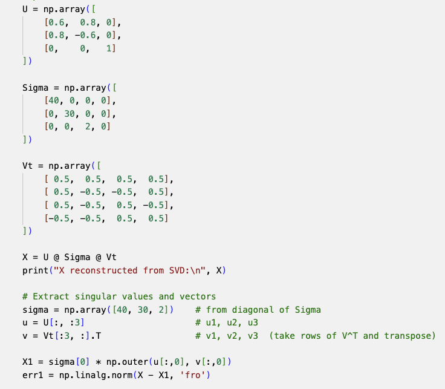
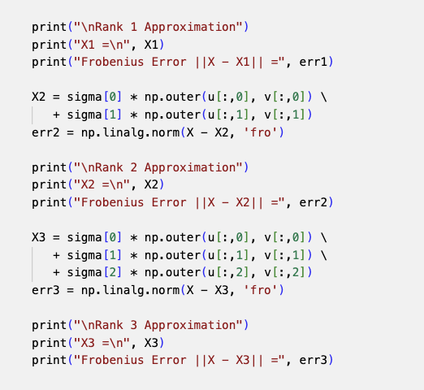
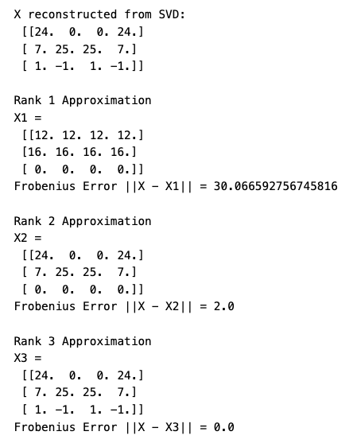
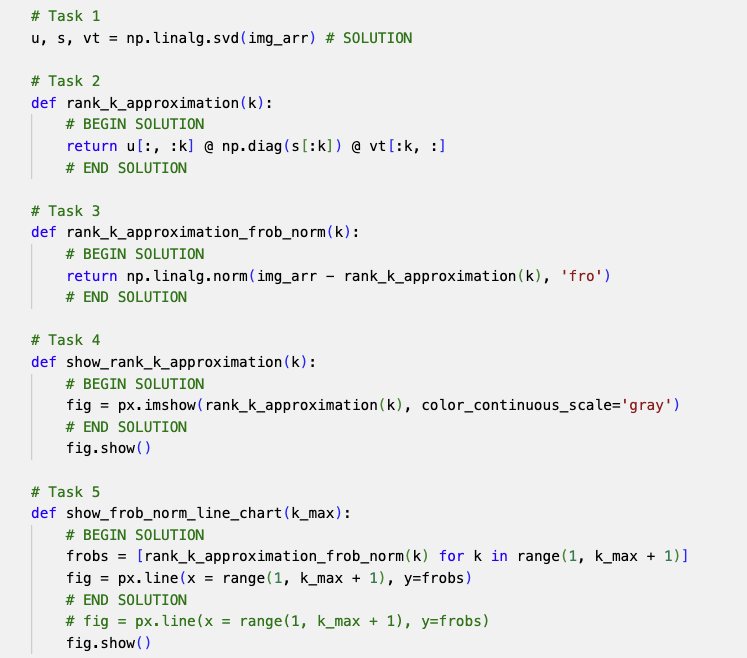
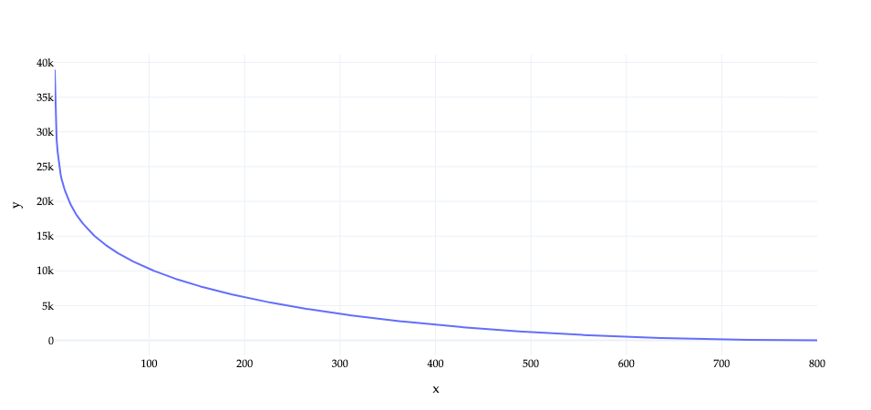
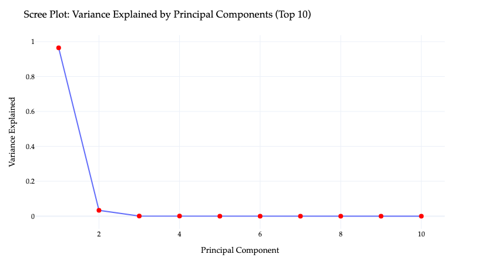



# Homework 11: Singular Value Decomposition

**due** Sunday, June 21st, 2026 at 11:59PM Ann Arbor Time

<a class="btn btn-info assignment-pdf-button" href="/resources/homeworks/hw11/hw11.pdf" target="_blank">View as PDF ✏️</a>
<a class="btn btn-info assignment-pdf-button" href="/resources/homeworks/hw11/hw11-solutions.pdf" target="_blank">Solutions PDF ✅</a>

{: .yellow }

Write your solutions to the following problems either by writing them on a piece of paper or on a tablet and scanning your answers as a PDF. Note that you are not allowed to use LaTeX, Google Docs, or any other digital document creation software to type your answers. Homeworks are due to Gradescope by 11:59PM on the due date. See the [syllabus](https://eecs245.org/syllabus/#homeworks) for details on the slip day policy.

Homework will be evaluated not only on the correctness of your answers, but on your ability to present your ideas clearly and logically. You should always explain and justify your conclusions, using sound reasoning. Your goal should be to convince the reader of your assertions. If a question does not require explanation, it will be explicitly stated.

Before proceeding, make sure you're familiar with the [collaboration policy](https://eecs245.org/syllabus/#homeworks).

---

## Problems

- [Problem 1: Homework 10 Solutions Review](#problem-1-homework-10-solutions-review-10-pts)
- [Problem 2: SVD Fundamentals](#problem-2-svd-fundamentals-18-pts)
- [Problem 3: Frobenius Norm and Low-Rank Approximation](#problem-3-frobenius-norm-and-low-rank-approximation-22-pts)
- [Problem 4: Principal Components Analysis](#problem-4-principal-components-analysis-15-pts)

---

Total Points: 10 + 18 + 22 + 15 = 65

---

## Problem 1: Homework 10 Solutions Review (10 pts)

Review [the solutions to Homework 10](https://eecs245.org/resources/homeworks/hw10/). Pick **two problem parts** (for example, Problem 6b and Problem 7c) from Homework 10 in which your solutions have the most room for improvement, i.e. where they have unsound reasoning, could be significantly more efficient or clearer, etc. Include a screenshot of your solution to each problem part, and in a few sentences, explain what was deficient and how it could be fixed.

Alternatively, if you think one of your solutions is significantly better than the posted one, copy it here and explain why you think it is better. If you didn't do Homework 10, choose two problem parts from it that look challenging to you, and in a few sentences, explain the key ideas behind their solutions in your own words.

Solution

Make sure to review the solutions to Homework 10 to figure out ways of answering questions more efficiently, as you'll need to on the Final Exam.

---

## Problem 2: SVD Fundamentals (18 pts)

Before getting started, make sure to refer to [Chapter 10.1](https://notes.eecs245.org/singular-value-decomposition/computing-svd/). These problems aren't as computationally intensive as they look; think about ways to be efficient.

a)

(4 pts) Let \\(A\\) be a \\(2 \times 2\\) matrix with singular value decomposition \\(A = U \Sigma V^T\\) where:

-   The first column of \\(U\\) is \\(\vec u&#95;1 = \begin{bmatrix} 2/\sqrt{5} \\\\ 1/\sqrt{5} \end{bmatrix}\\).

-   \\(A \vec v&#95;1 = 3 \vec u&#95;1\\), where \\(\vec v&#95;1 = \begin{bmatrix} 1/\sqrt{2} \\\\ 1/\sqrt{2} \end{bmatrix}\\) is the first column of \\(V\\).

-   The second singular value of \\(A\\) is \\(\sigma&#95;2 = 1\\).

Given this information, find \\(U\\), \\(\Sigma\\), and \\(V^T\\).

Solution

We are given the first left singular vector

$$
\vec u_1 =
\begin{bmatrix}
\frac{2}{\sqrt{5}} \\\\[4pt]
\frac{1}{\sqrt{5}}
\end{bmatrix}
$$

 and the first right singular vector

$$
\vec v_1 = \begin{bmatrix} \frac{1}{\sqrt{2}} \\\\[4pt] \frac{1}{\sqrt{2}} \end{bmatrix}
$$

 From \\(A \vec v&#95;1 = 3 \vec u&#95;1\\), the defining SVD relationship \\(A \vec v&#95;i = \sigma&#95;i \vec u&#95;i\\) immediately tells us that \\(\sigma&#95;1 = 3\\). Combined with the given \\(\sigma&#95;2 = 1\\):

$$
\Sigma =
\begin{bmatrix}
3 & 0 \\\\[4pt]
0 & 1
\end{bmatrix}
$$

**Finding \\(U\\):** Since \\(U\\) is orthonormal and its first column is \\(\vec u&#95;1\\), the second column must be a unit vector orthogonal to \\(\vec u&#95;1\\). Writing \\(\vec u&#95;2 = \begin{bmatrix} a \\\\ b \end{bmatrix}\\) and requiring orthogonality:

$$
\frac{2}{\sqrt{5}}\,a + \frac{1}{\sqrt{5}}\,b = 0
\implies 2a + b = 0 \implies b = -2a
$$

 Imposing \\(\|\vec u&#95;2\| = 1\\):

$$
\sqrt{a^2 + 4a^2} = \sqrt{5}\,|a| = 1 \implies a = \frac{1}{\sqrt{5}},\; b = -\frac{2}{\sqrt{5}}
$$

 so

$$
\boxed{U =
\begin{bmatrix}
\frac{2}{\sqrt{5}} & \frac{1}{\sqrt{5}} \\\\[6pt]
\frac{1}{\sqrt{5}} & -\frac{2}{\sqrt{5}}
\end{bmatrix}}
$$

**Finding \\(V^T\\):** We are given \\(\vec v&#95;1 = \begin{bmatrix} \frac{1}{\sqrt{2}} \\\\[4pt] \frac{1}{\sqrt{2}} \end{bmatrix}\\). The second column of \\(V\\) must be a unit vector orthogonal to \\(\vec v&#95;1\\). Writing \\(\vec v&#95;2 = \begin{bmatrix} c \\\\ d \end{bmatrix}\\):

$$
\frac{1}{\sqrt{2}}\,c + \frac{1}{\sqrt{2}}\,d = 0 \implies c = -d
$$

 With \\(\|\vec v&#95;2\| = 1\\): \\(c = \frac{1}{\sqrt{2}}, d = -\frac{1}{\sqrt{2}}\\), giving

$$
\boxed{V^T =
\begin{bmatrix}
\frac{1}{\sqrt{2}} & \frac{1}{\sqrt{2}} \\\\[6pt]
\frac{1}{\sqrt{2}} & -\frac{1}{\sqrt{2}}
\end{bmatrix}}
$$

Putting everything together, the unique singular value decomposition consistent with all the given information is:

$$
U =
\begin{bmatrix}
\frac{2}{\sqrt{5}} & \frac{1}{\sqrt{5}} \\\\[6pt]
\frac{1}{\sqrt{5}} & -\frac{2}{\sqrt{5}}
\end{bmatrix}
\qquad
\Sigma =
\begin{bmatrix}
3 & 0 \\\\[4pt]
0 & 1
\end{bmatrix}
\qquad
V^T =
\begin{bmatrix}
\frac{1}{\sqrt{2}} & \frac{1}{\sqrt{2}} \\\\[6pt]
\frac{1}{\sqrt{2}} & -\frac{1}{\sqrt{2}}
\end{bmatrix}
$$

 and the matrix \\(A\\) itself is therefore

$$
A = U\Sigma V^T =
\begin{bmatrix}
\frac{2}{\sqrt{5}} & \frac{1}{\sqrt{5}} \\\\[6pt]
\frac{1}{\sqrt{5}} & -\frac{2}{\sqrt{5}}
\end{bmatrix}
\begin{bmatrix}
3 & 0 \\\\[4pt]
0 & 1
\end{bmatrix}
\begin{bmatrix}
\frac{1}{\sqrt{2}} & \frac{1}{\sqrt{2}} \\\\[6pt]
\frac{1}{\sqrt{2}} & -\frac{1}{\sqrt{2}}
\end{bmatrix}
$$

b)

(6 pts) Let \\(X = \begin{bmatrix} 1 &amp; 0 \\\\ 0 &amp; 1 \\\\ 2 &amp; -1 \\\\ 2 &amp; 2 \end{bmatrix}\\).

1.  Compute the singular value decomposition (that is, find \\(U\\), \\(\Sigma\\), and \\(V^T\\)) for \\(X\\). Do this by hand, but use `np.linalg.svd` in Python to verify your work.

2.  Now, compute the singular value decomposition for \\(X^T = \begin{bmatrix} 1 &amp; 0 &amp; 2 &amp; 2 \\\\ 0 &amp; 1 &amp; -1 &amp; 2 \end{bmatrix}\\). How can you reuse your work in finding the SVD of \\(X\\) to compute the SVD of \\(X^T\\)?

Solution

**(i)** To compute the singular value decomposition of

$$
X =
\begin{bmatrix}
1 & 0 \\\\
0 & 1 \\\\
2 & -1 \\\\
2 & 2
\end{bmatrix}
$$

 we begin by forming the matrix \\(X^T X\\), since its eigenvalues give the squared singular values of \\(X\\):

$$
X^T X
=
\begin{bmatrix}
1^2 + 0^2 + 2^2 + 2^2 & 1\cdot 0 + 0\cdot 1 + 2(-1) + 2\cdot 2 \\\\[6pt]
1\cdot 0 + 0\cdot 1 + 2(-1) + 2\cdot 2 &
0^2 + 1^2 + (-1)^2 + 2^2
\end{bmatrix}
=
\begin{bmatrix}
9 & 2 \\\\[4pt]
2 & 6
\end{bmatrix}
$$

 To find the singular values, we compute the eigenvalues of this \\(2\times 2\\) matrix. Its characteristic polynomial is

$$
p(\lambda) =
\begin{vmatrix}
9 - \lambda & 2 \\\\
2 & 6 - \lambda
\end{vmatrix}
=
(9-\lambda)(6-\lambda) - 4 = \lambda^2 - 15 \lambda + 50
$$

This factors as

$$
p(\lambda) = \lambda^2 - 15 \lambda + 50 = (\lambda - 10)(\lambda - 5)
$$

so the two eigenvalues are \\(\lambda&#95;1 = 10\\) and \\(\lambda&#95;2 = 5\\). The singular values of \\(X\\) are therefore

$$
\sigma_1 = \sqrt{10} \qquad \sigma_2 = \sqrt{5}
$$

and so we've found one piece of the puzzle:

$$
\boxed{\Sigma = \begin{bmatrix} \sqrt{10} & 0 \\\\ 0 & \sqrt{5} \\\\ 0 & 0 \\\\ 0 & 0 \end{bmatrix}}
$$

(Remember that \\(\Sigma\\) is diagonal but also the same shape as \\(X\\), hence the extra \\(0\\)'s.)

To compute the right singular vectors (i.e. the \\(\vec v&#95;i\\)'s), we find eigenvectors of \\(X^T X\\) corresponding to the eigenvalues \\(\lambda&#95;1 = 10\\) and \\(\lambda&#95;2 = 5\\). Recall that

$$
X^T X =
\begin{bmatrix}
9 & 2 \\\\
2 & 6
\end{bmatrix}
$$

**Right singular vector for \\(\lambda&#95;1 = 10\\):**

$$
(X^T X - 10I) \vec v_1 = 0
$$

$$
\begin{bmatrix}
9 - 10 & 2 \\\\
2 & 6 - 10
\end{bmatrix}
\begin{bmatrix}
x \\\\ y
\end{bmatrix}
=
\begin{bmatrix}
-1 & 2 \\\\
2 & -4
\end{bmatrix}
\begin{bmatrix}
x \\\\ y
\end{bmatrix}
=
\begin{bmatrix}
0 \\\\ 0
\end{bmatrix}
$$

 The first row gives \\(-x + 2y = 0\\), so \\(x = 2y\\). Thus an eigenvector is

$$
\vec v_1 =
\begin{bmatrix}
2 \\\\ 1
\end{bmatrix}
$$

 Normalizing gives \\(\vec v&#95;1 = \begin{bmatrix} \frac{2}{\sqrt{5}} \\\\ \frac{1}{\sqrt{5}} \end{bmatrix}\\).

**Right singular vector for \\(\lambda&#95;2 = 5\\):**

$$
(X^T X - 5I) \vec v_2 = 0
$$

$$
\begin{bmatrix}
9 - 5 & 2 \\\\
2 & 6 - 5
\end{bmatrix}
\begin{bmatrix}
x \\\\ y
\end{bmatrix}
=
\begin{bmatrix}
4 & 2 \\\\
2 & 1
\end{bmatrix}
\begin{bmatrix}
x \\\\ y
\end{bmatrix}
=
\begin{bmatrix}
0 \\\\ 0
\end{bmatrix}
$$

 The first row gives \\(4x + 2y = 0\\), so \\(y = -2x\\). Thus an eigenvector is

$$
\vec v_2 =
\begin{bmatrix}
1 \\\\[4pt] -2
\end{bmatrix}
$$

 Normalizing gives \\(\vec v&#95;2 = \begin{bmatrix} \frac{1}{\sqrt{5}} \\\\ -\frac{2}{\sqrt{5}} \end{bmatrix}\\). **Note that we could have found this vector** just by finding a vector orthogonal to \\(\vec v&#95;1\\) and normalizing it, since the columns of \\(V\\) must be orthonormal.

So, \\(V\\) is

$$
V =
\begin{bmatrix}
\frac{2}{\sqrt{5}} & \frac{1}{\sqrt{5}} \\\\
\frac{1}{\sqrt{5}} & -\frac{2}{\sqrt{5}}
\end{bmatrix}
\implies
\boxed{V^T =
\begin{bmatrix}
\frac{2}{\sqrt{5}} & \frac{1}{\sqrt{5}} \\\\
\frac{1}{\sqrt{5}} & -\frac{2}{\sqrt{5}}
\end{bmatrix}}
$$

Almost there!

**Left singular vectors:** the defining SVD identity \\(X \vec v&#95;i = \sigma&#95;i \vec u&#95;i\\) allows us to compute each \\(\vec u&#95;i\\) explicitly.

For \\(\vec u&#95;1\\),

$$
X \vec v_1
=
\begin{bmatrix}
1 & 0 \\\\
0 & 1 \\\\
2 & -1 \\\\
2 & 2
\end{bmatrix}
\begin{bmatrix}
\frac{2}{\sqrt{5}} \\\\[4pt]
\frac{1}{\sqrt{5}}
\end{bmatrix}
=
\begin{bmatrix}
\frac{2}{\sqrt{5}} \\\\
\frac{1}{\sqrt{5}} \\\\
\frac{2(2) - 1}{\sqrt{5}} \\\\
\frac{2(2) + 2}{\sqrt{5}}
\end{bmatrix}
=
\frac{1}{\sqrt{5}}
\begin{bmatrix}
2 \\\\[4pt] 1 \\\\[4pt] 3 \\\\[4pt] 6
\end{bmatrix}
$$

 Since \\(\sigma&#95;1 = \sqrt{10}\\), we divide to obtain

$$
\vec u_1 = \frac{1}{\sigma_1} X v_1
= \frac{1}{\sqrt{10}}
\cdot \frac{1}{\sqrt{5}}
\begin{bmatrix}
2 \\\\ 1 \\\\ 3 \\\\ 6
\end{bmatrix}
=
\frac{1}{\sqrt{50}}
\begin{bmatrix}
2 \\\\ 1 \\\\ 3 \\\\ 6
\end{bmatrix}
$$

For \\(\vec u&#95;2\\),

$$
X \vec v_2
=
\begin{bmatrix}
1 & 0 \\\\
0 & 1 \\\\
2 & -1 \\\\
2 & 2
\end{bmatrix}
\begin{bmatrix}
-\frac{1}{\sqrt{5}} \\\\[4pt]
\frac{2}{\sqrt{5}}
\end{bmatrix}
=
\frac{1}{\sqrt{5}}
\begin{bmatrix}
-1 \\\\
2 \\\\
-(2)(1) - 2 \\\\
2(-1) + 4
\end{bmatrix}
=
\frac{1}{\sqrt{5}}
\begin{bmatrix}
-1 \\\\[4pt] 2 \\\\[4pt] -4 \\\\[4pt] 2
\end{bmatrix}
$$

 Since \\(\sigma&#95;2 = \sqrt{5}\\), dividing gives

$$
\vec u_2 = \frac{1}{\sigma_2} X \vec v_2
= \frac{1}{\sqrt{5}}
\cdot
\frac{1}{\sqrt{5}}
\begin{bmatrix}
-1 \\\\ 2 \\\\ -4 \\\\ 2
\end{bmatrix}
=
\frac{1}{5}
\begin{bmatrix}
-1 \\\\ 2 \\\\ -4 \\\\ 2
\end{bmatrix}
$$

Both \\(\vec u&#95;1\\) and \\(\vec u&#95;2\\) are already unit vectors, which we expect from the definition of the SVD, given that we started with unit vectors \\(\vec v&#95;1\\) and \\(\vec v&#95;2\\).

Since \\(X\\) is a \\(4\times 2\\) matrix, the full SVD requires a \\(4\times 4\\) orthogonal matrix \\(U\\). We've used

$$
X \vec v_i = \sigma_i \vec u_i
$$

to find the first two columns of \\(U\\), but this won't work any further, since \\(X\\) has no more non-zero singular values. Instead, we look for vectors \\(\vec u&#95;3\\) and \\(\vec u&#95;4\\) that are (1) in \\(\text{nullsp}(X^T)\\) and (2) orthogonal to each other, as we first saw in Chapter 10.1.

Recall,

$$
X = \begin{bmatrix} 1 & 0 \\\\ 0 & 1 \\\\ 2 & -1 \\\\ 2 & 2 \end{bmatrix} \implies X^T = \begin{bmatrix} 1 & 0 & 2 & 2 \\\\ 0 & 1 & -1 & 2 \end{bmatrix}
$$

We could solve a system of equations to find vectors that span \\(\text{nullsp}(X^T)\\), but we've chosen numbers that are small enough to reason through without needing to do that. Since \\(\text{rank}(X) = 2\\), we know that \\(\text{nullsp}(X^T)\\) is of dimension \\(4 - 2 = 2\\), so it is spanned by two vectors.

The first and second columns of \\(X^T\\) are the standard basis vectors in \\(\mathbb{R}^2\\). The third column of \\(X^T\\) is \\(2 \cdot \text{column 1} - \text{column 2}\\), and the fourth column of \\(X^T\\) is \\(2 \cdot \text{column 1} + \text{column 2}\\). This tells us the vectors

$$
\vec n_1 = \begin{bmatrix} 2 \\\\ -1 \\\\ -1 \\\\ 0 \end{bmatrix}, \vec n_2 = \begin{bmatrix} 2 \\\\ 2 \\\\ 0 \\\\ -1 \end{bmatrix}
$$

span \\(\text{nullsp}(X^T)\\). We can't place these in \\(U\\) directly, since they need to be orthogonal to one another, which they are not currently. (Though, they are automatically orthogonal to \\(\vec u&#95;1\\) and \\(\vec u&#95;2\\) as a consequence of the spectral theorem, which says that eigenvectors corresponding to different eigenvalues are orthogonal for symmetric matrices, and \\(XX^T\\) is symmetric. Remember that the \\(\vec u&#95;i\\)'s are eigenvectors of \\(XX^T\\), not \\(X^TX\\).)

To make them orthogonal while preserving their span, we can use the Gram-Schmidt process. Since we only have two vectors, this boils down to keeping \\(\vec n&#95;1\\) and computing the **error** of the projection of \\(\vec n&#95;2\\) onto \\(\vec n&#95;1\\), which must be orthogonal to \\(\vec n&#95;1\\).

First, let's find \\(\vec u&#95;3\\) by normalizing \\(\vec n&#95;1\\):

$$
\|\vec n_1\| = \sqrt{(-2)^2 + 1^2 + 1^2}
       = \sqrt{6}
\qquad
\vec u_3 = \frac{1}{\sqrt{6}}
\begin{bmatrix}
2\\\\ -1\\\\ -1\\\\ 0
\end{bmatrix}
$$

Next, we find the error of the projection of \\(\vec n&#95;2\\) onto \\(\vec u&#95;3\\).

$$
\begin{align*}
\vec e &= \vec n_2 - \text{proj}_{\vec u_3}(\vec n_2) \\\\
&= \vec n_2 - (\vec u_3 \cdot \vec n_2) \vec u_3 \\\\
&=
\begin{bmatrix} 2 \\\\ 2 \\\\ 0 \\\\ -1 \end{bmatrix}
- \left(
\frac{1}{\sqrt{6}}
\begin{bmatrix} 2 \\\\ -1 \\\\ -1 \\\\ 0 \end{bmatrix}
\cdot
\begin{bmatrix} 2 \\\\ 2 \\\\ 0 \\\\ -1 \end{bmatrix}
\right)
\frac{1}{\sqrt{6}}
\begin{bmatrix} 2 \\\\ -1 \\\\ -1 \\\\ 0 \end{bmatrix} \\\\
&= \begin{bmatrix} 2 \\\\ 2 \\\\ 0 \\\\ -1 \end{bmatrix} - \frac{1}{3} \begin{bmatrix} 2 \\\\ -1 \\\\ -1 \\\\ 0 \end{bmatrix} \\\\
&= \begin{bmatrix} 4/3 \\\\ 7/3 \\\\ 1/3 \\\\ -1 \end{bmatrix}
\end{align*}
$$

As a unit vector, this is

$$
\vec u_4
= \frac{\vec e}{\lVert \vec e \rVert}
= \frac{1}{5\sqrt{3}}
\begin{bmatrix}
4\\\\ 7\\\\ 1\\\\ -3
\end{bmatrix}
$$

With these two additional vectors, the full \\(U\\) matrix is

$$
U =
\begin{bmatrix}
\frac{2}{\sqrt{50}} & -\frac{1}{5}
                      & \frac{2}{\sqrt{6}}
                      & \frac{4}{5\sqrt{3}} \\\\[6pt]
\frac{1}{\sqrt{50}} &  \frac{2}{5}
                      & -\frac{1}{\sqrt{6}}
                      & \frac{7}{5\sqrt{3}} \\\\[6pt]
\frac{3}{\sqrt{50}} & -\frac{4}{5}
                      & -\frac{1}{\sqrt{6}}
                      & \frac{1}{5\sqrt{3}} \\\\[6pt]
\frac{6}{\sqrt{50}} &  \frac{2}{5}
                      & 0
                      & -\frac{3}{5\sqrt{3}}
\end{bmatrix}
$$

 which is now a complete orthonormal basis of \\(\mathbb{R}^4\\). These were not the only two choices of \\(\vec u&#95;3\\) and \\(\vec u&#95;4\\): there are infinitely many orthonormal bases for \\(\text{nullsp}(X^T)\\), and any of them could have been used.

So, finally, the SVD of \\(X = \begin{bmatrix} 1 &amp; 0\\\\ 0 &amp; 1\\\\ 2 &amp; -1\\\\ 2 &amp; 2 \end{bmatrix}\\) is:

$$
X =
\underbrace{
  \begin{bmatrix}
  \frac{2}{\sqrt{50}} & -\frac{1}{5}
                        & \frac{2}{\sqrt{6}}
                        & \frac{4}{5\sqrt{3}} \\\\[6pt]
  \frac{1}{\sqrt{50}} &  \frac{2}{5}
                        & -\frac{1}{\sqrt{6}}
                        & \frac{7}{5\sqrt{3}} \\\\[6pt]
  \frac{3}{\sqrt{50}} & -\frac{4}{5}
                        & -\frac{1}{\sqrt{6}}
                        & \frac{1}{5\sqrt{3}} \\\\[6pt]
  \frac{6}{\sqrt{50}} &  \frac{2}{5}
                        & 0
                        & -\frac{3}{5\sqrt{3}}
  \end{bmatrix}
}_{U}
\;
\underbrace{
\begin{bmatrix}
\sqrt{10} & 0 \\\\
0 & \sqrt{5} \\\\
0 & 0 \\\\
0 & 0
\end{bmatrix}
}_{\Sigma}
\;
\underbrace{
\begin{bmatrix}
\frac{2}{\sqrt{5}} & \frac{1}{\sqrt{5}} \\\\
\frac{1}{\sqrt{5}} & -\frac{2}{\sqrt{5}}
\end{bmatrix}
}_{V^T}
$$

**(ii)** Observe that no new computation is needed to obtain the SVD of \\(X^T\\). Transposing the decomposition \\(X = U \Sigma V^T\\) gives

$$
X^T = V \Sigma U^T,
$$

 which is already an SVD because \\(\Sigma\\) is diagonal and both \\(U\\) and \\(V\\) are orthonormal. Thus the left singular vectors of \\(X\\) become the right singular vectors of \\(X^T\\), the right singular vectors of \\(X\\) become the left singular vectors of \\(X^T\\), and the singular values remain unchanged. This reuse of the original computation highlights the symmetry built into the singular value decomposition.

c)

(4 pts) Compute the singular value decomposition for the diagonal matrix \\(X = \begin{bmatrix} 3 &amp; 0 &amp; 0 \\\\ 0 &amp; -2 &amp; 0 \\\\ 0 &amp; 0 &amp; -2 \end{bmatrix}\\).

Solution

To compute the singular value decomposition of the diagonal matrix

$$
X = \begin{bmatrix}
3 & 0 & 0 \\\\
0 & -2 & 0 \\\\
0 & 0 & -2
\end{bmatrix}
$$

first form the matrix \\(X^T X\\). Because \\(X\\) is diagonal, its transpose equals itself, and multiplying gives us

$$
X^T X
=
\begin{bmatrix}
3^2 & 0 & 0 \\\\
0 & (-2)^2 & 0 \\\\
0 & 0 & (-2)^2
\end{bmatrix}
=
\begin{bmatrix}
9 & 0 & 0 \\\\
0 & 4 & 0 \\\\
0 & 0 & 4
\end{bmatrix}
$$

The singular values of \\(X\\) are defined to be the square roots of the eigenvalues of \\(X^T X\\). Since the eigenvalues can be read directly from the diagonal, we obtain

$$
\lambda_1 = 9 \qquad \lambda_2 = 4 \qquad \lambda_3 = 4
$$

 Taking square roots gives the singular values

$$
\sigma_1 = \sqrt{9} = 3 \qquad
\sigma_2 = \sqrt{4} = 2 \qquad
\sigma_3 = \sqrt{4} = 2
$$

meaning

$$
\boxed{\Sigma = \begin{bmatrix} 3 & 0 & 0 \\\\ 0 & 2 & 0 \\\\ 0 & 0 & 2 \end{bmatrix}}
$$

The eigenvectors of a diagonal matrix are just the standard basis vectors, \\(\begin{bmatrix} 1 \\\\ 0 \\\\ 0 \end{bmatrix}\\), \\(\begin{bmatrix} 0 \\\\ 1 \\\\ 0 \end{bmatrix}\\), and \\(\begin{bmatrix} 0 \\\\ 0 \\\\ 1 \end{bmatrix}\\). For example, \\(X^TX \begin{bmatrix} 0 \\\\ 1 \\\\ 0 \end{bmatrix} = 4 \begin{bmatrix} 0 \\\\ 1 \\\\ 0 \end{bmatrix}\\). So, the matrix \\(V\\) is

$$
V =
\boxed{\begin{bmatrix}
1 & 0 & 0\\\\
0 & 1 & 0\\\\
0 & 0 & 1
\end{bmatrix} = V^T}
$$

Here's where we need to be careful. It's tempting to use the same logic in reverse and say that \\(U = I\\) as well, but this would lead us astray. Instead, we need to make sure that each column of \\(U\\) matches up with the corresponding column of \\(V\\), through the relationship

$$
X \vec v_i = \sigma_i \vec u_i
$$

$$
X \vec v_1 = 3 \vec u_1 \implies 3 \vec u_1 = \begin{bmatrix} 3 \\\\ 0 \\\\ 0 \end{bmatrix} \implies \vec u_1 = \begin{bmatrix} 1 \\\\ 0 \\\\ 0 \end{bmatrix}
$$

$$
X \vec v_2 = 2 \vec u_2 \implies 2 \vec u_2 = \begin{bmatrix} 0 \\\\ -2 \\\\ 0 \end{bmatrix} \implies \vec u_2 = \begin{bmatrix} 0 \\\\ -1 \\\\ 0 \end{bmatrix}
$$

$$
X \vec v_3 = 2 \vec u_3 \implies 2 \vec u_3 = \begin{bmatrix} 0 \\\\ 0 \\\\ -2 \end{bmatrix} \implies \vec u_3 = \begin{bmatrix} 0 \\\\ 0 \\\\ -1 \end{bmatrix}
$$

This means that

$$
U =
\begin{bmatrix}
1 & 0 & 0\\\\
0 & -1 & 0\\\\
0 & 0 & -1
\end{bmatrix}
$$

So, the SVD of \\(X\\) is

$$
X
=
U \Sigma V^T
=
\underbrace{
\begin{bmatrix}
1 & 0 & 0\\\\
0 & -1 & 0\\\\
0 & 0 & -1
\end{bmatrix}
}_{U}
\underbrace{
\begin{bmatrix}
3 & 0 & 0\\\\
0 & 2 & 0\\\\
0 & 0 & 2
\end{bmatrix}
}_{\Sigma}
\underbrace{
\begin{bmatrix}
1 & 0 & 0\\\\
0 & 1 & 0\\\\
0 & 0 & 1
\end{bmatrix}
}_{V^T}
$$

d)

(4 pts) Compute the singular value decomposition for the rank-one matrix \\(X = \begin{bmatrix} 0 &amp; 0 \\\\ 3 &amp; 4 \\\\ 6 &amp; 8 \end{bmatrix}\\).

<em>Hint: Can you write \\(X\\) as an outer product of two vectors? If you can, how do those vectors relate to the singular values and singular vectors of \\(X\\)?</em>

Solution

$$
X =
\begin{bmatrix}
0 & 0 \\\\
3 & 4 \\\\
6 & 8
\end{bmatrix}
$$

 In \\(X\\), note that the two non-zero rows,

$$
\begin{bmatrix} 3 & 4 \end{bmatrix}
\qquad\text{and}\qquad
\begin{bmatrix} 6 & 8 \end{bmatrix}
$$

 are scalar multiples of each other. This means that all non-zero rows lie in the span of the single vector \\(\begin{bmatrix} 3 &amp; 4 \end{bmatrix}\\). Because the rank of a matrix equals the dimension of the space spanned by its rows (or equivalently, its columns), we see immediately that \\(\mathrm{rank}(X)=1\\).

Once the rank is known to be one, the **hint** suggests looking for an outer--product factorization. Indeed, every rank--one matrix can be written in the form

$$
X = \vec u\, \vec v^T
$$

 where \\(\vec u\in\mathbb{R}^3\\) and \\(\vec v \in\mathbb{R}^2\\). We obtain the correct factorization by observing that each row of \\(X\\) is a scalar multiple of the vector \\(\begin{bmatrix} 3 &amp; 4 \end{bmatrix}\\):

$$
X =
\begin{bmatrix}
0 \\\\
1 \\\\
2
\end{bmatrix}
\begin{bmatrix}
3 & 4
\end{bmatrix}
=
\vec u \vec v^T
\qquad
\vec u =
\begin{bmatrix}
0 \\\\ 1 \\\\ 2
\end{bmatrix}
\quad
\vec v =
\begin{bmatrix}
3 \\\\ 4
\end{bmatrix}
$$

Writing \\(X\\) in this form makes the relationship to the singular value decomposition slightly clearer. The SVD of a rank-1 matrix always takes the form

$$
X = \sigma_1\, \vec u_1 \vec v_1^T
$$

 where \\(\vec u&#95;1\\) and \\(\vec v&#95;1\\) are unit vectors. All we need to do is normalize the \\(\vec u\\) and \\(\vec v\\) we found; the extra constant factors are placed into \\(\sigma&#95;1\\).

$$
\vec u_1 = \frac{\vec u}{\lVert \vec u \rVert} = \frac{1}{\sqrt{5}} \begin{bmatrix} 0 \\\\ 1 \\\\ 2 \end{bmatrix} = \begin{bmatrix} 0 \\\\ \frac{1}{\sqrt{5}} \\\\ \frac{2}{\sqrt{5}} \end{bmatrix}
$$

$$
\vec v_1 = \frac{\vec v}{\lVert \vec v \rVert} = \frac{1}{5} \begin{bmatrix} 3 \\\\ 4 \end{bmatrix} = \begin{bmatrix} \frac{3}{5} \\\\ \frac{4}{5} \end{bmatrix}
$$

The matrix \\(X\\) can now be expressed as

$$
X = (\sqrt{5})(5)\; \vec u_1 \vec v_1^T
= 5\sqrt{5}\; \vec u_1 \vec v_1^T
$$

 This shows that the single non-zero singular value is

$$
\sigma_1 = 5\sqrt{5} \implies \boxed{\Sigma = \begin{bmatrix} 5\sqrt{5} & 0 \\\\ 0 & 0 \\\\ 0 & 0 \end{bmatrix}}
$$

Since \\(X\\) is \\(3\times 2\\), the matrices \\(U\in\mathbb{R}^{3\times 3}\\) and \\(V\in\mathbb{R}^{2\times 2}\\) must be completed with additional orthonormal columns. The remaining singular values must be zero, so we choose any orthonormal vectors orthogonal to \\(\vec u&#95;1\\) and \\(\vec v&#95;1\\) to complete each matrix.

A convenient choice for the remaining column of \\(V\\) is

$$
\vec v_2 =
\begin{bmatrix}
-\frac{4}{5}\\\\[4pt]
\frac{3}{5}
\end{bmatrix}
$$

 which satisfies \\(\vec v&#95;1 \cdot \vec v&#95;2 = 0\\) and has unit length. So,

$$
V = \begin{bmatrix}
\frac{3}{5} & -\frac{4}{5}\\\\[4pt]
\frac{4}{5} & \frac{3}{5}
\end{bmatrix},
\qquad
\boxed{V^T =
\begin{bmatrix}
\frac{3}{5} & \frac{4}{5}\\\\[4pt]
-\frac{4}{5} & \frac{3}{5}
\end{bmatrix}}
$$

To complete the matrix \\(U\\), we need two additional orthonormal vectors that are orthogonal to

$$
\vec u_1 =
\begin{bmatrix}
0 \\\\[4pt] \tfrac{1}{\sqrt{5}} \\\\[4pt] \tfrac{2}{\sqrt{5}}
\end{bmatrix}
$$

We can follow a similar pattern to that of \\(V\\) and use

$$
\vec u_2 = \begin{bmatrix} 0 \\\\ -\frac{2}{\sqrt{5}} \\\\ \frac{1}{\sqrt{5}} \end{bmatrix}
$$

as one vector. As the final vector, note that both \\(\vec u&#95;1\\) and \\(\vec u&#95;2\\) have 0 as their first component, so both are orthogonal to

$$
\vec u_3 = \begin{bmatrix} 1 \\\\ 0 \\\\ 0 \end{bmatrix}
$$

Placing these \\(\vec u&#95;i\\)'s in the columns of \\(U\\) gives us

$$
U =
\begin{bmatrix}
0 & 0 & 1 \\\\
\frac{1}{\sqrt{5}} &  -\frac{2}{\sqrt{5}} & 0 \\\\
\frac{2}{\sqrt{5}} & \frac{1}{\sqrt{5}} & 0
\end{bmatrix}
$$

 Putting everything together, the singular value decomposition of \\(X\\) is

$$
X = U \Sigma V^T
=
\underbrace{
\begin{bmatrix}
  0 & 0 & 1 \\\\
  \frac{1}{\sqrt{5}} &  -\frac{2}{\sqrt{5}} & 0 \\\\
  \frac{2}{\sqrt{5}} & \frac{1}{\sqrt{5}} & 0
  \end{bmatrix}
}_{U}
\;
\underbrace{
\begin{bmatrix}
5\sqrt{5} & 0 \\\\
0 & 0 \\\\
0 & 0
\end{bmatrix}
}_{\Sigma}
\;
\underbrace{
\begin{bmatrix}
\frac{3}{5} & \frac{4}{5} \\\\
-\frac{4}{5} & \frac{3}{5}
\end{bmatrix}
}_{V^T}
$$

---

## Problem 3: Frobenius Norm and Low-Rank Approximation (22 pts)

As we first saw in Chapter 2.1, the norm of a vector is a measure of its size. The "default" norm is the Euclidean, or \\(L&#95;2\\) norm, \\(\lVert \vec v \rVert&#95;2 = \sqrt{v&#95;1^2 + v&#95;2^2 + \cdots + v&#95;n^2}\\).

Similarly, the norm of a matrix is a measure of its size. The most common matrix norm is the **Frobenius norm**, defined as

$$
\lVert X \rVert_F = \sqrt{\sum_{i=1}^n \sum_{j=1}^d x_{ij}^2}
$$

 That is, \\(\lVert X \rVert&#95;F\\) is the square root of the sum of the squares of the elements of \\(X\\); it treats \\(X\\) as a vector and computes its \\(L&#95;2\\) norm.

a)

(2 pts) Verify that \\(\lVert X \rVert&#95;F = \sqrt{15}\\) for \\(X = \begin{bmatrix} 1 &amp; 0 \\\\ 0 &amp; 1 \\\\ 2 &amp; -1 \\\\ 2 &amp; 2 \end{bmatrix}\\).

*Notice that \\(\sqrt{15} = \sqrt{10 + 5}\\), and in Problem 2a), you found that \\(X\\)'s singular values were \\(\sigma&#95;1 = \sqrt{10}\\) and \\(\sigma&#95;2 = \sqrt{5}\\). We build on this idea in part **c)**.*

Solution

To compute the Frobenius norm of the matrix

$$
X =
\begin{bmatrix}
1 & 0 \\\\
0 & 1 \\\\
2 & -1 \\\\
2 & 2
\end{bmatrix}
$$

 we use the definition

$$
\|X\|_F = \sqrt{\sum_{i=1}^n \sum_{j=1}^d x_{ij}^2}
$$

 which tells us to square every entry of the matrix, sum those squares, and then take a square root.

Writing out the squares of all eight entries and simplifying gives

$$
\|X\|_F^2
= 1^2 + 0^2 + 0^2 + 1^2 + 2^2 + (-1)^2 + 2^2 + 2^2 = 15
$$

Therefore,

$$
\|X\|_F = \sqrt{15}
$$

Notice that \\(\sqrt{15}\\) is also equal to \\(\sqrt{10 + 5}\\), and \\(\sqrt{10}\\) and \\(\sqrt{5}\\) are the singular values of \\(X\\) from Problem 2a. We build on this connection shortly.

b)

(4 pts) Another equivalent formula for the Frobenius norm is

$$
\lVert X \rVert_F^2 = \text{trace}(X^T X)
$$

 where \\(\text{trace}(X^T X)\\) is the sum of the diagonal entries of \\(X^TX\\). (Notice the square on the left-hand side!) **Explain why** this is equivalent to the first definition of the Frobenius norm.

Solution

To see why the identity

$$
\|X\|_F^2 = \operatorname{trace}(X^T X)
$$

 matches the original definition of the Frobenius norm, it's helpful to examine what the matrix product \\(X^T X\\) looks like entry by entry. Recall that the Frobenius norm is defined by

$$
\|X\|_F^2 = \sum_{i=1}^n \sum_{j=1}^d x_{ij}^2
$$

 which is the sum of the squares of all entries of \\(X\\).

Now consider the matrix \\(X^T X\\). This matrix contains the dot products of all pairs of columns of \\(X\\). Along its diagonal, it contains the dot products of each column with itself. That is, element \\((k,k)\\) of \\(X^T X\\) is the dot product of the \\(k\\)-th column of \\(X\\) with itself, **which is just the sum of the squares of the entries in the \\(k\\)-th column of \\(X\\)**.

$$
(X^TX)_{kk} = (\text{column } k \text{ of } X) \cdot (\text{column } k \text{ of } X) = \sum_{i=1}^n x_{ik}^2
$$

The trace of a matrix is the sum of its diagonal entries, so

$$
\operatorname{trace}(X^T X) = \sum_{k=1}^d (X^T X)_{kk} = \sum_{k=1}^d \left( \text{column } k \text{ of } X \cdot \text{column } k \text{ of } X \right) = \sum_{k=1}^d \sum_{i=1}^n x_{ik}^2
$$

This sum loops over every single entry of \\(X\\) exactly once and sums its square, just as the original definition of the Frobenius norm did!

This shows that

$$
\|X\|_F^2 = \operatorname{trace}(X^T X)
$$

 is equivalent to the definition

$$
\|X\|_F = \sqrt{\sum_{i=1}^n \sum_{j=1}^d x_{ij}^2 }
$$

c)

(4 pts) Another equivalent formula for the Frobenius norm is

$$
\lVert X \rVert_F^2 = \sum_{i=1}^r \sigma_i^2
$$

 where \\(\sigma&#95;1, \sigma&#95;2, \ldots, \sigma&#95;r\\) are the singular values of \\(X\\) and \\(r = \text{rank}(X)\\). **Explain why** this is equivalent to the definition of the Frobenius norm from part **b)**. <em>Hint: What is the relationship between the singular values of \\(X\\) and the eigenvalues of some other matrix?</em>

Solution

The goal is to understand why the Frobenius norm can also be written in terms of the singular values of \\(X\\). From **part b)**, we already know that

$$
\|X\|_F^2 = \operatorname{trace}(X^T X)
$$

 so it's enough to explain why the trace of \\(X^T X\\) is equal to the sum of the squares of the singular values.

The **hint** suggests recalling the relationship between the singular values of a matrix and the eigenvalues of another matrix.

Here's the key: in the singular value decomposition, the singular values \\(\sigma&#95;1,\ldots,\sigma&#95;r\\) of \\(X\\) are defined to be the square roots of the non-zero eigenvalues of the symmetric matrix \\(X^T X\\). If we denote these eigenvalues by

$$
\lambda_1, \lambda_2, \ldots, \lambda_r,
$$

 then the SVD tells us that

$$
\lambda_i = \sigma_i^2 \qquad \text{for each } i=1,\ldots,r
$$

But, from [Chapter 9.2](https://notes.eecs245.org/eigenvalues-and-eigenvectors/characteristic-polynomial/#trace-and-determinant), we know that the trace of a matrix is the sum of its eigenvalues, so

$$
\operatorname{trace}(X^T X) = \lambda_1 + \lambda_2 + \cdots + \lambda_r
$$

But, \\(\lambda&#95;1 + \lambda&#95;2 + \cdots + \lambda&#95;r = \sigma&#95;1^2 + \sigma&#95;2^2 + \cdots + \sigma&#95;r^2\\), and \\(\lVert X \rVert&#95;F^2 = \operatorname{trace}(X^T X)\\), so

$$
\lVert X \rVert_F^2 = \operatorname{trace}(X^T X) = \lambda_1 + \lambda_2 + \cdots + \lambda_r = \sigma_1^2 + \sigma_2^2 + \cdots + \sigma_r^2
$$

and thus

$$
\lVert X \rVert_F^2 = \sum_{i=1}^r \sigma_i^2
$$

 as required.

The Frobenius norm allows us to make more precise the idea of a rank-\\(k\\) approximation of a matrix, first introduced in [Chapter 10.2](https://notes.eecs245.org/singular-value-decomposition/low-rank-approximation/).

Suppose \\(X = U \Sigma V^T\\) is the singular value decomposition of the \\(n \times d\\) matrix \\(X\\), where the columns of \\(U\\) are \\(\vec u&#95;1, \vec u&#95;2, \ldots, \vec u&#95;n \in \mathbb{R}^n\\), the singular values of \\(X\\) are \\(\sigma&#95;1, \sigma&#95;2, \ldots, \sigma&#95;r &gt; 0\\), the rows of \\(V^T\\) are \\(\vec v&#95;1, \vec v&#95;2, \ldots, \vec v&#95;d \in \mathbb{R}^d\\), and \\(r = \text{rank}(X)\\).

The Eckart--Young--Mirsky theorem states that, for any integer \\(k\\) between 1 and \\(r\\), the \\(n \times d\\) matrix

$$
X_k = \sum_{i=1}^k \sigma_i \vec u_i \vec v_i^T
$$

 is the closest rank-\\(k\\) matrix to \\(X\\), in terms of Frobenius norm. That is, if \\(Y\\) is any other \\(n \times d\\) matrix of rank \\(k\\), then \\(\lVert X - X&#95;k \rVert&#95;F \leq \lVert X - Y \rVert&#95;F\\). More intuitively, this says that \\(X&#95;k\\) is the matrix with the smallest mean squared error from \\(X\\), among all \\(n \times d\\) matrices of rank \\(k\\). We will not prove this theorem in class.

d)

(6 pts) Let's illustrate the above with an example. Consider the \\(3 \times 4\\) matrix \\(X\\), whose singular value decomposition is given by

$$
\underbrace{\begin{bmatrix} 24 & 0 & 0 & 24 \\\\ 7 & 25 & 25 & 7 \\\\ 1 & -1 & 1 & -1 \end{bmatrix}}_{X} = \underbrace{\begin{bmatrix} 0.6 & 0.8 & 0 \\\\ 0.8 & -0.6 & 0 \\\\ 0 & 0 & 1 \end{bmatrix}}_{U} \underbrace{\begin{bmatrix} 40 & 0 & 0 & 0 \\\\ 0 & 30 & 0 & 0 \\\\ 0 & 0 & 2 & 0 \end{bmatrix}}_{\Sigma} \underbrace{\begin{bmatrix} 1/2 & 1/2 & 1/2 & 1/2 \\\\ 1/2 & -1/2 & -1/2 & 1/2 \\\\ 1/2 & -1/2 & 1/2 & -1/2 \\\\ -1/2 & -1/2 & 1/2 & 1/2 \end{bmatrix}}_{V^T}
$$

For \\(k = 1, 2, 3\\), compute the rank-\\(k\\) approximation \\(X&#95;k = \sum&#95;{i=1}^k \sigma&#95;i \vec u&#95;i \vec v&#95;i^T\\) and the Frobenius norm of the approximation error, \\(\lVert X - X&#95;k \rVert&#95;F\\).

Feel free to do the computations by hand or using `numpy`. If you use `numpy`, make sure to include screenshots of any code you write and its outputs, and **don't** use `np.linalg.svd`; instead, enter the SVD we provided you with and use `np.outer` to compute the outer product of two vectors.

Solution

The matrix \\(X\\) is given together with its singular value decomposition

$$
X = U \Sigma V^T
$$

 where

$$
U =
\begin{bmatrix}
0.6 & 0.8 & 0 \\\\
0.8 & -0.6 & 0 \\\\
0 & 0 & 1
\end{bmatrix}
\qquad
\Sigma =
\begin{bmatrix}
40 & 0 & 0 & 0 \\\\
0 & 30 & 0 & 0 \\\\
0 & 0 & 2 & 0
\end{bmatrix}
\qquad
V^T =
\begin{bmatrix} 1/2 & 1/2 & 1/2 & 1/2 \\\\ 1/2 & -1/2 & -1/2 & 1/2 \\\\ 1/2 & -1/2 & 1/2 & -1/2 \\\\ -1/2 & -1/2 & 1/2 & 1/2 \end{bmatrix}
$$

 Thus its singular values are

$$
\sigma_1 = 40 \qquad \sigma_2 = 30 \qquad \sigma_3 = 2
$$

 and the corresponding singular vectors are the columns of \\(U\\) and \\(V\\).

The Eckart--Young--Mirsky theorem states that the best rank--\\(k\\) approximation of \\(X\\) in Frobenius norm is

$$
X_k = \sum_{i=1}^k \sigma_i\, \vec u_i \vec v_i^T
$$

 which is a sum of outer products.

#### Rank-1 approximation

The relevant outer product is

$$
\vec u_1 \vec v_1^T
=
\begin{bmatrix}
0.6\\\\ 0.8\\\\ 0
\end{bmatrix}
\begin{bmatrix}
1/2 & 1/2 & 1/2 & 1/2
\end{bmatrix}
=
\begin{bmatrix}
0.3 & 0.3 & 0.3 & 0.3\\\\
0.4 & 0.4 & 0.4 & 0.4\\\\
0   & 0   & 0   & 0
\end{bmatrix}
$$

 So the rank-1 approximation is

$$
X_1 = 40\, \vec u_1 \vec v_1^T
=
\begin{bmatrix}
12 & 12 & 12 & 12\\\\
16 & 16 & 16 & 16\\\\
0  & 0  & 0  & 0
\end{bmatrix}
$$

To compute the approximation error, we subtract:

$$
X - X_1 =
\begin{bmatrix}
24 & 0 & 0 & 24 \\\\
7 & 25 & 25 & 7 \\\\
1 & -1 & 1 & -1
\end{bmatrix}
-
\begin{bmatrix}
12 & 12 & 12 & 12\\\\
16 & 16 & 16 & 16\\\\
0  & 0  & 0  & 0
\end{bmatrix}
=
\begin{bmatrix}
12 & -12 & -12 & 12\\\\
-9 & 9 & 9 & -9 \\\\
1 & -1 & 1 & -1
\end{bmatrix}
$$

 The Frobenius norm is

$$
\|X - X_1\|_F^2
=
4(12^2) + 4(9^2) + 4(1^2)
= 4(144 + 81 + 1)
= 4(226)
= 904
$$

 Thus

$$
\boxed{\|X - X_1\|_F = \sqrt{904}}
$$

Notice that \\(\sqrt{904}\\) is also equal to \\(\sqrt{30^2 + 2^2}\\), which is the square root of the sum of the singular values past the first one!

#### Rank-2 approximation

We now include a second outer product:

$$
\vec u_2 \vec v_2^T
=
\begin{bmatrix}
0.8\\\\ -0.6\\\\ 0
\end{bmatrix}
\begin{bmatrix}
1/2 & -1/2 & -1/2 & 1/2
\end{bmatrix}
=
\begin{bmatrix}
0.4 & -0.4 & -0.4 & 0.4\\\\
-0.3 & 0.3 & 0.3 & -0.3\\\\
0 & 0 & 0 & 0
\end{bmatrix}
$$

 Multiplying by \\(\sigma&#95;2 = 30\\) gives

$$
30\,\vec u_2 \vec v_2^T
=
\begin{bmatrix}
12 & -12 & -12 & 12\\\\
-9 & 9 & 9 & -9 \\\\
0 & 0 & 0 & 0
\end{bmatrix}
$$

Thus the rank-2 approximation is

$$
X_2 = \sigma_1 \vec u_1 \vec v_1^T + \sigma_2 \vec u_2 \vec v_2^T = X_1 + 30 \vec u_2 \vec v_2^T
=
\begin{bmatrix}
24 & 0 & 0 & 24\\\\
7 & 25 & 25 & 7\\\\
0 & 0 & 0 & 0
\end{bmatrix}
$$

The approximation error is now

$$
X - X_2 =
\begin{bmatrix}
0 & 0 & 0 & 0\\\\
0 & 0 & 0 & 0\\\\
1 & -1 & 1 & -1
\end{bmatrix}
$$

 Hence

$$
\|X - X_2\|_F^2
= 1^2 + (-1)^2 + 1^2 + (-1)^2
= 4
\qquad
\boxed{\|X - X_2\|_F = 2}
$$

#### Rank-3 approximation

\\(X\\) itself is rank 3, so a rank-3 approximation of it is just \\(X\\) itself. If you sum \\(\sigma&#95;1 \vec u&#95;1 \vec v&#95;1^T + \sigma&#95;2 \vec u&#95;2 \vec v&#95;2^T + \sigma&#95;3 \vec u&#95;3 \vec v&#95;3^T\\), you will get back \\(X\\).

Now we summarizing all three rank--\\(k\\) approximations and their errors:

$$

$$

\begin{aligned}
X_1 &= 40 u_1 v_1^T
&\quad \|X - X_1\|_F &= \sqrt{904}\\[6pt]
X_2 &= 40u_1 v_1^T + 30u_2 v_2^T
&\quad \|X - X_2\|_F &= 2\\[6pt]
X_3 &= X
&\quad \|X - X_3\|_F &= 0
\end{aligned}

$$

$$

Note that the Frobenius norm of the approximation error is decreasing as we add more outer products --- specifically, the error for the rank-\\(k\\) approximation is \\(\sqrt{\sum&#95;{i=k+1}^r \sigma&#95;i^2}\\), i.e. the sum of the squares of the singular values past the \\(k\\)-th one.

Here are the rank-\\(k\\) approximation computations done using `numpy`.

e)

(6 pts) Open the **the supplemental Jupyter Notebook** we've created for Homework 11, which can either be found [here](https://github.com/eecs245/sp26-code/blob/main/homeworks/hw11/hw11.ipynb) in the course GitHub repository, or [here](https://datahub.eecs245.org/hub/user-redirect/git-pull?repo=https%3A%2F%2Fgithub.com%2Feecs245%2Fsp26-code&urlpath=tree%2Fsp26-code%2Fhomeworks%2Fhw11%2Fhw11.ipynb&branch=main) on DataHub.

There, you're asked to implement the rank-\\(k\\) approximation of an image of your choosing, similar to the [Image Compression example in Chapter 10.2](https://notes.eecs245.org/singular-value-decomposition/low-rank-approximation/#example-image-compression).

More instructions are provided in the notebook. This problem is **not autograded**. Rather, in your submission to this part, include screenshots of all of your code and outputs here.

Solution

---

## Problem 4: Principal Components Analysis (15 pts)

**Make sure you've completed Problem 3 before attempting this problem.**

This problem involves a practical exploration of principal components analysis (PCA), perhaps the most interesting application of the singular value decomposition.

There are two ways to access the supplemental Jupyter Notebook:

-   **Option 1**: Set up a Jupyter Notebook environment locally, use `git` to clone our course repository, and open `homeworks/hw11/hw11.ipynb`. For instructions on how to do this, see the [Tech Support](https://eecs245.org/env-setup/#option-1-local-setup) page of the course website.

-   **Option 2**: Click [here](https://datahub.eecs245.org/hub/user-redirect/git-pull?repo=https%3A%2F%2Fgithub.com%2Feecs245%2Fsp26-code&urlpath=tree%2Fsp26-code%2Fhomeworks%2Fhw11%2Fhw11.ipynb&branch=main) to open `hw11.ipynb` on DataHub. Before doing so, read the instructions on the [Tech Support](https://eecs245.org/env-setup/#option-2-using-the-eecs-245-datahub) page on how to use the DataHub.

**This problem is NOT autograded**. Instead, complete the five tasks mentioned in Problem 4, and include screenshots of all of your code and outputs here, along with your written answers to Tasks 3 and 5.

Solution


