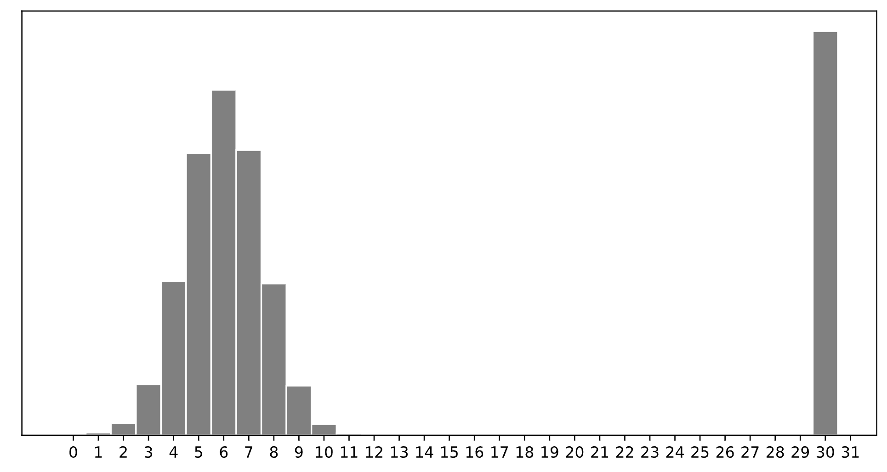
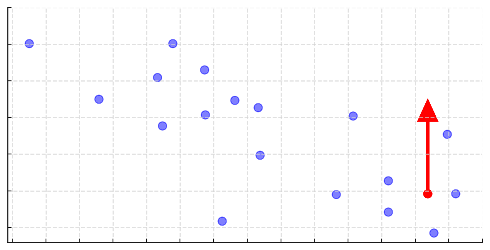
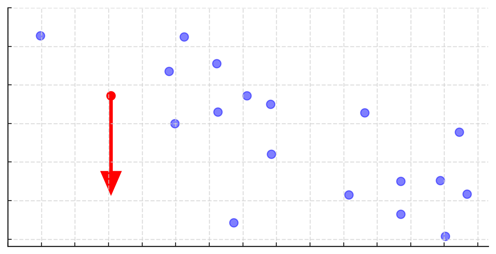
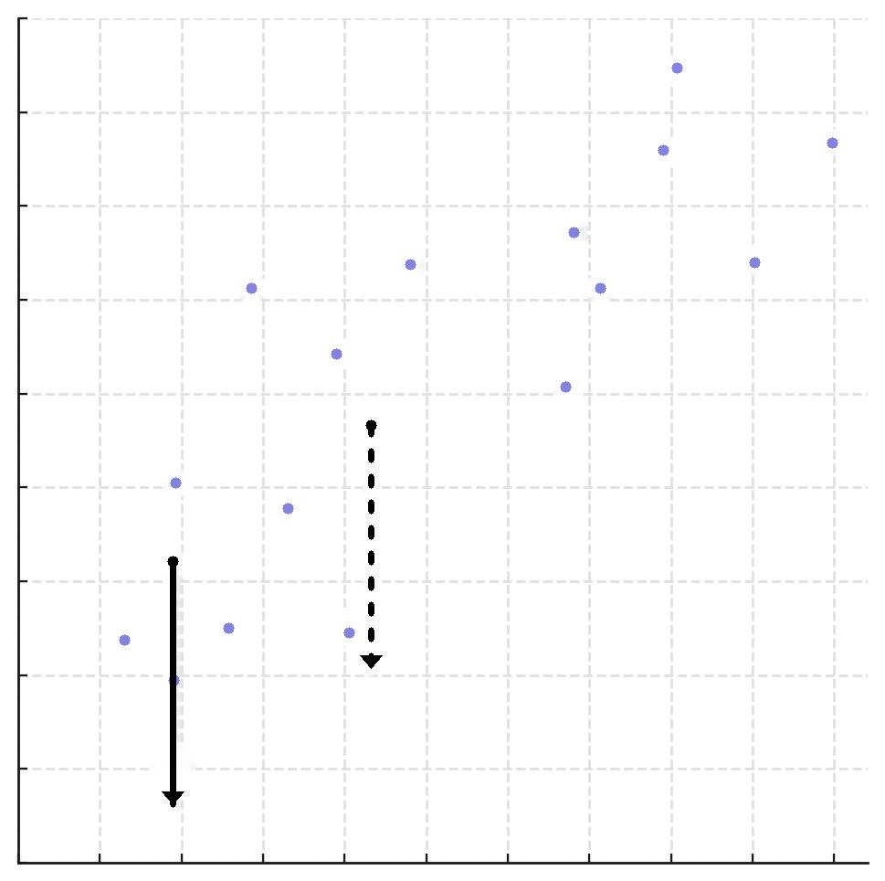

# Lab 2: Empirical Risk and Simple Linear Regression

**due** for completion at 11:59PM Ann Arbor Time on Monday, May 11th, 2026

<a class="btn btn-info assignment-pdf-button" href="/resources/labs/lab02/lab02.pdf" target="_blank">View as PDF ✏️</a>

{: .yellow }

Each lab worksheet will contain several activities, some of which will involve writing code and others that will involve writing math on paper. To receive credit for a lab, you must complete as many of the activities as you can in 2 hours and submit a PDF of your work to Gradescope. We will provide specific instructions on how to submit programming activities (e.g. submitting the notebook or including a screenshot of some output).

Feel free to work with others in the course, but you must submit individually.

---

## Activities

- [Activity 1: Relative Squared Loss](#activity-1-relative-squared-loss)
- [Activity 2: Rapid Fire](#activity-2-rapid-fire)
- [Activity 3: Slope of Mean Absolute Error](#activity-3-slope-of-mean-absolute-error)
- [Activity 4: Programming](#activity-4-programming)
- [Activity 5: Visualizing Changes in the Data](#activity-5-visualizing-changes-in-the-data)
- [Activity 6: Relative Squared Loss, Continued](#activity-6-relative-squared-loss-continued)

---

## Recap: The Modeling Recipe

In [Chapter 1.3](https://notes.eecs245.org/introduction-to-supervised-learning/absolute-loss/), we introduced the three-step modeling recipe for finding optimal model parameters, which ultimately helps us make the best possible predictions.

1.  **Choose a model.**

    

$$
\underbrace{h(x_i) = w}_{\text{constant model}} \quad\quad \underbrace{h(x_i) = w_0 + w_1 x_i}_{\text{simple linear regression model}}
$$

2.  **Choose a loss function.**

    

$$
\underbrace{L_{\text{sq}}(y_i, h(x_i)) = (y_i - h(x_i))^2}_{\text{squared loss}} \quad\quad \underbrace{L_{\text{abs}}(y_i, h(x_i)) = |y_i - h(x_i)|}_{\text{absolute loss}}
$$

3.  **Minimize *average loss* (also called *empirical risk*) to find optimal model parameters.**

    -   Constant model, squared loss: \\(\displaystyle R_{\text{sq}}(w) = \frac{1}{n} \sum_{i=1}^n (y_i - w)^2 \implies w^* = \bar{y}\\)

    -   Constant model, absolute loss: \\(\displaystyle R_{\text{abs}}(w) = \frac{1}{n} \sum_{i=1}^n |y_i - w| \implies w^* = \text{Median}(y_1, y_2, \ldots, y_n)\\)

    -   Simple linear regression model, squared loss: 

$$
\displaystyle R_{\text{sq}}(w_0, w_1) = \frac{1}{n} \sum_{i=1}^n (y_i - (w_0 + w_1 x_i))^2 \implies w_1^* = \frac{\sum_{i=1}^n (x_i - \bar{x})(y_i - \bar{y})}{\sum_{i=1}^n (x_i - \bar{x})^2}, \quad w_0^* = \bar{y} - w_1^* \bar{x}
$$

## Activity 1: Relative Squared Loss

Suppose we'd like to find the optimal parameter, \\(w^*\\), for the constant model \\(h(x_i) = w\\). To do so, we use the following loss function, called the **relative squared loss**:

$$
L_{\text{rsq}}(y_i, h(x_i)) = \frac{(y_i - h(x_i))^2}{y_i}
$$

What value of \\(w\\) minimizes the average loss (i.e. empirical risk) when using the relative squared loss function -- that is, what is \\(w^*\\)? Your answer should only be in terms of the variables \\(n, y_1, y_2, \ldots, y_n\\), and any constants.

---

## Activity 2: Rapid Fire

Consider a dataset of \\(n\\) **integers**, \\(y_1, y_2, \ldots, y_n\\), whose histogram is given below:

a)

Which of the following is closest to the constant prediction \\(w^*\\) that minimizes:

$$
\frac{1}{n} \sum_{i = 1}^n
\begin{cases}
0 \quad  y_i = w \\\\
1 \quad y_i \neq w
\end{cases}
$$

\\(\bigcirc\\) \\(1\\)\\(\bigcirc\\) \\(5\\)\\(\bigcirc\\) \\(6\\)\\(\bigcirc\\) \\(7\\)\\(\bigcirc\\) \\(11\\)\\(\bigcirc\\) \\(15\\)\\(\bigcirc\\) \\(30\\)

b)

Which of the following is closest to the constant prediction \\(w^*\\) that minimizes:

$$
\frac{1}{n} \sum_{i = 1}^n |y_i - w|
$$

\\(\bigcirc\\) \\(1\\)\\(\bigcirc\\) \\(5\\)\\(\bigcirc\\) \\(6\\)\\(\bigcirc\\) \\(7\\)\\(\bigcirc\\) \\(11\\)\\(\bigcirc\\) \\(15\\)\\(\bigcirc\\) \\(30\\)

c)

Which of the following is closest to the constant prediction \\(w^*\\) that minimizes:

$$
\frac{1}{n} \sum_{i = 1}^n (y_i - w)^2
$$

\\(\bigcirc\\) \\(1\\)\\(\bigcirc\\) \\(5\\)\\(\bigcirc\\) \\(6\\)\\(\bigcirc\\) \\(7\\)\\(\bigcirc\\) \\(11\\)\\(\bigcirc\\) \\(15\\)\\(\bigcirc\\) \\(30\\)

d)

Which of the following is closest to the constant prediction \\(w^*\\) that minimizes:

$$
\lim_{p \rightarrow \infty} \frac{1}{n} \sum_{i = 1}^n |y_i - w|^p
$$

<em>Hint: Think about the effect of outliers.</em>

\\(\bigcirc\\) \\(1\\)\\(\bigcirc\\) \\(5\\)\\(\bigcirc\\) \\(6\\)\\(\bigcirc\\) \\(7\\)\\(\bigcirc\\) \\(11\\)\\(\bigcirc\\) \\(15\\)\\(\bigcirc\\) \\(30\\)

---

## Activity 3: Slope of Mean Absolute Error

Consider a dataset of 8 points, \\(y_1, y_2, \ldots, y_8\\) that are in sorted order, i.e. \\(y_1 < y_2 < \ldots < y_8\\).

Recall that mean absolute error, \\(R_{\text{abs}}(w)\\), for the constant model \\(h(x_i) = w\\) is defined as: 

$$
R_{\text{abs}}(w)=\frac{1}{n} \sum_{i=1}^n |y_i - w|
$$

This is a piecewise linear function that changes slope at each data point. The slope of \\(R_{\text{abs}}(w)\\) at any \\(w\\) that is not a data point is:

$$
\frac{\text{d}}{\text{d}w} R_{\text{abs}}(w) = \frac{\text{# left of } w - \text{# right of } w}{n}
$$

Suppose that \\(y_4=10\\), \\(y_5=14\\), \\(y_6=22\\), and \\(R_{\text{abs}}(11)=9\\). What is \\(R_{\text{abs}}(22)\\)?

<em>Hint: You don't have all 8 of the \\(y\\)-values, so you can't find \\(R_\text{abs}(22)\\) just by plugging in numbers into the formula for \\(R_\text{abs}(w)\\). Instead, think about how to use the slope formula.</em>

---

## Activity 4: Programming

Complete the tasks in the `lab02.ipynb` notebook.

There are two ways to access the supplemental Jupyter Notebook:

-   **Option 1 (preferred)**: Set up a Jupyter Notebook environment locally, use `git` to clone our [course repository](https://github.com/eecs245/sp26-code/tree/main/labs/lab02/lab02.ipynb), and open `labs/lab02/lab02.ipynb`. For instructions on how to do this, see the [Environment Setup](https://eecs245.org/env-setup) page of the course website.

-   **Option 2**: Click [here](https://datahub.eecs245.org/hub/user-redirect/git-pull?repo=https%3A%2F%2Fgithub.com%2Feecs245%2Fsp26-code&urlpath=tree%2Fsp26-code%2Flabs%2Flab02%2Flab02.ipynb&branch=main) to open `lab02.ipynb` on DataHub. Before doing so, read the instructions on the [Environment Setup](https://eecs245.org/env-setup/#option-2-using-the-eecs-245-datahub) page on how to use the DataHub.

Once you're done, include a screenshot of your completed Activity 4 implementation in your PDF submission of Lab 2 to Gradescope, making sure to include proof that the (local) autograder passed.

---

## Activity 5: Visualizing Changes in the Data

The problems in this final activity will help you visualize how changes in the data affect the optimal simple linear regression line. To recap, this is the line \\(h(x_i) = w_0 + w_1 x_i\\) defined by:

$$
w_1^* = r \frac{\sigma_y}{\sigma_x} = \frac{\sum_{i=1}^n (x_i - \bar{x})(y_i - \bar{y})}{\sum_{i=1}^n (x_i - \bar{x})^2} \qquad w_0^* = \bar{y} - w_1^* \bar{x}
$$

\\(r\\) is the correlation coefficient between \\(x\\) and \\(y\\), \\(\sigma_x\\) is the standard deviation of \\(x\\), and \\(\sigma_y\\) is the standard deviation of \\(y\\).

Assume all data is in the first quadrant, i.e. all \\(x_i\\) and \\(y_i\\) are positive.

a)

In each dataset shown below, how will the slope and intercept of the regression line change if we move the red point in the direction of the arrow?

 

b)

Compare two different possible changes to the dataset shown below.

-   Move the dashed point down \\(c\\) units.

-   Move the solid point down \\(c\\) units.

Which move will change the slope of the regression line more? Why? *Hint: We're not looking for a formal proof. But, if you want to read more, look at [Chapter 2.3](https://notes.eecs245.org/simple-linear-regression/finding-optimal-parameters/#regression-line-passes-through-the-mean).*

**The rest of this worksheet is extra practice. Don't feel pressured to answer all of these problems in lab, but make sure to attempt them at some point.**

---

## Activity 6: Relative Squared Loss, Continued

Recall the formula for **relative squared loss** from Activity 1:

$$
L_{\text{rsq}}(y_i, h(x_i)) = \frac{(y_i - h(x_i))^2}{y_i}
$$

a)

Let \\(C(y_1, y_2, ..., y_n)\\) be your minimizer \\(w^*\\) from Activity 1. That is, for a particular dataset \\(y_1, y_2, ..., y_n\\), \\(C(y_1, y_2, ..., y_n)\\) is the value of \\(w\\) that minimizes empirical risk for relative squared loss on that dataset.

What is the value of \\(\displaystyle\lim_{y_4 \rightarrow \infty} C(1, 3, 5, y_4)\\) in terms of \\(C(1, 3, 5)\\)? Your answer should involve the function \\(C\\) and/or one or more constants.

<em>Hint: To notice the pattern, evaluate \\(C(1, 3, 5, 100)\\), \\(C(1, 3, 5, 10000)\\), and \\(C(1, 3, 5, 1000000)\\).</em>

b)

What is the value of \\(\displaystyle\lim_{y_4 \rightarrow 0} C(1, 3, 5, y_4)\\)? Again, your answer should involve the function \\(C\\) and/or one or more constants.

c)

Based on the results of the previous two parts, when is the prediction \\(C(y_1, y_2, ..., y_n)\\) robust to outliers? When is it not robust to outliers?

