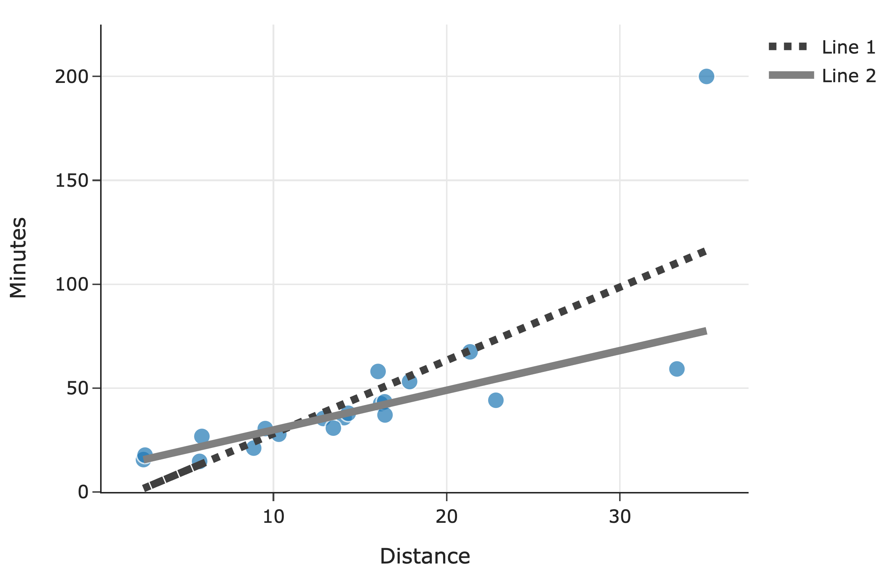

# Lab 3: Simple Linear Regression and Partial Derivatives

**due** for completion at 11:59PM Ann Arbor Time on Wednesday, May 13th, 2026

<a class="btn btn-info assignment-pdf-button" href="/resources/labs/lab03/lab03.pdf" target="_blank">View as PDF ✏️</a>

{: .yellow }

Each lab worksheet will contain several activities, some of which will involve writing code and others that will involve writing math on paper. To receive credit for a lab, you must complete as many of the activities as you can in 2 hours and submit a PDF of your work to Gradescope. We will provide specific instructions on how to submit programming activities (e.g. submitting the notebook or including a screenshot of some output).

Feel free to work with others in the course, but you must submit individually.

---

## Activities

- [Activity 1: The Meaning of Mean Squared Error](#activity-1-the-meaning-of-mean-squared-error)
- [Activity 2: What Do You Mean?](#activity-2-what-do-you-mean)
- [Activity 3: Reverse Regression](#activity-3-reverse-regression)
- [Activity 4: Partial Derivatives and Minimization](#activity-4-partial-derivatives-and-minimization)
- [Activity 5: Systems of Equations](#activity-5-systems-of-equations)
- [Activity 6: Transformed Data](#activity-6-transformed-data)
- [Activity 7: A Refresher](#activity-7-a-refresher)

---

## Recap: Simple Linear Regression

We've spent all of [Chapter 2](https://notes.eecs245.org/simple-linear-regression/finding-optimal-parameters/) learning about the simple linear regression model, \\(h(x_i) = w_0 + w_1 x_i\\).

To find the optimal intercept, \\(w_0^*\\), and slope, \\(w_1^*\\), we minimized mean squared error: 

$$
R_\text{sq}(w_0, w_1) = \frac{1}{n} \sum_{i=1}^{n} (y_i - (w_0 + w_1 x_i))^2
$$

-   **\\(R_\text{sq}\\) is a function of \\(w_0\\) and \\(w_1\\), and looks like a bowl in 3D.** Since it has two input variables, we found its minimum by taking the partial derivatives of \\(R_\text{sq}(w_0, w_1)\\) with respect to \\(w_0\\) and \\(w_1\\), setting both of them equal to 0, and then solving for the resulting \\(w_0^*\\) and \\(w_1^*\\).

-   A partial derivative is defined as the derivative with respect to one variable **while treating all others as constants**. 

$$
f(x, y) = x^2 + 3xy^2 \implies \frac{\partial f}{\partial x} = 2x + 3y^2
$$

-   An important fact about the line \\(h^*(x_i)=w_0^*+w_1^*x_i\\) is that it is guaranteed to pass through \\((\bar x, \bar y)\\) --- in other words, an average input always predicts an average output.

-   There are several equivalent ways to write the optimal slope, \\(w_1^*\\). One of them involves the correlation coefficient, \\(r\\). 

$$
\underbrace{r = \frac{1}{n} \sum_{i=1}^n \left( \frac{x_i-\bar x}{\sigma_x} \right) \left( \frac{y_i-\bar y}{\sigma_y} \right)}_{\text{average product of \\(x\\) and \\(y\\), once both are standardized}} \qquad w_1^* = r \frac{\sigma_y}{\sigma_x} = \frac{\sum_{i=1}^n (x_i-\bar x)(y_i-\bar y)}{\sum_{i=1}^n (x_i-\bar x)^2}, \quad w_0^* = \bar y - w_1^* \bar x
$$

## Activity 1: The Meaning of Mean Squared Error

Suppose we'd like to predict the number of minutes a delivery will take, \\(y\\), as a function of distance, \\(x\\). To do so, we look to our dataset of \\(n\\) deliveries, \\((x_1, y_1), (x_2,y_2), \dots, (x_n,y_n)\\), and fit two simple linear models:

-   \\(F(x_i)=a_0+a_1x_i\\), where: 

$$
a_1=r\frac{\sigma_y}{\sigma_x}, \qquad  a_0=\bar y - a_1 \bar x
$$

 Here, \\(r\\) is the correlation coefficient between \\(x\\) and \\(y\\), \\(\bar x\\) and \\(\bar y\\) are their respective means, and \\(\sigma_x\\) and \\(\sigma_y\\) are their respective standard deviations.

-   \\(G(x_i)=b_0+b_1x_i\\), where \\(b_0\\) and \\(b_1\\) are chosen such that \\(G(x_i)=b_0+b_1x_i\\) minimizes **mean absolute error** on the dataset. Assume that no other line minimizes mean absolute error on the dataset, i.e. that the values of \\(b_0\\) and \\(b_1\\) are unique.

a)

Fill in the :

$$
\displaystyle \sum_{i=1}^{n}(y_i-F(x_i))^2  \quad \fbox{???} \quad \sum_{i=1}^{n}(y_i-G(x_i))^2
$$

b)

Fill in the :

$$
\displaystyle \left(\sum_{i=1}^{n}|y_i-F(x_i)|\right)^2  \quad \fbox{???} \quad \left(\sum_{i=1}^{n}|y_i-G(x_i)|\right)^2
$$

c)

Below, we've drawn the lines for both \\(F\\) and \\(G\\) along with a scatter plot for the original \\(n\\) deliveries:

Which line corresponds to \\(F\\)?

---

## Activity 2: What Do You Mean?

Suppose we want to fit a simple linear model (using squared loss) that predicts the number of ingredients in a product given its price. We're given that:

-   The average cost of a product in our dataset is \\\(40, i.e. \\)\bar x=40$

-   The average number of ingredients in a product in our dataset is 15, i.e. \\(\bar y =15\\)

The intercept and slope of the regression line are \\(w_0^*=11\\) and \\(w_1^*=\frac{1}{10}\\), respectively.

a)

Suppose Victors' Veil (a skincare product) costs \$40 and has 11 ingredients. What is the squared loss of our model's predicted number of ingredients for Victors' Veil?

b)

Is it possible to answer part **a)** above **just** by knowing \\(\bar x\\) and \\(\bar y\\), i.e. **without** knowing the values of \\(w_0^*\\) and \\(w_1^*\\)? Once you select an answer, explain it to your peers.

---

## Activity 3: Reverse Regression

Suppose we have a dataset of \\(n\\) houses that were recently sold in the Ann Arbor area. For each house, we have its square footage and most recent sale price. The correlation between square footage and price is \\(r\\).

First, we minimize mean squared error to fit a simple linear model that uses square footage to predict price. The resulting regression line has an intercept of \\(w_0^*\\) and slope of \\(w_1^*\\). 

$$
\text{predicted price}_i=w_0^*+w_1^* \cdot \text{square footage}_i
$$

 We're now interested in minimizing mean squared error to fit a simple linear model **that uses price to predict square footage** --- that is, we're "reversing" the \\(x\\) and \\(y\\) variables. Suppose this new regression line has an intercept of \\(\beta_0^*\\) and slope of \\(\beta_1^*\\).

Find \\(\beta_1^*\\). Give your answer in terms of one or more of \\(n\\), \\(r\\), \\(w_0^*\\), and \\(w_1^*\\).

---

## Activity 4: Partial Derivatives and Minimization

Consider the function 

$$
g(x_1, x_2)=100(x_2-x_1^2)^2+(1-x_1)^2
$$

a)

Find \\(\frac{\partial g}{\partial x_1}\\) and \\(\frac{\partial g}{\partial x_2}\\), the partial derivatives of \\(g\\) with respect to \\(x_1\\) and \\(x_2\\).

b)

Find the values of \\(x_1\\) and \\(x_2\\) that minimize \\(g\\). You do not need to use the second derivative test to verify that you've found a minimum. (In fact, "the second derivative test" for functions with multiple input variables is much more complicated, and involves linear algebra.)

---

## Activity 5: Systems of Equations

Next week, we'll start learning about vectors, and various applications of them will involve solving systems of equations. Here, you'll practice solving systems of equations with three variables.

In each of the following systems of equations, solve for \\(x_1\\), \\(x_2\\), and \\(x_3\\). If you cannot find a unique solution, explain why.

a)

$$
\begin{align*}
-4x_1+7x_2-2x_3&=2
\\\\x_1-2x_2+x_3&=3
\\\\2x_1-3x_2+x_3&=-4
\end{align*}
$$

b)

$$
\begin{align*}
x_1+2x_2-x_3&=4
\\\\2x_1+4x_2-2x_3&=8
\\\\x_1-x_2+3x_3&=1
\end{align*}
$$

**The rest of this worksheet is extra practice (taken from past exams that Suraj wrote). Don't feel pressured to answer all of these problems in lab, but make sure to attempt them at some point.**

---

## Activity 6: Transformed Data

Suppose we're given a dataset of \\(n\\) points, \\((x_1, y_1), (x_2,y_2), \dots, (x_n,y_n)\\), where \\(\bar x\\) is the mean of \\(x_1, x_2, \dots, x_n\\) and \\(\bar y\\) is the mean of \\(y_1, y_2, \dots, y_n\\).

Using this dataset, we create a *transformed* dataset of \\(n\\) points, \\((x_1', y_1'), (x_2',y_2'), \dots, (x_n',y_n')\\), where: 

$$
x_i'=4x_i-3 \qquad y_i'=y_i+24
$$

 So the transformed dataset is of the form 

$$
(4x_1-3, y_1+24), (4x_2-3,y_2+24), \dots, (4x_n-3,y_n+24)
$$

 We decide to fit a simple linear model \\(h(x_i')=w_0+w_1x_i'\\) on the transformed dataset using squared loss. We find that \\(w_0^*=7\\) and \\(w_1^*=2\\), so \\(h^*(x_i')=7+2x_i'\\).

a)

Suppose we were to fit a simple linear model through the original dataset, \\((x_1, y_1), (x_2,y_2), \dots, (x_n,y_n)\\), again using squared loss. What would the optimal slope on the original dataset be?

b)

Recall, the model \\(h^*(x_i')=w_0+w_1x_i'\\) was fit on the transformed dataset, \\((x_1', y_1'), (x_2',y_2'), \dots, (x_n',y_n')\\). \\(h^*(x_i')\\) happens to pass through the point \\((\bar x, \bar y)\\). What is the value of \\(\bar x\\)? Give your answer as an integer with no variables. *Hint: What else does \\(h^*(x_i')\\) pass through?*

---

## Activity 7: A Refresher

Consider a dataset of \\(y_1, y_2, \dots, y_n\\), all of which are **positive**. We want to fit a constant model, \\(h(x_i)=w\\), to the data.

Let \\(w_p^*\\) be the optimal constant prediction that minimizes average degree-\\(p\\) loss, \\(R_p(w)\\), defined below: 

$$
R_p(w)= \displaystyle \frac{1}{n} \sum_{i=1}^{n}|y_i-w|^p
$$

 For example, \\(w_2^*\\) is the optimal constant prediction that minimizes \\(R_2(w)= \displaystyle \frac{1}{n} \sum_{i=1}^{n}|y_i-w|^2\\)

a)

In each of the parts below, determine the value of the quantity provided. By "the data", we are referring to \\(y_1, y_2, \dots, y_n\\). The answer choices are as follows; **select one item in each row**.

-   The standard deviation of the data

-   The variance of the data

-   The mean of the data

-   The median of the data

-   The midrange of the data, \\(\frac{y_\text{min} + y_\text{max}}{2}\\)

-   The mode of the data

-   None of these

|         |              |     |     |     |     |     |     |     |
|--------:|:-------------|:----|:----|:----|:----|:----|:----|:----|
|         |              | A   | B   | C   | D   | E   | F   | G   |
|   \\(i\\) | \\(h_0^*\\)      |     |     |     |     |     |     |     |
|  \\(ii\\) | \\(h_1^*\\)      |     |     |     |     |     |     |     |
| \\(iii\\) | \\(R_1(h_1^*)\\) |     |     |     |     |     |     |     |
|  \\(iv\\) | \\(h_2^*\\)      |     |     |     |     |     |     |     |
|   \\(v\\) | \\(R_2(h_2^*)\\) |     |     |     |     |     |     |     |

b)

Now, suppose we want to find the optimal constant prediction, \\(h_\text{U}^*\\), using the "Ulta" loss function, defined below:

$$
L_\text{U}(y_i, w) = y_i(y_i-w)^2
$$

To find \\(h_\text{U}^*\\), we minimize \\(R_\text{U}(w)\\), the average Ulta loss. How does \\(h_\text{U}^*\\) compare to the mean of the data, \\(M\\)?

c)

Finally, to find the optimal constant prediction, we will instead minimize **regularized** average Ulta loss, \\(R_\lambda(w)\\), defined below:

$$
\displaystyle R_\lambda(w) = \left(\frac{1}{n} \sum_{i=1}^{n} y_i(y_i-w)^2\right)+\lambda w^2
$$

Here, assume \\(\lambda > 0\\) is some positive constant. (We will cover regularization in more detail later in the term.)

Find \\(w^*\\), the constant prediction that minimizes \\(R_\lambda(w)\\). Give your answer as an expression in terms of the \\(y_i\\)'s, \\(n\\), and/or \\(\lambda\\).

