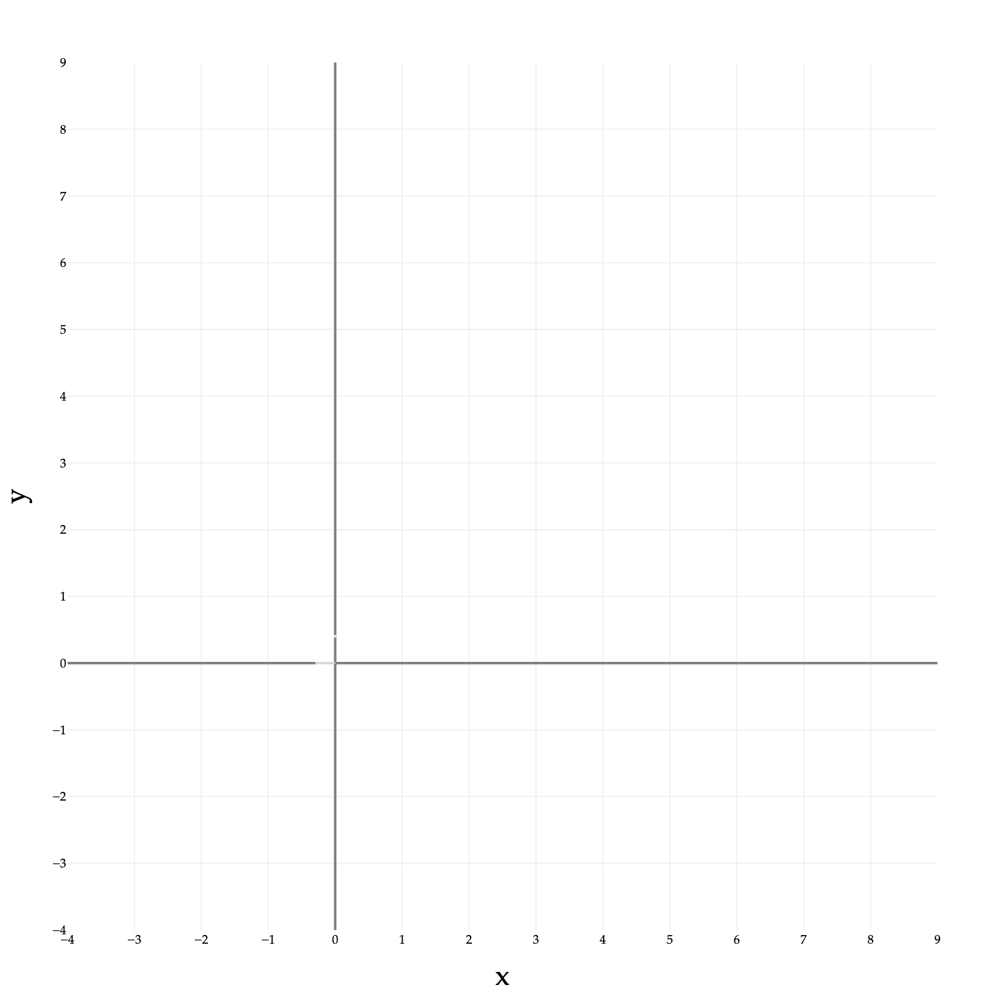
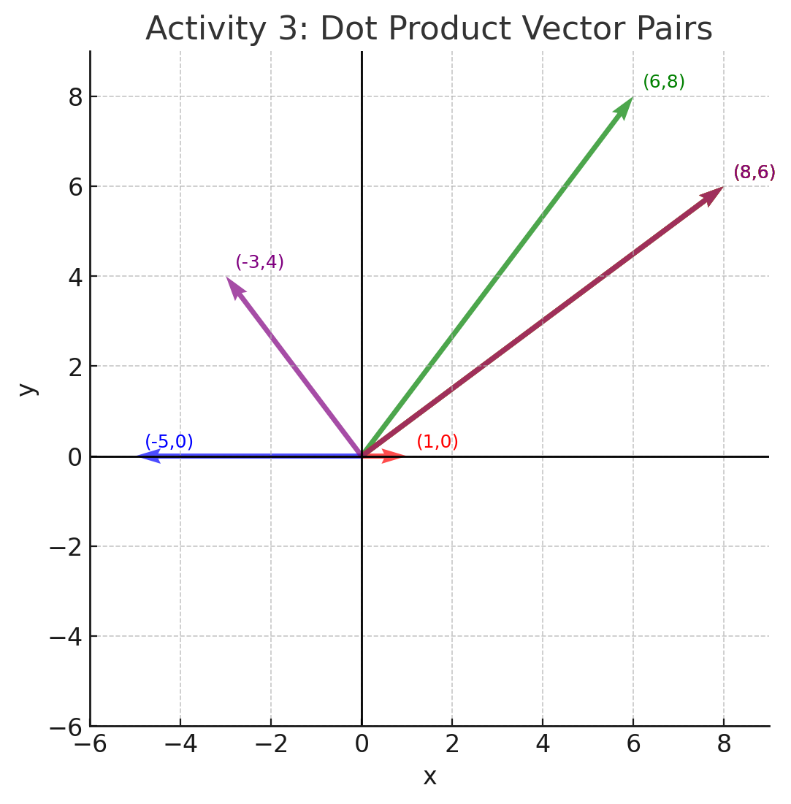

# Lab 3: Vectors and the Dot Product

**due** for completion at 11:59PM Ann Arbor Time on Wednesday, May 13th, 2026

<a class="btn btn-info assignment-pdf-button" href="/resources/labs/lab03/lab03.pdf" target="_blank">View as PDF ✏️</a>
<a class="btn btn-info assignment-pdf-button" href="/resources/labs/lab03/lab03-solutions.pdf" target="_blank">Solutions PDF ✅</a>

{: .yellow }

Each lab worksheet will contain several activities, some of which will involve writing code and others that will involve writing math on paper. To receive credit for a lab, you must complete as many of the activities as you can in 2 hours and submit a PDF of your work to Gradescope. We will provide specific instructions on how to submit programming activities (e.g. submitting the notebook or including a screenshot of some output).

Feel free to work with others in the course, but you must submit individually.

---

## Activities

- [Activity 1: Linear Combinations](#activity-1-linear-combinations)
- [Activity 2: The Dot Product](#activity-2-the-dot-product)
- [Activity 3: Angles and Orthogonality](#activity-3-angles-and-orthogonality)
- [Activity 4: Sum--Difference Orthogonality](#activity-4-sum--difference-orthogonality)
- [Activity 5: Triangle Inequality](#activity-5-triangle-inequality)
- [Activity 6: Arrays in NumPy](#activity-6-arrays-in-numpy)

---

## Recap: Vectors and the Dot Product

-   ([Chapters 3.1](https://notes.eecs245.org/vectors/vectors-and-linear-combinations/) and [3.2](https://notes.eecs245.org/vectors/norms/)) The **norm** of a vector \\(\vec v \in \mathbb{R}^n\\) measures its length: 

$$
\lVert \vec v \rVert = \sqrt{v_1^2 + v_2^2 + \dots + v_n^2}
$$

 This is the default norm for vectors in \\(\mathbb{R}^n\\), but other norms exist.

-   ([3.1](https://notes.eecs245.org/vectors/vectors-and-linear-combinations/)) A **linear combination** of the vectors \\(\vec v&#95;1,\vec v&#95;2, \dots,\vec v&#95;d\\) is any vector that can be written as 

$$
a_1\vec v_1 + a_2\vec v_2+\dots+a_d\vec v_d
$$

 where \\(a&#95;1, a&#95;2, \dots, a&#95;d\\) are scalars. We can think of this as taking bits of each vector and adding them together. The \\(a&#95;i\\)'s are called the **coefficients** of the linear combination.

-   ([3.3](https://notes.eecs245.org/vectors/dot-product/)) The **dot product** of two vectors \\(\vec u, \vec v \in \mathbb{R}^n\\) is defined as: 

$$
\vec u \cdot \vec v = \begin{bmatrix}u_1 \\\\ u_2 \\\\ \dots \\\\ u_n\end{bmatrix} \cdot \begin{bmatrix}v_1 \\\\ v_2 \\\\ \dots \\\\ v_n\end{bmatrix} = u_1v_1 + u_2v_2 + \dots + u_nv_n
$$

 The result is a **scalar**, not another vector.

-   ([3.3](https://notes.eecs245.org/vectors/dot-product/)) The dot product also has a geometric definition, involving the norms (lengths) of the vectors and the angle between them: 

$$
\vec u \cdot \vec v = ||\vec u|| ||\vec v|| \text{cos}\theta
$$

-   ([3.3](https://notes.eecs245.org/vectors/dot-product/)) The key takeaway from the dot product is that it tells us how similar the directions of two vectors are. When two vectors have a dot product of 0, they are **orthogonal**, or have a 90 degree angle between them.

---

## Activity 1: Linear Combinations

Let \\(\vec u = \begin{bmatrix} 4 \\\\ 3 \end{bmatrix}\\), \\(\vec v = \begin{bmatrix} -1 \\\\ -3 \end{bmatrix}\\), and \\(\vec w = \begin{bmatrix} -6 \\\\ 9 \end{bmatrix}\\).

a)

Find values of \\(a\\) and \\(b\\) such that \\(a \vec u + b \vec v = \vec w\\). By finding \\(a\\) and \\(b\\), you have written \\(\vec w\\) as a **linear combination** of \\(\vec u\\) and \\(\vec v\\).

Solution

We can pose this problem as solving a system of equations. By scalar multiplication, we have:

$$
\begin{align*}
a \begin{bmatrix} 4 \\\\ 3 \end{bmatrix} + b \begin{bmatrix} -1 \\\\ -3 \end{bmatrix} &= \begin{bmatrix} -6 \\\\ 9 \end{bmatrix} \\\\
\begin{bmatrix} 4a \\\\ 3a \end{bmatrix} + \begin{bmatrix} -b \\\\ -3b \end{bmatrix} &= \begin{bmatrix} -6 \\\\ 9 \end{bmatrix} \\\\
\begin{bmatrix} 4a - b \\\\ 3a - 3b \end{bmatrix} &= \begin{bmatrix} -6 \\\\ 9 \end{bmatrix}
\end{align*}
$$

The vector equation on the last line is equivalent to the system of equations:

$$
\begin{cases}
  4a - b &= -6 \\\\
  3a - 3b &= 9
\end{cases}
$$

So, we just need to solve this system of equations to find \\(a\\) and \\(b\\).

To do so, we can multiply the first equation by 3 to get:

$$
\begin{cases}
  12a - 3b &= -18 \\\\
  3a - 3b &= 9
\end{cases}
$$

Then, we can subtract the second equation from the first to get:

$$
9a = -27 \implies a = -3
$$

Substituting \\(a = -3\\) back into the second equation, we get:

$$
3(-3) - 3b = 9 \implies -9 - 3b = 9 \implies -3b = 18 \implies b = -6
$$

So, we have \\(\boxed{a = -3}\\) and \\(\boxed{b = -6}\\).

To verify that this solution works, we can substitute \\(a = -3\\) and \\(b = -6\\) back into the original equation:

$$
(-3)\begin{bmatrix}4\\\\3\end{bmatrix} + (-6)\begin{bmatrix}-1\\\\-3\end{bmatrix}
= \begin{bmatrix}-12\\\\-9\end{bmatrix} + \begin{bmatrix}6\\\\18\end{bmatrix}
= \begin{bmatrix}-6\\\\9\end{bmatrix}=\vec w
$$

b)

Now, try and write \\(\vec w\\) as a linear combination of \\(\vec u\\), \\(\vec v\\), and \\(\begin{bmatrix} 2 \\\\ 1 \end{bmatrix}\\). In other words, try and find values of \\(a\\), \\(b\\), and \\(c\\) such that

$$
a \begin{bmatrix} 4 \\\\ 3 \end{bmatrix} + b \begin{bmatrix} -1 \\\\ -3 \end{bmatrix} + c \begin{bmatrix} 2 \\\\ 1 \end{bmatrix} = \vec w
$$

What happens? Why?

Solution

We can start by trying to solve the corresponding system of equations: 

$$
\begin{cases}
4a - b + 2c = -6\\\\
3a - 3b + c = 9
\end{cases}
$$

There are 2 equations and 3 unknowns, **which means thare are infinitely many solutions for \\(a\\), \\(b\\), and \\(c\\)**.

What's the linear algebra reason for this?

-   With just \\(\begin{bmatrix}4\\\\3\end{bmatrix}\\) and \\(\begin{bmatrix}-1\\\\-3\end{bmatrix}\\), you can already create any other vector in \\(\mathbb{R}^2\\). That is, any vector in \\(\mathbb{R}^2\\) can be written as a linear combination of \\(\begin{bmatrix}4\\\\3\end{bmatrix}\\) and \\(\begin{bmatrix}-1\\\\-3\end{bmatrix}\\).

-   That is, for **any** vector \\(\vec w \in \mathbb{R}^2\\) (not just the one in this question), there exist **unique values** of \\(a\\) and \\(b\\) such that 

$$
a \begin{bmatrix}4\\\\3\end{bmatrix} + b \begin{bmatrix}-1\\\\-3\end{bmatrix} = \vec w
$$

-   Since \\(\begin{bmatrix} 4 \\\\ 3 \end{bmatrix}\\) and \\(\begin{bmatrix} -1 \\\\ -3 \end{bmatrix}\\) already can create any other vector in \\(\mathbb{R}^2\\), adding \\(\begin{bmatrix} 2 \\\\ 1 \end{bmatrix}\\) to the linear combination doesn't "unlock" any new vectors --- we can still create any other vector in \\(\mathbb{R}^2\\).

-   But, because \\(\begin{bmatrix} 2 \\\\ 1 \end{bmatrix}\\) already can be created using \\(\begin{bmatrix} 4 \\\\ 3 \end{bmatrix}\\) and \\(\begin{bmatrix} -1 \\\\ -3 \end{bmatrix}\\), adding it to the linear combination makes it so that there are infinitely many solutions for \\(a\\), \\(b\\), and \\(c\\) in 

$$
a \begin{bmatrix}4\\\\3\end{bmatrix} + b \begin{bmatrix}-1\\\\-3\end{bmatrix} + c \begin{bmatrix}2\\\\1\end{bmatrix} = \vec w
$$

If there are infinitely many solutions, how do we find them? Let's treat \\(c\\) as a free variable, and solve for \\(a\\) and \\(b\\) in terms of \\(c\\).

$$
\begin{cases}
4a - b + 2c = -6\\\\
3a - 3b + c = 9
\end{cases}
$$

Multiplying the first equation by 3 gives us:

$$
\begin{cases}
12a - 3b + 6c = -18\\\\
3a - 3b + c = 9
\end{cases}
$$

Subtracting the second equation from the (new) first gives us:

$$
9a + 5c = -27 \implies a = -3 - \frac{5}{9}c
$$

Similarly, multiplying the first equation by 3 and the second equation by 4 gives us:

$$
\begin{cases}
12a - 3b + 6c = -18\\\\
12a - 12b + 4c = 36
\end{cases}
$$

Subtracting the (new) second equation from the (new) first gives us:

$$
9b + 2c = -54 \implies b = -6 - \frac{2}{9}c
$$

So, the values of \\(a\\), \\(b\\), and \\(c\\) that satisfy

$$
a \begin{bmatrix} 4 \\\\ 3 \end{bmatrix} + b \begin{bmatrix} -1 \\\\ -3 \end{bmatrix} + c \begin{bmatrix} 2 \\\\ 1 \end{bmatrix} = \begin{bmatrix} -6 \\\\ 9 \end{bmatrix}
$$

are

$$
\boxed{a = -3 - \frac{5}{9}c, \qquad b = -6 - \frac{2}{9}c, \qquad c = c, c \in \mathbb{R}}
$$

\\(c\\) can be anything, which is why there are infinitely many solutions. If we let \\(c = 0\\), then we get back \\(a = -3\\) and \\(b = -6\\) from part **a)**. But, say, if we let \\(c = -9\\), then we get \\(a = 2\\) and \\(b = -4\\), which also works:

$$
2 \begin{bmatrix} 4 \\\\ 3 \end{bmatrix} - 4 \begin{bmatrix} -1 \\\\ -3 \end{bmatrix} + (-9) \begin{bmatrix} 2 \\\\ 1 \end{bmatrix} = \begin{bmatrix} 8 \\\\ 6 \end{bmatrix} - \begin{bmatrix} -4 \\\\ -12 \end{bmatrix} + \begin{bmatrix} -18 \\\\ -9 \end{bmatrix} = \begin{bmatrix} -6 \\\\ 9 \end{bmatrix} = \vec w
$$

c)

Now, try and write \\(\vec w\\) as a linear combination of \\(\begin{bmatrix} 2 \\\\ 1 \end{bmatrix}\\) and \\(\begin{bmatrix} -4 \\\\ -2 \end{bmatrix}\\). What happens? Why?

Solution

Note \\(\begin{bmatrix}-4\\\\-2\end{bmatrix}=-2\begin{bmatrix}2\\\\1\end{bmatrix}\\), which means these vectors point in the same direction, or lie on the same line. (The formal term is that these vectors are **collinear**.)

Since \\(\vec w=\begin{bmatrix}-6\\\\9\end{bmatrix}\\) is not a scalar multiple of \\(\begin{bmatrix}2\\\\1\end{bmatrix}\\) (ratios \\(-6/2=-3\\) vs. \\(9/1=9\\) disagree), **no solution exists**!

To conclude, because the two vectors \\(\begin{bmatrix}2\\\\1\end{bmatrix}\\) and \\(\begin{bmatrix}-4\\\\-2\end{bmatrix}\\) are collinear, it is impossible to write \\(\vec w\\) as a linear combination of them. The only possible linear combinations are of the form \\(c \begin{bmatrix}2\\\\1\end{bmatrix}\\) for some \\(c \in \mathbb{R}\\).

---

## Activity 2: The Dot Product

For each pair of vectors below (1) draw them on the grid at the bottom of the page and (2) compute their dot product.

a)

\\(\begin{bmatrix} 8 \\\\ 6 \end{bmatrix} \text { and } \begin{bmatrix} 1 \\\\ 0 \end{bmatrix}\\)

Solution

$$
8\cdot 1 + 6\cdot 0 = 8.
$$

b)

\\(\begin{bmatrix} 8 \\\\ 6 \end{bmatrix} \text { and } \begin{bmatrix} -5 \\\\ 0 \end{bmatrix}\\)

Solution

$$
8\cdot (-5) + 6\cdot 0 = -40.
$$

c)

\\(\begin{bmatrix} 8 \\\\ 6 \end{bmatrix} \text { and } \begin{bmatrix} 6 \\\\ 8 \end{bmatrix}\\)

Solution

$$
8\cdot 6 + 6\cdot 8 = 48 + 48 = 96.
$$

d)

\\(\begin{bmatrix} 8 \\\\ 6 \end{bmatrix} \text { and } \begin{bmatrix} 8 \\\\ 6 \end{bmatrix}\\)

Solution

$$
8\cdot 8 + 6\cdot 6 = 64 + 36 = 100.
$$

e)

\\(\begin{bmatrix} 8 \\\\ 6 \end{bmatrix} \text { and } \begin{bmatrix} -3 \\\\ 4 \end{bmatrix}\\)

Solution

$$
8\cdot (-3) + 6\cdot 4 = -24 + 24 = 0.
$$

Since the dot product is \\(0\\), the vectors are **orthogonal**.

Solution

---

## Activity 3: Angles and Orthogonality

In this activity, we will investigate the relationship between the two definitions of the dot product and learn how to use this equivalence to measure the similarity between two vectors. 

$$
\vec u \cdot \vec v = \begin{bmatrix}u_1 \\\\ u_2 \\\\ \dots \\\\ u_n\end{bmatrix} \cdot \begin{bmatrix}v_1 \\\\ v_2 \\\\ \dots \\\\ v_n\end{bmatrix} = u_1v_1 + u_2v_2 + \dots + u_nv_n
$$

 

$$
\vec u \cdot \vec v = ||\vec u|| ||\vec v|| \text{cos}\theta
$$

 Let \\(\vec w=\begin{bmatrix}5\\\\0\\\\-4\\\\1\end{bmatrix}\\) and \\(\vec x=\begin{bmatrix}9\\\\1\\\\2\\\\3\end{bmatrix}\\).

a)

Find \\(\vec w \cdot \vec x\\), \\(\lVert \vec w \rVert\\), and \\(\lVert \vec x \rVert\\).

Solution

$$
\vec w \cdot \vec x = 5\cdot 9 + 0\cdot 1 + (-4)\cdot 2 + 1\cdot 3 = 45 + 0 - 8 + 3 = \boxed{40}.
$$

 

$$
\lVert \vec w \rVert = \sqrt{5^2 + 0^2 + (-4)^2 + 1^2} = \sqrt{25 + 0 + 16 + 1} = \boxed{\sqrt{42}}.
$$

 

$$
\lVert \vec x \rVert = \sqrt{9^2 + 1^2 + 2^2 + 3^2} = \sqrt{81 + 1 + 4 + 9} = \boxed{\sqrt{95}}.
$$

b)

Using the results of part **a)**, find the angle between \\(\vec w\\) and \\(\vec x\\). Leave your answer in the form \\(\cos^{-1}(\cdot)\\).

Solution

Using \\(\vec w \cdot \vec x=\|\vec w\|\,\|\vec x\|\cos\theta\\), 

$$
\cos \theta = \frac{\vec w \cdot \vec x}{\|\vec w\|\,\|\vec x\|}
= \frac{40}{\sqrt{42}\,\sqrt{95}}.
$$

 Therefore 

$$
\boxed{\;\theta = \cos^{-1}\!\left(\frac{40}{\sqrt{42\cdot 95}}\right)\;}.
$$

c)

What is \\(\cos(90^\circ)\\)? What does this have to do with orthogonality?

Solution

$$
\cos(90^\circ)=0.
$$

 If the angle \\(\theta\\) between \\(\vec u\\) and \\(\vec v\\) is \\(90^\circ\\), then 

$$
\vec u\cdot\vec v=\|\vec u\|\,\|\vec v\|\cos\theta=\|\vec u\|\,\|\vec v\| \cdot 0 = 0,
$$

 so the vectors are **orthogonal**. Conversely, if \\(\vec u\cdot\vec v=0\\) (and neither vector is the zero vector), then \\(\cos\theta=0\\) and \\(\theta=90^\circ\\).

---

## Activity 4: Sum--Difference Orthogonality

Let \\(\vec u=\begin{bmatrix}2\\\\-1\\\\0\\\\5\end{bmatrix}\\) and \\(\vec v=\begin{bmatrix}1\\\\2\\\\4\\\\-3\end{bmatrix}\\).

a)

Show that \\(\vec u+\vec v\\) and \\(\vec u-\vec v\\) are orthogonal.

Solution

Let's start by computing the two vectors: 

$$
\vec u+\vec v=\begin{bmatrix}3\\\\1\\\\4\\\\2\end{bmatrix},\qquad
\vec u-\vec v=\begin{bmatrix}1\\\\-3\\\\-4\\\\8\end{bmatrix}.
$$

 Their dot product is 

$$
(\vec u+\vec v)\cdot(\vec u-\vec v)
=3\cdot1+1\cdot(-3)+4\cdot(-4)+2\cdot 8
=3-3-16+16
=0.
$$

 Since the dot product is \\(0\\), the vectors are orthogonal.

b)

Now suppose \\(\vec u,\vec v\in\mathbb{R}^n\\) are arbitrary vectors with the same number of components. Is it always true that \\(\vec u+\vec v\\) and \\(\vec u-\vec v\\) are orthogonal?

-   If so, prove why.

-   If not, specify conditions under which it's guaranteed that \\(\vec u+\vec v\\) and \\(\vec u-\vec v\\) are orthogonal.

<em>Hint: Use the distributive property of the dot product, which states that </em>

$$
(\vec a + \vec b) \cdot (\vec c + \vec d) = \vec a \cdot \vec c + \vec a \cdot \vec d + \vec b \cdot \vec c + \vec b \cdot \vec d
$$

Solution

For any two vectors \\(\vec u\\) and \\(\vec v\\), 

$$
(\vec u+\vec v)\cdot(\vec u-\vec v)
= \vec u\cdot\vec u - \vec u\cdot\vec v + \vec v\cdot\vec u - \vec v\cdot\vec v
= \|\vec u\|^2 - \|\vec v\|^2,
$$

 since \\(\vec u\cdot\vec v=\vec v\cdot\vec u\\).

So, in order for \\(\vec u+\vec v\\) and \\(\vec u-\vec v\\) to be orthogonal, we need 

$$
\|\vec u\|^2 - \|\vec v\|^2 = 0
$$

 which means 

$$
\|\vec u\| = \|\vec v\|
$$

So, \\(\vec u+\vec v\\) and \\(\vec u-\vec v\\) are orthogonal if (and only if!) the two vectors have equal length. That was the case in part **a)** --- both vectors had a norm of \\(\sqrt{2^2 + (-1)^2 + 0^2 + 5^2} = \sqrt{30}\\).

---

## Activity 5: Triangle Inequality

The triangle inequality states that for any two vectors \\(\vec u, \vec v \in \mathbb{R}^n:\\) 

$$
\lVert \vec u + \vec v \rVert \leq \lVert \vec u \rVert + \lVert \vec v \rVert
$$

a)

**For the vectors \\(\vec u = \begin{bmatrix} 4 \\\\ 3 \end{bmatrix}\\) and \\(\vec v = \begin{bmatrix} -1 \\\\ -3 \end{bmatrix}\\)**, verify that the triangle inequality holds. That is, show that the left-hand side is less than or equal to the right-hand side.

Solution

First, let's find \\(\lVert \vec u + \vec v \rVert\\).

$$
\begin{align*}
\lVert \vec u + \vec v \rVert
&= \left\lVert \begin{bmatrix} 4 \\\\ 3 \end{bmatrix} + \begin{bmatrix} -1 \\\\ -3 \end{bmatrix} \right\rVert \\\\
&= \left\lVert \begin{bmatrix} 4-1 \\\\ 3-3 \end{bmatrix} \right\rVert \\\\
&= \left\lVert \begin{bmatrix} 3 \\\\ 0 \end{bmatrix} \right\rVert \\\\
&= \sqrt{3^2 + 0^2} \\\\
&= \sqrt{9} \\\\
&= 3
\end{align*}
$$

We found that \\(\lVert \vec u \rVert = 5\\) in part **a)**. What's \\(\lVert \vec v \rVert\\)?

$$
\begin{align*}
\lVert \vec v \rVert
&= \left\lVert \begin{bmatrix} -1 \\\\ -3 \end{bmatrix} \right\rVert \\\\
&= \sqrt{(-1)^2 + (-3)^2} \\\\
&= \sqrt{1 + 9} \\\\
&= \sqrt{10}
\end{align*}
$$

So, the triangle inequality claims that

$$
\lVert \vec u + \vec v \rVert \leq \lVert \vec u \rVert + \lVert \vec v \rVert
$$

which, here, is

$$
3 \leq 5 + \sqrt{10}
$$

This is true, since 5 alone is greater than 3, so \\(5 + \sqrt{10}\\) is surely also greater than (or equal to) 3.

b)

Find two **different** vectors in \\(\vec x, \vec y \in \mathbb{R}^2\\) such that the triangle inequality achieves **equality**, i.e. where

$$
\lVert \vec x + \vec y \rVert = \lVert \vec x \rVert + \lVert \vec y \rVert
$$

What is the relationship between the \\(\vec x\\) and \\(\vec y\\) you found?

Solution

Example: let \\(\vec x = \begin{bmatrix} 1 \\\\ 1 \end{bmatrix}\\) and \\(\vec y = \begin{bmatrix} 2 \\\\ 2 \end{bmatrix}\\). Then,

$$
\left\lVert \vec x + \vec y \right\rVert = \left\lVert \begin{bmatrix} 3 \\\\ 3 \end{bmatrix} \right\rVert = \sqrt{3^2 + 3^2} = 3 \sqrt{2}
$$

 

$$
\lVert \vec x \rVert + \lVert \vec y \rVert = \sqrt{1^2 + 1^2} + \sqrt{2^2 + 2^2} = \sqrt{2} + \sqrt{8} = \sqrt{2} + 2 \sqrt{2} = 3 \sqrt{2}
$$

So, in this case, the triangle inequality achieves equality. What you'll notice is that \\(\vec x\\) and \\(\vec y\\) point in the same direction, i.e. \\(\vec y = 2 \vec x\\).

---

## Activity 6: Arrays in NumPy

Instead of writing code in a separate Jupyter Notebook for this lab, you will interact with the code cells that exist in the course notes.

In particular, go to [Chapter 3.2](https://notes.eecs245.org/vectors/norms/) of the course notes, scroll all the way to the bottom, and complete **Activity 5** there. Once you're done, include a screenshot of your completed Activity 5 in your PDF submission of Lab 3 to Gradescope, making sure to include proof that you've completed the activity.
