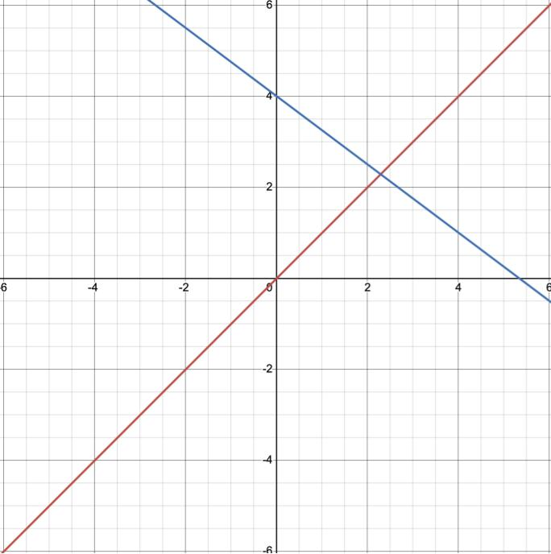

# Lab 5: Vector Spaces, Subspaces, Bases, and Dimension

**due** for completion at 11:59PM Ann Arbor Time on Wednesday, May 20th, 2026

<a class="btn btn-info assignment-pdf-button" href="/resources/labs/lab05/lab05.pdf" target="_blank">View as PDF ✏️</a>

{: .yellow }

Each lab worksheet will contain several activities, some of which will involve writing code and others that will involve writing math on paper. To receive credit for a lab, you must complete as many of the activities as you can in 2 hours and submit a PDF of your work to Gradescope. We will provide specific instructions on how to submit programming activities (e.g. submitting the notebook or including a screenshot of some output).

Feel free to work with others in the course, but you must submit individually.

---

## Activities

- [Activity 1: Formal Definition of Linear Independence](#activity-1-formal-definition-of-linear-independence)
- [Activity 2: Thinking in Higher Dimensions](#activity-2-thinking-in-higher-dimensions)
- [Activity 3: Introduction to Subspaces](#activity-3-introduction-to-subspaces)
- [Activity 4: Finding Non-Examples of Subspaces](#activity-4-finding-non-examples-of-subspaces)
- [Activity 5: Finding Bases for Subspaces](#activity-5-finding-bases-for-subspaces)

---

**Recap: Vector Spaces, Subspaces, Bases, and Dimension** ([Chapter 4.3](https://notes.eecs245.org/linear-independence/vector-spaces-basis-dimension/))

-   A **subspace** \\(S\\) of a vector space \\(V\\) is a set of vectors where:

    1.  \\(\vec{0} \in S\\)

    2.  \\(\vec{u}, \vec{v} \in S \rightarrow \vec{u} + \vec{v} \in S\\)

    3.  \\(\vec{u} \in S, c \in \mathbb{R} \rightarrow c\vec{u} \in S\\)

    If you take any two vectors \\(\vec{u}, \vec{v} \in S\\), then any linear combination \\(c\vec{u}+d\vec{v}\\) must also be in \\(S\\).

-   As an example, let's consider \\(\mathbb{R}^2\\), which itself is a vector space.

    

-   The line through the origin **is** a subspace of \\(\mathbb{R}^2\\), with dimension 1. It is the span of the vector \\(\begin{bmatrix}1 \\\\ 1\end{bmatrix}\\).

-   The other line, however, is **not** a subspace of \\(\mathbb{R}^2\\), since it doesn't pass through the origin.

-   A **basis** for a subspace \\(S\\) is a set of vectors that:

    1.  span all of \\(S\\)

    2.  are linearly independent

    A basis for a subspace is a minimal set of vectors that spans the whole subspace. All subspaces have infinitely many bases. For example, \\(\left \lbrace \begin{bmatrix} 1 \\\\ 0 \end{bmatrix}, \begin{bmatrix} 0 \\\\ 1 \end{bmatrix} \right\rbrace\\) and \\(\left \lbrace \begin{bmatrix} 1 \\\\ 1 \end{bmatrix}, \begin{bmatrix} 2 \\\\ 3 \end{bmatrix} \right\rbrace\\) are both bases for \\(\mathbb{R}^2\\).

-   The **dimension** of a subspace \\(S\\), denoted \\(\text{dim}(S)\\), is the number of vectors in any basis for \\(S\\).

---

## Activity 1: Formal Definition of Linear Independence

Suppose \\(\vec v_1, \vec v_2, \ldots, \vec v_d \in \mathbb{R}^n\\), and that \\(\vec b \in \text{span}(\lbrace\vec v_1, \vec v_2, \ldots, \vec v_d\rbrace)\\).

a)

Give a one sentence English explanation of what it means for \\(\vec b \in \text{span}(\lbrace\vec v_1, \vec v_2, \ldots, \vec v_d\rbrace)\\).

b)

Suppose that \\(a_1 \vec v_1 + a_2 \vec v_2 + \ldots + a_d \vec v_d = \vec b\\) **and** \\(c_1 \vec v_1 + c_2 \vec v_2 + \ldots + c_d \vec v_d = \vec b\\), where at least one of the \\(a_i\\)'s is different from its corresponding \\(c_i\\).

Using the formal definition of linear independence from [Chapter 4.2](https://notes.eecs245.org/linear-independence/linear-independence/), determine whether or not \\(\vec v_1, \vec v_2, \ldots, \vec v_d\\) are linearly independent, and prove your answer.

c)

Find another set of coefficients \\(k_1, k_2, \ldots, k_d\\) such that

$$
k_1 \vec v_1 + k_2 \vec v_2 + \ldots + k_d \vec v_d = \vec b
$$

and at least one of the \\(k_i\\)'s is different from its corresponding \\(a_i\\) or \\(c_i\\).

By doing this, you're showing that if there is at least one way to write \\(\vec b\\) as a linear combination of a set of vectors, then there are infinitely many ways to write \\(\vec b\\) as a linear combination of those vectors; there can't just be two or three ways to do it.

---

## Activity 2: Thinking in Higher Dimensions

a)

Suppose \\(\vec v_1, \vec v_2, \ldots, \vec v_8\\) are 8 vectors in \\(\mathbb{R}^5\\). Fill in each blank below with one of the provided options, and explain your reasoning.

1.  These vectors \_\_\_\_\_\_\_\_ span all of \\(\mathbb{R}^5\\).

    (options: do, do not, might)

2.  These vectors \_\_\_\_\_\_\_\_ linearly independent.

    (options: are, are not, might be)

3.  Any 5 of these vectors \_\_\_\_\_\_\_\_ span all of \\(\mathbb{R}^5\\).

    (options: do, do not, might)

b)

Suppose \\(\vec u_1, \vec u_2, \ldots, \vec u_{10}\\) are 10 non-zero vectors in \\(\mathbb{R}^{11}\\).

Furthermore, suppose that \\(\text{span}(\lbrace\vec u_1, \vec u_2, \ldots, \vec u_{10}\rbrace)\\) is a 6-dimensional subspace of \\(\mathbb{R}^{11}\\). This means that there exists a subset of 6 of these vectors that is linearly independent and spans the same 6-dimensional subspace as the original 10 vectors; we just don't know which 6.

1.  Let \\(k\\) be the dimension of the subspace spanned by a subset of 4 of these vectors. What are all possible values of \\(k\\)?

2.  Let \\(m\\) be the dimension of the subspace spanned by a subset of 7 of these vectors. What are all possible values of \\(m\\)?

---

## Activity 3: Introduction to Subspaces

Only one of the following is a subspace of \\(\mathbb{R}^3\\). Which one? Explain why the others are not subspaces.

The set of vectors \\(\vec v = \begin{bmatrix} x \\\\ y \\\\ z \end{bmatrix}\\) in \\(\mathbb{R}^3\\) such that

1.  \\(x + 2y - 3z = 4\\)

2.  \\(\vec v\\) is on the line \\(L = \begin{bmatrix} 1 \\\\ -2 \\\\ 0 \end{bmatrix} + t \begin{bmatrix} 2 \\\\ 3 \\\\ 4 \end{bmatrix}, t \in \mathbb{R}\\)

3.  \\(x + y + z = 0\\) and \\(x - y + z = 1\\)

4.  \\(x = -z\\) and \\(x = z\\)

5.  \\(x^2 + y^2 = z\\)

---

## Activity 4: Finding Non-Examples of Subspaces

In this activity, you'll find sets of vectors in \\(\mathbb{R}^2\\) that satisfy some, but not all, of the requirements for a subspace. Think creatively, and since we're working in \\(\mathbb{R}^2\\), visualize the vectors!

a)

Find a set of vectors in \\(\mathbb{R}^2\\) such that the sum of any two vectors \\(\vec u\\) and \\(\vec v\\) in the set is also in the set, but \\(\frac{1}{2} \vec v\\) is possibly not in the set.

b)

Find a set of vectors in \\(\mathbb{R}^2\\) such that \\(c \vec v\\) is in the set for any vector \\(\vec v\\) in the set and any scalar \\(c\\), but the sum of any two vectors \\(\vec u\\) and \\(\vec v\\) in the set is possibly not in the set.

---

## Activity 5: Finding Bases for Subspaces

In each part below, find **two different possible bases** for the given subspace, and state the **dimension** of the subspace.

a)

\\(S = \text{span} \left( \left\lbrace \begin{bmatrix} 1 \\\\ 3 \\\\ 3 \end{bmatrix}, \begin{bmatrix} -3 \\\\ -9 \\\\ -9 \end{bmatrix}, \begin{bmatrix} 1 \\\\ 5 \\\\ -1 \end{bmatrix}, \begin{bmatrix} 2 \\\\ 7 \\\\ 4 \end{bmatrix}, \begin{bmatrix} 1 \\\\ 4 \\\\ 1 \end{bmatrix} \right\rbrace \right)\\)

b)

\\(S = \left\lbrace \begin{bmatrix} v_1 \\\\ v_2 \end{bmatrix} \mid v_1 = - v_2; v_1, v_2 \in \mathbb{R} \right\rbrace\\)

c)

\\(S = \left\lbrace \begin{bmatrix} v_1 \\\\ v_2 \\\\ v_3 \\\\ v_4 \end{bmatrix} \mid \ v_4 = 0; v_1, v_2, v_3 \in \mathbb{R} \right\rbrace\\)

