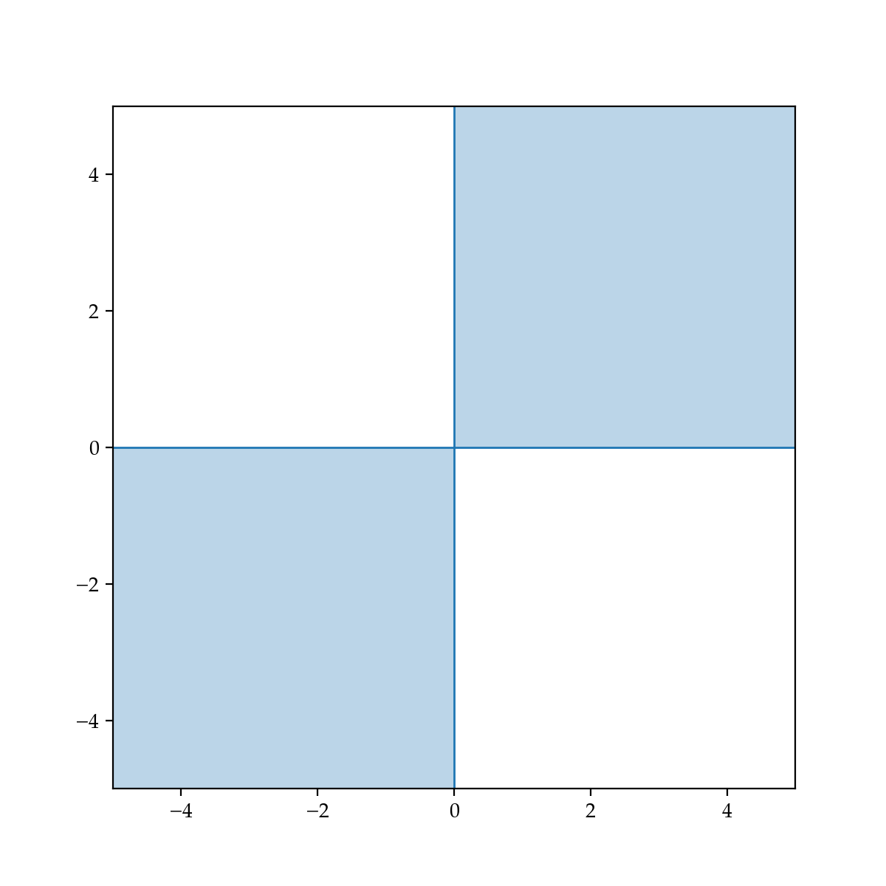



# Lab 5: Vector Spaces, Subspaces, Bases, and Dimension

**due** for completion at 11:59PM Ann Arbor Time on Wednesday, May 20th, 2026

<a class="btn btn-info assignment-pdf-button" href="/resources/labs/lab05/lab05.pdf" target="_blank">View as PDF ✏️</a>
<a class="btn btn-info assignment-pdf-button" href="/resources/labs/lab05/lab05-solutions.pdf" target="_blank">Solutions PDF ✅</a>

{: .yellow }

Each lab worksheet will contain several activities, some of which will involve writing code and others that will involve writing math on paper. To receive credit for a lab, you must complete as many of the activities as you can in 2 hours and submit a PDF of your work to Gradescope. We will provide specific instructions on how to submit programming activities (e.g. submitting the notebook or including a screenshot of some output).

Feel free to work with others in the course, but you must submit individually.

---

## Activities

- [Activity 1: Formal Definition of Linear Independence](#activity-1-formal-definition-of-linear-independence)
- [Activity 2: Thinking in Higher Dimensions](#activity-2-thinking-in-higher-dimensions)
- [Activity 3: Introduction to Subspaces](#activity-3-introduction-to-subspaces)
- [Activity 4: Finding Non-Examples of Subspaces](#activity-4-finding-non-examples-of-subspaces)
- [Activity 5: Finding Bases for Subspaces](#activity-5-finding-bases-for-subspaces)

---

**Recap: Vector Spaces, Subspaces, Bases, and Dimension** ([Chapter 4.3](https://notes.eecs245.org/linear-independence/vector-spaces-basis-dimension/))

-   A **subspace** \\(S\\) of a vector space \\(V\\) is a set of vectors where:

    1.  \\(\vec{0} \in S\\)

    2.  \\(\vec{u}, \vec{v} \in S \rightarrow \vec{u} + \vec{v} \in S\\)

    3.  \\(\vec{u} \in S, c \in \mathbb{R} \rightarrow c\vec{u} \in S\\)

    If you take any two vectors \\(\vec{u}, \vec{v} \in S\\), then any linear combination \\(c\vec{u}+d\vec{v}\\) must also be in \\(S\\).

-   As an example, let's consider \\(\mathbb{R}^2\\), which itself is a vector space.

    

-   The line through the origin **is** a subspace of \\(\mathbb{R}^2\\), with dimension 1. It is the span of the vector \\(\begin{bmatrix}1 \\\\ 1\end{bmatrix}\\).

-   The other line, however, is **not** a subspace of \\(\mathbb{R}^2\\), since it doesn't pass through the origin.

-   A **basis** for a subspace \\(S\\) is a set of vectors that:

    1.  span all of \\(S\\)

    2.  are linearly independent

    A basis for a subspace is a minimal set of vectors that spans the whole subspace. All subspaces have infinitely many bases. For example, \\(\left \lbrace \begin{bmatrix} 1 \\\\ 0 \end{bmatrix}, \begin{bmatrix} 0 \\\\ 1 \end{bmatrix} \right\rbrace\\) and \\(\left \lbrace \begin{bmatrix} 1 \\\\ 1 \end{bmatrix}, \begin{bmatrix} 2 \\\\ 3 \end{bmatrix} \right\rbrace\\) are both bases for \\(\mathbb{R}^2\\).

-   The **dimension** of a subspace \\(S\\), denoted \\(\text{dim}(S)\\), is the number of vectors in any basis for \\(S\\).

---

## Activity 1: Formal Definition of Linear Independence

Suppose \\(\vec v&#95;1, \vec v&#95;2, \ldots, \vec v&#95;d \in \mathbb{R}^n\\), and that \\(\vec b \in \text{span}(\lbrace\vec v&#95;1, \vec v&#95;2, \ldots, \vec v&#95;d\rbrace)\\).

a)

Give a one sentence English explanation of what it means for \\(\vec b \in \text{span}(\lbrace\vec v&#95;1, \vec v&#95;2, \ldots, \vec v&#95;d\rbrace)\\).

Solution

If \\(\vec b \in \text{span}(\lbrace\vec v&#95;1, \vec v&#95;2, \ldots, \vec v&#95;d\rbrace)\\), then there exist scalars \\(a&#95;1, a&#95;2, \ldots, a&#95;d\\) such that \\(\vec b = a&#95;1 \vec v&#95;1 + a&#95;2 \vec v&#95;2 + \ldots + a&#95;d \vec v&#95;d\\), i.e. \\(\vec b\\) can be written as a linear combination of \\(\vec v&#95;1, \vec v&#95;2, \ldots, \vec v&#95;d\\).

b)

Suppose that \\(a&#95;1 \vec v&#95;1 + a&#95;2 \vec v&#95;2 + \ldots + a&#95;d \vec v&#95;d = \vec b\\) **and** \\(c&#95;1 \vec v&#95;1 + c&#95;2 \vec v&#95;2 + \ldots + c&#95;d \vec v&#95;d = \vec b\\), where at least one of the \\(a&#95;i\\)'s is different from its corresponding \\(c&#95;i\\).

Using the formal definition of linear independence from [Chapter 4.2](https://notes.eecs245.org/linear-independence/linear-independence/), determine whether or not \\(\vec v&#95;1, \vec v&#95;2, \ldots, \vec v&#95;d\\) are linearly independent, and prove your answer.

Solution

We're given that

$$
\begin{align*}
a_1 \vec v_1 + a_2 \vec v_2 + \ldots + a_d \vec v_d &= \vec b \\\\
c_1 \vec v_1 + c_2 \vec v_2 + \ldots + c_d \vec v_d &= \vec b
\end{align*}
$$

Subtracting the two equations gives us

$$
(a_1 - c_1) \vec v_1 + (a_2 - c_2) \vec v_2 + \ldots + (a_d - c_d) \vec v_d = \vec 0
$$

We know that vectors \\(\vec v&#95;1, \vec v&#95;2, \ldots, \vec v&#95;d\\) are linearly independent if the only way to write the zero vector \\(\vec 0\\) as a linear combination of them is to have all the coefficients be zero.

But here, we were told that at least one of the \\(a&#95;i\\)'s is different from its corresponding \\(c&#95;i\\), meaning that at least one of the \\((a&#95;i - c&#95;i)\\) values is non-zero. This means that there is some way to create \\(\vec 0\\) using a non-zero linear combination of \\(\vec v&#95;1, \vec v&#95;2, \ldots, \vec v&#95;d\\), which means that \\(\vec v&#95;1, \vec v&#95;2, \ldots, \vec v&#95;d\\) are linearly dependent.

c)

Find another set of coefficients \\(k&#95;1, k&#95;2, \ldots, k&#95;d\\) such that

$$
k_1 \vec v_1 + k_2 \vec v_2 + \ldots + k_d \vec v_d = \vec b
$$

and at least one of the \\(k&#95;i\\)'s is different from its corresponding \\(a&#95;i\\) or \\(c&#95;i\\).

By doing this, you're showing that if there is at least one way to write \\(\vec b\\) as a linear combination of a set of vectors, then there are infinitely many ways to write \\(\vec b\\) as a linear combination of those vectors; there can't just be two or three ways to do it.

Solution

In the previous proof we subtracted the following two equations. What if we add them?

$$
\begin{align*}
a_1 \vec v_1 + a_2 \vec v_2 + \ldots + a_d \vec v_d &= \vec b \\\\
c_1 \vec v_1 + c_2 \vec v_2 + \ldots + c_d \vec v_d &= \vec b
\end{align*}
$$

This would give us

$$
(a_1 + c_1) \vec v_1 + (a_2 + c_2) \vec v_2 + \ldots + (a_d + c_d) \vec v_d = 2 \vec b
$$

Dividing both sides by 2 gives us

$$
\left( \frac{a_1 + c_1}{2} \right) \vec v_1 + \left( \frac{a_2 + c_2}{2} \right) \vec v_2 + \ldots + \left( \frac{a_d + c_d}{2} \right) \vec v_d = \vec b
$$

This is another linear combination of \\(\vec v&#95;1, \vec v&#95;2, \ldots, \vec v&#95;d\\) that equals \\(\vec b\\)! So \\(k&#95;1 = \frac{a&#95;1 + c&#95;1}{2}, k&#95;2 = \frac{a&#95;2 + c&#95;2}{2}, \ldots, k&#95;d = \frac{a&#95;d + c&#95;d}{2}\\).

Why does this imply that there are infinitely many ways to write \\(\vec b\\) as a linear combination of \\(\vec v&#95;1, \vec v&#95;2, \ldots, \vec v&#95;d\\)? It's because we could repeat this process once again, to get \\(\frac{a&#95;1 + k&#95;1}{2}\\), \\(\frac{a&#95;2 + k&#95;2}{2}\\), \\(\ldots\\), \\(\frac{a&#95;d + k&#95;d}{2}\\) as coefficients, and then again, and again. There are other ways to write \\(\vec b\\) as a linear combination of \\(\vec v&#95;1, \vec v&#95;2, \ldots, \vec v&#95;d\\) since they're linearly dependent, but we'd need to know more about the specific relationships between the vectors to find more.

---

## Activity 2: Thinking in Higher Dimensions

a)

Suppose \\(\vec v&#95;1, \vec v&#95;2, \ldots, \vec v&#95;8\\) are 8 vectors in \\(\mathbb{R}^5\\). Fill in each blank below with one of the provided options, and explain your reasoning.

1.  These vectors \_\_\_\_\_\_\_\_ span all of \\(\mathbb{R}^5\\).

    (options: do, do not, might)

2.  These vectors \_\_\_\_\_\_\_\_ linearly independent.

    (options: are, are not, might be)

3.  Any 5 of these vectors \_\_\_\_\_\_\_\_ span all of \\(\mathbb{R}^5\\).

    (options: do, do not, might)

b)

Suppose \\(\vec u&#95;1, \vec u&#95;2, \ldots, \vec u&#95;{10}\\) are 10 non-zero vectors in \\(\mathbb{R}^{11}\\).

Furthermore, suppose that \\(\text{span}(\lbrace\vec u&#95;1, \vec u&#95;2, \ldots, \vec u&#95;{10}\rbrace)\\) is a 6-dimensional subspace of \\(\mathbb{R}^{11}\\). This means that there exists a subset of 6 of these vectors that is linearly independent and spans the same 6-dimensional subspace as the original 10 vectors; we just don't know which 6.

1.  Let \\(k\\) be the dimension of the subspace spanned by a subset of 4 of these vectors. What are all possible values of \\(k\\)?

2.  Let \\(m\\) be the dimension of the subspace spanned by a subset of 7 of these vectors. What are all possible values of \\(m\\)?

---

## Activity 3: Introduction to Subspaces

Only one of the following is a subspace of \\(\mathbb{R}^3\\). Which one? Explain why the others are not subspaces.

The set of vectors \\(\vec v = \begin{bmatrix} x \\\\ y \\\\ z \end{bmatrix}\\) in \\(\mathbb{R}^3\\) such that

1.  \\(x + 2y - 3z = 4\\)

2.  \\(\vec v\\) is on the line \\(L = \begin{bmatrix} 1 \\\\ -2 \\\\ 0 \end{bmatrix} + t \begin{bmatrix} 2 \\\\ 3 \\\\ 4 \end{bmatrix}, t \in \mathbb{R}\\)

3.  \\(x + y + z = 0\\) and \\(x - y + z = 1\\)

4.  \\(x = -z\\) and \\(x = z\\)

5.  \\(x^2 + y^2 = z\\)

Solution

Recall that a subspace must contain the zero vector and must be closed under addition and scalar multiplication.

1.  \\(x + 2y - 3z = 4\\) is **not a subspace**. The zero vector is not in the set, since plugging in \\(x = 0, y = 0, z = 0\\) to the equation \\(x + 2y - 3z = 4\\) gives us \\(0 + 0 - 0 = 4\\), which is not true. \\(x + 2y - 3z = 4\\) is a plane in \\(\mathbb{R}^3\\), and planes are subspaces only when they contain the zero vector.

2.  The line \\(L = \begin{bmatrix} 1 \\\\ -2 \\\\ 0 \end{bmatrix} + t \begin{bmatrix} 2 \\\\ 3 \\\\ 4 \end{bmatrix}, t \in \mathbb{R}\\) is **not a subspace**. The zero vector is not in the set, since no value of \\(t\\) makes \\(\begin{bmatrix} 1 \\\\ -2 \\\\ 0 \end{bmatrix} + t \begin{bmatrix} 2 \\\\ 3 \\\\ 4 \end{bmatrix} = \begin{bmatrix} 0 \\\\ 0 \\\\ 0 \end{bmatrix}\\). The first equation implies \\(1 + 2t = 0 \implies t = -\frac{1}{2}\\), while the last implies \\(0 + 4t = 0 \implies t = 0\\), which is a contradiction.

3.  \\(x + y + z = 0\\) and \\(x - y + z = 1\\) is **not a subspace**. These are two non-parallel planes in \\(\mathbb{R}^3\\), which means their intersection is a line in \\(\mathbb{R}^3\\). Lines are subspaces only when they pass through the origin, i.e. contain the zero vector. But the second equation requires \\(x - y + z = 1\\), but at \\((0, 0, 0)\\) this is \\(0 - 0 + 0 = 1\\), which is not true, meaning that the zero vector is not in the set and so the set is not a subspace.

4.  \\(x = -z\\) and \\(x = z\\) \\(\boxed{\textbf{is a subspace}}\\). For \\(x = -z\\) and \\(x = z\\) to both be true, we'd need \\(z = -z\\), which implies \\(z = 0\\) and \\(x = 0\\). So, this is the set of all vectors whose first and third components are 0. The zero vector is in the set (since the zero vector's first and third components are 0), and the set is closed under addition and scalar multiplication, since if

$$
\vec u = \begin{bmatrix} 0 \\\\ a \\\\ 0 \end{bmatrix}, \quad \vec v = \begin{bmatrix} 0 \\\\ b \\\\ 0 \end{bmatrix}
$$

    then

$$
c \vec u + d \vec v = \begin{bmatrix} 0 \\\\ ca + db \\\\ 0 \end{bmatrix}
$$

    is also in the set. So, the set of vectors in \\(\mathbb{R}^3\\) that satisfy \\(x = -z\\) and \\(x = z\\) is a subspace.

5.  \\(x^2 + y^2 = z\\) is **not a subspace**. The zero vector is the set, since plugging in \\((x, y, z) = (0, 0, 0)\\) gives us \\(0^2 + 0^2 = 0\\), which is fine. But, the set is not closed under scalar multiplication. For example, consider \\(\begin{bmatrix} 3 \\\\ 4 \\\\ 25 \end{bmatrix}\\), which is in the set, but \\(2 \begin{bmatrix} 3 \\\\ 4 \\\\ 25 \end{bmatrix} = \begin{bmatrix} 6 \\\\ 8 \\\\ 50 \end{bmatrix}\\) is not in the set, since \\(6^2 + 8^2 = 100 \neq 50\\).

---

## Activity 4: Finding Non-Examples of Subspaces

In this activity, you'll find sets of vectors in \\(\mathbb{R}^2\\) that satisfy some, but not all, of the requirements for a subspace. Think creatively, and since we're working in \\(\mathbb{R}^2\\), visualize the vectors!

a)

Find a set of vectors in \\(\mathbb{R}^2\\) such that the sum of any two vectors \\(\vec u\\) and \\(\vec v\\) in the set is also in the set, but \\(\frac{1}{2} \vec v\\) is possibly not in the set.

Solution

One possible answer is the set of all vectors with integer components, e.g.

$$
S = \left\{ \begin{bmatrix} a \\\\ b \end{bmatrix} \mid a, b \in \mathbb{Z} \right\}
$$

The sum of any two vectors in \\(S\\) is also in \\(S\\), since the sum of two integers is another integer. However, \\(\frac{1}{2} \vec v\\) is not necessarily in \\(S\\); for example, \\(\frac{1}{2} \begin{bmatrix} 1 \\\\ 1 \end{bmatrix} = \begin{bmatrix} \frac{1}{2} \\\\ \frac{1}{2} \end{bmatrix}\\) is not in \\(S\\).

So, this \\(S\\) is a sub**set**, but not a sub**space**.

b)

Find a set of vectors in \\(\mathbb{R}^2\\) such that \\(c \vec v\\) is in the set for any vector \\(\vec v\\) in the set and any scalar \\(c\\), but the sum of any two vectors \\(\vec u\\) and \\(\vec v\\) in the set is possibly not in the set.

Solution

One possible answer is the set of all vectors in which either both components are positive, both components are negative, or both components are zero. In other words, this is the set of all vectors that exist in the top-right and bottom-left quadrants of the \\(xy\\)-plane.

$$
S = \left\{ \begin{bmatrix} a \\\\ b \end{bmatrix} \mid a, b \in \mathbb{R}, a \geq 0, b \geq 0 \text{ or } a \leq 0, b \leq 0 \text{ or } a = 0, b = 0 \right\}
$$

Two vectors in \\(S\\), for example, are \\(\begin{bmatrix} 2 \\\\ 3 \end{bmatrix}\\) (top right) and \\(\begin{bmatrix} -4 \\\\ -1 \end{bmatrix}\\) (bottom left). Any scalar multiple of \\(\begin{bmatrix} 2 \\\\ 3 \end{bmatrix}\\) is also in \\(S\\); \\(k \begin{bmatrix} 2 \\\\ 3 \end{bmatrix} = \begin{bmatrix} 2k \\\\ 3k \end{bmatrix}\\) is in the top-right quadrant if \\(k &gt; 0\\) and in the bottom-left quadrant if \\(k &lt; 0\\).

But, the sum \\(\begin{bmatrix} 2 \\\\ 3 \end{bmatrix} + \begin{bmatrix} -4 \\\\ -1 \end{bmatrix} = \begin{bmatrix} -2 \\\\ 2 \end{bmatrix}\\) is not in \\(S\\), since it is in the second quadrant.

---

## Activity 5: Finding Bases for Subspaces

In each part below, find **two different possible bases** for the given subspace, and state the **dimension** of the subspace.

a)

\\(S = \text{span} \left( \left\lbrace \begin{bmatrix} 1 \\\\ 3 \\\\ 3 \end{bmatrix}, \begin{bmatrix} -3 \\\\ -9 \\\\ -9 \end{bmatrix}, \begin{bmatrix} 1 \\\\ 5 \\\\ -1 \end{bmatrix}, \begin{bmatrix} 2 \\\\ 7 \\\\ 4 \end{bmatrix}, \begin{bmatrix} 1 \\\\ 4 \\\\ 1 \end{bmatrix} \right\rbrace \right)\\)

Solution

Here, we'll employ the algorithm mentioned at the end of [Chapter 4.3](https://notes.eecs245.org/linear-independence/linear-independence/#algorithm-for-finding-linearly-independent-subsets-with-the-same-span) to find a linearly independent subset of \\(S\\) that spans it.

Let's call the set of vectors in our basis \\(B\\).

-   We'll start with \\(B = \left\lbrace \begin{bmatrix} 1 \\\\ 3 \\\\ 3 \end{bmatrix} \right\rbrace\\).

-   \\(\begin{bmatrix} -3 \\\\ -9 \\\\ -9 \end{bmatrix}\\) is just \\(-3 \begin{bmatrix} 1 \\\\ 3 \\\\ 3 \end{bmatrix}\\), so we won't add it.

-   \\(\begin{bmatrix} 1 \\\\ 5 \\\\ -1 \end{bmatrix}\\) is not a scalar multiple of \\(\begin{bmatrix} 1 \\\\ 3 \\\\ 3 \end{bmatrix}\\). We know this because if it were the case that \\(\begin{bmatrix} 1 \\\\ 5 \\\\ -1 \end{bmatrix} = k \begin{bmatrix} 1 \\\\ 3 \\\\ 3 \end{bmatrix}\\) for some scalar \\(k\\), then we'd need \\(1 = k\\), \\(5 = 3k\\), and \\(-1 = 3k\\), which are inconsistent. So, we'll add \\(\begin{bmatrix} 1 \\\\ 5 \\\\ -1 \end{bmatrix}\\) to \\(B\\), which now is \\(B = \left\lbrace \begin{bmatrix} 1 \\\\ 3 \\\\ 3 \end{bmatrix}, \begin{bmatrix} 1 \\\\ 5 \\\\ -1 \end{bmatrix} \right\rbrace\\).

-   Is \\(\begin{bmatrix} 2 \\\\ 7 \\\\ 4 \end{bmatrix}\\) a linear combination of \\(\begin{bmatrix} 1 \\\\ 3 \\\\ 3 \end{bmatrix}\\) and \\(\begin{bmatrix} 1 \\\\ 5 \\\\ -1 \end{bmatrix}\\)? To determine whether it is, we'll look for scalars \\(a\\) and \\(b\\) such that

$$
a \begin{bmatrix} 1 \\\\ 3 \\\\ 3 \end{bmatrix} + b \begin{bmatrix} 1 \\\\ 5 \\\\ -1 \end{bmatrix} = \begin{bmatrix} 2 \\\\ 7 \\\\ 4 \end{bmatrix}
$$

    This is equivalent to the system

$$
\begin{align*}
    a + b &= 2 \\\\
    3a + 5b &= 7 \\\\
    3a - b &= 4
    \end{align*}
$$

    Subtracting equations 2 and 3 gives \\(6b = 3 \implies b = \frac{1}{2}\\), and plugging this into equation 1 gives \\(a + \frac{1}{2} = 2 \implies a = \frac{3}{2}\\). Let's check if this system is consistent. Evaluating \\(\frac{3}{2} \begin{bmatrix} 1 \\\\ 3 \\\\ 3 \end{bmatrix} + \frac{1}{2} \begin{bmatrix} 1 \\\\ 5 \\\\ -1 \end{bmatrix}\\) gives us

$$
\begin{align*}
    \frac{3}{2} \begin{bmatrix} 1 \\\\ 3 \\\\ 3 \end{bmatrix} + \frac{1}{2} \begin{bmatrix} 1 \\\\ 5 \\\\ -1 \end{bmatrix} &= \begin{bmatrix} 3 / 2 \\\\ 9 / 2 \\\\ 9 / 2 \end{bmatrix} + \begin{bmatrix} 1 / 2 \\\\ 5 / 2 \\\\ -1 / 2 \end{bmatrix} \\\\
    &= \begin{bmatrix} 2 \\\\ 7 \\\\ 4 \end{bmatrix}
    \end{align*}
$$

    So, \\(\begin{bmatrix} 2 \\\\ 7 \\\\ 4 \end{bmatrix}\\) is a linear combination of \\(\begin{bmatrix} 1 \\\\ 3 \\\\ 3 \end{bmatrix}\\) and \\(\begin{bmatrix} 1 \\\\ 5 \\\\ -1 \end{bmatrix}\\), so we won't add it to \\(B\\). (Remember, the point of \\(B\\) is that it is linearly independent and spans \\(S\\).)

-   What's left is \\(\begin{bmatrix} 1 \\\\ 4 \\\\ 1 \end{bmatrix}\\). Is it a linear combination of \\(\begin{bmatrix} 1 \\\\ 3 \\\\ 3 \end{bmatrix}\\) and \\(\begin{bmatrix} 1 \\\\ 5 \\\\ -1 \end{bmatrix}\\)? To determine whether it is, we'll look for scalars \\(a\\) and \\(b\\) such that

$$
a \begin{bmatrix} 1 \\\\ 3 \\\\ 3 \end{bmatrix} + b \begin{bmatrix} 1 \\\\ 5 \\\\ -1 \end{bmatrix} = \begin{bmatrix} 1 \\\\ 4 \\\\ 1 \end{bmatrix}
$$

    This is equivalent to the system

$$
\begin{align*}
    a + b &= 1 \\\\
    3a + 5b &= 4 \\\\
    3a - b &= 1
    \end{align*}
$$

    Subtracting equations 2 and 3 gives \\(6b = 3 \implies b = \frac{1}{2}\\), and plugging this into equation 1 gives \\(a + \frac{1}{2} = 1 \implies a = \frac{1}{2}\\). Let's check if this system is consistent. Evaluating \\(\frac{1}{2} \begin{bmatrix} 1 \\\\ 3 \\\\ 3 \end{bmatrix} + \frac{1}{2} \begin{bmatrix} 1 \\\\ 5 \\\\ -1 \end{bmatrix}\\) gives us \\(\begin{bmatrix} 1 \\\\ 4 \\\\ 1 \end{bmatrix}\\).

    So, \\(\begin{bmatrix} 1 \\\\ 4 \\\\ 1 \end{bmatrix}\\) is a linear combination of \\(\begin{bmatrix} 1 \\\\ 3 \\\\ 3 \end{bmatrix}\\) and \\(\begin{bmatrix} 1 \\\\ 5 \\\\ -1 \end{bmatrix}\\), so we won't add it to \\(B\\).

So, \\(B = \left\lbrace \begin{bmatrix} 1 \\\\ 3 \\\\ 3 \end{bmatrix}, \begin{bmatrix} 1 \\\\ 5 \\\\ -1 \end{bmatrix} \right\rbrace\\) is a linearly independent subset of \\(S\\) that spans \\(S\\), i.e. it is a basis for \\(S\\). **The dimension of \\(S\\) is 2.**

If we want another basis, we could just swap out \\(\begin{bmatrix} 1 \\\\ 3 \\\\ 3 \end{bmatrix}\\) for \\(\begin{bmatrix} 1 \\\\ 4 \\\\ 1 \end{bmatrix}\\), the most recent vector we considered adding to \\(B\\). We didn't add \\(\begin{bmatrix} 1 \\\\ 4 \\\\ 1 \end{bmatrix}\\) to \\(B\\) since it's a linear combination of \\(\begin{bmatrix} 1 \\\\ 3 \\\\ 3 \end{bmatrix}\\) and \\(\begin{bmatrix} 1 \\\\ 5 \\\\ -1 \end{bmatrix}\\), but that also means that \\(\begin{bmatrix} 1 \\\\ 3 \\\\ 3 \end{bmatrix}\\) is a linear combination of \\(\begin{bmatrix} 1 \\\\ 4 \\\\ 1 \end{bmatrix}\\) and \\(\begin{bmatrix} 1 \\\\ 5 \\\\ -1 \end{bmatrix}\\), meaning that we can create with \\(\begin{bmatrix} 1 \\\\ 4 \\\\ 1 \end{bmatrix}\\) and \\(\begin{bmatrix} 1 \\\\ 5 \\\\ -1 \end{bmatrix}\\) anything we could create with \\(\begin{bmatrix} 1 \\\\ 3 \\\\ 3 \end{bmatrix}\\) and \\(\begin{bmatrix} 1 \\\\ 5 \\\\ -1 \end{bmatrix}\\). So, another basis for \\(S\\) is \\(\left\lbrace \begin{bmatrix} 1 \\\\ 4 \\\\ 1 \end{bmatrix}, \begin{bmatrix} 1 \\\\ 5 \\\\ -1 \end{bmatrix} \right\rbrace\\).

b)

\\(S = \left\lbrace \begin{bmatrix} v&#95;1 \\\\ v&#95;2 \end{bmatrix} \mid v&#95;1 = - v&#95;2; v&#95;1, v&#95;2 \in \mathbb{R} \right\rbrace\\)

Solution

One basis for \\(S\\) is \\(\left\lbrace \begin{bmatrix} 1 \\\\ -1 \end{bmatrix} \right\rbrace\\), since any vector in \\(S\\) is a scalar multiple of \\(\begin{bmatrix} 1 \\\\ -1 \end{bmatrix}\\). The dimension of \\(S\\) is 1.

Another basis for \\(S\\) is \\(\left\lbrace \begin{bmatrix} -5 \\\\ 5 \end{bmatrix} \right\rbrace\\). There's nothing special about the number 5 -- replace it with any other non-zero number and you'll get another basis for \\(S\\).

c)

\\(S = \left\lbrace \begin{bmatrix} v&#95;1 \\\\ v&#95;2 \\\\ v&#95;3 \\\\ v&#95;4 \end{bmatrix} \mid \ v&#95;4 = 0; v&#95;1, v&#95;2, v&#95;3 \in \mathbb{R} \right\rbrace\\)

Solution

One basis for \\(S\\) is \\(\left\lbrace \begin{bmatrix} 1 \\\\ 0 \\\\ 0 \\\\ 0 \end{bmatrix}, \begin{bmatrix} 0 \\\\ 1 \\\\ 0 \\\\ 0 \end{bmatrix}, \begin{bmatrix} 0 \\\\ 0 \\\\ 1 \\\\ 0 \end{bmatrix} \right\rbrace\\), since any vector in \\(S\\) is a linear combination of these three vectors. The dimension of \\(S\\) is 3.

The example basis above is perhaps the simplest possible basis for \\(S\\), but there are infinitely many other bases for \\(S\\). For example, other ones are

$$
\left\{ \begin{bmatrix} 2 \\\\ 0 \\\\ 0 \\\\ 0 \end{bmatrix}, \begin{bmatrix} 0 \\\\ -394 \\\\ 0 \\\\ 0 \end{bmatrix}, \begin{bmatrix} 0 \\\\ 0 \\\\ 15 \\\\ 0 \end{bmatrix} \right\}
$$

and

$$
\left\{ \begin{bmatrix} 3 \\\\ 5 \\\\ 2 \\\\ 0 \end{bmatrix}, \begin{bmatrix} 0 \\\\ -394 \\\\ 0 \\\\ 0 \end{bmatrix}, \begin{bmatrix} 0 \\\\ 0 \\\\ 15 \\\\ 0 \end{bmatrix} \right\}
$$


