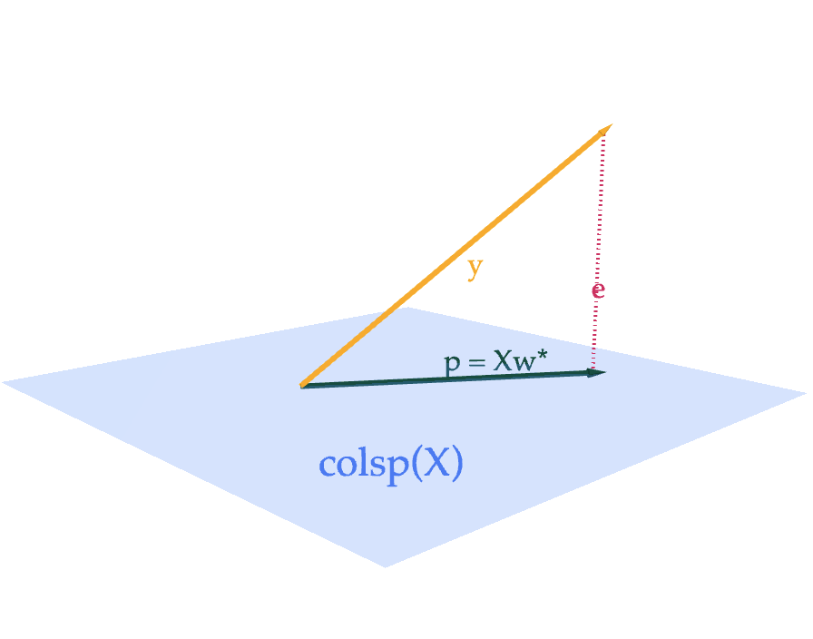



# Lab 7: Inverses and Projections

**due** for completion at 11:59PM Ann Arbor Time on Monday, June 1st, 2026

<a class="btn btn-info assignment-pdf-button" href="/resources/labs/lab07/lab07.pdf" target="_blank">View as PDF ✏️</a>
<a class="btn btn-info assignment-pdf-button" href="/resources/labs/lab07/lab07-solutions.pdf" target="_blank">Solutions PDF ✅</a>

{: .yellow }

Each lab worksheet will contain several activities, some of which will involve writing code and others that will involve writing math on paper. To receive credit for a lab, you must complete as many of the activities as you can in 2 hours and submit a PDF of your work to Gradescope. We will provide specific instructions on how to submit programming activities (e.g. submitting the notebook or including a screenshot of some output).

---

## Activities

- [Activity 1: PrairieLearn Practice Problems](#activity-1-prairielearn-practice-problems)
- [Activity 2: Linear Transformations](#activity-2-linear-transformations)
- [Activity 3: Projecting onto the Column Space](#activity-3-projecting-onto-the-column-space)

---

## Recap: Inverses ([Chapter 6.2](https://notes.eecs245.org/linear-transformations-and-projections/inverses/)) and Linear Transformations ([Chapter 6.1](https://notes.eecs245.org/linear-transformations-and-projections/linear-transformations/))

(We provide a recap of projections and the normal equation in Activity 3.)

-   An \\(n \times n\\) square matrix \\(A\\) is **invertible** if and only if \\(\text{rank}(A) = n\\), which also means that \\(A\\)'s columns are linearly independent (along with several other equivalent conditions).

-   If \\(A\\) is invertible, then its **inverse** \\(A^{-1}\\) is the **unique** \\(n \times n\\) matrix such that \\(AA^{-1}=I=A^{-1}A\\).

-   The determinant of a square matrix \\(A\\) is the volume of the \\(n\\)-dimensional cube with side length 1 after it is transformed by \\(A\\).

-   If \\(\text{det}(A) = 0\\), then \\(A\\) is not invertible.

-   If \\(A = \begin{bmatrix} a &amp; b \\\\ c &amp; d \end{bmatrix}\\), then \\(\text{det}(A) = ad - bc\\) and \\(A^{-1} = \frac{1}{ad - bc} \begin{bmatrix} d &amp; -b \\\\ -c &amp; a \end{bmatrix}\\).

-   The determinant satisfies several properties, including that \\(\text{det}(AB) = \text{det}(A) \text{det}(B)\\) and \\(\text{det}(A^T) = \text{det}(A)\\).

-   A linear transformation is a function \\(\mathbb{R}^d \to \mathbb{R}^n\\) such that

$$
f(\vec x + \vec y) = f(\vec x) + f(\vec y), \qquad f(c \vec x) = c f(\vec x)
$$

-   Every linear transformation has a corresponding \\(n \times d\\) matrix \\(A\\) where \\(f(\vec x) = A \vec x\\).

-   If \\(A\\) is square, then \\(f(\vec x) = A \vec x\\) is a function from \\(\mathbb{R}^n\\) to \\(\mathbb{R}^n\\), and \\(A\\) is invertible if and only if the function \\(f\\) is invertible.

---

## Activity 1: PrairieLearn Practice Problems

We're testing out a new website for practicing linear algebra problems: PrairieLearn.

Click [**this link**](https://us.prairielearn.com/pl/course_instance/217357) to access the relevant problems for this activity. It consists of 6 problems, each worth 1 point. The numbers in the problems are randomized; everyone will receive slightly different problems.

To get credit for Activity 1, you must **eventually** correctly answer all 6 problems, earning a score of 6/6. If you answer a problem incorrectly, click "New Variant" to generate a new version and then try again. There is no penalty for answering a problem incorrectly, as long as you eventually get it correct.

To be clear, you don't need to include anything in your PDF for Activity 1; we will manually verify that you've finished all 6 problems.

If you have trouble accessing PrairieLearn, message Suraj on Slack.

---

## Activity 2: Linear Transformations

Suppose \\(f: \mathbb{R}^3 \to \mathbb{R}^3\\) is a linear transformation represented by the matrix \\(A\\).

Furthermore, suppose that \\(f\left(\begin{bmatrix} 1 \\\\ 0 \\\\ 0 \end{bmatrix}\right) = \begin{bmatrix} 0 \\\\ 3 \\\\ 4 \end{bmatrix}\\), \\(f\left(\begin{bmatrix} 0 \\\\ 10 \\\\ 0 \end{bmatrix}\right) = \begin{bmatrix} 0 \\\\ 4 \\\\ -3 \end{bmatrix}\\), and \\(f\left(\begin{bmatrix} 0 \\\\ 0 \\\\ 1 \end{bmatrix}\right) = \begin{bmatrix} 1 \\\\ 0 \\\\ 0 \end{bmatrix}\\).

a)

Find \\(f\left(\begin{bmatrix} 2 \\\\ 1 \\\\ 2 \end{bmatrix}\right)\\). **After that**, find the matrix \\(A\\) corresponding to \\(f\\), i.e. where \\(f(\vec x) = A \vec x\\).

Solution

First, using just the properties of linear transformations, we can find \\(f\left(\begin{bmatrix} 2 \\\\ 1 \\\\ 2 \end{bmatrix}\right)\\). Recall that a linear transformation \\(f\\) satisfies

-   \\(f(\vec x + \vec y) = f(\vec x) + f(\vec y)\\)

-   \\(f(c \vec x) = c f(\vec x)\\)

In other words, \\(f\\) preserves linear combinations, i.e. \\(f(a \vec x + b \vec y) = a f(\vec x) + b f(\vec y)\\).

Let's decompose \\(f\left(\begin{bmatrix} 2 \\\\ 1 \\\\ 2 \end{bmatrix}\right)\\) into a linear combination of outputs we already know.

$$
\begin{align*}
f\left(\begin{bmatrix} 2 \\\\ 1 \\\\ 2 \end{bmatrix}\right)
&= f\left(2 \begin{bmatrix} 1 \\\\ 0 \\\\ 0 \end{bmatrix} + \frac{1}{10} \begin{bmatrix} 0 \\\\ 10 \\\\ 0 \end{bmatrix} + 2 \begin{bmatrix} 0 \\\\ 0 \\\\ 1 \end{bmatrix}\right) \\\\
&= \underbrace{2 f\left(\begin{bmatrix} 1 \\\\ 0 \\\\ 0 \end{bmatrix}\right)
+ \frac{1}{10} f\left(\begin{bmatrix} 0 \\\\ 10 \\\\ 0 \end{bmatrix}\right)
+ 2 f\left(\begin{bmatrix} 0 \\\\ 0 \\\\ 1 \end{bmatrix}\right)}_\text{property of linear transformations} \\\\
&= 2 \begin{bmatrix} 0 \\\\ 3 \\\\ 4 \end{bmatrix} + \frac{1}{10} \begin{bmatrix} 0 \\\\ 4 \\\\ -3 \end{bmatrix} + 2 \begin{bmatrix} 1 \\\\ 0 \\\\ 0 \end{bmatrix} \\\\
&= \begin{bmatrix} 0 \\\\ 6 \\\\ 8 \end{bmatrix} + \begin{bmatrix} 0 \\\\ 4 / 10 \\\\ -3 / 10 \end{bmatrix} + \begin{bmatrix} 2 \\\\ 0 \\\\ 0 \end{bmatrix} \\\\
&= \begin{bmatrix} 2 \\\\ 6.4 \\\\ 7.7 \end{bmatrix}
\end{align*}
$$

So, \\(f\left(\begin{bmatrix} 2 \\\\ 1 \\\\ 2 \end{bmatrix}\right) = \begin{bmatrix} 2 \\\\ 6.4 \\\\ 7.7 \end{bmatrix}\\).

Next, we need to find the matrix \\(A\\) corresponding to \\(f\\), i.e. where \\(f(\vec x) = A \vec x\\). Since \\(f\\) is a linear transformation, we know that \\(f(\vec x) = A \vec x\\) for some matrix \\(A\\).

-   The first column of \\(A\\) is given by \\(f\left(\begin{bmatrix} 1 \\\\ 0 \\\\ 0 \end{bmatrix}\right)\\), which we're told is \\(\begin{bmatrix} 0 \\\\ 3 \\\\ 4 \end{bmatrix}\\).

-   The second column of \\(A\\) is given by \\(f\left(\begin{bmatrix} 0 \\\\ 1 \\\\ 0 \end{bmatrix}\right)\\), which we've computed above to be \\(\begin{bmatrix} 0 \\\\ 4/10 \\\\ -3/10 \end{bmatrix}\\).

-   The third column of \\(A\\) is given by \\(f\left(\begin{bmatrix} 0 \\\\ 0 \\\\ 1 \end{bmatrix}\right)\\), which we're told is \\(\begin{bmatrix} 1 \\\\ 0 \\\\ 0 \end{bmatrix}\\).

So,

$$
A = \begin{bmatrix} 0 & 0 & 1 \\\\ 3 & 4 / 10 & 0 \\\\ 4 & -3 / 10 & 0 \end{bmatrix}
$$

If that seems too simple to be true, you can verify that multiplying \\(A\\) by \\(\begin{bmatrix} 2 \\\\ 1 \\\\ 2 \end{bmatrix}\\) gives us \\(\begin{bmatrix} 2 \\\\ 6.4 \\\\ 7.7 \end{bmatrix}\\), and that multiplying \\(A\\) by the three vectors in the question give the outputs we're told. Remember that \\(A \begin{bmatrix} 1 \\\\ 0 \\\\ 0 \end{bmatrix}\\) returns just the first column of \\(A\\), and so on.

b)

Find a **diagonal** matrix \\(D\\) and an **orthogonal** matrix \\(Q\\) such that \\(A = QD\\). (Not every matrix can be written in this form, but this particular \\(A\\) can.) Then, describe **in English** how \\(f\\) transforms a vector \\(\vec x\\).

Solution

Remember that

-   Diagonal matrices have 0s everywhere except on the diagonal, and have the effect of stretching/compressing each axis/dimension of the input vector independently.

-   Orthogonal matrices have columns that are orthonormal, meaning their columns are unit vectors that are orthogonal to one another.

In

$$
A = \begin{bmatrix} 0 & 0 & 1 \\\\ 3 & 4 / 10 & 0 \\\\ 4 & -3 / 10 & 0 \end{bmatrix}
$$

You might notice that \\(A\\)'s first column is 5 times \\(\begin{bmatrix} 0 \\\\ 3/5 \\\\ 4/5 \end{bmatrix}\\), which is a unit vector. You might also notice that \\(A\\)'s second column is \\((1/2)\\) times \\(\begin{bmatrix} 0 \\\\ 4/5 \\\\ -3/5 \end{bmatrix}\\), which is another unit vector orthogonal to the first column. And finally, \\(A\\)'s third column is already a unit vector, and its orthogonal to the first two columns.

So, if we put these orthogonal unit vectors into the columns of \\(Q\\), and the scaling factors of \\(5\\), \\(1/2\\), and \\(1\\) into the diagonal of \\(D\\), we have

$$
A = \begin{bmatrix} 0 & 0 & 1 \\\\ 3 & 4 / 10 & 0 \\\\ 4 & -3 / 10 & 0 \end{bmatrix} = \underbrace{\begin{bmatrix} 0 & 0 & 1 \\\\ 3/5 & 4/5 & 0 \\\\ 4/5 & -3/5 & 0 \end{bmatrix}}_Q \underbrace{\begin{bmatrix} 5 & 0 & 0 \\\\ 0 & 1 / 2 & 0 \\\\ 0 & 0 & 1 \end{bmatrix}}_D
$$

So, \\(Q = \begin{bmatrix} 0 &amp; 0 &amp; 1 \\\\ 3/5 &amp; 4/5 &amp; 0 \\\\ 4/5 &amp; -3/5 &amp; 0 \end{bmatrix}\\) and \\(D = \begin{bmatrix} 5 &amp; 0 &amp; 0 \\\\ 0 &amp; 1 / 2 &amp; 0 \\\\ 0 &amp; 0 &amp; 1 \end{bmatrix}\\).

\\(f(\vec x) = QD \vec x\\) transforms \\(f\\) by first scaling \\(\vec x\\)'s first component by 5, second component by 1/2, and leaving the third component as-is, and then rotating it by the orthogonal matrix \\(Q\\).

Orthogonal matrices rotate the vectors that they're multiplied by. In \\(\mathbb{R}^2\\), this is a rotation by some angle \\(\theta\\). It's harder to describe rotations in \\(\mathbb{R}^3\\) and beyond, but the key property that describes the effect of an orthogonal matrix \\(Q\\) is that for any vector \\(\vec x\\),

$$
\lVert Q \vec x \rVert = \lVert \vec x \rVert
$$

as you proved in Homework 6, meaning that all an orthogonal matrix is doing is changing the angle of the vector, not its length.

So, \\(f(\vec x)\\) first scales \\(\vec x\\)'s components, and then rotates the resulting vector.

c)

Using your \\(A = QD\\) decomposition from part **b)**, find \\(A^{-1}\\).

<em>Hint: Recall that for orthogonal matrices, \\(QQ^T = Q^TQ = I\\). And, for any invertible matrices \\(A\\) and \\(B\\), \\((AB)^{-1} = B^{-1}A^{-1}\\).</em>

Solution

Since \\(A = QD\\), we have

$$
A^{-1} = D^{-1}Q^{-1}
$$

Since \\(D\\) is diagonal, its inverse is just the diagonal matrix with the reciprocal of each diagonal entry. This corresponds to "unstretching" the vector in each dimension. So,

$$
D^{-1} = \begin{bmatrix} 1 / 5 & 0 & 0 \\\\ 0 & 2 & 0 \\\\ 0 & 0 & 1 \end{bmatrix}
$$

And, since \\(Q\\) is orthogonal, we know \\(Q^TQ = I\\), meaning that \\(Q^{-1} = Q^T\\), i.e. \\(Q\\)'s inverse is its transpose. This corresponds to "undoing" the rotation of the vector.

$$
Q^{-1} = Q^T = \begin{bmatrix} 0 & 3/5 & 4/5 \\\\ 0 & 4/5 & -3/5 \\\\ 1 & 0 & 0 \end{bmatrix}
$$

Putting these building blocks together gives us

$$
A^{-1} = D^{-1}Q^{-1} = D^{-1}Q^T = \begin{bmatrix} 1 / 5 & 0 & 0 \\\\ 0 & 2 & 0 \\\\ 0 & 0 & 1 \end{bmatrix} \begin{bmatrix} 0 & 3/5 & 4/5 \\\\ 0 & 4/5 & -3/5 \\\\ 1 & 0 & 0 \end{bmatrix} = \begin{bmatrix} 0 & 3/25 & 4/25 \\\\ 0 & 8/5 & -6/5 \\\\ 1 & 0 & 0 \end{bmatrix}
$$

d)

Given the English definition of \\(f\\) from part **b)** **alone**, find \\(\text{det}(A)\\). (You can verify your work using the formula in [Chapter 6.1](https://notes.eecs245.org/linear-transformations-and-projections/linear-transformations/#the-determinant).)

Solution

Recall, \\(f(\vec x)\\) first scales \\(\vec x\\)'s first component by 5, second component by 1/2, and leaves the third component as-is, and then it rotates the resulting vector in a way that preserves its length.

Intuitively, \\(\text{det}(A)\\) should be the product of the scaling factors, i.e. \\(5 \cdot 1/2 \cdot 1 = 5/2\\).

---

## Activity 3: Projecting onto the Column Space

Note: We've recorded a **[YouTube playlist](https://www.youtube.com/playlist?list=PLEFTQpsm47qQeWokuNgEIryDcVJ9iVQbx)** walking through the activities in this lab.

Suppose \\(X\\) is an \\(n \times d\\) matrix with columns \\(\vec x^{(1)}, \vec x^{(2)}, \ldots, \vec x^{(d)}\\) and \\(\vec y \in \mathbb{R}^n\\). Then, the projection of \\(\vec y\\) onto \\(\text{colsp}(X)\\) is the vector

$$
\vec p = X\vec w^* = w_1^* \vec x^{(1)} + w_2^* \vec x^{(2)} + \cdots + w_d^* \vec x^{(d)}
$$

 where \\(\vec w^{\ast} \in \mathbb{R}^d\\) is chosen to satisfy the **normal equation**,

$$
X^TX \vec w = X^T \vec y
$$

 If \\(X\\)'s columns are linearly independent, \\(\vec w^{\ast}\\) is the unique vector

$$
\vec w^* = (X^TX)^{-1}X^T \vec y
$$

Of all vectors in \\(\text{colsp}(X)\\), \\(X \vec w^{\ast}\\) is the one that is closest to \\(\vec y\\), meaning it minimizes

$$
\lVert \vec y - X \vec w \rVert^2
$$

As we will see in Tuesday's lecture, \\(\vec w^{\ast}\\) contains the **optimal model parameters** for linear regression, when we fill our \\(X\\) (carefully) with our input variables and \\(\vec y\\) with our output variables.

a)

Let \\(X = \begin{bmatrix} 2 &amp; 1 \\\\ 0 &amp; -3 \\\\ 0 &amp; 0 \end{bmatrix}\\) and \\(\vec y = \begin{bmatrix} 2 \\\\ 3 \\\\ 4 \end{bmatrix}\\). Find \\(\vec w^{\ast}\\), \\(\vec p\\), and \\(\vec e = \vec y - \vec p\\), and verify that \\(\vec e\\) is orthogonal to \\(\text{colsp}(X)\\) by showing that it is orthogonal to each of \\(X\\)'s columns.

Solution

For

$$
X =
\begin{bmatrix}
2 & 1 \\\\
0 & -3 \\\\
0 & 0
\end{bmatrix}
\qquad
\vec y =
\begin{bmatrix}
2 \\\\ 3 \\\\ 4
\end{bmatrix}
$$

 we begin by computing the normal equation components:

$$
X^T X =
\begin{bmatrix}
2 & 0 & 0 \\\\
1 & -3 & 0
\end{bmatrix}
\begin{bmatrix}
2 & 1 \\\\
0 & -3 \\\\
0 & 0
\end{bmatrix}
=
\begin{bmatrix}
4 & 2 \\\\
2 & 10
\end{bmatrix}
$$

 The determinant of \\(X^T X\\) is \\(36\\), so

$$
(X^T X)^{-1}
= \frac{1}{36}
\begin{bmatrix}
10 & -2 \\\\
-2 & 4
\end{bmatrix}
=
\begin{bmatrix}
\frac{5}{18} & -\frac{1}{18} \\\\
-\frac{1}{18} & \frac{1}{9}
\end{bmatrix}
$$

Next, compute

$$
X^T \vec y =
\begin{bmatrix}
2 & 0 & 0 \\\\
1 & -3 & 0
\end{bmatrix}
\begin{bmatrix}
2 \\\\ 3 \\\\ 4
\end{bmatrix}
=
\begin{bmatrix}
4 \\\\ -7
\end{bmatrix}
$$

 Therefore,

$$
\vec w^* = (X^T X)^{-1} X^T \vec y
=
\begin{bmatrix}
\frac{5}{18} & -\frac{1}{18} \\\\
-\frac{1}{18} & \frac{1}{9}
\end{bmatrix}
\begin{bmatrix}
4 \\\\ -7
\end{bmatrix}
=
\begin{bmatrix}
\frac{27}{18} \\\\[4pt]
-1
\end{bmatrix}
=
\begin{bmatrix}
1.5 \\\\[4pt] -1
\end{bmatrix}
$$

Now compute the projection:

$$
\vec p = X \vec w^*
=
\begin{bmatrix}
2 & 1 \\\\
0 & -3 \\\\
0 & 0
\end{bmatrix}
\begin{bmatrix}
1.5 \\\\[4pt]
-1
\end{bmatrix}
=
\begin{bmatrix}
2 \\\\ 3 \\\\ 0
\end{bmatrix}
$$

 The error vector is:

$$
\vec e = \vec y - \vec p =
\begin{bmatrix}
2 \\\\ 3 \\\\ 4
\end{bmatrix}
-
\begin{bmatrix}
2 \\\\ 3 \\\\ 0
\end{bmatrix}
=
\begin{bmatrix}
0 \\\\ 0 \\\\ 4
\end{bmatrix}
$$

 To verify orthogonality:

$$
X^T \vec e =
\begin{bmatrix}
2 & 0 & 0 \\\\
1 & -3 & 0
\end{bmatrix}
\begin{bmatrix}
0 \\\\ 0 \\\\ 4
\end{bmatrix}
=
\begin{bmatrix}
0 \\\\ 0
\end{bmatrix}
$$

 Thus, \\(\vec e\\) is orthogonal to both columns of \\(X\\) as required.

b)

Find scalars \\(a\\) and \\(b\\) such that \\(a \begin{bmatrix} 2 \\\\ 0 \\\\ 0 \end{bmatrix} + b \begin{bmatrix} 1 \\\\ -3 \\\\ 0 \end{bmatrix}\\) is as close as possible to \\(\begin{bmatrix} 1 \\\\ 9 \\\\ 2 \end{bmatrix}\\). <em>Hint: You can reuse most of your work from part <strong>a)</strong>.</em>

c)

Now, suppose \\(X = \begin{bmatrix} 1 &amp; 1 \\\\ 1 &amp; -1 \\\\ 1 &amp; 0 \end{bmatrix}\\) and \\(\vec y = \begin{bmatrix} 2 \\\\ 3 \\\\ 4 \end{bmatrix}\\). We've already computed \\(\vec w^{\ast}\\), \\(\vec p\\), and \\(\vec e\\) here:

$$
\vec w^* = \begin{bmatrix} 3 \\\\ -\frac{1}{2} \end{bmatrix}, \quad \vec p = \begin{bmatrix} 5/2 \\\\ 7/2 \\\\ 3 \end{bmatrix}, \quad \vec e = \vec y - \vec p = \begin{bmatrix} -1/2 \\\\ -1/2 \\\\ 1 \end{bmatrix}
$$

Notice that the components of this \\(\vec e\\) add up to 0, but this doesn't happen with your \\(\vec e\\) from part **a)**. **Why?** <em>Hint: The answer is not that \\(\vec y\\) is in \\(\text{colsp}(X)\\) --- it isn't in part <strong>a)</strong> and it isn't here either. Rather, it has something to do with the difference between the two \\(X\\)'s. This is a hugely important result, and one that will 100% appear on Midterm 2.</em>

Solution

In both parts, \\(X^T \vec e = \begin{bmatrix} 0 \\\\ 0 \end{bmatrix}\\), but only in this new example is the sum of the components in \\(\vec e\\) exactly 0 (in part **a)**, it's 4).

This has to do with the fact that in each case, \\(\vec e\\) is orthogonal to **any linear combination of the columns of \\(X\\)**. This is what it means for \\(\vec e\\) to be orthogonal to \\(\text{colsp}(X)\\).

In subpart (ii), one of the columns of \\(X\\) is \\(\begin{bmatrix} 1 \\\\ 1 \\\\ 1 \end{bmatrix}\\), meaning that \\(\vec e \cdot \begin{bmatrix} 1 \\\\ 1 \\\\ 1 \end{bmatrix} = e&#95;1 + e&#95;2 + e&#95;3 = 0\\). However, no linear combination of the columns of \\(X\\) in subpart (i) gives a vector of \\(\begin{bmatrix} 1 \\\\ 1 \\\\ 1 \end{bmatrix}\\), so we can't use this logic to guarantee the error vector's components sum to 0 in subpart (i). (I say "guarantee" because while the error vector's components don't sum to 0 for \\(\vec y = \begin{bmatrix} 2 \\\\ 3 \\\\ 4 \end{bmatrix}\\), they still could for some other \\(\vec y\\) projected onto the column space of \\(X\\) in subpart (i).)

**Don't forget this fact**: the existence of a column of 1's in \\(X\\) (or in \\(X\\)'s column space) guarantees that the error vector \\(\vec e\\) when projecting \\(\vec y\\) onto \\(\text{colsp}(X)\\) will have a sum of components equal to 0, no matter what the other columns of \\(X\\) are and no matter what \\(\vec y\\) is.

Taking another look at the formula \\(\vec p = X \vec w^{\ast}\\), we see that it's equivalent to

$$
\vec p = X \vec w^* = X (X^TX)^{-1}X^T\vec y = P\vec y
$$

 where \\(P = X (X^TX)^{-1}X^T\\) is called the **projection matrix**, discussed in [Chapter 6.4](https://notes.eecs245.org/linear-transformations-and-projections/complete-solution/#the-projection-matrix). Multiplying \\(P \vec y\\) is equivalent to projecting \\(\vec y\\) onto \\(\text{colsp}(X)\\).

d)

Recall that \\(X\\) is an \\(n \times d\\) matrix (meaning it's not necessarily square), which makes \\(P = X (X^TX)^{-1}X^T\\) an \\(n \times n\\) matrix.

Fill in the blanks: \\(X^TX\\) is invertible if and only if \\(X\\)'s columns are \_\_\_\_.

Solution

\\(X^TX\\) is invertible if and only if \\(X\\)'s columns are **linearly independent**. This is because \\(\text{rank}(X) = \text{rank}(X^TX)\\), as we proved in [Chapter 5.4](https://notes.eecs245.org/matrices/null-space-rank-nullity/#example-rank-of-x-tx), and a matrix is invertible if and only if its rank is equal to its number of columns.

For \\(\text{rank}(X^TX) = d\\), we need \\(\text{rank}(X) = d\\), meaning \\(X\\)'s columns must be linearly independent.

e)

In this part only, suppose \\(X\\) is an \\(n \times 1\\) matrix, i.e. it is a vector. Then,

1.  What is the value of \\(\vec w^{\ast}\\), and how does it relate to what we learned in [Chapter 3.4](https://notes.eecs245.org/vectors/projecting-onto-a-single-vector/#orthogonal-projections)? (What type of object is \\((X^TX)^{-1}\\) when \\(X\\) is a vector?)

2.  What is the value of the matrix \\(P\\), and how does it relate to what we learned in [Homework 6, Problem 5](https://eecs245.org/resources/homeworks/hw06/#problem-5-projecting-onto-a-single-vector-12-pts)?

Solution

Suppose \\(X\\) is the vector \\(\vec x\\). Remember that \\(\vec x^T \vec x\\) is a scalar; it's the dot product of \\(\vec x\\) with itself. So, \\((X^TX)^{-1} = (\vec x^T \vec x)^{-1} = \frac{1}{\vec x^T \vec x}\\), since the inverse of a scalar is the reciprocal of that scalar.

1.  $$
\vec w^* = (X^TX)^{-1}X^T\vec y = (\vec x^T \vec x)^{-1} \vec x^T \vec y = \frac{\vec x^T \vec y}{\vec x^T \vec x} = \frac{\vec x \cdot \vec y}{\vec x \cdot \vec x}
$$

   This is the same formula for the optimal value of \\(k\\) from Chapter 3.4, where we approximated \\(\vec y\\) by a scalar multiple of \\(\vec x\\), called \\(k \vec x\\).

2.  $$
P = X (X^TX)^{-1}X^T = \vec x (\vec x^T \vec x)^{-1} \vec x^T = \frac{\vec x \vec x^T}{\vec x^T \vec x}
$$

   In [Homework 6, Problem 5](https://eecs245.org/resources/homeworks/hw06/#problem-5-projecting-onto-a-single-vector-12-pts), we found that the matrix \\(P\\) that projects \\(\vec y\\) onto the line spanned by the **unit vector** \\(\vec x\\) is given by

$$
P = \begin{bmatrix} x_1^2 & x_1x_2 \\\\ x_1x_2 & x_2^2 \end{bmatrix} = \begin{bmatrix} x_1 & x_2 \end{bmatrix} \begin{bmatrix} x_1 & x_2 \end{bmatrix}^T = \vec x \vec x^T
$$

   Here, \\(\vec x\\) isn't a unit vector, hence the division by \\(\vec x^T \vec x\\).

$$
P = X (X^TX)^{-1}X^T
$$

f)

Show that \\(P\\) is both symmetric (meaning that \\(P^T = P\\)) and idempotent (meaning that \\(P^2 = P\\)). Then, explain in English how \\(P\\)'s idempotence relates to the linear transformation of projecting \\(\vec y\\) onto \\(\text{colsp}(X)\\).

Solution

To show that \\(P\\) is **symmetric**, we need to show that \\(P^T = P\\). Recall that \\((AB)^T = B^TA^T\\), so

$$
\begin{align*}
P^T &= \left( {X} ({X^T X})^{-1} {X^T} \right)^T \\\\ &= \left( {X^T} \right)^T \left( ({X^T X})^{-1} \right)^T {X^T} \\\\ &= {X} ({X^T X})^{-1} X^T \\\\ &= P
\end{align*}
$$

To go from line 2 to line 3, we used the fact that \\(X^TX\\) is symmetric, so \\((X^TX)^{-1}\\) is also symmetric. Remember that \\(X^TX\\) contains the dot products of all pairs of \\(X\\)'s columns.

To show that \\(P\\) is **idempotent**, we need to show that \\(P^2 = P\\).

$$
\begin{align*}
P^2
&= \left( {X} ({X^T X})^{-1} {X^T} \right) \left( {X} ({X^T X})^{-1} {X^T} \right) \\\\
&= {X} ({X^T X})^{-1} \left( {X^T} {X} \right) ({X^T X})^{-1} {X^T} \\\\
&= {X} ({X^T X})^{-1} {I} {X^T} \\\\
&= {X} ({X^T X})^{-1} {X^T}  \\\\
&= P
\end{align*}
$$

The fact that \\(P\\) is idempotent means that applying \\(P\\) twice (or three times, or four times, etc.) to a vector is the same as applying it once. Once we've already projected \\(\vec y\\) onto \\(\text{colsp}(X)\\), we don't need to project it again, since the projection \\(\vec p = P \vec y\\) is already in \\(\text{colsp}(X)\\).

g)

In the rare case that \\(X\\) is an \\(n \times n\\) square matrix, and \\(\text{rank}(X) = n\\), what is \\(P\\)? What does this say about the relationship between \\(\vec y\\), \\(\vec p\\), and \\(\text{colsp}(X)\\)? <em>Hint: Use the fact that \\((AB)^{-1} = B^{-1}A^{-1}\\).</em>

Solution

If \\(X\\) is an \\(n \times n\\) square matrix, and \\(\text{rank}(X) = n\\), then \\(X\\) is invertible, and so is \\(X^T\\) (since if \\(X\\) has \\(n\\) linearly independent columns, it must have \\(n\\) linearly independent rows).

\\((X^TX)^{-1} = X^{-1}(X^T)^{-1}\\) because \\((AB)^{-1} = B^{-1}A^{-1}\\).

Then,

$$
P = X (X^TX)^{-1}X^T = \underbrace{X X^{-1}}_I \underbrace{(X^T)^{-1}X^T}_I = I
$$

So, if \\(X\\) is an \\(n \times n\\) square matrix with \\(\text{rank}(X) = n\\), then \\(P = I\\). What this says is that \\(\text{colsp}(X) = \mathbb{R}^n\\), meaning that any vector \\(\vec y \in \mathbb{R}^n\\) can be represented as a linear combination of \\(X\\)'s columns, so the projection of \\(\vec y\\) onto \\(\text{colsp}(X)\\) is just \\(\vec y\\) itself, i.e. \\(\vec p = P \vec y = \vec y\\).


