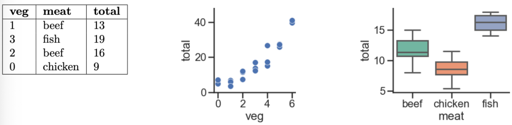



# Lab 8: Multiple Linear Regression; The Gradient Vector

**due** for completion at 11:59PM Ann Arbor Time on Wednesday, June 3rd, 2026

<a class="btn btn-info assignment-pdf-button" href="/resources/labs/lab08/lab08.pdf" target="_blank">View as PDF ✏️</a>

{: .yellow }

Each lab worksheet will contain several activities, some of which will involve writing code and others that will involve writing math on paper. To receive credit for a lab, you must complete as many of the activities as you can in 2 hours and submit a PDF of your work to Gradescope. We will provide specific instructions on how to submit programming activities (e.g. submitting the notebook or including a screenshot of some output).

---

## Activities

- [Activity 1: Multiple Linear Regression](#activity-1-multiple-linear-regression)
- [Activity 2: Chicken, Beef, or Fish?](#activity-2-chicken-beef-or-fish)
- [Activity 3: Gradients and Partial Derivatives](#activity-3-gradients-and-partial-derivatives)
- [Activity 4: The Big Three](#activity-4-the-big-three)
- [Activity 5: Quadratic Forms and Symmetry](#activity-5-quadratic-forms-and-symmetry)

---

## Recap: Multiple Linear Regression ([Chapter 7.2](https://notes.eecs245.org/regression-using-linear-algebra/multiple-linear-regression/))

Suppose we have \\(n\\) data points, \\((\vec x&#95;1, y&#95;1), (\vec x&#95;2, y&#95;2), \dots (\vec x&#95;n, y&#95;n)\\), where each \\(\vec x&#95;i\\) is a feature vector of \\(d\\) features:

$$
\vec x_i = \begin{bmatrix}
x_i^{(1)} \\\\
x_i^{(2)} \\\\
\vdots \\\\
x_i^{(d)}
\end{bmatrix} \qquad \qquad \text{for example}, \vec x_i = \begin{bmatrix} \text{height}_i \\\\ \text{weight}_i \\\\ \text{shoe size}_i \\\\ \text{height}_i^2 \\\\ \cos\left( \text{height}_i \cdot \text{weight}_i \right) \end{bmatrix}
$$

This data is stored in the \\(n \times (d+1)\\) matrix \\(X\\), called the **design matrix**, and observation vector \\(\vec y\\).

$$
X = \begin{bmatrix}
1 && x_1^{(1)} && x_1^{(2)} && \dots && x_1^{(d)} \\\\
1 && x_2^{(1)} && x_2^{(2)} && \dots && x_2^{(d)} \\\\
\vdots && \vdots && \vdots && \vdots && \vdots \\\\
1 && x_n^{(1)} && x_n^{(2)} && \dots && x_n^{(d)} \\\\
\end{bmatrix}
= \begin{bmatrix}
\text{Aug}(\vec x_1)^T \\\\
\text{Aug}(\vec x_2)^T \\\\
\vdots \\\\
\text{Aug}(\vec x_n)^T \\\\
\end{bmatrix}, \quad
\vec y = \begin{bmatrix}
y_1 \\\\
y_2 \\\\
\vdots \\\\
y_n
\end{bmatrix}
$$

Our goal is to find the optimal parameter vector, \\(\vec w^{*}\\), which minimizes the mean squared error of our model's predictions on the training data.

$$
\text{mean squared error} = \displaystyle R_\text{sq}(\vec w)=\frac{1}{n}||\vec y - X\vec w||^2
$$

The optimal \\(\vec w^*\\) satisfies the normal equation, \\(X^TX \vec w = X^T \vec y\\). To make predictions:

-   \\(\vec p = X\vec w^*\\) is a vector containing the prediction for all \\(n\\) observations.

-   \\(h(\vec x&#95;i)=\vec w^* \cdot \text{Aug}(\vec x&#95;i)\\) is the prediction for any one observation \\(\vec x&#95;i\\).

---

## Activity 1: Multiple Linear Regression

Let \\(X\\) be a **full rank** \\(n \times 3\\) design matrix and \\(\vec y \in \mathbb{R}^n\\) be an observation vector. Suppose we have already fit a multiple linear regression model of the form

$$
h(\vec x_i)=w_0+w_1x_i^{(1)}+w_2 x_i^{(2)}
$$

 Now, suppose we add the feature \\((x&#95;i^{(1)}+x&#95;i^{(2)})\\) to our design matrix and train a new model.

a)

Which of the following are true about the new \\(n \times 4\\) design matrix \\(X&#95;\text{new}\\) with our added feature? Select all that apply.

 The columns of \\(X&#95;\text{new}\\) are linearly independent

 The columns of \\(X&#95;\text{new}\\) are linearly dependent

 \\(\vec y\\) is orthogonal to all the columns of \\(X&#95;\text{new}\\)

 \\(\vec y\\) is orthogonal to all the columns of the original design matrix \\(X\\)

 \\(\text{colsp}(X)=\text{colsp}(X&#95;\text{new})\\)

 \\(X&#95;\text{new}^TX&#95;\text{new}\\) is invertible

 \\(X&#95;\text{new}^TX&#95;\text{new}\\) is not invertible

b)

Find a basis for \\(\text{nullsp}(X&#95;\text{new})\\). (This should be quick!)

---

## Activity 2: Chicken, Beef, or Fish?

Every week, Lauren goes to her local grocery store and buys exactly one pound of meat (either beef, fish, or chicken) but varying amounts of vegetables. We've collected a dataset containing the pounds of vegetables bought, the type of meat bought, and the total bill. Below we display the first few rows of the dataset and two plots generated using the entire (training) dataset.

In each part below, we provide you with a model that predicts `total` (her total grocery bill), fit to the dataset by minimizing mean squared error. For each model, determine whether **each optimal parameter \\(w^*\\) is positive, negative or exactly 0**. For example, in part (iv), you'll need to provide 3 answers: one for \\(w&#95;0^*\\), one for \\(w&#95;1^*\\), and one for \\(w&#95;2^*\\).

1.  \\(h(\vec x&#95;i)=w&#95;0\\)

2.  \\(h(\vec x&#95;i)=w&#95;0+w&#95;1 \cdot \text{veg}&#95;i\\)

3.  \\(h(\vec x&#95;i)=w&#95;0+w&#95;1 \cdot \text{meat=chicken}&#95;i\\) (one hot encoded feature for chicken)

4.  \\(h(\vec x&#95;i)=w&#95;0+w&#95;1 \cdot \text{meat=beef}&#95;i+ w&#95;2 \cdot \text{meat=chicken}&#95;i\\)

5.  \\(h(\vec x&#95;i)=w&#95;0+w&#95;1 \cdot \text{meat=beef}&#95;i+ w&#95;2 \cdot \text{meat=chicken}&#95;i + w&#95;3 \cdot \text{meat=fish}&#95;i\\)

---

## Activity 3: Gradients and Partial Derivatives

Suppose \\(\vec x \in \mathbb{R}^3\\). Let \\(g(\vec x)=(x&#95;1^2+x&#95;2-3)^2+(x&#95;1+x&#95;2^2-4)^2 + x&#95;3^2\\).

a)

Find \\(\nabla g(\vec x)\\). <em>Hint: Start by finding the partial derivatives of \\(g\\) with respect to \\(x&#95;1\\), \\(x&#95;2\\), and \\(x&#95;3\\).</em>

b)

Evaluate \\(\nabla g\left( \begin{bmatrix} 2 \\\\ 1 \\\\ 0 \end{bmatrix} \right)\\). The result is a vector in \\(\mathbb{R}^3\\). What does it mean?

c)

Why is it guaranteed that \\(g(\vec x)\\) **has** a global minimum?

---

## Activity 4: The Big Three

In [Chapter 8.2](https://notes.eecs245.org/gradients/gradients-matrix-vector-operations/), we introduced three key gradient rules for vector-to-scalar functions.

-   **Dot product**: If \\(f(\vec x) = \vec a \cdot \vec x\\), then \\(\nabla f(\vec x) = \vec a\\).

-   **Squared norm**: If \\(f(\vec x) = \lVert \vec x \rVert^2\\), then \\(\nabla f(\vec x) = 2 \vec x\\).

-   **Quadratic form**: If \\(f(\vec x) = \vec x^T A \vec x\\), then \\(\nabla f(\vec x) = (A + A^T) \vec x\\).

In each part below, assume \\(\vec x, \vec a, \vec b \in \mathbb{R}^n\\), \\(A \in \mathbb{R}^{n \times n}\\), and \\(c \in \mathbb{R}\\).

a)

Given \\(f(\vec x) = \vec x^T A \vec x + \vec b^T \vec x + c\\), find \\(\nabla f(\vec x)\\).

b)

Given \\(f(\vec x) = \sum&#95;{i=1}^n x&#95;i\\), find \\(\nabla f(\vec x)\\).

c)

Given \\(f(\vec x) = \lVert A \vec x \rVert^2\\), find \\(\nabla f(\vec x)\\). <em>Hint: Use the fact that \\(\lVert \vec v \rVert^2 = \vec v^T \vec v\\).</em>

d)

Given \\(f(\vec x) = \lVert \vec x \rVert\\), find \\(\nabla f(\vec x)\\).

e)

Given \\(f(\vec x) = (\vec a \cdot \vec x)^2\\), find \\(\nabla f(\vec x)\\).

<em>Hint: Expand \\(f(\vec x)\\) so that you can use one of the "big three" rules.</em>

---

## Activity 5: Quadratic Forms and Symmetry

Suppose \\(f(\vec x) = \vec x^T \begin{bmatrix} a &amp; b \\\\ c &amp; d \end{bmatrix} \vec x\\), where \\(\vec x = \begin{bmatrix} x&#95;1 \\\\ x&#95;2 \end{bmatrix}\\). (If you'd like, as an example, let \\(A = \begin{bmatrix} 2 &amp; 3 \\\\ 7 &amp; -8 \end{bmatrix}\\).)

1.  Expand \\(f(\vec x)\\) so that it doesn't involve matrices or vectors.

2.  Find \\(\frac{\partial f}{\partial x&#95;1}\\), \\(\frac{\partial f}{\partial x&#95;2}\\), and show that \\(\nabla f(\vec x) = \begin{bmatrix} \frac{\partial f}{\partial x&#95;1} \\\\ \frac{\partial f}{\partial x&#95;2} \end{bmatrix}\\) satisfies the quadratic form gradient rule.

3.  Discuss: Why do we typically assume that \\(A\\) is symmetric when defining a quadratic form?


