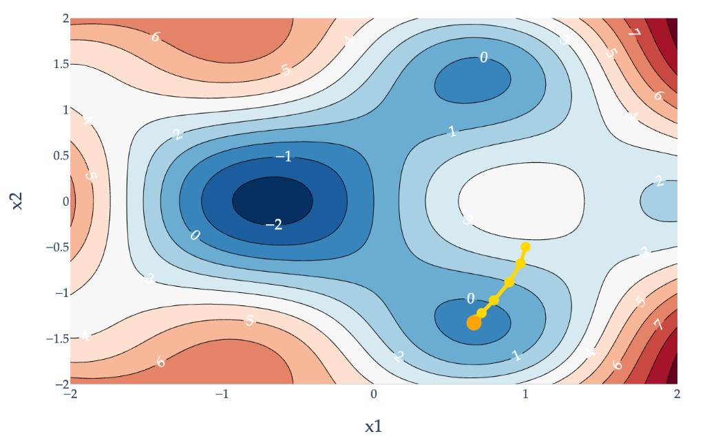
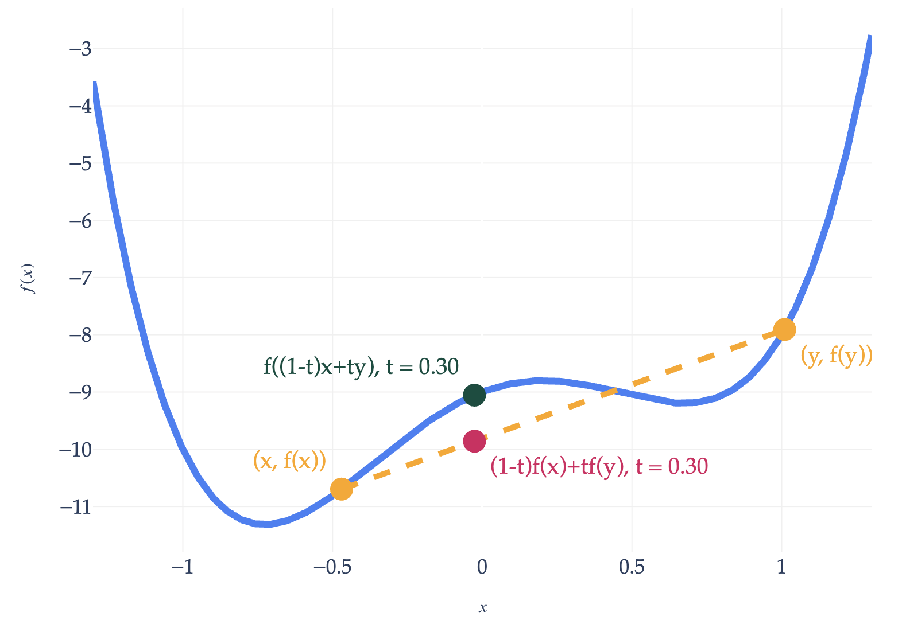
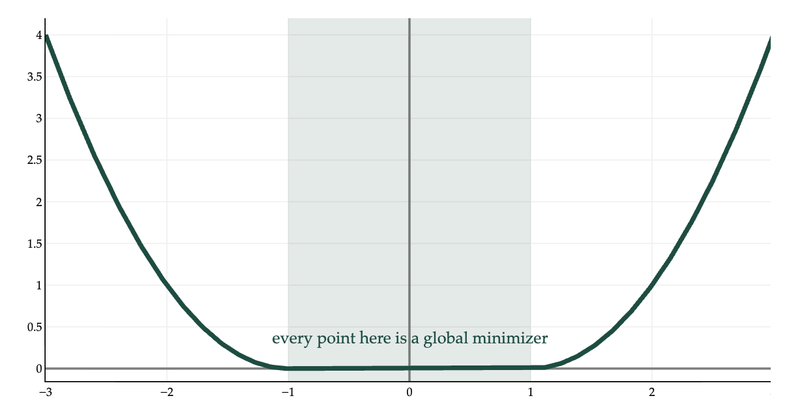
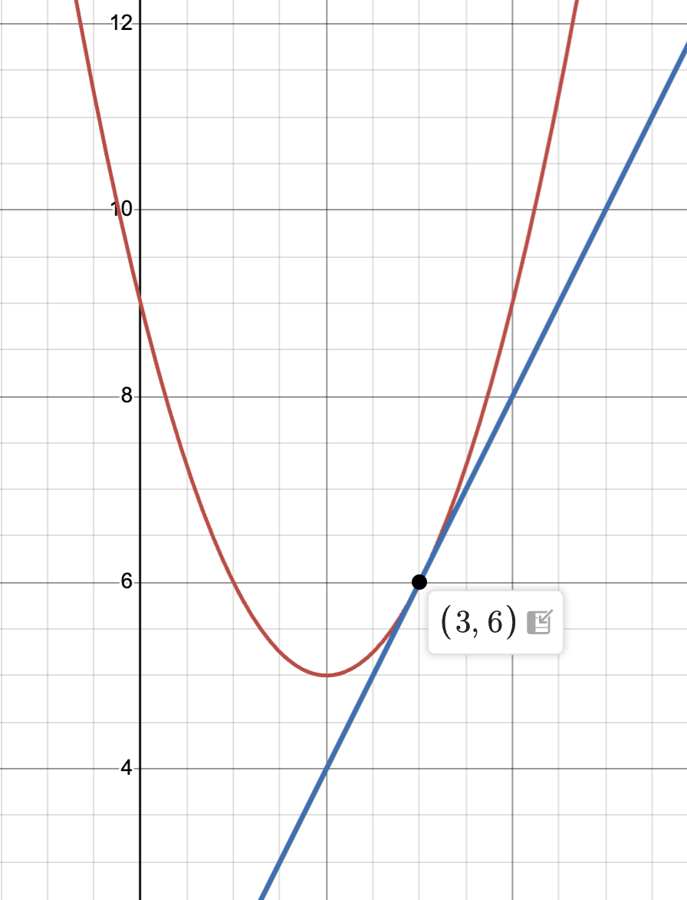
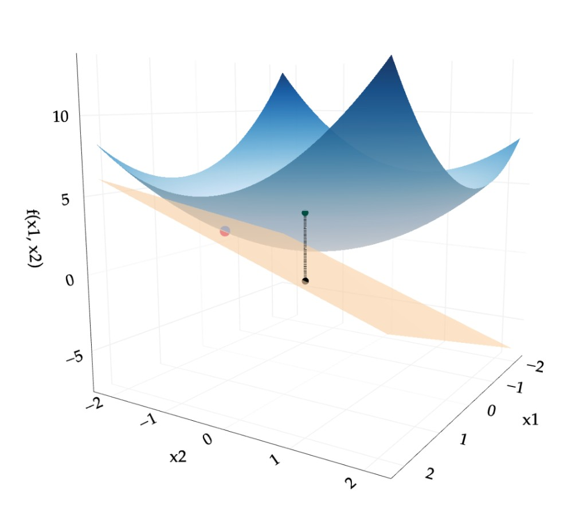



# Lab 9: Gradient Descent and Convexity

**due** for completion at 11:59PM Ann Arbor Time on Monday, June 8th, 2026

<a class="btn btn-info assignment-pdf-button" href="/resources/labs/lab09/lab09.pdf" target="_blank">View as PDF ✏️</a>
<a class="btn btn-info assignment-pdf-button" href="/resources/labs/lab09/lab09-solutions.pdf" target="_blank">Solutions PDF ✅</a>

{: .yellow }

Each lab worksheet will contain several activities, some of which will involve writing code and others that will involve writing math on paper. To receive credit for a lab, you must complete as many of the activities as you can in 2 hours and submit a PDF of your work to Gradescope. We will provide specific instructions on how to submit programming activities (e.g. submitting the notebook or including a screenshot of some output).

---

## Activities

- [Activity 1: Gradient Descent Gone Wrong](#activity-1-gradient-descent-gone-wrong)
- [Activity 2: Gradient Descent for Empirical Risk Minimization](#activity-2-gradient-descent-for-empirical-risk-minimization)
- [Activity 3: Convexity and Gradient Descent](#activity-3-convexity-and-gradient-descent)
- [Activity 4: Linear Approximation](#activity-4-linear-approximation)
- [Activity 5: Using Convexity to Prove Inequalities](#activity-5-using-convexity-to-prove-inequalities)

---

**Recap: Gradient Descent** ([Chapter 8.3](https://notes.eecs245.org/gradients/gradient-descent/))

Suppose \\(f: \mathbb{R}^d \rightarrow \mathbb{R}\\) is a **differentiable** vector-to-scalar function, meaning that all of its partial derivatives are defined everywhere. To find \\(\vec x^{\ast}\\), the **minimizer** of \\(f\\):

1.  Choose a positive number, \\(\mathbf{\alpha}\\). This number is called the **learning rate**, or **step size**.

2.  Choose an **initial guess** for the minimizer, \\(\vec x^{(0)}\\).

3.  Then, repeatedly update the guess using the **update rule**:

$$
\vec x^{(t+1)} = \vec x^{(t)} - \alpha \nabla f(\vec x^{(t)})
$$

4.  Terminate once the algorithm converges, which happens when the norm of the gradient, \\(\lVert \nabla f(\vec x^{(t)}) \rVert\\), is below some small **tolerance** level, e.g. \\(0.001\\) (since this must mean we're very close to a minimum).

**Intuition**: The gradient vector \\(\nabla f(\vec x^{(t)})\\) tells us the direction of greatest increase in \\(f\\) at the current guess \\(\vec x^{(t)}\\), so \\(-\nabla f(\vec x^{(t)})\\) is the direction that will **decrease** our function the most. The distance moved in that direction is determined by the step size \\(\alpha\\), which scales \\(-\nabla f(\vec x^{(t)})\\). To update our guess, we add \\(-\alpha \nabla f(\vec x^{(t)})\\) to the old guess, \\(\vec x^{(t)}\\). Then, we repeat this process.

Example gradient descent path for a function \\(f: \mathbb{R}^2 \to \mathbb{R}\\).

---

## Activity 1: Gradient Descent Gone Wrong

Suppose \\(\vec x \in \mathbb{R}^2\\). Let

$$
f(\vec x) = x_1^3 + \lVert \vec x \rVert^2 = x_1^3 + x_1^2 + x_2^2
$$

To minimize \\(f(\vec x)\\), we use gradient descent, with a learning rate of \\(\alpha = \frac{1}{4}\\).

a)

Open Desmos and plot the related function \\(g(x) = x^3 + x^2\\). Even though this is a scalar-to-scalar function, and \\(f\\) is vector-to-scalar, they are related. What do you notice about the shape of the graph?

Solution

\\(g(x)\\) is a cubic function, with a local minimum and local maximum and no global minimum nor maximum. It is not convex.

b)

Find \\(\nabla f(\vec x)\\), the gradient of \\(f(\vec x)\\).

Solution

$$
\nabla f(\vec x) = \begin{bmatrix} 3x_1^2 + 2x_1 \\\\ 2x_2 \end{bmatrix} = \begin{bmatrix} 3x_1^2 \\\\ 0 \end{bmatrix} + 2 \vec x
$$

c)

Recall, \\(\vec x^{(t)}\\) is the guess for \\(\vec x^{\ast}\\) at timestep \\(t\\). Let \\(\vec x^{(t)} = \begin{bmatrix} x&#95;1^{(t)} \\\\ x&#95;2^{(t)} \end{bmatrix}\\).

Show that

$$
x_1^{(t+1)} = \frac{1}{2} x_1^{(t)} - \frac{3}{4} (x_1^{(t)})^2, \qquad x_2^{(t+1)} = \frac{1}{2}x_2^{(t)}
$$

Solution

The gradient descent update rule states that \\(\vec x^{(t+1)}=\vec x^{(t)}-\alpha \nabla f(\vec x^{(t)})\\). But, since \\(\nabla f(\vec x) = \begin{bmatrix} \frac{\partial f}{\partial x&#95;1} \\\\ \frac{\partial f}{\partial x&#95;2} \end{bmatrix}\\), we can think of the update rule as being two separate update rules:

$$
x_i^{(t+1)} = x_i^{(t)} - \alpha \frac{\partial f}{\partial x_i}(\vec x^{(t)}), \quad i = 1, 2
$$

Then,

$$
\begin{align*}
x_1^{(t+1)}&=x_1^{(t)}-\alpha \frac{\partial f}{\partial x_1}(\vec x^{(t)})
\\\\&=x_1^{(t)}-\frac{1}{4}(3(x_1^{(t)})^2 + 2x_1)
\\\\&=x_1^{(t)}-\frac{3}{4}(x_1^{(t)})^2-\frac{2}{4}x_1^{(t)}
\\\\&=\frac{1}{2}x_1^{(t)}-\frac{3}{4}(x_1^{(t)})^2
\end{align*}
$$

$$
\begin{align*}
x_2^{(t+1)}&=x_2^{(t)}-\alpha \frac{\partial f}{\partial x_2}(\vec x^{(t)})
\\\\&=x_2^{(t)}-\frac{1}{4}(2x_2^{(t)})
\\\\&=x_2^{(t)}-\frac{1}{2}x_2^{(t)}
\\\\&=\frac{1}{2}x_2^{(t)}
\end{align*}
$$

d)

For any initial guess \\(\vec x^{(0)}\\), what does \\(x&#95;2^{(t)}\\) converge to as \\(t \to \infty\\)?

Solution

\\(x&#95;2^{(t)}\\) converges to 0 as \\(t \to \infty\\) because it's being divided in half at each iteration.

e)

Suppose \\(\vec x^{(0)}=\begin{bmatrix} -1 \\\\ 0 \end{bmatrix}\\).

1.  Find \\(\vec x^{(1)}\\).

2.  Will gradient descent eventually converge, given this initial guess and learning rate?

Solution

i\. Recall that \\(x&#95;2^{(t+1)} = \frac{1}{2}x&#95;2^{(t)}\\). So, \\(x&#95;2^{(1)} = \frac{1}{2}x&#95;2^{(0)} = \frac{1}{2} \cdot 0 = 0\\). As for \\(x&#95;1^{(1)}\\), we have

$$
\begin{align*}
x_1^{(1)}&=\frac{1}{2}x_1^{(0)}-\frac{3}{4}(x_1^{(0)})^2
\\\\&=\frac{1}{2}(-1)-\frac{3}{4}(-1)^2
\\\\&=-\frac{1}{2}-\frac{3}{4}
\\\\&=-\frac{5}{4}
\end{align*}
$$

ii. Gradient descent will not converge: the guesses for \\(x&#95;1^{(t)}\\) will get larger and larger in magnitude, approaching \\(-\infty\\). This happens because the term \\(-\frac{3}{4} (x&#95;1^{(t)})^2\\) dominates the term \\(\frac{1}{2} x&#95;1^{(t)}\\) in the iteration rule. Since \\(x&#95;1^{(1)}\\) is already larger than 1 in magnitude, \\((x&#95;1^{(1)})^2\\) will be even larger than that (since when you square a number greater than 1, it increases in size), which propagates to the next iteration and so on.

$$
x_1^{(t+1)} = \frac{1}{2} x_1^{(t)} - \frac{3}{4} (x_1^{(t)})^2
$$

f)

Suppose \\(\vec x^{(0)}=\begin{bmatrix} 1 \\\\ 0 \end{bmatrix}\\).

1.  Find \\(\vec x^{(1)}\\).

2.  Will gradient descent eventually converge, given this initial guess and learning rate?

Solution

i\. Similar to part **e)**, we only have to find \\(x&#95;1^{(1)}\\).

$$
\begin{align*}
x_1^{(1)}&=\frac{1}{2}x_1^{(0)}-\frac{3}{4}(x_1^{(0)})^2
\\\\&=\frac{1}{2}(1)-\frac{3}{4}(1)^2
\\\\&=-\frac{1}{4}
\end{align*}
$$

ii. Here, gradient descent **will** converge, since the absolute value of \\(x&#95;1^{(1)}\\) is less than 1. If we run more iterations, we'll see that \\(x&#95;1^{(t)}\\) is approacing zero because the absolute value keeps decreasing. \\(x&#95;1^{(2)}\\), for instance, is \\(-\frac{11}{64}\\), and \\(|-\frac{11}{64}| &lt; |-\frac{1}{4}|\\).

---

## Activity 2: Gradient Descent for Empirical Risk Minimization

Suppose we have a dataset of \\(3\\) points, \\((1, 2), (3, 5), (6, -1)\\). We'd like to fit a simple linear regression model, \\(h(x&#95;i) = w&#95;0 + w&#95;1 x&#95;i\\), to this dataset by minimizing average squared loss.

While we already know a closed-form solution for the optimal parameters --- we've seen multiple equivalent versions of these formulas throughout the semester --- let's use gradient descent to find them.

Let \\(\vec w = \begin{bmatrix} w&#95;0 \\\\ w&#95;1 \end{bmatrix}\\). Using an initial guess of \\(\vec w^{(0)} = \begin{bmatrix} 0 \\\\ 0 \end{bmatrix}\\) and a step size of \\(\alpha = 0.1\\), perform one iteration of gradient descent. What is \\(\vec w^{(1)}\\)?

<em>Hint: You can proceed either by using the gradient of \\(R&#95;\text{sq}(\vec w) = \frac{1}{n} \lVert \vec y - X \vec w \rVert^2\\) from the notes or by computing the partial derivatives of \\(R&#95;\text{sq}(w&#95;0, w&#95;1) = \frac{1}{n} \sum&#95;{i=1}^n (y&#95;i - (w&#95;0 + w&#95;1 x&#95;i))^2\\) with respect to \\(w&#95;0\\) and \\(w&#95;1\\).</em>

Solution

Let's use the gradient of \\(R&#95;\text{sq}(\vec w) = \frac{1}{n} \lVert \vec y - X \vec w \rVert^2\\) from the notes.

$$
\nabla R_\text{sq}(\vec w) = - \frac{2}{n} (X^T \vec y - X^TX \vec w) = \frac{2}{n} X^T (X \vec w - \vec y)
$$

Here, \\(X = \begin{bmatrix} 1 &amp; 1 \\\\ 1 &amp; 3 \\\\ 1 &amp; 6 \end{bmatrix}\\) and \\(\vec y = \begin{bmatrix} 2 \\\\ 5 \\\\ -1 \end{bmatrix}\\).

So, the gradient descent update is given by

$$
\vec w^{(1)} = \vec w^{(0)} - \alpha \nabla R_\text{sq}(\vec w^{(0)}) = \begin{bmatrix} 0 \\\\ 0 \end{bmatrix} - 0.1 \cdot \frac{2}{3} \begin{bmatrix} 1 & 1 & 1 \\\\ 1 & 3 & 6 \end{bmatrix} \left( \begin{bmatrix} 1 & 1 \\\\ 1 & 3 \\\\ 1 & 6 \end{bmatrix} \begin{bmatrix} 0 \\\\ 0 \end{bmatrix} - \begin{bmatrix} 2 \\\\ 5 \\\\ -1 \end{bmatrix} \right) = \boxed{\begin{bmatrix} 2/5 \\\\ 11/15 \end{bmatrix}}
$$

Note that if you did this using the partial derivatives of \\(R&#95;\text{sq}(w&#95;0, w&#95;1) = \frac{1}{n} \sum&#95;{i=1}^n (y&#95;i - (w&#95;0 + w&#95;1 x&#95;i))^2\\) with respect to \\(w&#95;0\\) and \\(w&#95;1\\), you would get the same answer!

$$
\nabla R_\text{sq}(\vec w) = \begin{bmatrix} \frac{\partial R_\text{sq}}{\partial w_0} \\\\ \frac{\partial R_\text{sq}}{\partial w_1} \end{bmatrix} = \begin{bmatrix} \displaystyle -\frac{2}{n} \sum_{i=1}^n (y_i - (w_0 + w_1 x_i)) \\\\ \displaystyle -\frac{2}{n} \sum_{i=1}^n (y_i - (w_0 + w_1 x_i)) x_i \end{bmatrix}
$$

Plugging in \\(n=3\\), \\(x&#95;1 = 1, x&#95;2 = 3, x&#95;3 = 6\\), \\(y&#95;1 = 2, y&#95;2 = 5, y&#95;3 = -1\\), and \\(w&#95;0^{(0)} = 0, w&#95;1^{(0)} = 0\\), we get

$$
\begin{align*}
\nabla R_\text{sq}(\vec w^{(0)})
&= \begin{bmatrix}
-\frac{2}{n} \sum_{i=1}^n \left(y_i - (w_0^{(0)} + w_1^{(0)} x_i)\right)\\\\
-\frac{2}{n} \sum_{i=1}^n \left(y_i - (w_0^{(0)} + w_1^{(0)} x_i)\right) x_i
\end{bmatrix} \\\\
&= \begin{bmatrix}
-\frac{2}{3} \sum_{i=1}^3 \left(y_i - (0 + 0 \cdot x_i)\right)\\\\
-\frac{2}{3} \sum_{i=1}^3 \left(y_i - (0 + 0 \cdot x_i)\right) x_i
\end{bmatrix} \\\\
&= \begin{bmatrix}
-\frac{2}{3} \sum_{i=1}^3 y_i \\\\
-\frac{2}{3} \sum_{i=1}^3 y_i x_i
\end{bmatrix} \\\\
&= \begin{bmatrix}
-\frac{2}{3} (2 + 5 + (-1)) \\\\
-\frac{2}{3} (2 \cdot 1 + 5 \cdot 3 + (-1) \cdot 6)
\end{bmatrix} \\\\
&= \begin{bmatrix}
-4 \\\\
-22/3
\end{bmatrix}
\end{align*}
$$

Then, \\(\vec w^{(1)}\\) is given by

$$
\begin{align*}
\vec w^{(1)}
&= \vec w^{(0)} - \alpha \nabla R_\text{sq}(\vec w^{(0)}) \\\\
&=
\begin{bmatrix} 0 \\\\ 0 \end{bmatrix}
- 0.1
\begin{bmatrix} -4 \\\\ -22/3 \end{bmatrix} \\\\
&=
\begin{bmatrix}
2/5 \\\\
11/15
\end{bmatrix}
\end{align*}
$$

which is the same result as before!

---

## Activity 3: Convexity and Gradient Descent

A function \\(f: \mathbb{R}^d \to \mathbb{R}\\) is convex if for all \\(\vec x\\) and \\(\vec y\\) in its domain, and for any \\(t \in [0, 1]\\),

$$
f((1-t) \vec x + t \vec y) \leq (1-t) f(\vec x) + t f(\vec y)
$$

 The English interpretation of this definition is that **the line connecting any two points on the graph of \\(f\\) always lies on or above the graph of \\(f\\)**. Intuitively, a convex function is a function that curves upward, like a bowl.

A non-convex function.

a)

If a function is convex, it **must** have a global minimum.

 True False

Solution

 True False

This is false. For example, \\(f(x) = e^x\\) is convex, but it doesn't have a global minimum. It approaches \\(0\\) as \\(x \to -\infty\\), but it never actually reaches it. \\(f(x) = x\\) is also convex and doesn't have a global minimum.

b)

If a function is convex, then gradient descent **must** converge on it given any initial guess and step size.

 True False

Solution

 True False

This is also false. If we choose a step size \\(\alpha\\) that is too large, gradient descent may oscillate or diverge, as we've seen in examples in [Chapter 8.3](https://notes.eecs245.org/gradients/gradient-descent/).

c)

If a function is convex, then any local minimum is also a global minimum.

 True False

Solution

 True False

This is true; a proof is given in [Chapter 8.5](https://notes.eecs245.org/gradients/convexity/).

d)

If a function is convex and has a global minimum, then its minimizer **must** be unique.

 True False

Solution

 True False

This is false: a function can have multiple local minima that are all adjacent to each other, like a flat "ridge" at the very bottom.

---

## Activity 4: Linear Approximation

Suppose \\(f: \mathbb{R} \to \mathbb{R}\\), i.e. \\(f\\) is a scalar-to-scalar function. In general, the **tangent line** to \\(f(x)\\) at \\(x=a\\) is given by the equation

$$
f(x) \approx \underbrace{f(a) + \left( \frac{\text{d} f}{\text{d} x}(a) \right)(x-a)}_{\text{tangent line}}
$$

The \\(\approx\\) symbol means that the tangent line is an approximation of \\(f(x)\\) near \\(x = a\\); in [Appendix 2](https://notes.eecs245.org/math-foundations/derivatives/), we defined it as the **best linear approximation** of \\(f(x)\\) near \\(x = a\\). The expression on the right is a line with slope \\(\frac{\text{d} f}{\text{d} x}(a)\\) that passes through the point \\((a, f(a))\\).

a)

Draw \\(f(x) = (x - 2)^2 + 5\\) and its tangent line at \\(x = 3\\).

Solution

First, let's find the derivative of \\(f(x) = (x - 2)^2 + 5\\).

$$
\frac{\text{d} f}{\text{d} x} = 2(x - 2)
$$

So, the tangent line to \\(f(x)\\) at \\(x = 3\\) is given by

$$
f(x) \approx f(3) + \left( \frac{\text{d} f}{\text{d} x}(3) \right)(x-3) = 6 + 2(3-2)(x - 3) = 6 + 2x - 6 = \boxed{2x}
$$

b)

For vector-to-scalar functions, the best linear approximation at \\(\vec x = \vec a\\) is given by

$$
f(\vec x) \approx f(\vec a) + \left(\nabla f(\vec a) \right) \cdot (\vec x - \vec a)
$$

If \\(\vec x \in \mathbb{R}^2\\), this is called the **tangent plane**; if \\(\vec x \in \mathbb{R}^3\\) or higher, it is called the **tangent hyperplane**.

Tangent plane for a function \\(f: \mathbb{R}^2 \to \mathbb{R}\\).

Find the tangent plane to \\(f(\vec x) = \lVert \vec x \rVert^2 - 3\\) at \\(\vec x = \begin{bmatrix} 2 \\\\ 5 \end{bmatrix}\\).

Solution

Let's start by finding the gradient of \\(f(\vec x) = \lVert \vec x \rVert^2 - 3\\). Remember that \\(\nabla(\lVert \vec x \rVert^2) = 2 \vec x\\). So,

$$
\nabla f(\vec x) = 2 \vec x
$$

as well.

So, the tangent plane to \\(f(\vec x)\\) at \\(\vec x = \begin{bmatrix} 2 \\\\ 5 \end{bmatrix}\\) is given by

$$
\begin{align*}
f(\vec x) &\approx f\left(\begin{bmatrix} 2 \\\\ 5 \end{bmatrix}\right) + \left(\nabla f\left(\begin{bmatrix} 2 \\\\ 5 \end{bmatrix}\right) \right) \cdot \left(\vec x - \begin{bmatrix} 2 \\\\ 5 \end{bmatrix}\right) \\\\
&= (2^2 + 5^2 - 3) + \left( 2\begin{bmatrix} 2 \\\\ 5 \end{bmatrix} \right) \cdot \left(\vec x - \begin{bmatrix} 2 \\\\ 5 \end{bmatrix}\right) \\\\
&= 26 + \begin{bmatrix} 4 \\\\ 10 \end{bmatrix} \cdot \vec x - \begin{bmatrix} 4 \\\\ 10 \end{bmatrix} \cdot \begin{bmatrix} 2 \\\\ 5 \end{bmatrix} \\\\
&= 26 - (8 + 50) + \begin{bmatrix} 4 \\\\ 10 \end{bmatrix} \cdot \vec x \\\\
&= \boxed{\begin{bmatrix} 4 \\\\ 10 \end{bmatrix} \cdot \vec x - 32} \\\\
&= \boxed{4x_1 + 10x_2 - 32}
\end{align*}
$$

The last two boxed expressions are both equivalent ways of writing the tangent plane. This plane passes through \\((2, 5, f(2, 5))\\) while having the same gradient as \\(f(\vec x)\\) at that point.

-   Plugging in \\(x&#95;1 = 2\\) and \\(x&#95;2 = 5\\) into the final expression gives 26, which also matches the value of \\(f\left( \begin{bmatrix} 2 \\\\ 5 \end{bmatrix} \right) = 26\\).

-   In the latter form, the coefficients on \\(x&#95;1\\) and \\(x&#95;2\\) are 4 and 10, respectively, which match the components of the gradient vector \\(\nabla f\left(\begin{bmatrix} 2 \\\\ 5 \end{bmatrix}\right) = \begin{bmatrix} 4 \\\\ 10 \end{bmatrix}\\).

So, the boxed plane is **the** tangent plane to \\(f(\vec x)\\) at \\(\vec x = \begin{bmatrix} 2 \\\\ 5 \end{bmatrix}\\). It's the best linear approximation of \\(f(\vec x)\\) near that point.

---

## Activity 5: Using Convexity to Prove Inequalities

Proofs like this will not appear on Midterm 2 but will appear on the Final Exam.

a)

Suppose \\(f: \mathbb{R} \to \mathbb{R}\\) is a convex function such that \\(f(0) = 0\\). Prove that for all \\(y \in \mathbb{R}\\) and \\(t \in [0, 1]\\),

$$
f(ty) \leq t f(y)
$$

Solution

Since the definition of convexity states that

$$
f((1-t) x + t y) \leq (1-t) f(x) + t f(y)
$$

 **for all** \\(x, y \in \mathbb{R}\\), we can substitute whatever we'd like for \\(x\\) or \\(y\\). Let's plug in \\(x = 0\\). Then,

$$
\begin{align*}
f((1-t)\cdot 0 + ty) &\leq (1-t) f(0) + t f(y)
\\\\f(ty) &\leq tf(y)
\end{align*}
$$

b)

Let \\(f: \mathbb{R} \to \mathbb{R}\\) be a convex function. Prove that \\(2f(5) \leq f(3) + f(7)\\).

Solution

We'll start by solving for \\(t\\) using \\(x=3\\) and \\(y=7\\) with the expression for the input on the left side of the inequality.

$$
\begin{align*}
5&=(1-t)x + ty
\\\\&=(1-t)\cdot 3 + 7t
\\\\&=3-3t + 7t
\\\\&=3+4t, \:\: t=\frac{1}{2}
\end{align*}
$$

Then, plug the variables into the inequality and simplify.

$$
\begin{align*}
f((1-\frac{1}{2})\cdot 3 + \frac{1}{2} \cdot 7) &\leq (1-\frac{1}{2})\cdot f(3) + \frac{1}{2}\cdot f(7)
\\\\f(\frac{3}{2} + \frac{7}{2}) &\leq \frac{f(3)}{2} + \frac{f(7)}{2}
\\\\f(5) &\leq \frac{f(3)}{2} + \frac{f(7)}{2}
\\\\2f(5) &\leq f(3) + f(7)
\end{align*}
$$


