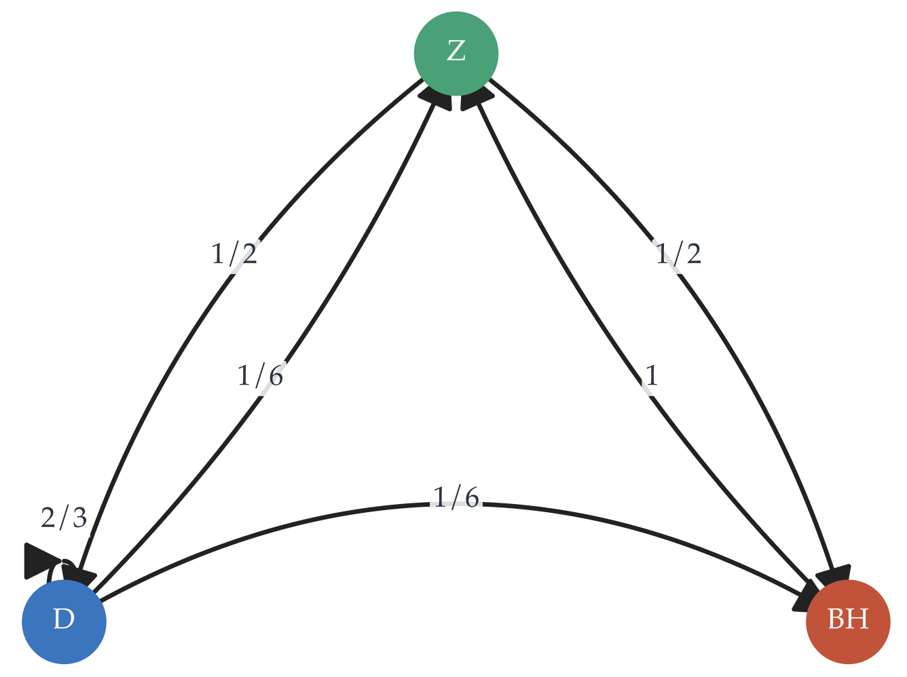



<script>
window.MathJax = {
  tex: {inlineMath: [['$', '$'], ['\\(', '\\)']]}
};
</script>
<script src="https://cdn.jsdelivr.net/npm/mathjax@3/es5/tex-mml-chtml.js" async></script>

<style>
.main-content p {
  margin-bottom: 1.15em;
}
.assignment-pdf-button {
  font-size: 0.95rem;
  padding: 0.35rem 0.65rem;
}
.assignment-actions {
  align-items: center;
  display: flex;
  flex-wrap: wrap;
  gap: 0.55rem;
  margin: 0 0 1rem;
}
.math-display,
mjx-container[jax="CHTML"][display="true"] {
  max-width: 100%;
  overflow-x: auto;
  overflow-y: hidden;
}
.math-display {
  padding-bottom: 0.2rem;
}
.math-display mjx-container[jax="CHTML"][display="true"] {
  padding-bottom: 0.2rem;
}
.answer-blank {
  border-bottom: 1px solid currentColor;
  display: inline-block;
  min-width: 8rem;
  height: 1em;
  vertical-align: baseline;
}
.assignment-parts {
  margin: 1rem 0;
}
.assignment-part {
  column-gap: 0.55rem;
  display: grid;
  grid-template-columns: 1.4rem minmax(0, 1fr);
  margin-bottom: 1.05rem;
}
.assignment-part-label {
  font-weight: 600;
  text-align: right;
}
.assignment-part-content > :first-child {
  margin-top: 0;
}
.mc-options {
  display: flex;
  flex-wrap: wrap;
  gap: 0.9rem 1.6rem;
  margin: 0.9rem 0 1.1rem;
}
.mc-option {
  display: inline-flex;
  align-items: center;
  gap: 0.35rem;
  white-space: nowrap;
}
.mc-bubble,
.mc-square {
  display: inline-block;
  flex: 0 0 auto;
  height: 0.95em;
  width: 0.95em;
  vertical-align: -0.12em;
}
.mc-bubble {
  border: 1.5px solid currentColor;
  border-radius: 50%;
}
.mc-square {
  border: 1.5px solid currentColor;
}
.mc-correct {
  background: currentColor;
}
.main-content table {
  font-size: 0.9rem;
  width: auto;
  max-width: 100%;
}
.main-content table th,
.main-content table td {
  padding: 0.35rem 0.5rem;
  white-space: nowrap;
}
</style>

# Lab 11: Adjacency Matrices and Diagonalization

**due** for completion at 11:59PM Ann Arbor Time on Wednesday, June 17th, 2026

<div class="assignment-actions">
<a class="btn btn-info assignment-pdf-button" href="/resources/labs/lab11/lab11.pdf" target="_blank">View as PDF ✏️</a>
<a class="btn btn-info assignment-pdf-button" href="/resources/labs/lab11/lab11-solutions.pdf" target="_blank">Solutions PDF ✅</a>
</div>

{: .yellow }
<div markdown="1">
Each lab worksheet will contain several activities, some of which will involve writing code and others that will involve writing math on paper. To receive credit for a lab, you must complete as many of the activities as you can in 2 hours and submit a PDF of your work to Gradescope. We will provide specific instructions on how to submit programming activities (e.g. submitting the notebook or including a screenshot of some output).

Feel free to work with others in the course, but you must submit individually.
</div>

---

## Activities

- [Activity 1: Rapid Fire](#activity-1-rapid-fire)
- [Activity 2: Fundamentals](#activity-2-fundamentals)
- [Activity 3: Adjacency Matrices](#activity-3-adjacency-matrices)
- [Activity 4: Symmetric Matrices](#activity-4-symmetric-matrices)
- [Activity 5: More Practice (Optional)](#activity-5-more-practice-optional)

---

**Recap: Diagonalization** ([Chapter 9.4](https://notes.eecs245.org/eigenvalues-and-eigenvectors/multiplicities-diagonalization/))

-   Since <span class="math-inline">\\(A\\)</span> has two linearly independent eigenvectors, it is **diagonalizable**, meaning we can write

<div class="math-display">
$$
A = V \Lambda V^{-1} = \underbrace{\begin{bmatrix} 2 & 3 \\\\ -6 & 1 \end{bmatrix}}_{V} \underbrace{\begin{bmatrix} -3 & 0 \\\\ 0 & 7 \end{bmatrix}}_{\Lambda} \underbrace{\begin{bmatrix} 0.05 & -0.15 \\\\ 0.3 & 0.1 \end{bmatrix}}_{V^{-1}}
$$
</div>

 where <span class="math-inline">\\(V\\)</span> is an invertible matrix whose columns are the eigenvectors of <span class="math-inline">\\(A\\)</span> and <span class="math-inline">\\(\Lambda\\)</span> is a diagonal matrix with the eigenvalues of <span class="math-inline">\\(A\\)</span> on the diagonal.

-   The **algebraic multiplicity** of an eigenvalue, <span class="math-inline">\\(\text{AM}(\lambda&#95;i)\\)</span>, is the number of times it appears as a root of the characteristic polynomial.

<div class="math-display">
$$
p(\lambda) = (\lambda - \lambda_1)^{\text{AM}(\lambda_1)} (\lambda - \lambda_2)^{\text{AM}(\lambda_2)} \cdots (\lambda - \lambda_k)^{\text{AM}(\lambda_k)}
$$
</div>

-   The **geometric multiplicity** of an eigenvalue, <span class="math-inline">\\(\text{GM}(\lambda&#95;i)\\)</span>, is the dimension of the eigenspace corresponding to <span class="math-inline">\\(\lambda&#95;i\\)</span>.

<div class="math-display">
$$
\text{GM}(\lambda_i) = \text{dim}(\text{nullsp}(A - \lambda_i I)) = \text{number of linearly independent eigenvectors corresponding to } \lambda_i
$$
</div>

-   For any <span class="math-inline">\\(\lambda&#95;i\\)</span>, <span class="math-inline">\\(1 \leq \text{GM}(\lambda&#95;i) \leq \text{AM}(\lambda&#95;i)\\)</span>.

-   <span class="math-inline">\\(A\\)</span> is diagonalizable if and only if <span class="math-inline">\\(\text{AM}(\lambda&#95;i) = \text{GM}(\lambda&#95;i)\\)</span> for all eigenvalues <span class="math-inline">\\(\lambda&#95;i\\)</span>. This ensures that <span class="math-inline">\\(A\\)</span>'s eigenvectors form a basis of <span class="math-inline">\\(\mathbb{R}^n\\)</span>.

-   <span class="math-inline">\\(A = \begin{bmatrix} 3 &amp; -1 \\\\ 1 &amp; 1 \end{bmatrix}\\)</span> has characteristic polynomial <span class="math-inline">\\(p(\lambda) = (2 - \lambda)^2\\)</span>. The eigenvalue <span class="math-inline">\\(\lambda = 2\\)</span> has algebraic multiplicity 2, but the corresponding eigenspace is only 1-dimensional:

<div class="math-display">
$$
\text{nullsp}(A - 2I) = \text{nullsp}\left(\begin{bmatrix} 1 & -1 \\\\ 1 & -1 \end{bmatrix}\right) = \text{span}\left(\begin{bmatrix} 1 \\\\ 1 \end{bmatrix}\right)
$$
</div>

 so, <span class="math-inline">\\(\lambda = 2\\)</span> has geometric multiplicity 1. Since <span class="math-inline">\\(\text{AM}(2) \neq \text{GM}(2)\\)</span>, <span class="math-inline">\\(A\\)</span> is **not diagonalizable**.

-   <span class="math-inline">\\(A = \begin{bmatrix} 1 &amp; 0 &amp; 0 \\\\ -1 &amp; 2 &amp; 1 \\\\ -1 &amp; 1 &amp; 2 \end{bmatrix}\\)</span> has characteristic polynomial <span class="math-inline">\\(p(\lambda) = (1 - \lambda)^2(3 - \lambda)\\)</span>, so <span class="math-inline">\\(\lambda&#95;1 = 1\\)</span> has <span class="math-inline">\\(\text{AM}(\lambda&#95;1) = 2\\)</span> and <span class="math-inline">\\(\lambda&#95;2 = 3\\)</span> has <span class="math-inline">\\(\text{AM}(\lambda&#95;2) = 1\\)</span>. The eigenspace for <span class="math-inline">\\(\lambda&#95;1 = 1\\)</span> is 2-dimensional,

<div class="math-display">
$$
\text{nullsp}(A - 1 I) = \text{nullsp}\left(\begin{bmatrix} 0 & 0 & 0 \\\\ -1 & 1 & 1 \\\\ -1 & 1 & 1 \end{bmatrix}\right) = \text{span}\left(\begin{bmatrix} 1 \\\\ 1 \\\\ 0 \end{bmatrix}, \begin{bmatrix} 1 \\\\ 0 \\\\ 1 \end{bmatrix}\right)
$$
</div>

 so <span class="math-inline">\\(\text{GM}(\lambda&#95;1) = 2\\)</span>. Since <span class="math-inline">\\(\text{AM}(\lambda&#95;i) = \text{GM}(\lambda&#95;i)\\)</span> for all eigenvalues <span class="math-inline">\\(\lambda&#95;i\\)</span>, <span class="math-inline">\\(A\\)</span> is **diagonalizable**.

<div class="math-display">
$$
A = V \Lambda V^{-1} = \underbrace{\begin{bmatrix} 1 & 1 & 0 \\\\ 1 & 0 & 1 \\\\ 0 & 1 & 1 \end{bmatrix}}_{V} \underbrace{\begin{bmatrix} 1 & 0 & 0 \\\\ 0 & 1 & 0 \\\\ 0 & 0 & 3 \end{bmatrix}}_{\Lambda} \underbrace{\begin{bmatrix} 0.5 & 0.5 & -0.5 \\\\ 0.5 & -0.5 & 0.5 \\\\ -0.5 & 0.5 & 0.5 \end{bmatrix}}_{V^{-1}}
$$
</div>

-   Diagonalizability is not the same as invertibility!

---

## Activity 1: Rapid Fire

The goal here is to answer the problems **quickly** without working out the details.

<div class="assignment-parts" markdown="1">
<div class="assignment-part" markdown="1">
<div class="assignment-part-label">a)</div>
<div class="assignment-part-content" markdown="1">
Let <span class="math-inline">\\(A = \begin{bmatrix} 1 &amp; 2 &amp; 3 \\\\ 0 &amp; 4 &amp; 5 \\\\ 0 &amp; 0 &amp; 6 \end{bmatrix}\\)</span>. What are the eigenvalues of <span class="math-inline">\\(A\\)</span>? Is <span class="math-inline">\\(A\\)</span> diagonalizable?

<em>Hint: Use the fact that <span class="math-inline">\\(A\\)</span> is an upper triangular matrix. What is <span class="math-inline">\\(\det(A - \lambda I)\\)</span>?</em>

<details markdown="1"><summary>Solution</summary>

<span class="math-inline">\\(\lambda&#95;1 = 1, \lambda&#95;2 = 4, \lambda&#95;3 = 6\\)</span>; <span class="math-inline">\\(A\\)</span> is diagonalizable.

The characteristic polynomial of <span class="math-inline">\\(A\\)</span> is

<div class="math-display">
$$
\begin{align*}
p(\lambda) &= \det(A - \lambda I) \\\\
&= \begin{vmatrix} 1 - \lambda & 2 & 3 \\\\ 0 & 4 - \lambda & 5 \\\\ 0 & 0 & 6 - \lambda \end{vmatrix} \\\\
&= (1 - \lambda) \begin{vmatrix} 4 - \lambda & 5 \\\\ 0 & 6 - \lambda \end{vmatrix}
- 2 \begin{vmatrix} 0 & 5 \\\\ 0 & 6 - \lambda \end{vmatrix}
+ 3 \begin{vmatrix} 0 & 4 - \lambda \\\\ 0 & 0 \end{vmatrix} \\\\
&= (1 - \lambda) \left[ (4 - \lambda)(6 - \lambda) - 0 \cdot 5 \right]
- 2 \left[ 0 \cdot (6 - \lambda) - 0 \cdot 5 \right]
+ 3 \left[ 0 \cdot 0 - 0 \cdot (4 - \lambda) \right] \\\\
&= (1 - \lambda)[(4 - \lambda)(6 - \lambda)] - 0 + 0 \\\\
&= (1 - \lambda)(4 - \lambda)(6 - \lambda)
\end{align*}
$$
</div>

The eigenvalues of <span class="math-inline">\\(A\\)</span> are the solutions to <span class="math-inline">\\(p(\lambda) = 0\\)</span>, which are <span class="math-inline">\\(\lambda&#95;1 = 1\\)</span>, <span class="math-inline">\\(\lambda&#95;2 = 4\\)</span>, and <span class="math-inline">\\(\lambda&#95;3 = 6\\)</span>. Since <span class="math-inline">\\(A\\)</span> has three distinct eigenvalues, it is diagonalizable.

Why does knowing that all of <span class="math-inline">\\(A\\)</span>'s eigenvalues are distinct imply that it's diagonalizable? The key is that for any matrix <span class="math-inline">\\(A\\)</span>, **eigenvectors for different eigenvalues must be linearly independent**. Each eigenvector points in a "new" direction relative to eigenvectors for other eigenvalues. An eigenvector can't correspond to multiple eigenvalues.

From the perspective of multiplicities, remember that the minimum geometric multiplicity of an eigenvalue is 1. Since <span class="math-inline">\\(A\\)</span> has three distinct eigenvalues, they all have geometric multiplicities of 1, which match their algebraic multiplicities.
</details>

</div>
</div>

<div class="assignment-part" markdown="1">
<div class="assignment-part-label">b)</div>
<div class="assignment-part-content" markdown="1">
A <span class="math-inline">\\(5 \times 5\\)</span> matrix has an eigenvalue of 0 with geometric multiplicity 2. What is its rank?

<details markdown="1"><summary>Solution</summary>

<span class="math-inline">\\(\text{rank}(A) = 3\\)</span>.

Let <span class="math-inline">\\(A\\)</span> be the matrix in question. Since it has an eigenvalue of 0 with geometric multiplicity 2, it has two linearly independent eigenvectors corresponding to 0. This means that the null space of <span class="math-inline">\\(A - 0I\\)</span>, which is the same as the null space of <span class="math-inline">\\(A\\)</span>, has dimension 2.

<div class="math-display">
$$
\text{dim}(\text{nullsp}(A)) = 2
$$
</div>

 The rank-nullity theorem tells us that

<div class="math-display">
$$
\text{rank}(A) + \text{dim}(\text{nullsp}(A)) = 5
$$
</div>

Since <span class="math-inline">\\(\text{dim}(\text{nullsp}(A)) = 2\\)</span>, we have

<div class="math-display">
$$
\text{rank}(A) = 5 - 2 = 3
$$
</div>

</details>

</div>
</div>

</div>

---

## Activity 2: Fundamentals

Let <span class="math-inline">\\(A = \begin{bmatrix} 3 &amp; 2 &amp; 0 \\\\ 2 &amp; 3 &amp; 0 \\\\ 0 &amp; 0 &amp; 5 \end{bmatrix}\\)</span>.

<div class="assignment-parts" markdown="1">
<div class="assignment-part" markdown="1">
<div class="assignment-part-label">a)</div>
<div class="assignment-part-content" markdown="1">
Find the characteristic polynomial of <span class="math-inline">\\(A\\)</span>, and use it to find the eigenvalues of <span class="math-inline">\\(A\\)</span> and their algebraic multiplicities.

<details markdown="1"><summary>Solution</summary>

The characteristic polynomial of <span class="math-inline">\\(A\\)</span> is

<div class="math-display">
$$
\begin{align*}
p(\lambda) &= \det(A - \lambda I) \\\\
&= \begin{vmatrix}
3 - \lambda & 2 & 0 \\\\
2 & 3 - \lambda & 0 \\\\
0 & 0 & 5 - \lambda
\end{vmatrix} \\\\
&= (3-\lambda) \begin{vmatrix} 3-\lambda & 0 \\\\ 0 & 5-\lambda \end{vmatrix}
- 2 \begin{vmatrix} 2 & 0 \\\\ 0 & 5-\lambda \end{vmatrix}
+ 0 \begin{vmatrix} 2 & 3-\lambda \\\\ 0 & 0 \end{vmatrix} \\\\
&= (3-\lambda) \left[ (3-\lambda)(5-\lambda) - 0 \cdot 0 \right]
- 2 \left[ 2(5-\lambda) - 0 \cdot 0 \right] + 0 \\\\
&= (3-\lambda)\left[(3-\lambda)(5-\lambda)\right]
- 2[2(5-\lambda)] \\\\
&= (3-\lambda)^2(5-\lambda) - 4(5-\lambda) \\\\
&= (5-\lambda)\left[(3-\lambda)^2 - 4\right] \\\\
&= (5-\lambda)\left[9 - 6\lambda + \lambda^2 - 4\right] \\\\
&= (5-\lambda)\left[\lambda^2 - 6\lambda + 5\right] \\\\
&= (5-\lambda)(\lambda - 1)(\lambda - 5) \\\\
&= (1-\lambda)(5 - \lambda)^2
\end{align*}
$$
</div>

So, <span class="math-inline">\\(A\\)</span> has eigenvalues <span class="math-inline">\\(\lambda&#95;1 = 1\\)</span> with algebraic multiplicity <span class="math-inline">\\(\text{AM}(\lambda&#95;1) = 1\\)</span> and <span class="math-inline">\\(\lambda&#95;2 = 5\\)</span> with algebraic multiplicity <span class="math-inline">\\(\text{AM}(\lambda&#95;2) = 2\\)</span>.
</details>

</div>
</div>

<div class="assignment-part" markdown="1">
<div class="assignment-part-label">b)</div>
<div class="assignment-part-content" markdown="1">
Find a basis for the eigenspace corresponding to each eigenvalue.

<details markdown="1"><summary>Solution</summary>

-   The eigenspace corresponding to <span class="math-inline">\\(\lambda&#95;1 = 1\\)</span> is

<div class="math-display">
$$
\text{nullsp}(A - 1I) = \text{nullsp}\left(\begin{bmatrix} 2 & 2 & 0 \\\\ 2 & 2 & 0 \\\\ 0 & 0 & 4 \end{bmatrix}\right) = \text{span}\left(\begin{bmatrix} 1 \\\\ -1 \\\\ 0 \end{bmatrix}\right)
$$
</div>

   If you'd rather see this the systems of equations way, we're looking for a vector <span class="math-inline">\\(\vec v&#95;1 = \begin{bmatrix} a \\\\ b \\\\ c \end{bmatrix}\\)</span> such that


<div class="math-display">
$$
\begin{align*}
    A \begin{bmatrix} a \\\\ b \\\\ c \end{bmatrix} &= (1) \begin{bmatrix} a \\\\ b \\\\ c \end{bmatrix} \\\\
    \begin{bmatrix} 3 & 2 & 0 \\\\ 2 & 3 & 0 \\\\ 0 & 0 & 5 \end{bmatrix} \begin{bmatrix} a \\\\ b \\\\ c \end{bmatrix} &= \begin{bmatrix} a \\\\ b \\\\ c \end{bmatrix} \\\\
    \begin{bmatrix} 3a + 2b \\\\ 2a + 3b \\\\ 5c \end{bmatrix} &= \begin{bmatrix} a \\\\ b \\\\ c \end{bmatrix}
    \end{align*}
$$
</div>

   The first two equations both are equivalent, and say that <span class="math-inline">\\(3a + 2b = a \implies 2a + 2b = 0 \implies b = -a\\)</span>. The last equation just says <span class="math-inline">\\(5c = c \implies 4c = 0 \implies c = 0\\)</span>. The easy solution is to let <span class="math-inline">\\(a = 1\\)</span>, which gives <span class="math-inline">\\(\boxed{\vec v&#95;1 = \begin{bmatrix} 1 \\\\ -1 \\\\ 0 \end{bmatrix}}\\)</span>. So, the eigenspace is the line of vectors spanned by <span class="math-inline">\\(\vec v&#95;1\\)</span>.

-   The eigenspace corresponding to <span class="math-inline">\\(\lambda&#95;2 = 5\\)</span> is

<div class="math-display">
$$
\text{nullsp}(A - 5I) = \text{nullsp}\left(\begin{bmatrix} -2 & 2 & 0 \\\\ 2 & -2 & 0 \\\\ 0 & 0 & 0 \end{bmatrix}\right) = \boxed{\text{span}\left(\begin{bmatrix} 1 \\\\ 1 \\\\ 0 \end{bmatrix}, \begin{bmatrix} 0 \\\\ 0 \\\\ 1 \end{bmatrix}\right)}
$$
</div>

   If you'd rather see this the systems of equations way, we're looking for a vector <span class="math-inline">\\(\vec v&#95;2 = \begin{bmatrix} a \\\\ b \\\\ c \end{bmatrix}\\)</span> such that

<div class="math-display">
$$
\begin{bmatrix} 3a + 2b \\\\ 2a + 3b \\\\ 5c \end{bmatrix} = \begin{bmatrix} 5a \\\\ 5b \\\\ 5c \end{bmatrix}
$$
</div>

   The first two equations both are equivalent and say that <span class="math-inline">\\(a = b\\)</span>. The last equation just says that <span class="math-inline">\\(c = c\\)</span>. So, the null space of <span class="math-inline">\\(A - 5I\\)</span> is the set of all vectors with equal first and second components, while the third component can be anything. This is a space spanned by two vectors, <span class="math-inline">\\(\begin{bmatrix} 1 \\\\ 1 \\\\ 0 \end{bmatrix}\\)</span> and <span class="math-inline">\\(\begin{bmatrix} 0 \\\\ 0 \\\\ 1 \end{bmatrix}\\)</span>.
</details>

</div>
</div>

<div class="assignment-part" markdown="1">
<div class="assignment-part-label">c)</div>
<div class="assignment-part-content" markdown="1">
This particular <span class="math-inline">\\(A\\)</span> is diagonalizable. Diagonalize <span class="math-inline">\\(A\\)</span> by finding a matrix <span class="math-inline">\\(V\\)</span> and a diagonal matrix <span class="math-inline">\\(\Lambda\\)</span> such that <span class="math-inline">\\(A = V \Lambda V^{-1}\\)</span>.

<details markdown="1"><summary>Solution</summary>

In the previous part, we saw that <span class="math-inline">\\(\lambda&#95;1 = 1\\)</span> has the eigenvector <span class="math-inline">\\(\vec v&#95;1 = \begin{bmatrix} 1 \\\\ -1 \\\\ 0 \end{bmatrix}\\)</span>, while <span class="math-inline">\\(\lambda&#95;2 = 5\\)</span> corresponds to the linearly independent eigenvectors <span class="math-inline">\\(\begin{bmatrix} 1 \\\\ 1 \\\\ 0 \end{bmatrix}\\)</span> and <span class="math-inline">\\(\begin{bmatrix} 0 \\\\ 0 \\\\ 1 \end{bmatrix}\\)</span>. So, we can construct <span class="math-inline">\\(V\\)</span> and <span class="math-inline">\\(\Lambda\\)</span> as follows:

<div class="math-display">
$$
V = \begin{bmatrix} 1 & 1 & 0 \\\\ -1 & 1 & 0 \\\\ 0 & 0 & 1 \end{bmatrix}, \quad \Lambda = \begin{bmatrix} 1 & 0 & 0 \\\\ 0 & 5 & 0 \\\\ 0 & 0 & 5 \end{bmatrix}
$$
</div>

And we have <span class="math-inline">\\(A = V \Lambda V^{-1} = \begin{bmatrix} 1 &amp; 1 &amp; 0 \\\\ -1 &amp; 1 &amp; 0 \\\\ 0 &amp; 0 &amp; 1 \end{bmatrix} \begin{bmatrix} 1 &amp; 0 &amp; 0 \\\\ 0 &amp; 5 &amp; 0 \\\\ 0 &amp; 0 &amp; 5 \end{bmatrix} \begin{bmatrix} 1/2 &amp; -1/2 &amp; 0 \\\\ 1/2 &amp; 1/2 &amp; 0 \\\\ 0 &amp; 0 &amp; 1 \end{bmatrix} = \begin{bmatrix} 3 &amp; 2 &amp; 0 \\\\ 2 &amp; 3 &amp; 0 \\\\ 0 &amp; 0 &amp; 5 \end{bmatrix}\\)</span>.
</details>

</div>
</div>

</div>

---

## Activity 3: Adjacency Matrices

Suppose that each night, a Wolverine moves between three classic Ann Arbor spots: the Diag, Zingerman's, and the Big House.

-   From the Diag, <span class="math-inline">\\(\frac{2}{3}\\)</span> of the time it stays at the Diag, <span class="math-inline">\\(\frac{1}{6}\\)</span> of the time it walks to Zingerman's, and <span class="math-inline">\\(\frac{1}{6}\\)</span> of the time it walks to the Big House.

-   From the Big House, it **always** walks to Zingerman's.

-   From Zingerman's, it is **equally likely** to walk to the Diag or the Big House.

<div class="assignment-parts" markdown="1">
<div class="assignment-part" markdown="1">
<div class="assignment-part-label">a)</div>
<div class="assignment-part-content" markdown="1">
Draw a state diagram for this Markov chain. Make sure to clearly label the edges with their transition probabilities. (For help, see [Chapter 9.3](https://notes.eecs245.org/eigenvalues-and-eigenvectors/markov-chains-adjacency-matrices/).)

<details markdown="1"><summary>Solution</summary>

<div style="text-align: center;">

</div>
</details>

</div>
</div>

<div class="assignment-part" markdown="1">
<div class="assignment-part-label">b)</div>
<div class="assignment-part-content" markdown="1">
Find the adjacency matrix, <span class="math-inline">\\(A\\)</span>, of this Markov chain.

<details markdown="1"><summary>Solution</summary>

<span class="math-inline">\\(A = \begin{bmatrix} p(D \rightarrow D) &amp; p(B \rightarrow D) &amp; p(Z \rightarrow D) \\\\ p(D \rightarrow B) &amp; p(B \rightarrow B) &amp; p(Z \rightarrow B) \\\\ p(D \rightarrow Z) &amp; p(B \rightarrow Z) &amp; p(Z \rightarrow Z) \end{bmatrix} = \begin{bmatrix}2/3 &amp; 0 &amp; 1/2 \\\\ 1/6 &amp; 0 &amp; 1/2 \\\\ 1/6 &amp; 1 &amp; 0\end{bmatrix}\\)</span>

Let the Diag be state 1, so the first column corresponds to movement **from** the Diag. The second column corresponds to movement from the Big House, and the third column corresponds to movement from Zingerman's.
</details>

</div>
</div>

<div class="assignment-part" markdown="1">
<div class="assignment-part-label">c)</div>
<div class="assignment-part-content" markdown="1">
Show that the long-run distribution of the Wolverine's locations is <span class="math-inline">\\(\begin{bmatrix} p(\text{Diag}) \\\\ p(\text{Big House}) \\\\ p(\text{Zingerman's}) \end{bmatrix} = \begin{bmatrix} 6/13 \\\\ 3/13 \\\\ 4/13 \end{bmatrix}\\)</span>. <em>Hint: Do this by finding the eigenvector of <span class="math-inline">\\(A\\)</span> corresponding to the eigenvalue 1. Since there are infinitely many such eigenvectors, find the one that satisfies the constraint that the components sum to 1.</em>

<details markdown="1"><summary>Solution</summary>

We can find the eigenvector corresponding to <span class="math-inline">\\(\lambda = 1\\)</span> by finding a basis for <span class="math-inline">\\(\text{nullsp}(A - \lambda I)\\)</span>:

<div class="math-display">
$$
\text{nullsp}(A - I) = \text{nullsp}\left(\begin{bmatrix} -1/3 & 0 & 1/2 \\\\ 1/6 & -1 & 1/2 \\\\ 1/6 & 1 & -1 \end{bmatrix}\right)= \text{span}\left(\begin{bmatrix}6 \\\\ 3 \\\\ 4\end{bmatrix}\right)
$$
</div>

 Dividing <span class="math-inline">\\(\begin{bmatrix}6 \\\\ 3 \\\\ 4\end{bmatrix}\\)</span> by the sum of its components, 13, gives us the long-run distribution.
</details>

</div>
</div>

<div class="assignment-part" markdown="1">
<div class="assignment-part-label">d)</div>
<div class="assignment-part-content" markdown="1">
Open a new Jupyter Notebook or interactive Python session in the Terminal. In it, run:

```python
import numpy as np
A = np.array(...) # Replace with the adjacency matrix you found in b)
eigvals, eigvecs = np.linalg.eig(A)
```
Now, if you run `eigvals`, you should see

```python
array([ 1.        ,  0.36037961, -0.69371294])
```
If you run `eigvecs[:, 0]` to access the eigenvector corresponding to the first eigenvalue in the array above, you should see

```python
array([0.76822128, 0.38411064, 0.51214752])
```
This is **not** the eigenvector you found in the previous part. Why not? What did it return, and what expression can you run in code to find the exact answer you found in the previous part?

<details markdown="1"><summary>Solution</summary>

`np.linalg.eig` returns eigenvectors that are **unit vectors**. Since there are infinitely many eigenvectors in any one direction, a unit eigenvector is the one it chooses to return. To find the eigenvector with a sum of 1, run

   eigvecs[:, 0] / np.sum(eigvecs[:, 0])
</details>

</div>
</div>

<div class="assignment-part" markdown="1">
<div class="assignment-part-label">e)</div>
<div class="assignment-part-content" markdown="1">
Run both of the following commands:

```python
np.linalg.matrix_power(A, 20) @ np.array([[1/3], [1/3], [1/3]])
np.linalg.matrix_power(A, 21) @ np.array([[1/3], [1/3], [1/3]])
```
What do you see? Why?

<details markdown="1"><summary>Solution</summary>

The resulting vectors are the same as the long-run distribution from part **c)** because it's the eigenvector for the eigenvalue 1, the dominant eigenvalue of the adjacency matrix. Let's show why it's converging towards that eigenvector more concretely:

<div class="math-display">
$$
\lambda_1 = 1, \lambda_2 = 0.36, \lambda_3 = -0.69, \vec x = \begin{bmatrix} 1/3 & 1/3 & 1/3 \end{bmatrix}^T
$$
</div>

 All of <span class="math-inline">\\(A\\)</span>'s eigenvectors, <span class="math-inline">\\(\vec v&#95;1, \vec v&#95;2, \text{and } \vec v&#95;3\\)</span> are linearly independent, so <span class="math-inline">\\(\vec x=c&#95;1\vec v&#95;1 + c&#95;2\vec v&#95;2 + c&#95;3\vec v&#95;3\\)</span> for some constants <span class="math-inline">\\(c&#95;1, c&#95;2, c&#95;3\\)</span>.

<div class="math-display">
$$
\begin{align*}
A^k\vec x &= A^k(c_1\vec v_1 + c_2\vec v_2 + c_3\vec v_3)
\\\\&= c_1A^k\vec v_1 + c_2A^k\vec v_2 + c_3A^k\vec v_3
\\\\&= c_1\lambda_1^k\vec v_1 + c_2\lambda_2^k\vec v_2 + c_3\lambda_3^k\vec v_3
\\\\&= c_1\lambda_1^k\vec v_1
\end{align*}
$$
</div>

As <span class="math-inline">\\(k \rightarrow \infty\\)</span>, <span class="math-inline">\\(\lambda&#95;2^k\\)</span> and <span class="math-inline">\\(\lambda&#95;3^k\\)</span> will both approach 0 because their magnitudes are less than 1, while <span class="math-inline">\\(\lambda&#95;1^k\\)</span> stays at 1. This leaves us with the eigenvector for <span class="math-inline">\\(\lambda&#95;1\\)</span>.
</details>

</div>
</div>

<div class="assignment-part" markdown="1">
<div class="assignment-part-label">f)</div>
<div class="assignment-part-content" markdown="1">
Now, consider the adjacency matrix

<div class="math-display">
$$
B = \begin{bmatrix} 0 & 0 & 1/2 \\\\ 0 & 0 & 1/2 \\\\ 1 & 1 & 0 \end{bmatrix}
$$
</div>

Using `numpy`, find the eigenvalues of <span class="math-inline">\\(B\\)</span>. Then, run all of the following commands:

```python
np.linalg.matrix_power(B, 20) @ np.array([[1/3], [1/3], [1/3]])
np.linalg.matrix_power(B, 21) @ np.array([[1/3], [1/3], [1/3]])
np.linalg.matrix_power(B, 22) @ np.array([[1/3], [1/3], [1/3]])
np.linalg.matrix_power(B, 23) @ np.array([[1/3], [1/3], [1/3]])
```
This Markov chain appears not to converge. **Why not?** Relate your answer to the discussion of "the dominant eigenvalue" in [Chapter 9.3](https://notes.eecs245.org/eigenvalues-and-eigenvectors/markov-chains-adjacency-matrices/).

<details markdown="1"><summary>Solution</summary>

The eigenvalues of <span class="math-inline">\\(B\\)</span> are <span class="math-inline">\\(\lambda&#95;1 = -1, \lambda&#95;2 = 0, \lambda&#95;3 = 1\\)</span>. Let's take a closer look at what happens when we apply the same idea from part **e)**:

<div class="math-display">
$$
\begin{align*}
A^k\vec x &= A^k(c_1\vec v_1 + c_2\vec v_2 + c_3\vec v_3)
\\\\&= c_1A^k\vec v_1 + c_2A^k\vec v_2 + c_3A^k\vec v_3
\\\\&= c_1\lambda_1^k\vec v_1 + c_3\lambda_3^k\vec v_3
\\\\
\\\\\text{if }k \text{ is even}, &= c_1\lambda_1^k\vec v_1 + c_3\lambda_3^k\vec v_3 \\\\
\text{if }k \text{ is odd}, &= c_1\lambda_1^k\vec v_1 - c_3\lambda_3^k\vec v_3
\end{align*}
$$
</div>

There are **2** eigenvalues with magnitude 1, and one of them is negative. As <span class="math-inline">\\(k \rightarrow \infty\\)</span>, the result of <span class="math-inline">\\(A^k\vec x\\)</span> will bounce between two different vectors.
</details>

</div>
</div>

</div>

---

## Activity 4: Symmetric Matrices

Suppose <span class="math-inline">\\(A\\)</span> is a symmetric <span class="math-inline">\\(n \times n\\)</span> matrix, meaning <span class="math-inline">\\(A = A^T\\)</span>. Symmetric matrices have a special property, described by the spectral theorem: **the eigenvectors corresponding to different eigenvalues are orthogonal**. Below, we provide a proof of this fact.

`1.` Let <span class="math-inline">\\(\vec v&#95;i\\)</span> be an eigenvector of <span class="math-inline">\\(A\\)</span> with eigenvalue <span class="math-inline">\\(\lambda&#95;i\\)</span>, so <span class="math-inline">\\(A \vec v&#95;i = \lambda&#95;i \vec v&#95;i\\)</span>.

`2.` Let <span class="math-inline">\\(\vec v&#95;j\\)</span> be an eigenvector of <span class="math-inline">\\(A\\)</span> with eigenvalue <span class="math-inline">\\(\lambda&#95;j\\)</span>, where <span class="math-inline">\\(\lambda&#95;i \neq \lambda&#95;j\\)</span>, so <span class="math-inline">\\(A \vec v&#95;j = \lambda&#95;j \vec v&#95;j\\)</span>.

`3.` The dot product of <span class="math-inline">\\(\vec v&#95;i\\)</span> and <span class="math-inline">\\(A \vec v&#95;j\\)</span> is <span class="math-inline">\\(\vec v&#95;i \cdot (A \vec v&#95;j) = \vec v&#95;i \cdot (\lambda&#95;j \vec v&#95;j) = \lambda&#95;j (\vec v&#95;i \cdot \vec v&#95;j)\\)</span>.

`4.` But also, <span class="math-inline">\\(\vec v&#95;i \cdot (A \vec v&#95;j) = \vec v&#95;i^T A \vec v&#95;j = \vec v&#95;i^T A^T \vec v&#95;j = (A \vec v&#95;i)^T \vec v&#95;j = \lambda&#95;i \vec v&#95;i^T \vec v&#95;j = \lambda&#95;i (\vec v&#95;i \cdot \vec v&#95;j)\\)</span>.

`5.` The final expressions in both cases are equal, so <span class="math-inline">\\(\lambda&#95;j (\vec v&#95;i \cdot \vec v&#95;j) = \lambda&#95;i (\vec v&#95;i \cdot \vec v&#95;j)\\)</span>.

`6.` Equivalently, <span class="math-inline">\\((\lambda&#95;j - \lambda&#95;i) (\vec v&#95;i \cdot \vec v&#95;j) = 0\\)</span>. But since <span class="math-inline">\\(\lambda&#95;i \neq \lambda&#95;j\\)</span>, we must have <span class="math-inline">\\(\vec v&#95;i \cdot \vec v&#95;j = 0\\)</span>.

<div class="assignment-parts" markdown="1">
<div class="assignment-part" markdown="1">
<div class="assignment-part-label">a)</div>
<div class="assignment-part-content" markdown="1">
In which line did we use the fact that <span class="math-inline">\\(A\\)</span> is symmetric? Select the line below, and then in that line, circle the specific part of the equation that uses the fact that <span class="math-inline">\\(A = A^T\\)</span>.

<div class="mc-options"><span class="mc-option"><span class="mc-bubble" aria-hidden="true"></span> 1</span><span class="mc-option"><span class="mc-bubble" aria-hidden="true"></span> 2</span><span class="mc-option"><span class="mc-bubble" aria-hidden="true"></span> 3</span><span class="mc-option"><span class="mc-bubble" aria-hidden="true"></span> 4</span><span class="mc-option"><span class="mc-bubble" aria-hidden="true"></span> 5</span><span class="mc-option"><span class="mc-bubble" aria-hidden="true"></span> 6</span></div>

<details markdown="1"><summary>Solution</summary>

<div class="mc-options"><span class="mc-option"><span class="mc-bubble" aria-hidden="true"></span> 1</span><span class="mc-option"><span class="mc-bubble" aria-hidden="true"></span> 2</span><span class="mc-option"><span class="mc-bubble" aria-hidden="true"></span> 3</span><span class="mc-option"><span class="mc-bubble mc-correct" aria-hidden="true"></span> 4</span><span class="mc-option"><span class="mc-bubble" aria-hidden="true"></span> 5</span><span class="mc-option"><span class="mc-bubble" aria-hidden="true"></span> 6</span></div>

Line 4 is the only line that uses the fact that <span class="math-inline">\\(A = A^T\\)</span>, but it's the most important line in the proof. Specifically, here's where we used that fact:

<div class="math-display">
$$
\vec v_i^T A \vec v_j = \vec v_i^T A^T \vec v_j
$$
</div>

By using <span class="math-inline">\\(A = A^T\\)</span> here, we were able to write <span class="math-inline">\\(\vec v&#95;i \cdot (A \vec v&#95;j)\\)</span> as <span class="math-inline">\\(\vec v&#95;i^T A^T \vec v&#95;j = (A \vec v&#95;i) \cdot \vec v&#95;j\\)</span>, which was key to our final expression.
</details>

</div>
</div>

<div class="assignment-part" markdown="1">
<div class="assignment-part-label">b)</div>
<div class="assignment-part-content" markdown="1">
The **spectral theorem** states that any symmetric <span class="math-inline">\\(n \times n\\)</span> matrix <span class="math-inline">\\(A\\)</span> can be diagonalized by an orthogonal matrix <span class="math-inline">\\(Q\\)</span> through

<div class="math-display">
$$
A = Q \Lambda Q^T
$$
</div>

Explain how this relates to the "regular" diagonalization <span class="math-inline">\\(A = V \Lambda V^{-1}\\)</span>. Why does the equation above contain <span class="math-inline">\\(Q^T\\)</span> instead of <span class="math-inline">\\(Q^{-1}\\)</span>?

<details markdown="1"><summary>Solution</summary>

A standard (not necessarily symmetric) matrix <span class="math-inline">\\(A\\)</span> that is diagonalizable can be written as

<div class="math-display">
$$
A = V \Lambda V^{-1}
$$
</div>

If <span class="math-inline">\\(A\\)</span> is symmetric and can be written <span class="math-inline">\\(A = Q \Lambda Q^T\\)</span>, then the fact that we have <span class="math-inline">\\(Q^T\\)</span> instead of <span class="math-inline">\\(Q^{-1}\\)</span> stems from the fact that orthogonal matrices satisfy <span class="math-inline">\\(Q^T = Q^{-1}\\)</span>. This comes from the fact that <span class="math-inline">\\(Q^TQ = QQ^T = I\\)</span>. Transposes are easier to compute than inverses, and easier to interpret, too: if <span class="math-inline">\\(Q\\)</span> is a rotation, then <span class="math-inline">\\(Q^T\\)</span> is the inverse rotation, i.e. a rotation by the opposite amount.
</details>

</div>
</div>

<div class="assignment-part" markdown="1">
<div class="assignment-part-label">c)</div>
<div class="assignment-part-content" markdown="1">
Symmetric matrices play a big role in solving optimization problems in machine learning. You'll get a taste of this in Homework 10, Problem 6, which discusses *ridge regression* and *regularization*, ideas that we use to make sure that our models are not overfitting to training data.

Here, we'll prove a related fact: **if <span class="math-inline">\\(A\\)</span> is an <span class="math-inline">\\(n \times n\\)</span> symmetric matrix and all of its eigenvalues are non-negative, then <span class="math-inline">\\(A\\)</span> is positive semidefinite.** A symmetric matrix <span class="math-inline">\\(A\\)</span> is positive semidefinite if and only if <span class="math-inline">\\(\boxed{\vec v^T A \vec v \geq 0}\\)</span> for all <span class="math-inline">\\(\vec v \in \mathbb{R}^n\\)</span>. One interpretation: this means the quadratic form <span class="math-inline">\\(f(\vec v) = \vec v^T A \vec v\\)</span> is always greater than or equal to 0, no matter what <span class="math-inline">\\(\vec v\\)</span> is.

Let's work through the proof step-by-step: we will do some of it for you, and you'll complete the rest. (To be precise, we're only proving one direction of the "if and only if" statement; the other direction is in Homework 10!) First, since <span class="math-inline">\\(A\\)</span> is symmetric, the **spectral theorem** tells us that <span class="math-inline">\\(A\\)</span> can be written as

<div class="math-display">
$$
A = Q \Lambda Q^T
$$
</div>

 where <span class="math-inline">\\(Q\\)</span> is an orthogonal matrix and <span class="math-inline">\\(\Lambda\\)</span> is a diagonal matrix with the eigenvalues of <span class="math-inline">\\(A\\)</span> on the diagonal. This is the eigenvector decomposition of <span class="math-inline">\\(A\\)</span>.

On top of that, suppose that all of <span class="math-inline">\\(A\\)</span>'s eigenvalues, <span class="math-inline">\\(\lambda&#95;1, \lambda&#95;2, \ldots, \lambda&#95;n\\)</span>, are non-negative.

Now, let <span class="math-inline">\\(\vec v\\)</span> be some arbitrary vector (not necessarily an eigenvector of <span class="math-inline">\\(A\\)</span>) in <span class="math-inline">\\(\mathbb{R}^n\\)</span>. Then, eventually we need to show that <span class="math-inline">\\(\vec v^T A \vec v \geq 0\\)</span>, regardless of what <span class="math-inline">\\(\vec v\\)</span> is. Let's start by expanding <span class="math-inline">\\(\vec v^T A \vec v\\)</span> using the fact that <span class="math-inline">\\(A = Q \Lambda Q^T\\)</span>.

<div class="math-display">
$$
\vec v^T A \vec v = \vec v^T (Q \Lambda Q^T) \vec v = (\vec v^T Q) \Lambda (Q^T \vec v)
$$
</div>

Suppose that <span class="math-inline">\\(\vec y = Q^T \vec v\\)</span>. Then, <span class="math-inline">\\(\vec y^T = (Q^T \vec v)^T = \vec v^T Q\\)</span>. This seems like an arbitrary maneuver, but it will be useful in a moment.

<div class="math-display">
$$
\begin{align*}
\vec v^T A \vec v &= \vec y^T \Lambda \vec y =\begin{bmatrix} y_1 & y_2 & \ldots & y_n \end{bmatrix}
\begin{bmatrix}
\lambda_1 & 0 & \ldots & 0 \\\\
0 & \lambda_2 & \ldots & 0 \\\\
\vdots & \vdots & \ddots & \vdots \\\\
0 & 0 & \ldots & \lambda_n
\end{bmatrix}
\begin{bmatrix}
y_1 \\\\ y_2 \\\\ \vdots \\\\ y_n
\end{bmatrix}
\end{align*}
$$
</div>

**Your job** is to complete the rest of the proof. Show that if <span class="math-inline">\\(A\\)</span> is an <span class="math-inline">\\(n \times n\\)</span> symmetric matrix and all of its eigenvalues are non-negative, then <span class="math-inline">\\(\vec v^T A \vec v \geq 0\\)</span> for all <span class="math-inline">\\(\vec v \in \mathbb{R}^n\\)</span>.

<details markdown="1"><summary>Solution</summary>

<div class="math-display">
$$
\begin{align*}
\vec v^T A \vec v &= \vec y^T \Lambda \vec y \\\\
&= \begin{bmatrix} y_1 & y_2 & \ldots & y_n \end{bmatrix}
\begin{bmatrix}
\lambda_1 & 0 & \ldots & 0 \\\\
0 & \lambda_2 & \ldots & 0 \\\\
\vdots & \vdots & \ddots & \vdots \\\\
0 & 0 & \ldots & \lambda_n
\end{bmatrix}
\begin{bmatrix}
y_1 \\\\ y_2 \\\\ \vdots \\\\ y_n
\end{bmatrix} \\\\
&= \begin{bmatrix}
y_1 & y_2 & \ldots & y_n
\end{bmatrix}  \begin{bmatrix} \lambda_1 y_1 \\\\ \lambda_2 y_2 \\\\ \vdots \\\\ \lambda_n y_n \end{bmatrix} \\\\
&= \sum_{i=1}^n \lambda_i y_i^2
\end{align*}
$$
</div>

Remember that none of the <span class="math-inline">\\(\lambda&#95;i\\)</span>'s are negative. So, each term <span class="math-inline">\\(\lambda&#95;i y&#95;i^2\\)</span> is non-negative too, meaning the entire sum <span class="math-inline">\\(\sum&#95;{i=1}^n \lambda&#95;i y&#95;i^2\\)</span> is non-negative. What we've shown is that if <span class="math-inline">\\(\vec v\\)</span> is **any** vector in <span class="math-inline">\\(\mathbb{R}^n\\)</span>, then <span class="math-inline">\\(\vec v^T A \vec v\\)</span> ends up being a sum of this form, which is always non-negative, so <span class="math-inline">\\(\vec v^T A \vec v \geq 0\\)</span>, and thus <span class="math-inline">\\(A\\)</span> is positive semidefinite.
</details>

</div>
</div>

</div>

---

## Activity 5: More Practice (Optional)

Let <span class="math-inline">\\(A\\)</span> be a <span class="math-inline">\\(3 \times 3\\)</span> with:

-   eigenvalue <span class="math-inline">\\(\lambda&#95;1 = 3\\)</span> with eigenvector <span class="math-inline">\\(\vec v&#95;1 = \begin{bmatrix} 2 \\\\ 0 \\\\ 1 \end{bmatrix}\\)</span>.

-   eigenvalue <span class="math-inline">\\(\lambda&#95;2 = -2\\)</span> with the 2-dimensional eigenspace: <span class="math-inline">\\(\text{span}\left(\begin{bmatrix} 1 \\\\ 1 \\\\ 0 \end{bmatrix}, \begin{bmatrix} 0 \\\\ 1 \\\\ 2 \end{bmatrix}\right)\\)</span>.

<div class="assignment-parts" markdown="1">
<div class="assignment-part" markdown="1">
<div class="assignment-part-label">a)</div>
<div class="assignment-part-content" markdown="1">
Find <span class="math-inline">\\(A\\)</span>. Feel free to use `numpy` to find an inverse for you and verify your answer.

<details markdown="1"><summary>Solution</summary>

<span class="math-inline">\\(A = \begin{bmatrix} 0.5 &amp; -2.5 &amp; 5 \\\\ 0 &amp; -2 &amp; 0 \\\\ 1.25 &amp; -1.25 &amp; 0.5 \end{bmatrix}\\)</span>.

The eigenvector decomposition of <span class="math-inline">\\(A\\)</span> is <span class="math-inline">\\(A = V \Lambda V^{-1}\\)</span>, where <span class="math-inline">\\(V\\)</span> is the matrix whose columns are the eigenvectors of <span class="math-inline">\\(A\\)</span> and <span class="math-inline">\\(\Lambda\\)</span> is the diagonal matrix with the eigenvalues of <span class="math-inline">\\(A\\)</span> on the diagonal, arranged in the same order as the eigenvectors in <span class="math-inline">\\(V\\)</span>. We know that <span class="math-inline">\\(\lambda&#95;1 = 3\\)</span> with eigenvector <span class="math-inline">\\(\vec v&#95;1 = \begin{bmatrix} 2 \\\\ 0 \\\\ 1 \end{bmatrix}\\)</span> and that <span class="math-inline">\\(\lambda&#95;2 = \lambda&#95;3 = -2\\)</span> with eigenvectors <span class="math-inline">\\(\vec v&#95;2 = \begin{bmatrix} 1 \\\\ 1 \\\\ 0 \end{bmatrix}\\)</span> and <span class="math-inline">\\(\vec v&#95;3 = \begin{bmatrix} 0 \\\\ 1 \\\\ 2 \end{bmatrix}\\)</span>. Placing this information into <span class="math-inline">\\(V\\)</span> and <span class="math-inline">\\(\Lambda\\)</span> gives us

<div class="math-display">
$$
V = \begin{bmatrix} 2 & 1 & 0 \\\\ 0 & 1 & 2 \\\\ 1 & 0 & 1 \end{bmatrix}, \quad \Lambda = \begin{bmatrix} 3 & 0 & 0 \\\\ 0 & -2 & 0 \\\\ 0 & 0 & -2 \end{bmatrix}
$$
</div>

So,

<div class="math-display">
$$
A = V \Lambda V^{-1} = \begin{bmatrix} 2 & 1 & 0 \\\\ 0 & 1 & 2 \\\\ 1 & 0 & 1 \end{bmatrix} \begin{bmatrix} 3 & 0 & 0 \\\\ 0 & -2 & 0 \\\\ 0 & 0 & -2 \end{bmatrix} \left(\begin{bmatrix} 2 & 1 & 0 \\\\ 0 & 1 & 2 \\\\ 1 & 0 & 1 \end{bmatrix}\right)^{-1}
$$
</div>

A bit of help from `numpy` shows that <span class="math-inline">\\(A = \begin{bmatrix} 0.5 &amp; -2.5 &amp; 5 \\\\ 0 &amp; -2 &amp; 0 \\\\ 1.25 &amp; -1.25 &amp; 0.5 \end{bmatrix}\\)</span>.

```python
>>> V = np.array([
    [2, 1, 0],
    [0, 1, 2],
    [1, 0, 1]
])
>>> V @ np.diag([3, -2, -2]) @ np.linalg.inv(V)
array([[ 0.5 , -2.5 ,  5.  ],
       [ 0.  , -2.  ,  0.  ],
       [ 1.25, -1.25,  0.5 ]])
```
</details>

</div>
</div>

<div class="assignment-part" markdown="1">
<div class="assignment-part-label">b)</div>
<div class="assignment-part-content" markdown="1">
Let <span class="math-inline">\\(V\\)</span> be the matrix whose columns are the eigenvectors of <span class="math-inline">\\(A\\)</span> and <span class="math-inline">\\(\Lambda\\)</span> be the diagonal matrix with the eigenvalues of <span class="math-inline">\\(A\\)</span> on the diagonal. In terms of <span class="math-inline">\\(V\\)</span> and <span class="math-inline">\\(\Lambda\\)</span>, what is <span class="math-inline">\\(A^{8}\\)</span>?

<details markdown="1"><summary>Solution</summary>

<span class="math-inline">\\(A^8 = V \Lambda^8 V^{-1}\\)</span>.

This comes from the fact that <span class="math-inline">\\(A = V \Lambda V^{-1}\\)</span>, so

<div class="math-display">
$$
A^8 = V \Lambda (V^{-1}  V) \Lambda (V^{-1}  V) \cdots \Lambda V^{-1} =  V \Lambda^8 V^{-1}
$$
</div>

The sequential multiplication of <span class="math-inline">\\(V^{-1}\\)</span> with <span class="math-inline">\\(V\\)</span> cancels out, and we stack together 8 copies of <span class="math-inline">\\(\Lambda\\)</span>.

Since <span class="math-inline">\\(\Lambda\\)</span> is a diagonal matrix, we can raise each diagonal element to the 8th power.

<div class="math-display">
$$
\Lambda^8 = \begin{bmatrix} 3^8 & 0 & 0 \\\\ 0 & (-2)^8 & 0 \\\\ 0 & 0 & (-2)^8 \end{bmatrix}
$$
</div>

So, <span class="math-inline">\\(A^8 = V \begin{bmatrix} 3^8 &amp; 0 &amp; 0 \\\\ 0 &amp; (-2)^8 &amp; 0 \\\\ 0 &amp; 0 &amp; (-2)^8 \end{bmatrix} V^{-1}\\)</span>.
</details>

</div>
</div>

<div class="assignment-part" markdown="1">
<div class="assignment-part-label">c)</div>
<div class="assignment-part-content" markdown="1">
Suppose <span class="math-inline">\\(\vec x \in \mathbb{R}^3\\)</span> is some vector. As <span class="math-inline">\\(k \to \infty\\)</span>, what does <span class="math-inline">\\(A^k \vec x\\)</span> approach? Explain your answer in English.

<details markdown="1"><summary>Solution</summary>

As <span class="math-inline">\\(k \to \infty\\)</span>, <span class="math-inline">\\(A^k \vec x\\)</span> approaches the eigenvector corresponding to <span class="math-inline">\\(\lambda&#95;1 = 3\\)</span> (the dominant eigenvalue), so some scalar multiple of <span class="math-inline">\\(\vec v&#95;1 = \begin{bmatrix} 2 \\\\ 0 \\\\ 1 \end{bmatrix}\\)</span>.

Remember that <span class="math-inline">\\(A^k = V \Lambda^k V^{-1}\\)</span>. As <span class="math-inline">\\(k\\)</span> increases, the diagonal entries of <span class="math-inline">\\(\Lambda^k\\)</span> --- <span class="math-inline">\\(3^k, (-2)^k, (-2)^k\\)</span> --- all grow exponentially larger, but <span class="math-inline">\\(3^k\\)</span> grows faster than <span class="math-inline">\\((-2)^k\\)</span>. So, the contribution of the second and third eigenvectors to <span class="math-inline">\\(A^k \vec x\\)</span> diminishes, and <span class="math-inline">\\(A^k \vec x\\)</span> approaches a scalar multiple of <span class="math-inline">\\(\vec v&#95;1\\)</span>.

To be clear, the numbers in <span class="math-inline">\\(A^k \vec x\\)</span> will approach infinity; it's the **direction** of <span class="math-inline">\\(A^k \vec x\\)</span> that approaches the direction of <span class="math-inline">\\(\vec v&#95;1\\)</span>. Simulate this in `numpy` to see for yourself!

```python
>>> x = np.array([[1], [1], [1]])
>>> A = np.array([
    [0.5, -2.5, 5],
    [0, -2, 0],
    [1.25, -1.25, 0.5]
])
>>> x_k = np.linalg.matrix_power(A, 50) @ x
>>> x_k # Massive numbers!
array([[7.17897988e+23],
       [1.12589991e+15],
       [3.58948994e+23]])
>>> x_k / np.linalg.norm(x_k) # Unit vector makes numbers smaller.
array([[8.94427191e-01],
       [1.40275570e-09],
       [4.47213596e-01]])
# Notice that the unit vector is roughly [2, 0, 1] multiplied by a scalar.
```
</details>
</div>
</div>

</div>


