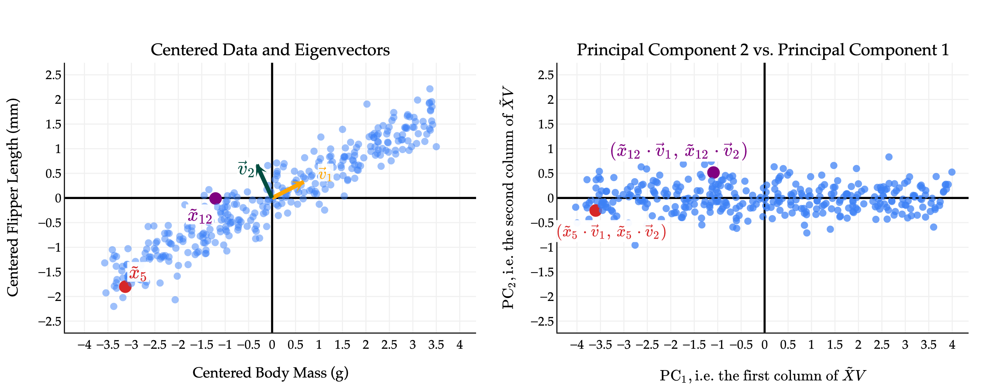
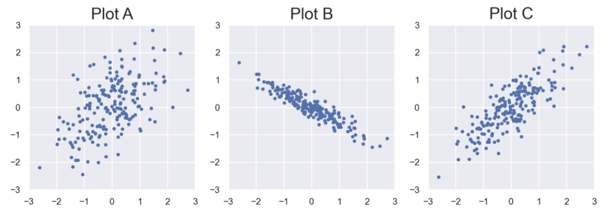



# Lab 13: Singular Value Decomposition

**due** for completion at the end of your lab section

{: .yellow }

Each lab worksheet will contain several activities, some of which will involve writing code and others that will involve writing math on paper. To receive credit for a lab, you must complete as many of the activities as you can in 2 hours and submit a PDF of your work to Gradescope. We will provide specific instructions on how to submit programming activities (e.g. submitting the notebook or including a screenshot of some output).

Feel free to work with others in the course, but you must submit individually.

---

## Activities

- [Activity 1: SVD Fundamentals](#activity-1-svd-fundamentals)
- [Activity 2: Outer Products](#activity-2-outer-products)
- [Activity 3: Rotating and Stretching](#activity-3-rotating-and-stretching)
- [Activity 4](#activity-4)

---

**Recap: Singular Value Decomposition** ([Chapters 10.1](https://notes.eecs245.org/singular-value-decomposition/computing-svd/) and [10.2](https://notes.eecs245.org/singular-value-decomposition/low-rank-approximation/))

-   Suppose \\(X\\) is any \\(n \times d\\) matrix. Then, there exists a **singular value decomposition (SVD)** of \\(X\\) of the form

$$
X = U \Sigma V^T
$$

 where:

    | **Matrix** | **Shape** | **Values Come From** | **Properties** |
    |:---|:--:|:---|:---|
    | \\(U\\) | \\(n \times n\\) | Columns are eigenvectors of \\(XX^T\\), called the **left singular vectors** of \\(X\\) | Orthogonal

$$
U^TU = UU^T = I_{n \times n}
$$

 |
    | \\(\Sigma\\) | \\(n \times d\\) | Each **singular value** \\(\sigma&#95;i\\) is the square root of the \\(i\\)-th largest eigenvalue of \\(X^TX\\) (or \\(XX^T\\)) | Diagonal, with value in position \\((i, i)\\) equal to \\(\sigma&#95;i\\) for \\(i=1,2,\dots,r = \text{rank}(X)\\) |
    | \\(V\\) | \\(d \times d\\) | Columns are eigenvectors of \\(X^TX\\), called the **right singular vectors** of \\(X\\) | Orthogonal

$$
V^TV = VV^T = I_{d \times d}
$$

 |

-   If \\(\vec u&#95;i\\) and \\(\vec v&#95;i\\) are the \\(i\\)-th left and right singular vectors of \\(X\\), respectively, then \\(X\vec v&#95;i = \sigma&#95;i \vec u&#95;i\\).

---

## Activity 1: SVD Fundamentals

Suppose the matrix \\(X\\) has the singular value decomposition \\(X=U\Sigma V^T\\) where

$$
U = \begin{bmatrix}0 & 1 \\\\ 1 & 0\end{bmatrix}, \quad \Sigma = \begin{bmatrix}\sigma_1 & 0 & 0 \\\\ 0 & 2 & 0 \end{bmatrix}, \quad V = \begin{bmatrix}1/\sqrt{2} & | & 0 \\\\ 0 & \vec v_2 & 1 \\\\ 1/\sqrt{2} & | & 0 \end{bmatrix}
$$

a)

How many rows and columns does \\(X\\) have? What is \\(\text{rank}(X)\\)?

Solution

\\(X\\) is a \\(2 \times 3\\) matrix, matching the dimensions of \\(\Sigma\\). \\(\text{rank}(X)\\) is 2, since there are 2 non-zero singular values.

b)

Find \\(\vec v&#95;2\\).

Solution

\\(\vec v&#95;2\\) is the eigenvector of \\(X^TX\\) corresponding to the eigenvalue 2. It's also a unit vector, meaning we need to find a unit vector that's orthogonal to the other two columns, so \\(\vec v&#95;2 = \begin{bmatrix}\sqrt{2} / 2 \\\\ 0 \\\\ -\sqrt{2} / 2 \end{bmatrix}\\)

c)

Given that the first column of \\(X\\) and third column of \\(X\\) sum to \\(\begin{bmatrix}0 \\\\ 5\end{bmatrix}\\), find \\(\sigma&#95;1\\).

Solution

$$
\begin{align*}
X\vec v_1 &= \sigma_1 \vec u_1
\\\\X\begin{bmatrix}1/\sqrt{2} \\\\ 0 \\\\ 1/\sqrt{2}\end{bmatrix} &= \sigma_1 \begin{bmatrix}0 \\\\ 1\end{bmatrix}
\end{align*}
$$

The left side of the equation is the sum of \\(X\\)'s first and third columns, scaled by \\(1 / \sqrt{2}\\), so we can use the fact given in the problem here:

$$
\begin{align*}
\frac{1}{\sqrt{2}}\begin{bmatrix}0 \\\\ 5\end{bmatrix} &= \sigma_1\begin{bmatrix}0 \\\\ 1\end{bmatrix}
\\\\ \begin{bmatrix}0 \\\\ 5/\sqrt{2}\end{bmatrix} &= \begin{bmatrix}0 \\\\ \sigma_1\end{bmatrix}
\\\\ \sigma_1 &= \frac{5\sqrt{2}}{2}
\end{align*}
$$

---

## Activity 2: Outer Products

Consider the rank-\\(2\\) matrix \\(X=\begin{bmatrix}1 &amp; 2 &amp; 2 \\\\ 1 &amp; 3 &amp; 3\end{bmatrix}\\).

a)

Write \\(X\\) as a sum of two rank-1 outer products, e.g. \\(X=\vec x&#95;1 \vec y&#95;1^T + \vec x&#95;2 \vec y&#95;2^T\\).

Solution

\\(X\\) has a unique first column, while the second and third columns are the same. So, we can use a similar idea to the CR decomposition:

$$
X = \begin{bmatrix}1 \\\\ 1\end{bmatrix}\begin{bmatrix}1 & 0 & 0\end{bmatrix} + \begin{bmatrix}2 \\\\ 3\end{bmatrix}\begin{bmatrix}0 & 1 & 1\end{bmatrix}
$$

b)

Find \\(XX^T\\) and \\(X^TX\\), and the trace and determinant of each. Feel free to use `numpy`.

Solution

$$
\begin{align*}
XX^T &= \begin{bmatrix}1 & 2 & 2 \\\\ 1 & 3 & 3\end{bmatrix} \begin{bmatrix} 1 & 1 \\\\ 2 & 3 \\\\ 2 & 3\end{bmatrix}
\\\\&=\begin{bmatrix}1 + 4 + 4 & 1 + 6 + 6 \\\\ 1 + 6 + 6 & 1 + 9 + 9\end{bmatrix}
\\\\&=\begin{bmatrix}9 & 13 \\\\ 13 & 19\end{bmatrix}
\\\\\text{det}(XX^T)&=9\cdot 19 - 13 \cdot 13 = 2
\\\\\text{trace}(XX^T)&=9 + 19 = 28
\end{align*}
$$

$$
\begin{align*}
X^TX &= \begin{bmatrix} 1 & 1 \\\\ 2 & 3 \\\\ 2 & 3\end{bmatrix}\begin{bmatrix}1 & 2 & 2 \\\\ 1 & 3 & 3\end{bmatrix}
\\\\&=\begin{bmatrix}1 + 1 & 2 + 3 & 2 + 3 \\\\ 2 + 3 & 4 + 9 & 4 + 9 \\\\ 2 + 3 & 4 + 9 & 4 + 9\end{bmatrix}
\\\\&=\begin{bmatrix}2 & 5 & 5 \\\\ 5 & 13 & 13 \\\\ 5 & 13 & 13\end{bmatrix}
\\\\\text{det}(X^TX)&=0 \text{, } X^TX \text{ is not invertible}
\\\\\text{trace}(X^TX)&=2 + 13 + 13 = 28
\end{align*}
$$

c)

If \\(X\\) is any \\(n \times d\\) matrix, which of the following are guaranteed to be true, and why? <em>Hint: How does the trace of a matrix relate to its eigenvalues? How are the eigenvalues of \\(XX^T\\) and \\(X^TX\\) related?</em>

$$
\begin{align*}
\text{trace}(XX^T)&=\text{trace}(X^TX)
\\\\\text{det}(XX^T)&=\text{det}(X^TX)
\end{align*}
$$

Solution

\\(XX^T\\) and \\(X^TX\\) share the same **non-zero** values. Since the trace is equivalent to the sum of the eigenvalues, the non-zero eigenvalues being the same results in the same sum, as the zero eigenvalues don't affect it.

However, the same is not true for the determinant. In the case where \\(n \neq d\\), one of \\(XX^T\\) or \\(X^TX\\) will be larger. The larger matrix **must** have a zero eigenvalue because \\(\text{rank}(XX^T) = \text{rank}(X^TX)\\), so its determinant will be 0. We can't guarantee that \\(X^TX\\) won't be full rank, so its possible for the determinant to not be 0.

---

## Activity 3: Rotating and Stretching

Suppose \\(X\\) is a \\(5 \times 2\\) matrix with singular value decomposition \\(X=U \Sigma V^T\\), and that \\(\vec v&#95;1\\) and \\(\vec v&#95;2\\) are the first and second columns of \\(V\\), respectively. Furthermore, suppose \\(\vec w \in \mathbb{R}^2\\) is a vector such that

$$
\vec w = 3\vec v_1 - \vec v_2
$$

a)

Find \\(V^T\vec w\\).

Solution

$$
\begin{align*}
V^T\vec w &= V^T(3\vec v_1 - \vec v_2)
\\\\&= 3V^T\vec v_1 - V^T\vec v_2
\\\\&= 3\begin{bmatrix}\vec v_1 \cdot \vec v_1  \\\\ \vec v_2 \cdot \vec v_1\end{bmatrix} - \begin{bmatrix}\vec v_1 \cdot \vec v_2  \\\\ \vec v_2 \cdot \vec v_2\end{bmatrix}
\end{align*}
$$

We can simplify this further thanks to \\(V\\) being an orthogonal matrix. \\(\vec v&#95;1\\) and \\(\vec v&#95;2\\) are orthogonal, and their norms are both 1.

$$
\begin{align*}
V^T\vec w3 &= \begin{bmatrix}||\vec v_1||^2  \\\\ 0\end{bmatrix} - \begin{bmatrix}0 \\\\ ||\vec v_2||^2 \end{bmatrix}
\\\\&=3\begin{bmatrix}1  \\\\ 0\end{bmatrix} - \begin{bmatrix}0 \\\\ 1 \end{bmatrix}
\\\\&=\begin{bmatrix}3  \\\\ -1\end{bmatrix}
\end{align*}
$$

b)

Suppose \\(X\\)'s two singular values are \\(\sigma&#95;1 = 10\\) and \\(\sigma&#95;2 = 3\\). Find \\(\Sigma V^T\vec w\\).

Solution

$$
\begin{align*}
\Sigma V^T\vec w &= \Sigma \begin{bmatrix}3  \\\\ -1\end{bmatrix}
\\\\&= \begin{bmatrix}10 & 0 \\\\ 0 & 3 \\\\ 0 & 0 \\\\ 0 & 0 \\\\ 0 & 0 \end{bmatrix} \begin{bmatrix}3  \\\\ -1\end{bmatrix}
\\\\&= \begin{bmatrix}30 \\\\ -3 \\\\ 0 \\\\ 0 \\\\ 0 \end{bmatrix}
\end{align*}
$$

c)

Let \\(\vec z = \Sigma V^T\vec w\\). In English, what does \\(\vec z\\) represent, relative to \\(\vec w\\)?

Solution

\\(V^T\vec w\\) rotates \\(\vec w\\) using the right singular vectors as the basis. Since \\(\vec w\\) is already composed of those vectors, it returns the coefficients back in a vector. \\(\Sigma\\) then shifts the resulting vector by scaling each component using the singular values.

**Recap: Principal Component Analysis** ([Chapters 10.3](https://notes.eecs245.org/singular-value-decomposition/best-direction/) and [10.4](https://notes.eecs245.org/singular-value-decomposition/principal-components-analysis/))

-   The goal of **principal component analysis (PCA)** is reducing the dimensionality of a dataset by constructing new features --- called **principal components**.

-   These new features are linear combinations of the existing features in the data, and are constructed to **minimize the mean squared orthogonal error** of the data when projected onto the new features.

-   As we see in Chapter 10.3, this is equivalent to finding the **directions along which the data is most spread out**.

    

   The plot on the left shows the direction vectors \\(\vec v&#95;1\\) and \\(\vec v&#95;2\\) which define the first and second principal components, respectively. \\(\vec v&#95;1\\) is the direction that captures the most variability, followed by \\(\vec v&#95;2\\). Note that \\(\vec v&#95;1\\) and \\(\vec v&#95;2\\) are **orthogonal**, which results in the principal components (new features) being **uncorrelated**, as we see in the plot on the right.

-   The "PCA recipe" is as follows:

    1.  Starting with an \\(n \times d\\) matrix \\(X\\) of \\(n\\) data points in \\(d\\) dimensions and **mean-center** the data by subtracting the mean of each column from itself. The new matrix is \\(\tilde X\\).

    2.  Compute the singular value decomposition of \\(\tilde X\\): \\(\tilde X = U \Sigma V^T\\).

    3.  **The columns of \\(V\\) (rows of \\(V^T\\)) describe the directions of maximal variance in the data!** For instance, the single "best direction" is the eigenvector of \\(\tilde X \tilde X^T\\) with the largest eigenvalue, i.e. \\(\vec v&#95;1\\) in \\(\tilde X = U \Sigma V^T\\).

       4.  Principal component (new feature) \\(j\\) comes from multiplying \\(\tilde X\\) by the \\(j\\)-th column of \\(V\\).

$$
\text{PC}_j = \tilde X \vec v_j = \sigma_j \vec u_j
$$

       5.  The variance of \\(\text{PC}&#95;j\\) is \\(\frac{\sigma&#95;j^2}{n}\\). The proportion of total variance in \\(\tilde X\\) that is explained by \\(\text{PC}&#95;j\\) is

$$
\text{proportion of variance explained by PC } j = \frac{\sigma_j^2}{\sum_{k=1}^r \sigma_k^2}
$$

---

## Activity 4

Suppose \\(A\\), \\(B\\), and \\(C\\) are each \\(100 \times 2\\) matrices, representing \\(n=100\\) points in \\(\mathbb{R}^2\\). The three datasets are shown in the scatter plots below. (Matrix \\(A\\) is in Plot A, matrix \\(B\\) is in Plot B, and matrix \\(C\\) is in Plot C.)

Assume that \\(A\\), \\(B\\), and \\(C\\) are each already mean-centered.

a)

If we applied PCA to each of the above datasets, and created just one principal component in each case, for which dataset would the first principal component have the smallest mean squared orthogonal error --- \\(A\\), \\(B\\), or \\(C\\)?

Solution

\\(B\\) has a strong negative correlation, with little spread in the perpendicular direction, while \\(A\\) and \\(C\\)'s dominant directions aren't as clear.

b)

Suppose \\(\tilde{X}=U \Sigma V^T\\) is the singular value decomposition of \\(\tilde{X}\\), and that

$$
\Sigma = \begin{bmatrix}16 & 0 \\\\ 0 & 4 \\\\ 0 & 0 \\\\ \vdots & \vdots \\\\ 0 & 0 \end{bmatrix}, \quad \underbrace{V = \begin{bmatrix} 2/\sqrt{5} & 1/\sqrt{5} \\\\ -1/\sqrt{5} & 2/\sqrt{5}\end{bmatrix}}_{\textbf{not } V^T}
$$

Which dataset is most likely to be \\(\tilde{X}\\) --- \\(A\\), \\(B\\), or \\(C\\)?

Solution

The singular values tell us that one direction is being scaled by 16, while the other is scaled by 4, meaning most of the variance is captured in the \\(\vec v&#95;1\\) direction. \\(\vec v&#95;1\\) has a positive \\(x\\) component and a negative \\(y\\) component, which matches the slope of plot \\(B\\)'s dominant direction, since \\(A\\) and \\(B\\)'s dominant directions are more positive.

c)

Again, suppose \\(\tilde{X}=U \Sigma V^T\\) is the singular value decomposition of \\(\tilde{X}\\), and that

$$
\Sigma = \begin{bmatrix}16 & 0 \\\\ 0 & 4 \\\\ 0 & 0 \\\\ \vdots & \vdots \\\\ 0 & 0 \end{bmatrix}, \quad \underbrace{V = \begin{bmatrix} 2/\sqrt{5} & 1/\sqrt{5} \\\\ -1/\sqrt{5} & 2/\sqrt{5}\end{bmatrix}}_{\textbf{not } V^T}
$$

What is the proportion of the total variance in \\(\tilde{X}\\) that is accounted for by the first principal component?

Solution

$$
\begin{align*}
\displaystyle \frac{\sigma_1^2}{\sigma_1^2 + \sigma_2^2} = \frac{16^2}{16^2 + 4^2} = \frac{256}{272}
\end{align*}
$$

d)

Suppose that in the graph of principal component 2 vs. principal component 1 (i.e. with PC 1 on the \\(x\\)-axis and PC 2 on the \\(y\\)-axis), a particular data point is plotted at \\((4, 2)\\). What is the corresponding point in the original (mean-centered) dataset? Your answer should be a tuple of two numbers, \\((x, y)\\) (or equivalently, a vector in \\(\mathbb{R}^2\\)). <em>Hint: Start by understanding the plot on Page 4.</em>

Solution

There are two ways to approach this problem:

**Option 1: Dot Products and Transformation**

In the PC2 vs PC1 plot in the recap, you may have noticed the coordinates of \\(\vec x&#95;{12}\\) were \\((\vec x&#95;{12} \cdot \vec v&#95;1, \vec x&#95;{12} \cdot \vec v&#95;2)\\). This comes from multiplying \\(V^T\vec x&#95;{12}\\):

$$
\begin{align*}
V^T\vec x_{12} &= \begin{bmatrix} — & \vec v_1 & — \\\\ — & \vec v_2 & —\end{bmatrix}\vec x_{12}
\\\\&= \begin{bmatrix}  \vec v_1 \cdot \vec x_{12} \\\\ \vec v_2 \cdot \vec x_{12} \end{bmatrix}
\end{align*}
$$

If this looks familiar, that's because it's similar to 3c! In 3c, \\(V^T\vec w\\) rotated \\(\vec w\\) by translating it into a space with {\\(\vec v&#95;1,\vec v&#95;2\\)} as its basis. So, if we know a point's coordinates in \\(\vec v&#95;1, \vec v&#95;2\\) space, we can work backwards to solve for the point's coordinates in \\(x,y\\) space:

$$
\begin{align*}
\begin{bmatrix}4 \\\\ 2\end{bmatrix} &= \begin{bmatrix}\vec v_1 \cdot \vec w \\\\ \vec v_2 \cdot \vec w\end{bmatrix}
\\\\
\\\\ 4 &= \vec v_1 \cdot \vec w = \frac{2}{\sqrt{5}}w_1 + \frac{-1}{\sqrt{5}}w_2
\\\\ 2 &= \vec v_2 \cdot \vec w = \frac{1}{\sqrt{5}}w_1 + \frac{2}{\sqrt{5}}w_2
\end{align*}
$$

Now we have a system of equations to solve for the coordinate of \\(\vec w\\):

$$
\begin{align*}
4 &= \frac{2}{\sqrt{5}}w_1 + \frac{-1}{\sqrt{5}}w_2
\\\\2 &=\frac{1}{\sqrt{5}}w_1 + \frac{2}{\sqrt{5}}w_2
\\\\
\\\\8 &= \frac{4}{\sqrt{5}}w_1 + \frac{-2}{\sqrt{5}}w_2
\\\\8+2 &= \frac{4}{\sqrt{5}}w_1 + \frac{1}{\sqrt{5}}w_1 + \frac{-2}{\sqrt{5}}w_2 + \frac{2}{\sqrt{5}}w_2
\\\\10 &= \frac{5}{\sqrt{5}}w_1
\\\\w_1 &= \frac{10\sqrt{5}}{5} = 2\sqrt{5}
\\\\
\\\\4 &= \frac{2}{\sqrt{5}}(2\sqrt{5}) + \frac{-1}{\sqrt{5}}w_2
\\\\4 &= 4 + \frac{-1}{\sqrt{5}}w_2
\\\\w_2&=0
\\\\
\\\\ 2 &= \frac{1}{\sqrt{5}}(2\sqrt{5}) + \frac{2}{\sqrt{5}}w_2
\\\\ 2 &= 2 + \frac{2}{\sqrt{5}}w_2
\\\\ w_2 &= 0 \quad \checkmark
\\\\ \vec w &= \begin{bmatrix}2\sqrt{5} \\\\ 0\end{bmatrix}
\end{align*}
$$

**Option 2: Thinking in Terms of Linear Combinations**

\\((4, 2)\\) are coefficients in the basis \\(\lbrace \vec v&#95;1, \vec v&#95;2\rbrace\\). Since we know \\(\vec v&#95;1\\) and \\(\vec v&#95;2\\)'s directions in \\(x,y\\) space, getting the point's coordinates in \\(x,y\\) space just involves computing the linear combination, using the coordinates in \\(\vec v&#95;1, \vec v&#95;2\\) space as coefficients:

$$
\begin{align*}
4 \vec v_1 + 2\vec v_2 &= 4\begin{bmatrix} 2/\sqrt{5} \\\\ -1/\sqrt{5} \end{bmatrix} + 2\begin{bmatrix} 1/\sqrt{5} \\\\ 2/\sqrt{5}\end{bmatrix}
\\\\&= \begin{bmatrix} 8/\sqrt{5} \\\\ -4/\sqrt{5} \end{bmatrix} + \begin{bmatrix} 2/\sqrt{5} \\\\ 4/\sqrt{5}\end{bmatrix}
\\\\&= \begin{bmatrix} 10/\sqrt{5} \\\\ 0 \end{bmatrix} = \begin{bmatrix} 2\sqrt{5} \\\\ 0 \end{bmatrix}
\end{align*}
$$


